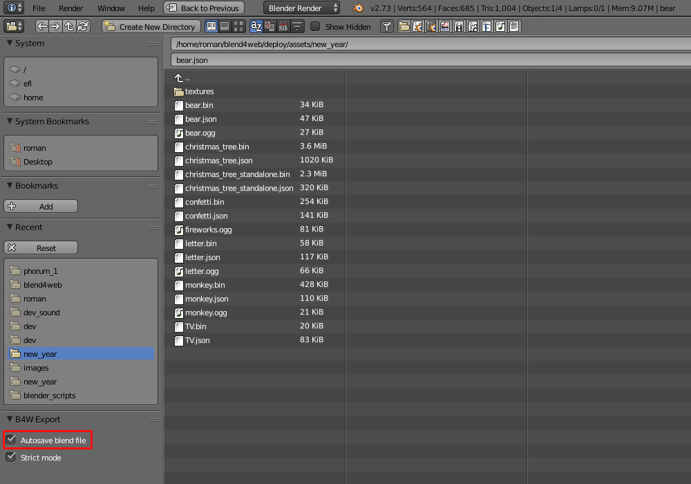
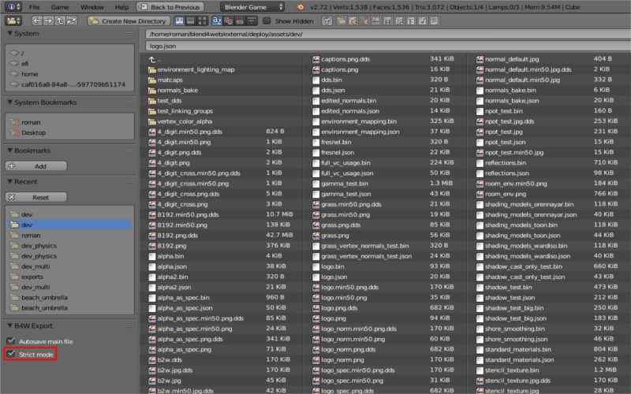
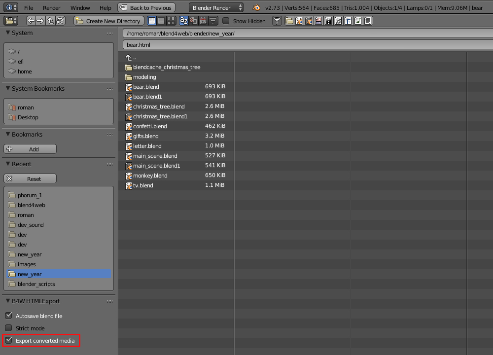
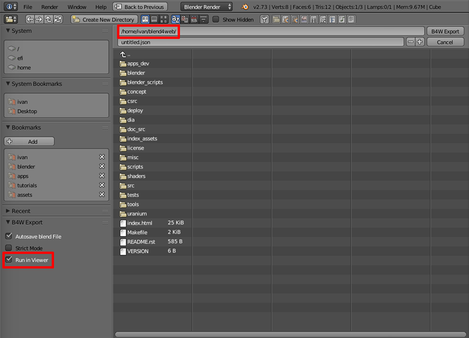
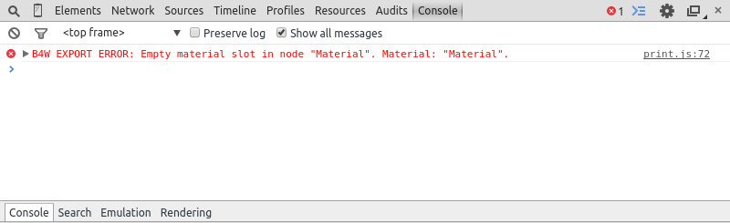
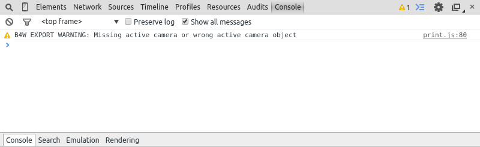

.. _addon:

.. index:: аддон

*****
Аддон
*****

.. _export_opts:

Опции экспорта
==============

*Autosave blend File*
    Автосохранение файла, из которого осуществляется экспорт. **Включено по умолчанию**. Осуществляется непосредственно после экспорта с целью поддержки соответствия между текущим содержимым blend-файла и экспортного файла. Кроме того, для удобства в blend-файле сохраняется относительный путь к экспортному файлу.

|

*Strict Mode*
    Данный режим блокирует экспорт при наличии ошибок и сообщений, требующих внимания пользователя. Режим включается при выставлении опции ``Strict Mode`` в меню экспорта:

|

    При наличии некритических ошибок экспорта или сообщений, требующих внимания пользователя, вашему вниманию будет представлено диалоговое окно вида:

.. image:: src_images/addon/messages.jpg
   :align: center
   :width: 100%

|

*Export Converted Media*
    Опция доступна при html-экспорте. Включение данного режима экспорта позволяет записать в HTML файл конвертированные медиафайлы разных форматов. Это необходимо использовать при создании кроссбраузерных и кроссплатформенных приложений при html-экспорте. При этом в html-файл будут записываться файлы, созданные с использованием :ref:`нашего конвертера <converter>`.

|

.. _run_in_viewer:

*Run in Viewer*
    Автоматически запустить просмотрщик сцен и добавить в него экспортируемую сцену. 

    При использовании :ref:`локального сервера разработки <local_development_server>`, имеется возможность открыть сцену, экспортированную в формате ``.json``, в просмотрщике сцен. Для этого при экспорте необходимо выбрать любой путь, лежащий внутри файловой структуры Blend4Web SDK. 
    
    В качестве директории для экспорта может использоваться созданная пользователем директория внутри Blend4Web SDK. При несоблюдении этого условия опция не будет отображаться в меню экспорта. Также опция не будет отображаться если локальный web-сервер не запущен.

|

.. _initialization_errors:

.. index:: аддон; ошибки инициализации

Ошибки инициализации
====================

Ошибки инициализации могут проявляться при инициализации аддона, либо при загрузке сцены в Blender.
При возникновении появится диалоговое окно с описанием ошибки.

.. image:: src_images/addon/init_error_message.jpg
   :align: center
   :width: 100%

|

+-------------------------------------+-------------------------------------------+
| Сообщение об ошибке                 | Причина                                   |
+=====================================+===========================================+
| Blend4Web initialization error!     | Ошибка загрузки аддона. Аддон не          |
| Addon is not compatible with        | совместим с платформой PLATFORM.          |
| the PLATFORM platform.              |                                           |
+-------------------------------------+-------------------------------------------+
| Warning: Blender version mismatch.  | Предупреждение о возможной                |
| Blender VER_REQUIRED is recommended | несовместимости с текущей версией Blender.|
| for the Blend4Web addon.            | Для работы рекомендуется версия Blender'а |
| Current version is VER_CURRENT.     | VER_REQUIRED. Текущая версия -            |
|                                     | VER_CURRENT.                              |
+-------------------------------------+-------------------------------------------+

.. index:: версия; ошибки

.. _version_errors:

Ошибки совместимости
====================

Ошибки совместимости версий могут проявиться при просмотре сцены в браузере, если версия аддона, которым был произведен экспорт сцены, не соответствует версии движка Blend4Web, который пытается эту сцену загрузить, а также если .bin-файл не соответствует .json-файлу.

+-------------------------------------+-------------------------------------------+
| Сообщение об ошибке                 | Причина                                   |
+=====================================+===========================================+
| JSON version is too old relative to | Версия аддона, которым была               |
| B4W engine: VER_OLD, required:      | экспортирована сцена, сильно устарела:    |
| VER_NEW. Reexport scene with the    | VER_OLD, движком требуется - VER_NEW.     |
| latest B4W addon to fix it.         | Сцена не будет загружена. Рекомендуется   |
|                                     | переэкспортировать сцену аддоном          |
|                                     | последней версии, а также использовать    |
|                                     | последнюю версию движка.                  |
+-------------------------------------+-------------------------------------------+
| JSON version is a bit old relative  | Версия аддона, которым была               |
| to B4W engine: VER_OLD, required:   | экспортирована сцена, немного устарела:   |
| VER_NEW. Some compatibility issues  | VER_OLD, движком требуется - VER_NEW.     |
| can occur. Reexport scene with the  | Сцена будет загружена, однако возможны    |
| latest B4W addon to fix it.         | различные ошибки. Рекомендуется           |
|                                     | переэкспортировать сцену аддоном          |
|                                     | последней версии, а также использовать    |
|                                     | последнюю версию движка.                  |
+-------------------------------------+-------------------------------------------+
| B4W engine version is too old       | Версия движка сильно устарела по          |
| relative to JSON. Can't load the    | сравнению с версией аддона, которым был   |
| scene. Update your engine version   | произведен экспорт сцены. Сцена не будет  |
| to fix it.                          | загружена. Рекомендуется использовать     |
|                                     | последнюю версию движка и аддона.         |
+-------------------------------------+-------------------------------------------+
| B4W engine version is a bit old     | Версия движка немного устарела по         |
| relative to JSON. Some              | сравнению с версией аддона, которым был   |
| compatibility issues can occur.     | произведен экспорт сцены. Сцена будет     |
| Update your engine version to fix   | загружена, однако возможны различные      |
| it.                                 | ошибки. Рекомендуется использовать        |
|                                     | последнюю версию движка и аддона.         |
+-------------------------------------+-------------------------------------------+
| BIN version does not match to       | Версия загружаемого .bin-файла сильно     |
| JSON version: VER_BIN, required:    | устарела по сравнению с .json-файлом:     |
| VER_JSON. Couldn't load the scene.  | VER_BIN, версия .json-файла: VER_JSON.    |
| Reexport scene to fix it.           | Сцена не будет загружена. Рекомендуется   |
|                                     | переэкспортировать сцену.                 |
+-------------------------------------+-------------------------------------------+
| BIN version does not match to       | Версия загружаемого .bin-файла немного    |
| JSON version: VER_BIN, required:    | устарела по сравнению с .json-файлом:     |
| VER_JSON. Some compatibility issues | VER_BIN, версия .json-файла: VER_JSON.    |
| can occur. Reexport scene to fix it.| Могут возникнуть ошибки несовместимости.  |
|                                     | Рекомендуется переэкспортировать сцену.   |
+-------------------------------------+-------------------------------------------+

.. index:: экспорт; ошибки

.. _export_errors:

Критические ошибки экспорта
===========================

При возникновении ошибок во время экспорта появляется диалоговое окно ``BLEND4WEB EXPORT ERROR`` с описанием проблемы:

    ``COMPONENT`` - тип компонента (объект, меш, материал, текстура и т.д.), при экспорте которого произошла ошибка.

    ``NAME`` - имя компонента.

    ``ERROR`` - краткое описание возникшей проблемы на англ. языке.

.. image:: src_images/addon/error_message.jpg
   :align: center
   :width: 100%

|

+-------------------------------------+-------------------------------------------+
| Сообщение об ошибке                 | Причина                                   |
+=====================================+===========================================+
| Dupli group error; Objects from     | Ни один из объектов группы GROUP_NAME,    |
| the GROUP_NAME dupli group on       | выбранной для дублирования на объекте     |
| the OBJECT_NAME object cannot be    | OBJECT_NAME, не экспортируется. Требуется |
| exported                            | разрешить экспорт хотя бы одного из       |
|                                     | объектов группы, либо убрать дублирование |
|                                     | группой.                                  |
+-------------------------------------+-------------------------------------------+
| Export to different disk is         | Не разрешен экспорт в директорию,         |
| forbidden                           | находящуюся на другом диске               |
+-------------------------------------+-------------------------------------------+
| Incompatible objects with           | Несовместимые объекты с общим мешем.      |
| a shared mesh; The OBJECT_NAME      | Не допускается экспорт объекта с общим    |
| object has both vertex groups and   | мешем и вертексными группами. Исключения: |
| a shared mesh                       | экспорт возможен, если                    |
|                                     | на объекте включены опции                 |
|                                     | ``Apply modifiers``,                      |
|                                     | ``Export vertex animation``,              |
|                                     | ``Export edited normals``,                |
|                                     | ``Apply scale``                           |
|                                     | (т.к. в этом случае при экспорте          |
|                                     | происходит полное копирование мешей).     |
+-------------------------------------+-------------------------------------------+
| Incomplete mesh; Material slot is   | Неполный меш: пустой слот материала.      |
| empty                               |                                           |
+-------------------------------------+-------------------------------------------+
| Incomplete vehicle. The NAME        | Моделируемое средство передвижения NAME   |
| vehicle doesn't have any chassis    | является незавершенным: оно должно        |
| or hull                             | содержать один элемент ``Chassis`` или    |
|                                     | ``Hull``.                                 |
+-------------------------------------+-------------------------------------------+
| Incomplete vehicle. The NAME        | Моделируемое средство передвижения NAME   |
| vehicle requires at least one bob   | является незавершенным: оно должно        |
|                                     | содержать хотя бы один элемент ``Bob``.   |
+-------------------------------------+-------------------------------------------+
| Incomplete vehicle. The NAME        | Моделируемое средство передвижения NAME   |
| vehicle requires at least one wheel | является незавершенным: оно должно        |
|                                     | содержать хотя бы один элемент ``wheel``. |
+-------------------------------------+-------------------------------------------+
| Incorrect mesh; Corrupted file:     | Меш содержит вершины, привязанные к       |
| Wrong group indices                 | несуществующей группе.                    |
+-------------------------------------+-------------------------------------------+
| Incorrect mesh; Corrupted file:     | Поврежденный файл: некорректное значение  |
| Wrong vertice positions             | координаты вертекса.                      |
+-------------------------------------+-------------------------------------------+
| Incorrect mesh; Corrupted file:     | Поврежденный файл: некорректное значение  |
| Wrong normals                       | нормали.                                  |
+-------------------------------------+-------------------------------------------+
| Incorrect mesh; Corrupted file:     | Поврежденный файл: некорректное значение  |
| Wrong tangents                      | тангенты.                                 |
+-------------------------------------+-------------------------------------------+
| Incorrect mesh; Corrupted file:     | Поврежденный файл: некорректное значение  |
| Wrong texture coordinates           | текстурной координаты.                    |
+-------------------------------------+-------------------------------------------+
| Incorrect mesh; Corrupted file:     | Поврежденный файл: некорректное значение  |
| Wrong vertex group weights          | веса вертекса в вертексной группе.        |
+-------------------------------------+-------------------------------------------+

+-------------------------------------+-------------------------------------------+
| Incorrect mesh; Corrupted file:     | Поврежденный файл: некорректное значение  |
| Wrong vertex color values           | вертексного цвета.                        |
+-------------------------------------+-------------------------------------------+
| Incorrect vertex animation; Object  | Включен экспорт вертексной анимации для   |
| has no vertex animation             | объекта, но ни одной анимации не имеется. |
+-------------------------------------+-------------------------------------------+
| Incorrect vertex animation; Unbaked | Включен экспорт вертексной анимации для   |
| "ANIM_NAME" vertex animation        | меша, но анимация ANIM_NAME не содержит   |
|                                     | ни одного кадра.                          |
+-------------------------------------+-------------------------------------------+
| Loading of resources from different | Не разрешен экспорт ресурсов из           |
| disk is forbidden                   | директории, находящейся на другом диске.  |
+-------------------------------------+-------------------------------------------+
| The material has a normal map but   | Нодовый материал использует               |
| doesn't have any material nodes     | ``Normal Mapping``, но не имеет ноды      |
|                                     | ``Material``.                             |
+-------------------------------------+-------------------------------------------+
| The mesh has a UV map but has no    | Меш имеет текстурную развертку, но не     |
| exported material                   | имеет материала, который бы               |
|                                     | экспортировался.                          |
+-------------------------------------+-------------------------------------------+
| The mesh has a vertex color layer   | Меш имеет слой вертексного цвета, но не   |
| but has no exported material        | имеет материала, который бы               |
|                                     | экспортировался.                          |
+-------------------------------------+-------------------------------------------+
| No such file or directory           | Данная директория не существует.          |
+-------------------------------------+-------------------------------------------+
| Object constraint has no target     | Для ограничителя объекта                  |
|                                     | (вкладка ``Object Constraints``)          |
|                                     | не установлено свойство                   |
|                                     | ``Target Object``.                        |
+-------------------------------------+-------------------------------------------+
| Particle system error; Dupli group  | Ошибка системы частиц. Не выбрана группа, |
| isn't specified                     | используемая в качестве частицы.          |
+-------------------------------------+-------------------------------------------+
| Particle system error; Dupli object | Ошибка системы частиц. Не выбран объект,  |
| isn't specified                     | используемый в качестве частицы.          |
+-------------------------------------+-------------------------------------------+

+-------------------------------------+-------------------------------------------+
| Particle system error; Dupli object | Ошибка системы частиц. Объект             |
| OBJECT_NAME doesn't export          | OBJECT_NAME, выбранный в качестве         |
|                                     | частицы, не экспортируется (на нем        |
|                                     | выбрана опция ``Do not export``).         |
+-------------------------------------+-------------------------------------------+
| Particle system error; The          | Ошибка системы частиц. Ни один подходящий |
| GROUP_NAME dupli group contains no  | объект из группы GROUP_NAME, выбранной в  |
| valid object for export             | качестве частицы, не экспортируется.      |
|                                     | Либо на таких объектах выбрана опция      |
|                                     | ``Do not export``, либо объекты имеют     |
|                                     | неподходящий тип.                         |
|                                     | Поддерживаемые типы: ``MESH``.            |
+-------------------------------------+-------------------------------------------+
| Particle system error. Unsupported  | Ошибка системы частиц. Неподдерживаемый   |
| render type TYPE for the            | тип рендера TYPE для EMITTER/HAIR системы |
| EMITTER/HAIR particles PSYS_NAME on | частиц с именем PSYS_NAME, находящейся на |
| object NAME. Particle system        | объекте NAME. Система частиц удалена.     |
| removed.                            |                                           |
+-------------------------------------+-------------------------------------------+
| Particle system error; Wrong dupli  | Ошибка системы частиц. В качестве частицы |
| object type TYPE_NAME               | выбран объект неподходящего типа.         |
|                                     | Поддерживаемые типы: ``MESH``.            |
+-------------------------------------+-------------------------------------------+
| Permission denied                   | Нет прав доступа к текущей директории.    |
+-------------------------------------+-------------------------------------------+
| Wrong edited normals count; It      | Число редактируемых нормалей не           |
| doesn't match with the mesh         | совпадает с числом вершин меша.           |
| vertices count                      | Требуется сделать ``Clean Up`` либо       |
|                                     | ``Save`` в панели                         |
|                                     | ``B4W Vertex Normals Editor``.            |
+-------------------------------------+-------------------------------------------+
| Wrong overridden bounding box;      | Указаны неверные размеры при              |
| Check the mesh's bounding box       | переопределении ``BoundingBox`` для меша: |
| values                              | минимальное значение больше максимального |
|                                     | для хотя бы одного из измерений.          |
+-------------------------------------+-------------------------------------------+
| Wrong vertex animation vertices     | Включен экспорт вертексной анимации, но   |
| count; It doesn't match with the    | число вершин покадрово в анимации         |
| mesh vertices count for "ANIM_NAME" | ANIM_NAME не совпадает с числом вершин    |
|                                     | меша. Возможное решение - "перезапекание" |
|                                     | анимации.                                 |
+-------------------------------------+-------------------------------------------+

.. _export_errors_warnings:

.. index:: экспорт; предупреждения об ошибках экспорта

Некритические ошибки экспорта
=============================

В отличие от критических ошибок экспорта, рассмотренных ранее, данные ошибки не препятствуют
экспорту, однако могут приводить к некорректному отображению сцен. Сообщения выводятся в консоли браузера (горячая клавиша ``F12``) при загрузке сцены. Сообщение имеет вид:

    ``B4W EXPORT ERROR: Сообщение об ошибке``

|

+-------------------------------------+-------------------------------------------+
| Сообщение об ошибке                 | Причина                                   |
+=====================================+===========================================+
| Canvas texture ID NAME already      | Данный идентификатор для объекта типа     |
| exists. Texture NAME.               | ``Canvas`` уже существует.                |
+-------------------------------------+-------------------------------------------+
| Empty canvas texture ID for texture | Пустое поле идентификатора для объекта    |
| NAME.                               | типа ``Canvas``.                          |
+-------------------------------------+-------------------------------------------+
| Empty material slot in node         | Не задан материал в ноде: \"NAME\"        |
| \"NAME\". Material: \"NAME\".       |                                           |
+-------------------------------------+-------------------------------------------+
| Environment map in the \"NAME\"     | Карта окружения не может быть видео.      |
| world texture slot cannot be        |                                           |
| a movie.                            |                                           |
+-------------------------------------+-------------------------------------------+
| Ignoring LODs after empty LOD for   | В списке LOD объектов, настроенных для    |
| the NAME object.                    | объекта NAME, были проигнорированы все    |
|                                     | LOD объекты, следующие за пустым.         |
+-------------------------------------+-------------------------------------------+
| Incomplete mesh NAME; Dynamic grass | Неполный меш: специальный материал для    |
| vertex colors required              | ландшафта использует опции                |
| by material settings                | ``Dynamic grass size`` и/или              |
|                                     | ``Dynamic grass color``, но у меша нет    |
|                                     | слоев вертексного цвета с такими именами. |
+-------------------------------------+-------------------------------------------+
| Incomplete mesh; Material settings  | Неполный меш: материал меша имеет         |
| require vertex colors               | включенную опцию вертексного цвета        |
|                                     | (``Vertex Color Paint``), но у меша нет   |
|                                     | слоя вертексного цвета.                   |
+-------------------------------------+-------------------------------------------+
| Incorrect NLA script, falling back  | Некорректный NLA-скрипт. Вместо него      |
| to simple sequential NLA.           | будет использоваться стандартная          |
|                                     | NLA-анимация.                             |
+-------------------------------------+-------------------------------------------+
| Invalid link found in node          | Нодовый материал с именем \"NAME\"        |
| material. Material: \"NAME"\.       | содержит некорректные связи между нодами. |
+-------------------------------------+-------------------------------------------+
| No image in the NAME texture.       | У текстуры отсутствует изображение.       |
| [Material: NAME.]                   |                                           |
+-------------------------------------+-------------------------------------------+
| No texture for the NAME particle    | В текстурном слоте системы частиц         |
| settings texture slot.              | отсутствует текстура.                     |
+-------------------------------------+-------------------------------------------+
| No texture in the NAME world        | В текстурном слоте объекта ``World``      |
| texture slot.                       | отсутствует текстура.                     |
+-------------------------------------+-------------------------------------------+
| No texture in the texture slot.     | В текстурном слоте материала отсутствует  |
| Material: NAME.                     | текстура.                                 |
+-------------------------------------+-------------------------------------------+
| Node material invalid: \"NAME\".    | Ошибка нодового материала. Типы входа и   |
| Check sockets compatibility:        | выхода связи между нодами ``FROM_NODE`` и |
| \"FROM_NODE\" with \"TO_NODE\".     | ``TO_NODE`` не соответствуют друг другу.  |
+-------------------------------------+-------------------------------------------+
| Object \"NAME\" hasn't renderable   | Объект с именем \"NAME\" является         |
| data. Converted to EMPTY.           | вырожденным, например, не имеет           |
|                                     | полигонов, поэтому его тип изменён на     |
|                                     | EMPTY.                                    |
+-------------------------------------+-------------------------------------------+

+-------------------------------------+-------------------------------------------+
| Object \"NAME\" has the mesh with   | Объект с именем \"NAME\" имеет меш с      |
| shape keys. The property            | опорными фигурами. На меше было включено  |
| \"Relative\" of mesh has been       | свойство \"Relative\".                    |
| enabled.                            |                                           |
+-------------------------------------+-------------------------------------------+
| Only 2 UV textures are allowed for  | Движком поддерживаются только до 2 UV     |
| a mesh; The mesh has N UVs.         | текстур на каждый меш. Меш содержит UV    |
|                                     | текстуры в количестве N.                  |
+-------------------------------------+-------------------------------------------+
| Packed media \"FILE_NAME\" has not  | Запакованный медиа файл \"FILE_NAME\" не  |
| been exported to                    | может быть конвертирован в                |
| \"CONVERTED_FILE_PATH\"             | \"CONVERTED_FILE_PATH\". Требуется        |
|                                     | распаковать файл и произвести             |
|                                     | конвертацию.                              |
+-------------------------------------+-------------------------------------------+
| Particle system error for \"NAME\"; | Ошибка системы частиц. Вертексный цвет    |
| The \"NAME\" vertex color specified | NAME указанный в поле ``from``,           |
| in the ``from`` field is missing in | отсутствует в эмиттере OBJECT_NAME.       |
| the last of the \"OBJECT_NAME\"     |                                           |
| object's vertex colors              |                                           |
+-------------------------------------+-------------------------------------------+
| Particle system error for \"NAME\"; | Ошибка системы частиц. Вертексный цвет    |
| The \"NAME\" vertex color specified | NAME указанный в поле ``to``, отсутствует |
| in the ``to`` field is missing in   | в объекте OBJECT_NAME, выбранном в        |
| the list of the \"OBJECT_NAME\"     | качестве частицы.                         |
| object's vertex colors              |                                           |
+-------------------------------------+-------------------------------------------+
| Particle system error for \"NAME\"; | Ошибка системы частиц. Вертексный цвет    |
| The \"NAME\" vertex color specified | NAME указанный в поле ``to``, не          |
| in the "``to`` field is missing in  | присутствует в объекте OBJECT_NAME группы |
| the \"OBJECT_NAME\" object          | GROUP_NAME, выбранной в качестве частицы. |
| (\"GROUP_NAME\" dupli group)        |                                           |
+-------------------------------------+-------------------------------------------+
| Particle system error for object    | Ошибка системы частиц для объекта NAME.   |
| \"NAME\". Invalid dupli object      | Неверный дупли объект OBJECT_NAME.        |
| \"OBJECT_NAME\".                    |                                           |
+-------------------------------------+-------------------------------------------+
| Sound file is missing in the        | У объекта типа SPEAKER отсутствует        |
| SPEAKER object \"NAME\". Converted  | звуковой файл. Тип объекта изменён на     |
| to EMPTY.                           | EMPTY.                                    |
+-------------------------------------+-------------------------------------------+
| The main scene NAME can not be      | Основная сцена NAME не может отображаться |
| rendered by another scene. Material | другой сценой. Материал NAME был удален.  |
| NAME has been removed.              |                                           |
+-------------------------------------+-------------------------------------------+
| The main scene NAME can not be      | Основная сцена NAME не может отображаться |
| rendered by another scene. Texture  | другой сценой. Текстура NAME был удалена. |
| NAME has been removed.              |                                           |
+-------------------------------------+-------------------------------------------+
| The NAME action has decimal frames. | Анимация NAME содержит дробные значения   |
| Converted to integer.               | кадров. Округлено до целых.               |
+-------------------------------------+-------------------------------------------+
| The NAME armature modifier has a    | Модификатор арматуры имеет прокси объект  |
| proxy object as an armature.        | в качестве арматуры.                      |
| Modifier removed.                   |                                           |
+-------------------------------------+-------------------------------------------+
| The NAME armature modifier has no   | В модификаторе NAME типа ``Armature`` не  |
| armature object or it is not        | указан объект, либо объект не             |
| exported. Modifier removed.         | экспортируется. Модификатор удален.       |
+-------------------------------------+-------------------------------------------+

+-------------------------------------+-------------------------------------------+
| The NAME curve modifier has no curve| В модификаторе NAME типа ``Curve`` не     |
| object. Modifier removed.           | указан объект. Модификатор удален.        |
+-------------------------------------+-------------------------------------------+
| The NAME curve modifier has         | В модификаторе NAME типа ``Curve`` указан |
| unsupported curve object. Modifier  | неподходящий объект. Модификатор удален.  |
| removed.                            |                                           |
+-------------------------------------+-------------------------------------------+
| The NAME object has the NAME        | Объект NAME имеет вертексную анимацию и   |
| armature modifier and a vertex      | арматурный модификатор. Модификатор       |
| animation. Modifier removed.        | удален.                                   |
+-------------------------------------+-------------------------------------------+
| The NAME LAMP node has no lamp      | В ноде NAME типа ``LAMP`` не указан       |
| object. Material: NAME.             | подходящий объект.                        |
+-------------------------------------+-------------------------------------------+
| The NAME node is not supported.     | Нода с данным именем не поддерживается    |
| The NAME material will be rendered  | движком, поэтому нодовый материал будет   |
| without nodes. Material: NAME.      | отключён. Чаще всего проблемы подобного   |
|                                     | рода возникают при использовании нод      |
|                                     | Cycles.                                   |
+-------------------------------------+-------------------------------------------+
| The NAME object has NAME armature   | Объект должен находиться в той же группе, |
| modifier which references the wrong | что и арматура или оба объекта должны явно|
| group. Modifier removed.            | присутствовать на сцене.                  |
+-------------------------------------+-------------------------------------------+
| TEXTURE_TYPE isn't supported,       | TEXTURE_TYPE тип текстуры не              |
| WORLD_NAME                          | поддерживается для мира, WORLD_NAME       |
+-------------------------------------+-------------------------------------------+
| Using B4W_REFRACTION node NODE_NAME | Используется нодовый материал             |
| with incorrect type of Alpha Blend. | с неправильно заданным свойством Alpha    |
| Material: NAME.                     | Blend. Допускается значение               |
|                                     | ``Alpha sort``, ``Alpha blend`` и ``Add`` |
|                                     | при использовании ноды "REFRACTION".      |
+-------------------------------------+-------------------------------------------+
| Wind bending: not all               | Настройки процедурной анимации деревьев:  |
| vertex colors exist for \"NAME\".   | должны существовать все указанные         |
| Properties were set to default      | слои вертексных цветов.                   |
| values.                             |                                           |
+-------------------------------------+-------------------------------------------+
| Wind bending: vertex colors weren't | Настройки процедурной анимации деревьев;  |
| properly assigned for \"NAME\".     | должны быть указаны названия всех слоев   |
| Properties were set to default      | вертексных цветов                         |
| values.                             | (``Main stiffness (A)``,                  |
|                                     | ``Leaves stiffness (R)``,                 |
|                                     | ``Leaves phase (G)``,                     |
|                                     | ``Overall stiffness (B)``),               |
|                                     | либо только главного                      |
|                                     | (``Main stiffness (A)``),                 |
|                                     | либо ни одного из них.                    |
+-------------------------------------+-------------------------------------------+
| Wrong "Height Map" input for the    | На вход "Height Map" ноды NAME типа       |
| "NAME" B4W_PARALLAX node. Only link | ``B4W_PARALLAX`` подаются некорректные    |
| from the TEXTURE node with a        | данные. Разрешено подавать только выход   |
| non-empty texture is allowed.       | из ноды типа ``TEXTURE`` с заполненой     |
|                                     | текстурой.                                |
+-------------------------------------+-------------------------------------------+
| Wrong texture coordinates type      | Для текстур с изображением (image)        |
| in texture NAME. [Material: NAME.]  | поддерживаются следующие типы координат:  |
|                                     | ``UV``, ``Normal`` и ``Generated``.       |
+-------------------------------------+-------------------------------------------+

.. _export_errors_other:

Прочие сообщения
================

Сообщения выводятся в консоли браузера (горячая клавиша ``F12``) при загрузке сцены. Сообщение имеет вид:

	``B4W EXPORT WARNING: Сообщение экспорта, требующее внимания пользователя``

|

+-------------------------------------+-------------------------------------------+
| Сообщение об ошибке                 | Причина                                   |
+=====================================+===========================================+
| Missing active camera or wrong      | На сцене отсутствует активная камера      |
| active camera object                | (свойство ``Camera`` на вкладке           |
|                                     | ``Scene``).                               |
+-------------------------------------+-------------------------------------------+
| Missing world or wrong active world | На сцене должен быть хотя бы один мир.    |
| object                              |                                           |
+-------------------------------------+-------------------------------------------+
| NAME particle settings has the NAME | NAME система частиц имеет NAME текстуру,  |
| texture rendering a scene. It has   | которая отображает сцену. Эта текстура    |
| been replaced by the default        | была заменена на стандартную.             |
| texture.                            |                                           |
+-------------------------------------+-------------------------------------------+
| The action NAME has no fcurves.     | В анимации NAME нет ни одного канала.     |
+-------------------------------------+-------------------------------------------+
| The \"NAME\" camera has unsupported | Панорамная камера не поддерживается.      |
| PANORAMIC type. Changed to          | Будет использована перспективная камера.  |
| PERSPECTIVE type."                  |                                           |
+-------------------------------------+-------------------------------------------+

.. _translator:
    
Перевод аддона
==============

Имеется возможность перевести аддон на язык, доступный в Blender'e. 
Для этого необходимо переименовать файл "empty.po", находящийся в директории: SDK/blender_scripts/addons/blend4web/locales, на одно из имен, 
соответствующих таблице:

|

+---------------------+---------------------+
| Имя файла           | Язык                |
+=====================+=====================+   
| ru_RU.po            | Russian             |
+---------------------+---------------------+
| ja_JP.po            | Japanese            |
+---------------------+---------------------+
| en_US.po            | English             |
+---------------------+---------------------+
| nl_NL.po            | Dutch               |
+---------------------+---------------------+
| it_IT.po            | Italian             |
+---------------------+---------------------+
| de_DE.po            | German              |
+---------------------+---------------------+
| fi_FI.po            | Finnish             |
+---------------------+---------------------+
| sv_SE.po            | Swedish             |
+---------------------+---------------------+
| fr_FR.po            | French              |
+---------------------+---------------------+
| es.po               | Spanish             |
+---------------------+---------------------+
| ca_AD.po            | Catalan             |
+---------------------+---------------------+
| cs_CZ.po            | Czech               |
+---------------------+---------------------+
| pt_PT.po            | Portuguese          |
+---------------------+---------------------+
| zh_CN.po            | Simplified Chinese  |
+---------------------+---------------------+
| zh_TW.po            | Traditional Chinese |
+---------------------+---------------------+
| hr_HR.po            | Croatian            |
+---------------------+---------------------+
| sr_RS.po            | Serbian             |
+---------------------+---------------------+
| uk_UA.po            | Ukrainian           |
+---------------------+---------------------+
| pl_PL.po            | Polish              |
+---------------------+---------------------+
| ro_RO.po            | Romanian            |
+---------------------+---------------------+
| ar_EG.po            | Arabic              |
+---------------------+---------------------+
| bg_BG.po            | Bulgarian           |
+---------------------+---------------------+
| el_GR.po            | Greek               |
+---------------------+---------------------+
| ko_KR.po            | Korean              |
+---------------------+---------------------+
| ne_NP.po            | Nepali              |
+---------------------+---------------------+
| fa_IR.po            | Persian             |
+---------------------+---------------------+
| id_ID.po            | Indonesian          |
+---------------------+---------------------+
| sr_RS\@latin.po     | Serbian Latin       |
+---------------------+---------------------+
| ky_KG.po            | Kyrgyz              |
+---------------------+---------------------+
| tr_TR.po            | Turkish             |
+---------------------+---------------------+
| hu_HU.po            | Hungarian           |
+---------------------+---------------------+
| pt_BR.po            | Brazilian Portuguese|
+---------------------+---------------------+
| he_IL.po            | Hebrew              |
+---------------------+---------------------+
| et_EE.po            | Estonian            |
+---------------------+---------------------+
| eo.po               | Esperanto           |
+---------------------+---------------------+
| es_ES.po            | Spanish from Spain  |
+---------------------+---------------------+
| am_ET.po            | Amharic             |
+---------------------+---------------------+
| uz_UZ.po            | Uzbek               |
+---------------------+---------------------+
| uz_UZ\@cyrillic.po  | Uzbek Cyrillic      |
+---------------------+---------------------+
| hi_IN.po            | Hindi               |
+---------------------+---------------------+
| vi_VN.po            | Vietnamese          |
+---------------------+---------------------+

Затем нужно открыть этот файл и написать перевод аддона.

Если вы пишете перевод аддона, вы можете прислать нам ваш .po файл любым 
доступным способом, чтобы он был включен в состав аддона.
