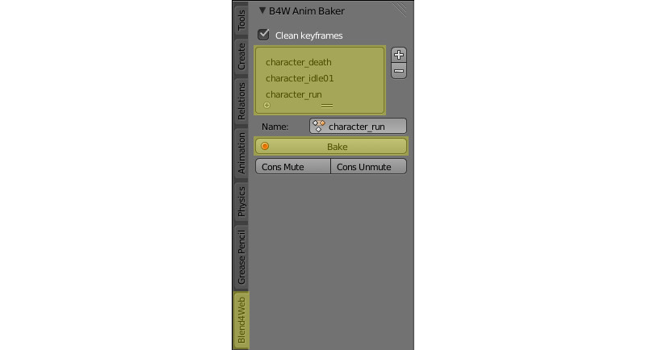
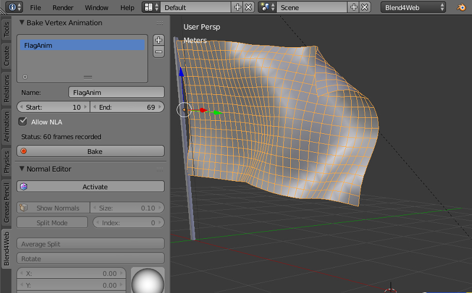

.. _animation:

.. index:: анимация

********
Анимация
********

.. contents:: Содержание
    :depth: 3
    :backlinks: entry

В общем случае, к анимации относятся изменения параметров объектов во времени.
Движком поддерживаются следующие типы анимации:

* Объектная анимация. Заключается в трансформации объекта в пространстве как
  единого целого.

* Скелетная анимация, то есть деформация геометрии объекта с помощью системы
  костей (скиннинг). Сюда же относится анимация костей в арматурном объекте с
  целью прикрепления объектов к костям.

* Вертексная анимация. Заключается в покадровой записи деформаций объекта с их
  последующим воспроизведением.

* Параметризация источников звука. Изменяемые параметры: громкость
  (``Volume``) и высота звука (``Pitch``).

* Анимация выходного значения ноды ``Value`` в нодовом материале.

* Процедурная анимация в виде колебаний объекта под действием ветра. Описано
  :ref:`отдельно <wind>`.

* Эмиссия частиц из источника. Описано в :ref:`соответствующем разделе <particles>`.

Управление анимацией
====================

Управление анимацией в движке осуществляется одним из двух способов:

#. Автоматически, с помощью активации панели ``Animation`` и указания поведения анимации
   ``Behavior`` в свойствах объекта. В данном случае будет осуществлён
   поиск доступного метода и в случае положительного результата, объект
   анимируется с момента загрузки сцены. В случае скелетной анимации, по
   умолчанию воспроизводится актор, назначенный на объекте в окне ``Action
   Editor``.

#. Программно, используя функции модуля движка ``animation``.

Для отладки анимации имеет смысл использовать интерфейс ``Animation``
программы-просмотрщика, рассмотренный в :ref:`соответствующем разделе <viewer>`.

.. _whole_object_anim:

Объектная анимация
==================

Изменяемые параметры: координаты центра (``Location``), поворот (``Rotation``) и масштабирование (``Scale``).

.. image:: src_images/animation/wind_generator.jpg
   :align: center
   :width: 100%

|

Осуществляется с помощью добавления ключей анимации для движения объекта в программе Blender и
их последующего воспроизведения в движке.

Поддерживаются следующие типы ключей:

* *Location*

* *Rotation* -- необходимо осуществлять в режиме ``Quaternion(WXYZ)`` либо ``XYZ Euler``.

* *Scale* -- для получения корректных результатов, фактор масштабирования должен
  быть одинаковым вдоль любых из осей.

* *LocRot* -- комбинация *Location* и *Rotation*.

* *LocScale* -- комбинация *Location* и *Scale*.

* *LocRotScale* -- комбинация *Location*, *Rotation* и *Scale*.

* *RotScale* -- комбинация *Rotation* и *Scale*.

В случае анимации объекта-меша, необходимо включение опции ``Force Dynamic Object`` панели ``Rendering Properties`` на
вкладке свойств объекта.

.. _skeletal_animation:

Скиннинг и скелетная анимация
=============================

.. image:: src_images/animation/rig.jpg
   :align: center
   :width: 100%

|

Для осуществления скелетной анимации, кроме деформируемого объекта-меша требуется
объект-арматура. Осуществляется в четыре этапа:

#. Создание скелета объекта в арматурном объекте.
#. Назначение вертексных групп в объекте-меше и их привязка к костям. Может быть осуществлено, например, методом "раскраски" весов (weight painting).
#. Анимация костей в арматурном объекте. Используются те же ключи, что и в случае
   объектной анимации.
#. В случае нетривиальных видов скелетной анимации, включающих инверсную кинематику,
   требуется стадия запекания анимационных акторов (блок ``Action`` в Blender).
   Запекание производится с помощью интерфейса ``Bake Skeletal Animation``, расположенного на панели инструментов ``Blend4Web``:

|

.. _animation_bake:

Параметры запекания
-------------------

Запекание производится при выделенном арматурном объекте.

В окне со списком запекаемых акторов приводятся те акторы, которые следует запечь. Если список пуст, запекаются все возможные акторы.

*Name*
    Имя текущего актора из списка запекаемых акторов.

*Optimize Keyframes*
    Произвести оптимизацию ключей анимации после запекания. В случае получения некорректных результатов, рекомендуется отключить опцию.

*Use Blender's Native Baker*
    Использовать для запекания анимации средства самого Blender (возможность Bake Action), а не Blend4Web. Настройки средства запекания Blender отличаются от настроек Blend4Web.

*Bake*
    Произвести запекание. После успешного окончания процесса на сцене появляются акторы с именами вида *B4W_BAKED_ИМЯ_АКТОРА*. Данные акторы будут автоматически назначены на арматурном объекте и воспроизведены в движке. Стоит отметить, что работа подобных акторов в Blender не гарантируется.

.. note::
    Движок поддерживает не более 4-х вертексных групп на каждом из вертексов,
    эти группы отбираются по величине влияния или "веса" вертекса. В процессе
    загрузки исходного файла со сценой "веса" вертексов проходят через процедуру
    нормализации, т.е. их сумма приводится в единице.

    Для удаления вертексных групп, которые не используются арматурой, можно воспользоваться
    кнопкой ``Clean Unused Vertex Groups`` в одноименной панели.

    .. image:: src_images/animation/vgroups_cleaner.png
       :align: center
       :width: 100%

В Blend4Web присутствует начальная поддержка ограничителей для костей. На сегодняшний день поддерживается только один тип ограничителя, ``Copy Transform``. Это позволяет привязывать арматуру к различным объектам, в том числе физическим (ragdoll). Поддержка других ограничителей ожидается в будущих версиях.

Вертексная анимация
===================

.. image:: src_images/animation/flag.jpg
   :align: center
   :width: 100%

|

Позволяет записать любые изменения геометрии объекта-меша. Необходимо учитывать,
что каждый кадр вертексной анимации эквивалентен мешу. Не рекомендуется создание
длинной анимации для высокополигонального меша, поскольку это может привести к
существенному возрастанию размера исходного и экспортируемого файлов, а также
замедлить работу движка.

.. _ver_anim:

Для запекания вертексной анимации предусмотрен инструмент ``Bake Vertex Animation``, 
расположенный на панели инструментов ``Blend4Web``.

Параметры запекания
-------------------

*Name*
    Имя, которое будет присвоено запеченной анимации.

*Start*
    Кадр, с которого начнётся запекание анимации.

*End*
    Кадр, которым закончится запекание анимации.

*Allow NLA*
    Позволяет управлять запечённой анимацией при помощи :ref:`NLA <nla>`.

*Status*
    В этой строке приводится количество кадров, из которых состоит запечённая анимация. Если запекание ещё не было произведено, вместо количества кадров приводится слово ``Empty``.

*Bake*
    Запекание анимации производится при нажатии на эту кнопку.

.. note::
    Для корректной работы вершинной анимации следует активировать опцию ``Export Vertex Animation`` (раздел ``Export Options`` панели ``Object``) у соответствующего объекта.

.. _default_animation:

Анимация по умолчанию
=====================

В Blend4Web присутствует возможность автоматически проигрывать анимацию объекта. Для этого нужно активировать параметр ``Apply Default Animation`` на вкладке ``Animation`` панели ``Object`` того объекта, анимацию которого требуется включить. Поддерживается скелетная и объектная анимация.

Проигрывание анимации начинается сразу после запуска приложения и осуществляется аналогично ноде :ref:`Play Timeline <nla_play_timeline>`, но без возможности задать начальный и конечный кадр (в качестве таковых всегда выступают первый и последний кадры таймлайна). Также присутствует возможность задать поведение анимации, аналогично ноде :ref:`Play Animation <nla_select_play>`.

.. _nla:

Нелинейная анимация
===================

.. _nla_editor:

Редактор NLA
------------

Редактор нелинейной анимации, имеющийся в программе Blender, позволяет в удобной
форме задавать поведение сцены. С его помощью можно реализовать несложные
сценарии. Таким образом
исключается необходимость программирования простых сцен и приложений.

.. image:: src_images/nla/simple_machinima.jpg
   :align: center
   :width: 100%

|

Движком поддерживается управление следующими сущностями:

* Любая анимация, параметры которой могут быть представлены с помощью `действий` (Action)

* Воспроизведение звуков

* Эмиссия частиц (в виде привязки к глобальной шкале времени)

.. image:: src_images/nla/nla_editor.jpg
   :align: center
   :width: 100%
   

Использование
.............

#. Во вкладке ``Scene`` активировать панель ``NLA``.
#. В редакторе ``NLA Editor`` задать необходимую конфигурацию поведения сцены.
#. На панели ``Timeline`` выбрать интервал времени анимации.

Дополнительные настройки
........................

Настройка сцены *NLA > Cyclic NLA* позволяет активировать режим
циклической NLA-анимации.

.. note::
    Для использования вертексной анимации необходимо выставить опцию
    "Allow NLA" на :ref:`панели запекания вертексной анимации <ver_anim>`.

Ограничения
...........

* Одновременное проигрывание различных видов анимации для одного объекта не поддерживается.

Управление через API
--------------------

Для управления нелинейной анимацией через API существует модуль ``nla.js``.

.. code-block:: javascript

    // ...
    var m_nla = require("nla");
    // ...
    m_nla.set_frame(150);
    // ...
    var frame = m_nla.get_frame();
    // ...
    m_nla.play();
    // ...
    m_nla.stop();
    // ...

  
При использовании :ref:`Logic Editor <logic_editor>` функции ``set_frame``, ``play``, 
``stop`` недоступны.

.. _speaker_animation:

Параметризация источников звука
===============================

На объектах-спикерах дополнительно поддерживаются следующие типы анимационных
ключей:

* *Volume* -- громкость звука источника.

* *Pitch* -- высота звука источника.

Параметризация источников звука по своей сути повторяет объектную анимацию.

.. _node_anim:

Анимация нод Value и RGB
========================

В нодовых материалах поддерживается воспроизведение анимационных ключей, проставленных на нодах ``Value`` и ``RGB``.

.. image:: src_images/animation/node_value_anim.jpg
   :align: center

|

.. image:: src_images/animation/node_RGB_anim.png
   :align: center

|

.. note::
    Анимация числовых и цветовых значений в других нодах не поддерживается.

Может быть также использована для создания треков в :ref:`редакторе нелинейной анимации <nla_editor>`. Поддерживается несколько анимированных нод ``Value`` и ``RGB`` в одном материале. Значения нод могут быть также установлены программно с помощью методов ``set_nodemat_value`` и ``set_nodemat_rgb`` модуля ``objects``.

.. seealso:: :ref:`node_time`

