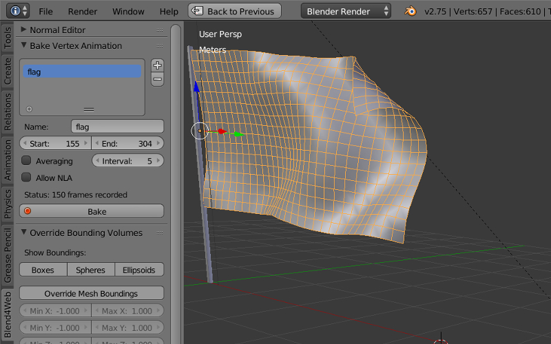

.. _animation:

.. index:: анимация, animation

********
Анимация
********

В общем случае, к анимации относятся изменения параметров объектов во времени.
Движком поддерживаются следующие типы анимации:

* Объектная анимация. Заключается в перемещении объекта в пространстве как
  единого целого. Изменяемые параметры: координаты центра (``Location``),
  кватернион поворота (``Rotation`` в режиме ``Quaternion(WXYZ)``) и
  масштабирование (``Scale``).

* Скелетная анимация, то есть деформация геометрии объекта с помощью системы
  костей (скиннинг). Сюда же относится анимация костей в арматурном объекте с
  целью прикрепления объектов к костям.

* Вертексная анимация. Заключается в покадровой записи деформаций объекта с их
  последующим воспроизведением.

* Параметризация источников звука. Изменяемые параметры: громкость
  (``Volume``) и высота звука (``Pitch``).

* Процедурная анимация в виде колебаний объекта под действием ветра. Описано
  :ref:`отдельно <wind>`.

* Эмиссия частиц из источника. Описано в :ref:`соответствующем разделе <particles>`.

Управление анимацией
====================

Управление анимацией в движке осуществляется одним из двух способов:

#. Автоматически, с помощью указания свойств ``Animation: Use default`` и
   ``Animation: Cyclic`` в свойствах объекта. В данном случае будет осуществлён
   поиск доступного метода и в случае положительного результата, объект
   анимируется с момента загрузки сцены. В случае скелетной анимации, по
   умолчанию воспроизводится актор, назначенный на объекте в окне ``Action
   Editor``.

#. Программно, используя функции модуля движка ``animation``.

Для отладки анимации имеет смысл использовать интерфейс ``Animation``
программы-просмотрщика, рассмотренный в :ref:`соответствующем разделе <viewer>`.

Объектная анимация
==================

Осуществляется с помощью добавления ключей анимации для движения объекта в программе Blender и
их последующего воспроизведения в движке.

Поддерживаются следующие типы ключей:

* *Location*

* *Rotation* -- необходимо осуществлять в режиме ``Quaternion(WXYZ)``.

* *Scale* -- для получения корректных результатов, фактор масштабирования должен
  быть одинаковым вдоль любых из осей.

* *LocRot* -- комбинация *Location* и *Rotation*.

* *LocScale* -- комбинация *Location* и *Scale*.

* *LocRotScale* -- комбинация *Location*, *Rotation* и *Scale*.

* *RotScale* -- комбинация *Rotation* и *Scale*.

В случае анимации объекта-меша, необходимо назначение свойства ``Do not batch`` на
вкладке свойств объекта.

Скиннинг и скелетная анимация
=============================

Для осуществления скелетной анимации, кроме деформируемого объекта-меша требуется
объект-арматура. Осуществляется в четыре этапа:

#. Создание скелета объекта в арматурном объекте.
#. Назначение вертексных групп в объекте-меше и их привязка к костям. Может быть осуществлено, например, методом "раскраски" весов (weight painting).
#. Анимация костей в арматурном объекте. Используются те же ключи, что и в случае 
   объектной анимации.
#. В случае нетривиальных видов скелетной анимации, включающих инверсную кинематику,
   требуется стадия запекания анимационных акторов (блок ``Action`` в Blender).
   Запекание производится с помощью интерфейса ``B4W Animation Bake``, расположенного на панели инструментов ``Blend4Web``:

.. image:: src_images/animation/baker.png
   :alt: Инструмент запекания скелетной анимации
   :align: center
   :width: 100%

Запекание производится при выделенном арматурном объекте. Элементы интерфейса запекателя:

* *Clean keyframes* -- произвести оптимизацию ключей анимации после запекания. В
  случае получения некорректных результатов, рекомендуется отключить опцию.

* *Bake* -- произвести запекание. В случае успешного окончания процесса, на
  сцене появляются акторы с именами вида *ИМЯ_BAKED*. Данные акторы могут быть
  назначены на арматурном объекте и воспроизведены в движке. Стоит отметить, что
  работа подобных акторов в Blender не гарантируется, хотя в ряде случаев может
  помочь интерфейс *Cons Mute*/*Cons Unmute*.

* *Cons Mute*/*Cons Unmute* -- отключить/активировать ограничители,
  установленные на костях. Инструмент может быть использован для тестирования
  запечёных акторов.

Вертексная анимация
===================

Позволяет записать любые изменения геометрии объекта-меша. Необходимо учитывать,
что каждый кадр вертексной анимации эквивалентен мешу. Не рекомендуется создание
длинной анимации для высокополигонального меша, поскольку это может привести к
существенному возрастанию размера исходного и экспортируемого файлов, а также
замедлить работу движка.

Для запекания вертексной анимации предусмотрен инструмент ``B4W Vertex Anim
Baker``, расположенный на панели инструментов ``Blend4Web``.

Параметризация источников звука
===============================

На объектах-спикерах дополнительно поддерживаются следующие типы анимационных
ключей:

* *Volume* -- громкость звука источника.

* *Pitch* -- высота звука источника.

Параметризация источников звука по своей сути повторяет объектную анимацию.
