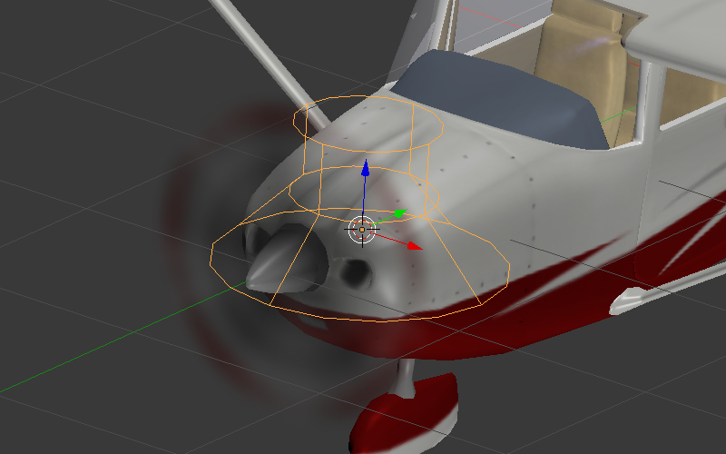
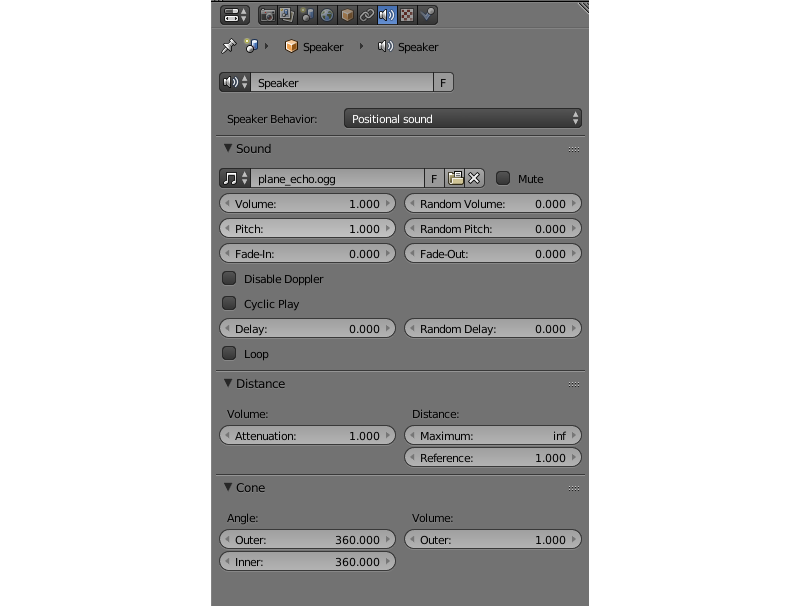

.. _audio:

*****
Audio
*****

.. contents:: Table of Contents
    :depth: 3
    :backlinks: entry

Audio sources are created in Blender. The standard ``Speaker`` object is used.

|

Audio Source Settings
=====================

Speaker parameters can be set up on the ``Properties`` panel under the ``Object Data`` tab.

The engine supports all the standard Blender sound parameters and some engine-specific settings.

Sound Tab
---------

*Mute*

    Enabling this parameter mutes the speaker.

*Speaker Behavior*:

    The behavior of the audio source.

    ``Positional`` --- high-quality sound with spatial positioning and directivity (conicity). The Web Audio API is used for sound rendering. Playback performance of such sounds is the least and so use them only for short samples. This is the default value.

    ``Background Sound`` --- high-quality omnidirectional sound without spatial positioning. The Web Audio API is used for sound rendering. It is more performant but is not effective for music.

    ``Background Music`` --- used for music playback. It has maximum performance due to the use of the Audio HTML tag, but has minimum flexibility.

The following options are available on the ``Sound`` panel:

*Volume*

    Speaker volume

*Random Volume*

    Additional volume randomization. The resulting value is calculated as for the delay.

*Pitch*

    Sound playback velocity. 

*Random Pitch*

    Additional randomization of the sound playback speed. The resulting value is calculated as for the delay.

*Fade-In*

    Fade-in time interval.

*Fade-Out*

    Fade-out time interval.

*Enable Doppler*

    Turn on the source's frequency shift upon its moving.

*Auto-play*

    This option enables default playback.

*Cyclic Play*

    Loop the sound playback.

*Loop*

    Loop the sound playback. Contrary to the ``Cyclic play`` option it guarantees a zero delay upon repeat. The option is available only for sound sources with ``Positional`` or ``Background Sound`` behavior.

*Loop Start*

    Marks the starting point of the source fragment that will be looped. This value is measured in second counted from the start of the source file.

*Loop End*

    Marks the end point of the source fragment. This value is also measured in seconds.

*Delay*

    Delay before sound playback starts.

*Random Delay*

    Additional delay randomization. The resulting value is calculated according to the formula :math:`Delay_{result} = Delay + Delay_{random} * Random_{[0-1]}`.

Distance Tab
------------

*Attenuation*

    This parameter defines how strong the distance affects the volume. Default value is 1.0.

*Maximum*

    Maximum distance for volume calculation.

*Reference*

    This sets the reference distance at which volume is 100%.

Cone Tab
--------

Angle group of parameters:

    *Outer*

        Angle of the outer cone in degrees. Outside this cone the volume is the outer cone volume. Between the inner and outer cone the volume is interpolated.

    *Inner*

        Angle of the inner cone in degrees. Inside the cone the volume is 100%.

Volume group of parameters:

    *Outer*

        This sets the volume outside the outer cone.

|

..
    *Loop count*
        Not implemented
    *Random loop count*
        Not implemented
    *Playlist ID*
        Not implemented

.. _encoding:

Processing and Decoding
=======================

Supported formats (containers):
-------------------------------

* ogg, Vorbis codec (Chrome, Firefox)
* mp3 (Chrome, Safari)
* mp4, AAC codec (Chrome, Safari)

It is recommended to use **Ogg** as it is an open standard, is widespread in browsers and provides good sound quality. The optimal format in respect to the quality and compatibility is 48kHz/16bit. Single-channel sound (mono) is used to store shot samples while two-channel sound (stereo) is used for music playback.

Converting resources between different formats is described in the :ref:`corresponding section <converter>`.
