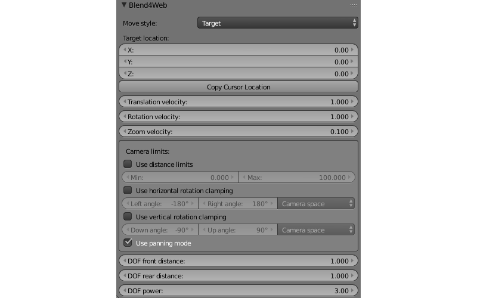
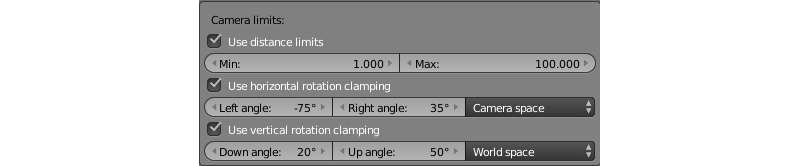

.. _camera:

******
Камера
******

Режимы управления и общие настройки
===================================

Настройки камеры выставляются в панели ``Properties`` на вкладке ``Object Data``.

|

*Blend4Web > Move Style*
    Режим управления камерой:
    
    * *Target*
        По умолчанию камера находится в режиме вращения вокруг некоторой точки (target). Положение точки вращения может быть изменено (см. :ref:`панорамирование <panning_mode>`).
    * *Eye*
        Режим взгляда позволяет осуществлять вращение и перемещение от первого лица.
    * *Hover*
        В режиме нависания камера движется параллельно горизонтальной плоскости.
    * *Static*
        В статическом режиме изменение положения камеры осуществляется посредством анимации или через API.

*Blend4Web > Target Location*
    Доступно в режиме ``Target``. Позиция точки, относительно которой будет вращаться камера. Кнопка ``Copy Cursor Location`` позволяет скопировать текущее положение курсора.

*Blend4Web > Dof Front Distance*
    Описано в разделе :ref:`dof`.

*Blend4Web > Dof Rear Distance*
    Описано в разделе :ref:`dof`.

*Blend4Web > DOF Power*
    Описано в разделе :ref:`dof`.

.. _camera_velocity:

Скорость движения камеры
========================

Для камеры доступно несколько настроек скорости движения.

*Blend4Web > Translation Velocity*
    Доступно в режимах ``Target``, ``Eye``, ``Hover``. Задаёт скорость перемещения камеры. 

*Blend4Web > Rotation Velocity*
    Доступно в режимах ``Target``, ``Eye``, ``Hover``. Задаёт скорость вращения камеры.

*Blend4Web > Zoom Velocity*
    Доступно в режимах ``Target``, ``Hover``. Задаёт скорость приближения камеры к опорной точке.

Значение параметров по умолчанию: ``Translation Velocity``, ``Rotation Velocity``: 1; ``Zoom Velocity``: 0.1.

Допустимые значения параметров: ``Translation Velocity``, ``Rotation Velocity``:
 :math:`\left[0,\ \infty \right)`; ``Zoom Velocity``: :math:`\left[0,\ 1\right)`.

Ограничения движения камеры
===========================

Для камеры доступно несколько настроек, ограничивающих/изменяющих её движение тем или иным образом. Они объединены в группу ``Camera Limits``. 

|

**Камера типа Target**

*Blend4Web > Use Distance Limits*
    Задание минимального и максимального расстояний от камеры до точки вращения. Допустимые значения: *Min* :math:`\le` *Max*. По умолчанию отключено.

.. only:: html

    .. image:: src_images/objects/distance_limits.svg
      :align: center
      :width: 100%

.. only:: latex

    .. image:: src_images/objects/distance_limits.png
      :align: center
      :width: 100%

*Blend4Web > Use Horizontal Rotation Clamping*
    Ограничение горизонтального (вокруг мировой оси Z в Blender'е) вращения камеры относительно соответствующей точки. Вращение происходит по дуге окружности определяемой значениями ``Left Angle`` и ``Right Angle``. Дуга вращения соответствует движению из ``Left Angle`` в ``Right Angle`` против часовой стрелки. По умолчанию отключено.

.. only:: html

    .. image:: src_images/objects/horizontal_limits_target.svg
      :align: center
      :width: 100%

.. only:: latex

    .. image:: src_images/objects/horizontal_limits_target.png
      :align: center
      :width: 100%

*Blend4Web > Use Vertical Rotation Clamping*
    Ограничение вертикального (вокруг локальной оси X камеры в Blender'е) вращения камеры относительно соответствующей точки. Вращение происходит по дуге окружности определяемой значениями ``Down Angle`` и ``Up Angle``. Дуга вращения соответствует движению из ``Down Angle`` в ``Up Angle`` по часовой стрелке. По умолчанию отключено.

.. only:: html
    
    .. image:: src_images/objects/vertical_limits_target.svg
      :align: center
      :width: 100%

.. only:: latex
    
    .. image:: src_images/objects/vertical_limits_target.png
      :align: center
      :width: 100%

.. _panning_mode:

*Blend4Web > Use panning mode*
    Разрешить панорамное перемещение камеры.

|

**Камера типа Eye**

*Blend4Web > Use Horizontal Rotation Clamping*
    Ограничение горизонтального (вокруг мировой оси Z в Blender'е) вращения камеры относительно своего местоположения. Вращение происходит по дуге окружности определяемой значениями ``Left Angle`` и ``Right Angle``. Дуга вращения соответствует движению из ``Left Angle`` в ``Right Angle`` по часовой стрелке. По умолчанию отключено.

.. only:: html

    .. image:: src_images/objects/horizontal_limits_eye.svg
      :align: center
      :width: 100%

.. only:: latex

    .. image:: src_images/objects/horizontal_limits_eye.png
      :align: center
      :width: 100%

*Blend4Web > Use Vertical Rotation Clamping*
    Ограничение вертикального (вокруг локальной оси X камеры в Blender'е) вращения камеры относительно своего местоположения. Вращение происходит по дуге окружности определяемой значениями ``Down Angle`` и ``Up Angle``. Дуга вращения соответствует движению из ``Down Angle`` в ``Up Angle`` против часовой стрелки. По умолчанию отключено.

.. only:: html

    .. image:: src_images/objects/vertical_limits_eye.svg
      :align: center
      :width: 100%

.. only:: latex

    .. image:: src_images/objects/vertical_limits_eye.png
      :align: center
      :width: 100%

|

**Камера типа Hover**

*Blend4Web > Use Horizontal Translation Limits* 
    Ограничение перемещения опорной точки вдоль оси X в мировых координатах в Blender'е. Допустимые значения: *Min* :math:`\le` *Max*. По умолчанию отключено.

*Blend4Web > Use Vertical Translation Limits*
    Ограничение перемещения опорной точки вдоль оси Y в мировых координатах в Blender'е. Допустимые значения: *Min* :math:`\le` *Max*. По умолчанию отключено.

.. only:: html

    .. image:: src_images/objects/hover_camera_trans_limits.svg
      :align: center
      :width: 100%

.. only:: latex

    .. image:: src_images/objects/hover_camera_trans_limits.png
      :align: center
      :width: 100%

*Blend4Web > Use Distance Limits*
    Задание минимального и максимального расстояний от камеры до точки пересечения (опорная точка) направления взгляда камеры с горизонтальной плоскостью 
    (по умолчанию с плоскостью XOY мировых координат в Blender'е). Допустимые значения: *Min* :math:`\le` *Max*. При отключении камера будет свободно двигаться вдоль оси Z мировых координат в Blender'е, опорная точка не будет задана, а настройки ``Blend4Web > Use Horizontal Translation Limits`` и ``Blend4Web > Use Vertical Translation Limits`` будут ограничивать позицию самой камеры. По умолчанию отключено.

*Blend4Web > Camera Angle Limits*
    Ограничения угла подъема камеры (угла между направлением взгляда камеры и горизонтальной плоскостью). Становятся доступными при включении опции ``Blend4Web > Use Distance Limits``. Допустимые значения: 0 :math:`\le` Down Angle :math:`\le` Up Angle :math:`\le` 90. Значения по умолчанию: *Down Angle = 0, Up Angle = 90*.

При включении настройки ``Blend4Web > Use Distance Limits`` лимиты по расстоянию и углу подъема будут действовать одновременно, задавая траекторию движения камеры в вертикальной плоскости. 

.. only:: html

    .. image:: src_images/objects/hover_camera_rot_limits.svg
      :align: center
      :width: 100%

.. only:: latex

    .. image:: src_images/objects/hover_camera_rot_limits.png
      :align: center
      :width: 100%

Некорректное задание лимитов по расстоянию либо углу подъема приведет к отключению опции ``Blend4Web > Use Distance Limits``.

*Blend4Web > Use Horizontal Rotation*
    Разрешить вращение камеры в плоскости XOY Blender'а относительно опорной точки. Становятся доступными при включении опции ``Blend4Web > Use Distance Limits``. По умолчанию включено.

.. only:: html

    .. image:: src_images/objects/hover_camera_horiz_rotation.svg
      :align: center
      :width: 100%

.. only:: latex

    .. image:: src_images/objects/hover_camera_horiz_rotation.png
      :align: center
      :width: 100%

|

**Особенности задания ограничений**

* Для EYE/TARGET камеры перемена мест значений *Left/Right* или *Down/Up* приводит к движению по противоположной дуге окружности вращения.

.. only:: html

    .. image:: src_images/objects/limits_inversion.svg
      :align: center
      :width: 100%

.. only:: latex

    .. image:: src_images/objects/limits_inversion.png
      :align: center
      :width: 100%

* При ограничении горизонтального и вертикального вращения камеры можно выбрать пространство координат:

*Camera Space*
    Все углы отсчитываются относительно начального положения и ориентации камеры.

*World Space*
    Горизонтальные углы отсчитываются относительно направления оси Y в пространстве мировых координат, вертикальные - относительно плоскости XOY в мировом пространстве в Blender'е.

Значение по умолчанию: ``Camera Space``.

Ограничения по горизонтали на примере TARGET камеры:

.. only:: html

    .. image:: src_images/objects/camera_space_world_space_h.svg
      :align: center
      :width: 100%

.. only:: latex

    .. image:: src_images/objects/camera_space_world_space_h.png
      :align: center
      :width: 100%

Ограничения по вертикали на примере TARGET камеры:

.. only:: html

    .. image:: src_images/objects/camera_space_world_space_v.svg
      :align: center
      :width: 100%

.. only:: latex

    .. image:: src_images/objects/camera_space_world_space_v.png
      :align: center
      :width: 100%

.. _camera_api_notes:

Управление камерой через API
============================

  Основные функции управления камерой находятся в модуле ``camera.js``.

  При работе с камерой через API (вращение, выставление ограничений) отсчет угловых координат ведется в системе координат движка следующим образом:

  Для типов ``TARGET/HOVER``:

.. only:: html

    .. image:: src_images/objects/b4w_target_hover_cam_angles.svg
      :align: center
      :width: 100%

.. only:: latex

    .. image:: src_images/objects/b4w_target_hover_cam_angles.png
      :align: center
      :width: 100%

Для типа ``EYE``:

.. only:: html

    .. image:: src_images/objects/b4w_eye_cam_angles.svg
      :align: center
      :width: 100%

.. only:: latex

    .. image:: src_images/objects/b4w_eye_cam_angles.png
      :align: center
      :width: 100%

|

При выставлении лимитов перемещения для камеры типа ``HOVER`` значения лимитов будут соответствовать осям системы координат движка: 

* ``Horizontal Translation Limits`` - ось X

* ``Vertical Translation Limits`` - ось Z

.. only:: html

    .. image:: src_images/objects/b4w_hover_trans_limits.svg
      :align: center
      :width: 100%

.. only:: latex

    .. image:: src_images/objects/b4w_hover_trans_limits.png
      :align: center
      :width: 100%
