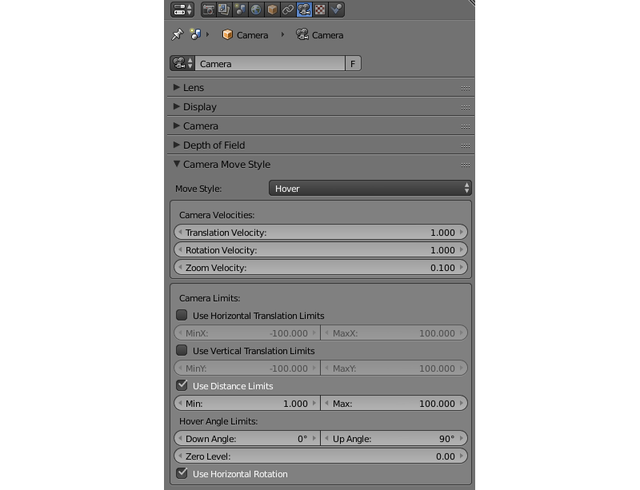
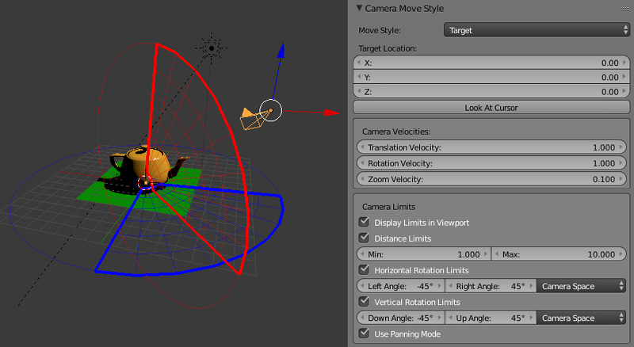
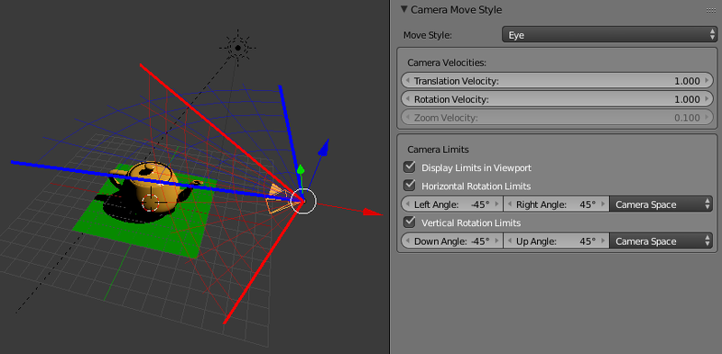
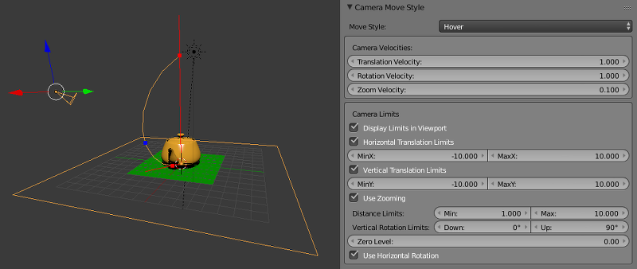

.. _camera:

******
Camera
******

.. contents:: Table of Contents
    :depth: 3
    :backlinks: entry

Move Styles and General Settings
================================

The camera settings are specified in the ``Properties`` panel under the ``Camera (Object Data)`` tab.

|

.. _camera_move_style:

*Camera Move Style > Move Style*
    Camera control mode:

    * *Target*
        By default the camera is rotating around a fixed point (target). The pivot's position can be changed (see :ref:`camera panning <panning_mode>`).
    * *Eye*
        The ``Eye`` mode allows rotation and translation as in first person view.
    * *Hover*
        In ``Hover`` mode, camera moves parallel to the horizontal plane. By using additional limits, a smooth movement path toward the pivot point for the camera can be created.
    * *Static*
        In the ``Static`` mode the camera can be moved via animation or through API calls.

*Look At Cursor > Target Location*
    Available for the ``Target`` mode. This is the position of the camera pivot point. The ``Look At Cursor`` button copies the current 3D cursor position into this value.

*Depth of Field*
    Described in the :ref:`dof` section.

.. _camera_velocity:

Velocity settings are available for camera movement.

*Camera Move Style > Camera Velocities > Translation Velocity*
    Available for the ``Target``, ``Eye`` and ``Hover`` type cameras. Sets the velocity of the camera translation. Possible value interval: :math:`\left[0,\ \infty \right)`. Default value is 1.

*Camera Move Style > Camera Velocities > Rotation Velocity*
    Available for the ``Target``, ``Eye`` and ``Hover`` type cameras. Sets the camera rotation speed. Possible value interval: :math:`\left[0,\ \infty \right)`. Default value is 1.

*Camera Move Style > Camera Velocities > Zoom Velocity*
    Available for the ``Target`` and ``Hover`` type cameras. Set the velocity of the camera approaching the pivot point. Possible value interval: :math:`\left[0,\ 0.99\right]`. Default value is 0.1.

Limiting the Camera Movement
============================

There are several settings for the camera which limit/change its movement one way or another. They are grouped as ``Camera Limits``.

.. image:: src_images/camera/camera_limits.png
   :align: center
   :width: 100%

Camera limits can be viewed right in the Blender viewport, if the ``Display Limits in Viewport`` parameter is enabled.

|

.. _camera_target_type:

**Target Type Camera**
----------------------

*Camera Move Style > Camera Limits > Distance Limits*
    Set minimum and maximum distances from the camera to the pivot point. Allowable values: *Min* :math:`\le` *Max*. Default values: *Min = 1*, *Max = 10*. Disabled by default.

.. only:: html

    .. image:: src_images/camera/distance_limits.svg
        :align: center
        :width: 100%

.. only:: latex

    .. image:: src_images/camera/distance_limits.png
        :align: center
        :width: 100%

*Camera Move Style > Camera Limits > Horizontal Rotation Limits*
    Limit the horizontal (around the Z world axis in Blender) camera rotation around the corresponding point. Rotation is performed along the arc of a circle between ``Left Angle`` and ``Right Angle`` values. The rotation arc corresponds to movement from ``Left Angle`` to ``Right Angle`` anticlockwise. Default values: *Left Angle = -45°*, *Right Angle = 45°*. Disabled by default.

.. only:: html

    .. image:: src_images/camera/horizontal_limits_target.svg
        :align: center
        :width: 100%

.. only:: latex

    .. image:: src_images/camera/horizontal_limits_target.png
        :align: center
        :width: 100%

*Camera Move Style > Camera Limits > Vertical Rotation Limits*
    Limit the horizontal (around the Z world axis in Blender) camera rotation around the corresponding point. Rotation is performed along the arc of a circle between ``Left Angle`` and ``Right Angle`` values. The rotation arc corresponds to movement from ``Left Angle`` to ``Right Angle`` anticlockwise. Default values: *Left Angle = -45°*, *Right Angle = 45°*. Disabled by default.

.. only:: html

    .. image:: src_images/camera/vertical_limits_target.svg
        :align: center
        :width: 100%

.. only:: latex

    .. image:: src_images/camera/vertical_limits_target.png
        :align: center
        :width: 100%

*Camera Move Style > Camera Limits > Pivot Translation Limits*
    Limit the translation of the camera's pivot point. Default values: *MinZ = 0*, *MaxZ = 10*. Not rendered in the viewport.

.. _panning_mode:

*Camera Move Style > Camera Limits > Use Panning Mode*
    Allow camera panning.

|

.. _camera_eye_type:

**Eye Type Camera**
-------------------

*Blend4Web > Horizontal Rotation Limits*
    Limit the horizontal (around the Z world axis in Blender) camera rotation around the corresponding point. Rotation is performed along the arc of a circle between ``Left Angle`` and ``Right Angle`` values. The rotation arc corresponds to movement from ``Left Angle`` to ``Right Angle`` anticlockwise. Default values: *Left Angle = -45°*, *Right Angle = 45°*. Disabled by default.

.. only:: html

    .. image:: src_images/camera/horizontal_limits_eye.svg
        :align: center
        :width: 100%

.. only:: latex

    .. image:: src_images/camera/horizontal_limits_eye.png
        :align: center
        :width: 100%

*Camera Move Style > Camera Limits > Vertical Rotation Limits*
    Limit the vertical (around the local X axis in Blender) camera rotation around the corresponding point. Rotation is performed along the arc of a circle between ``Down Angle`` and ``Up Angle`` values. The rotation arc corresponds to movement from ``Down Angle`` to ``Up Angle`` anticlockwise. Default values: *Down Angle = -45°*, *Up Angle = 45°*. Disabled by default.

.. only:: html

    .. image:: src_images/camera/vertical_limits_eye.svg
        :align: center
        :width: 100%

.. only:: latex

    .. image:: src_images/camera/vertical_limits_eye.png
        :align: center
        :width: 100%

|

.. _camera_hover_type:

**Hover Type Camera**
---------------------

*Camera Move Style > Camera Limits > Horizontal Translation Limits*
    Limit movement of the pivot point along the Blender's world X axis. Allowable values: *Min* :math:`\le` *Max*. Default values: *MinX = -10*, *MaxX = 10*. Disabled by default.

*Camera Move Style > Camera Limits > Vertical Translation Limits*
    Limit movement of the pivot point along the Blender's world X axis. Allowable values: *Min* :math:`\le` *Max*. Default values: *MinY = -10*, *MaxY = 10*. Disabled by default.

.. only:: html

    .. image:: src_images/camera/hover_camera_trans_limits.svg
        :align: center
        :width: 100%

.. only:: latex

    .. image:: src_images/camera/hover_camera_trans_limits.png
        :align: center
        :width: 100%

*Camera Move Style > Camera Limits > Use Zooming*
    Allows user to zoom the camera in and out from the pivot point. If this parameter is disabled, the camera will always remain at a fixed distance from the pivot point. Disable by default.

*Camera Move Style > Camera Limits > Distance Limits*
    Set minimum and maximum distances from the camera to the point of intersection between the camera's view direction and the horizontal reference plane (Blender's world XOY plane by default). Allowable values: *Min* :math:`\le` *Max*. Default values: *Min = 1*, *Max = 10*. Disabled by default.

*Camera Move Style > Camera Limits > Vertical Rotation Limits*
    Limits the camera's angle of elevation (an angle between the camera's sight line and a horizontal plane. Possible value interval: *0°* :math:`\le` *Down* :math:`\le` *Up* :math:`\le` *90°*. Default values: *Down = 0°, Up = 90°*.

*Camera Move Style > Camera Limits > Zero Level*
    A distance between reference plane and the coordinates origin. Set to zero by default.

.. _hover_trajectory_figure:

If the ``Blend4Web > Use Zooming`` setting is turned on, the limits for distance and inclination angle will be applied simultaneously, to define the camera movement path in the vertical plane.

.. only:: html

    .. image:: src_images/camera/hover_camera_rot_limits.svg
        :align: center
        :width: 100%

.. only:: latex

    .. image:: src_images/camera/hover_camera_rot_limits.png
        :align: center
        :width: 100%

Setting incorrect distance or elevation angle limits will disable this parameter.

*Camera Move Style > Camera Limits > Use Horizontal Rotation*
    Allow camera rotation in Blender's XOY plane around to the pivot point. Enabled by default.

.. only:: html

    .. image:: src_images/camera/hover_camera_horiz_rotation.svg
        :align: center
        :width: 100%

.. only:: latex

    .. image:: src_images/camera/hover_camera_horiz_rotation.png
        :align: center
        :width: 100%

|

.. _camera_static_type:

**Static Camera**

.. image:: src_images/camera/camera_limits_static.png
    :align: center
    :width: 100%

This type of camera does not have limits, as it can't be directly controlled by the user.

|

**Peculiarities of Limiting Settings**

* For EYE/TARGET cameras, interchanging *Left/Right* or *Down/Up* values results in movement along the opposite arc of a circle.

.. only:: html

    .. image:: src_images/camera/limits_inversion.svg
        :align: center
        :width: 100%

.. only:: latex

    .. image:: src_images/camera/limits_inversion.png
        :align: center
        :width: 100%

* When limiting the camera's horizontal and vertical rotation, it is possible to choose between the following coordinate spaces:

*Camera Space*
    All angles are measured relative to the initial camera position and orientation.

*World Space*
    Horizontal angles are measured relative to the Y axis in world space; vertical angles are measured relative to the Blender's XOY plane in world space.

Default value: ``Camera Space``.

Horizontal limits by the example of the TARGET camera:

.. only:: html

    .. image:: src_images/camera/camera_space_world_space_h.svg
        :align: center
        :width: 100%

.. only:: latex

    .. image:: src_images/camera/camera_space_world_space_h.png
        :align: center
        :width: 100%

Vertical limits by the example of the TARGET camera:

.. only:: html

    .. image:: src_images/camera/camera_space_world_space_v.svg
        :align: center
        :width: 100%

.. only:: latex

    .. image:: src_images/camera/camera_space_world_space_v.png
        :align: center
        :width: 100%

.. _camera_viewport_alignment:

Viewport Alignment
==================

If an object is parented to a camera, the set of parameters known as *Viewport Alignment* are available under the ``Relations`` tab on the ``Object`` panel.

.. image:: src_images/objects/objects_viewport_alignment.png
    :align: center
    :width: 100%

Using these settings, the object can be aligned to the active camera, so that the object will remain in the same place of the screen regardless of the position and rotation of the camera. This is especially useful for creating UI elements.

.. figure:: src_images/camera/camera_viewport_alignment_example.png
    :width: 100%

This picture shows an example of how the Viewport Alignment option can be used.

*Viewport Alignment*
    This parameter enables and disables all the following parameters. It is disabled by default.

*Alignment*
    This parameter specifies what side of the screen the object will be aligned with. It can have one of the following values.
    
    * ``Top-Left`` - aligns the object in the top left corner of the viewport
    * ``Top`` - aligns the object in the top of the viewport
    * ``Top-Right`` - aligns the object in the top right corner of the viewport
    * ``Left`` - aligns the object in the left side of the viewport
    * ``Center`` - aligns the object in the center of the viewport
    * ``Right`` - aligns the object in the right side of the viewport
    * ``Bottom-Left`` - aligns the object in the bottom left corner of the viewport
    * ``Bottom`` - aligns the object in the bottom of the viewport
    * ``Bottom-Right`` - aligns the object in the bottom right corner of the viewport.

    Default value is ``Center``.

*Distance*
    This specifies the distance between the aligned object and the camera. It is set to 10 by default.

*Fit to Camera*
    By pressing this button, you can make the aligned object look the same way in the Blender viewport as it will look in the engine. It can be used to preview alignment results.

.. _camera_api_notes:

Camera Controls API
===================

Detailed API module documentation: :b4wmod:`link camera`.

A camera's position and its spatial orientation are defined by the control mode. In the ``EYE``, ``TARGET`` and ``HOVER`` modes, control mode has several limitations: for example, the camera's vertical axis is always aligned along the world's Z-axis and the camera is constantly focused on the pivot point. The ``STATIC`` mode camera has no such limitations, which makes it more suitable for cases when you need more complete control, such as procedural animation.

Main functions for camera control are located in the :b4wmod:`camera` module. Some of them (intended for a specific control mode) have names which start with an appropriate prefix: ``static_``, ``eye_``, ``target_`` and ``hover_``. Other functions can be used in any mode.

.. _camera_move_style_change:

Control Mode Setup
------------------

To change the control mode and to completely define a camera's behavior, the following methods can be used: :b4wref:`camera.static_setup()`, :b4wref:`camera.eye_setup()`, :b4wref:`camera.target_setup()` and :b4wref:`camera.hover_setup()`. These methods receive an object that contains a set of optional parameters, which can be used to set the camera's position, rotation, available limits and so on.

.. code-block:: javascript

    var camera = m_scenes.get_active_camera();
    var POS = new Float32Array([1,1,1]);
    var LOOK_AT = new Float32Array([0,0,0]);
    var EYE_HORIZ_LIMITS = { left: Math.PI/4, right: -Math.PI/4 };
    var EYE_VERT_LIMITS = { down: -Math.PI/4, up: Math.PI/4 };
    var TARGET_DIST_LIMITS = { min: 1, max: 10 };
    var HOVER_DIST_LIMITS = { min: 1, max: 10 };
    var HOVER_ANGLE_LIMITS = { down: 0, up: -Math.PI/4 };
    var HOVER_HORIZ_TRANS_LIMITS = { min: -5, max: 3 };
    var HOVER_VERT_TRANS_LIMITS = { min: -1, max: 1 };

    ...
    
    // setup STATIC camera by defining the new position and the new look-at point
    m_cam.static_setup(camera, { pos: POS, look_at: LOOK_AT });

    // setup STATIC camera by defining the new look-at point and keeping the existing position
    m_cam.static_setup(camera, { look_at: LOOK_AT });

    // setup STATIC camera by defining the new position and keeping the existing orientation
    m_cam.static_setup(camera, { pos: POS });

    // setup EYE camera with horizontal rotation limits
    m_cam.eye_setup(camera, { pos: POS, look_at: LOOK_AT, 
            horiz_rot_lim: EYE_HORIZ_LIMITS });

    // setup EYE camera with vertical rotation limits
    m_cam.eye_setup(camera, { pos: POS, look_at: LOOK_AT, 
            vert_rot_lim: EYE_VERT_LIMITS });

    // setup TARGET camera with distance limits and panning mode
    m_cam.target_setup(camera, { pos: POS, pivot: LOOK_AT, 
            dist_lim: TARGET_DIST_LIMITS, use_panning: true });

    // setup HOVER camera on a fixed distance (without zooming) relatively to its pivot
    m_cam.hover_setup(camera, { pos: POS, pivot: LOOK_AT });

    // setup HOVER camera with zooming (distance + angle limits)
    m_cam.hover_setup(camera, { pos: POS, pivot: LOOK_AT, 
            dist_lim: HOVER_DIST_LIMITS, hover_angle_lim: HOVER_ANGLE_LIMITS });

    // setup HOVER camera with translation limits
    m_cam.hover_setup(camera, { pos: POS, pivot: LOOK_AT, 
            horiz_trans_lim: HOVER_HORIZ_TRANS_LIMITS, 
            vert_trans_lim: HOVER_VERT_TRANS_LIMITS });

    // setup HOVER camera with horizontal rotation enabled
    m_cam.hover_setup(camera, { pos: POS, pivot: LOOK_AT, enable_horiz_rot: true });

The main characteristic of the ``HOVER`` type camera is the fact that the distance and elevation angle limits define a certain :ref:`path <hover_trajectory_figure>` of movement toward the pivot point. The camera will always be located on this path, so its final position can be different from the one returned by the :b4wref:`camera.hover_setup()` method (basically, it is projected onto the path). If you need to set the camera's position on some path, you can use the :b4wref:`camera.hover_setup_rel()` method to set the relative limits.

.. code-block:: javascript

    var camera = m_scenes.get_active_camera();
    var POS = new Float32Array([1,1,1]);
    var PIVOT = new Float32Array([0,0,0]);

    ...

    // setup HOVER camera with maintaining the given camera position and 
    // ability to zoom-in and zoom-out equally
    m_cam.hover_setup_rel(camera, { pos: POS, pivot: PIVOT, dist_interval: 2, 
            angle_interval: Math.PI/4 });

The current camera mode can be checked with the :b4wref:`camera.is_static_camera()`, :b4wref:`camera.is_eye_camera()`, :b4wref:`camera.is_target_camera()`, :b4wref:`camera.is_hover_camera()` or :b4wref:`camera.get_move_style()` methods:

.. code-block:: javascript

    var camera = m_scenes.get_active_camera();

    ...

    if (m_cam.is_static_camera(camera))
        console.log("STATIC camera!");

    if (m_cam.get_move_style(camera) == m_cam.MS_EYE_CONTROLS)
        console.log("EYE camera!");

.. note::

    If you need to change only some aspects of the camera's behavior, you can use the methods described below.

Translation and Rotation
------------------------

To rotate a ``STATIC`` type camera, you need to use the :b4wref:`camera.static_get_rotation()` and :b4wref:`camera.static_set_rotation()` methods. In these methods, rotation is defined by a quaternion.

.. code-block:: javascript

    var camera = m_scenes.get_active_camera();

    ...

    // rotation through a quaternion
    var _quat_tmp = new Float32Array(4);
    var old_quat = m_cam.static_get_rotation(camera, _quat_tmp);
    var new_quat = m_quat.rotateX(old_quat, Math.PI/2, old_quat)
    m_cam.static_set_rotation(camera, new_quat);

For the ``EYE``, ``TARGET`` and ``HOVER`` type cameras, rotation is performed in :ref:`spherical coordinates <camera_spherical_coordinates>` by using the :b4wref:`camera.eye_rotate()`, :b4wref:`camera.target_rotate()`, :b4wref:`camera.hover_rotate()` and :b4wref:`camera.rotate_camera()` methods: 

.. code-block:: javascript

    var camera = m_scenes.get_active_camera();

    ...

    // rotate by given delta angles
    m_cam.eye_rotate(camera, Math.PI/6, Math.PI/2);

    // set absolute rotation in world space
    m_cam.eye_rotate(camera, Math.PI/6, Math.PI/2, true, true);

Current spherical coordinates of the camera can be obtained by using the :b4wref:`camera.get_camera_angles()` method:

.. code-block:: javascript

    var camera = m_scenes.get_active_camera();
    var _vec2_tmp = new Float32Array(2);

    ...

    // get camera orientation in spherical coordinates
    var angles = m_cam.get_camera_angles(camera, _vec2_tmp);
    phi = angles[0];
    theta = angles[1];

Access to the position of the camera can be obtained by using the :b4wref:`camera.get_translation()` and :b4wref:`camera.set_translation()` methods. For the ``TARGET`` and ``HOVER`` modes this means simultaneous translation of an entire model, including camera position and pivot point. 

.. code-block:: javascript

    var camera = m_scenes.get_active_camera();
    var _vec3_tmp = new Float32Array(3);

    ...

    // get camera position
    var pos = m_cam.get_translation(camera, _vec3_tmp);

    // set new position
    var new_pos = m_vec3.set(1, 0, 2, pos);
    m_cam.set_translation(camera, new_pos);

Additional camera translation methods:

* :b4wref:`camera.target_set_trans_pivot()`, :b4wref:`camera.target_set_pivot_translation()`, :b4wref:`camera.hover_set_pivot_translation()` - sets the position and the pivot point of the camera at the same time;

* :b4wref:`camera.target_get_distance()`, :b4wref:`camera.target_set_distance()` - translation based on the distance to the pivot point;

* :b4wref:`camera.static_set_look_at()`, :b4wref:`camera.eye_set_look_at()` - sets the camera's position and point of sight simultaneously;

.. note::

    Because a camera is a scene object, :b4wmod:`transform` module methods can also be used. But, as every control mode influences camera movement differently, results may differ from those expected.

Limit Setup
---------------

Camera limits are available for the ``EYE``, ``TARGET`` and ``HOVER`` type cameras. To set a specific limit, you need to use a specific method:

+----------------------------------------------+-------------------------------------------------+-------------------------------------------------+
| EYE                                          | TARGET                                          | HOVER                                           |
+==============================================+=================================================+=================================================+
| :b4wref:`camera.eye_get_horizontal_limits()` | :b4wref:`camera.target_get_distance_limits()`   | :b4wref:`camera.hover_get_distance_limits()`    |
| :b4wref:`camera.eye_set_horizontal_limits()` | :b4wref:`camera.target_set_distance_limits()`   | :b4wref:`camera.hover_set_distance_limits()`    |
| :b4wref:`camera.eye_get_vertical_limits()`   | :b4wref:`camera.target_get_horizontal_limits()` | :b4wref:`camera.hover_get_vertical_limits()`    |
| :b4wref:`camera.eye_set_vertical_limits()`   | :b4wref:`camera.target_set_horizontal_limits()` | :b4wref:`camera.hover_set_vertical_limits()`    |
|                                              | :b4wref:`camera.target_get_vertical_limits()`   | :b4wref:`camera.hover_get_horiz_trans_limits()` |
|                                              | :b4wref:`camera.target_set_vertical_limits()`   | :b4wref:`camera.hover_set_horiz_trans_limits()` |
|                                              | :b4wref:`camera.target_get_pivot_limits`        | :b4wref:`camera.hover_get_vert_trans_limits()`  |
|                                              | :b4wref:`camera.target_set_pivot_limits`        | :b4wref:`camera.hover_set_vert_trans_limits()`  |
+----------------------------------------------+-------------------------------------------------+-------------------------------------------------+

.. code-block:: javascript

    var camera = m_scenes.get_active_camera();
    var _limits_tmp = {};
    var EYE_HORIZ_LIMITS = { left: Math.PI/4, right: -Math.PI/4 };

    ...

    // get limits
    m_cam.eye_get_horizontal_limits(camera, _limits_tmp);

    // set limits
    m_cam.eye_set_horizontal_limits(camera, EYE_HORIZ_LIMITS);

Limit presence can be checked by using the :b4wref:`camera.has_distance_limits()`, :b4wref:`camera.has_horizontal_rot_limits()`, :b4wref:`camera.has_vertical_rot_limits()`, :b4wref:`camera.has_horizontal_trans_limits()` and :b4wref:`camera.has_vertical_trans_limits()` methods.

.. note::

    In ``HOVER`` mode, the camera always has distance and elevation angle limits. In case these limits were not set, they are automatically calculated to lock the camera in the current position relative to the pivot point.

.. note::

    Enabled camera limits can influence its position and spatial orientation set by the API functions.

.. _camera_spherical_coordinates:
  
Angular Coordinates Count
-------------------------

  When working with the camera's APIs (rotation, setting limits), all angles are defined as follows:

  For the ``TARGET/HOVER`` camera:

.. only:: html

    .. image:: src_images/camera/b4w_target_hover_cam_angles.svg
      :align: center
      :width: 100%

.. only:: latex

    .. image:: src_images/camera/b4w_target_hover_cam_angles.png
      :align: center
      :width: 100%

For the ``EYE`` camera:

.. only:: html

    .. image:: src_images/camera/b4w_eye_cam_angles.svg
      :align: center
      :width: 100%

.. only:: latex

    .. image:: src_images/camera/b4w_eye_cam_angles.png
      :align: center
      :width: 100%
