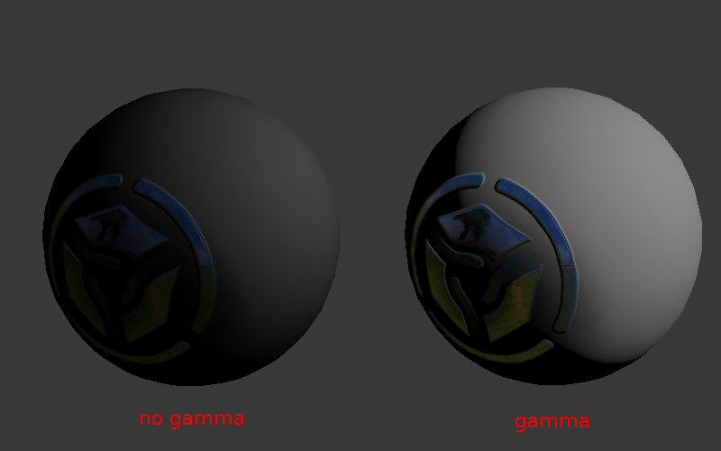
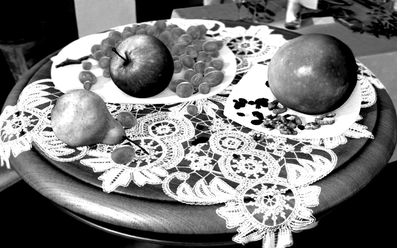

.. _gamma:

****************
Color Management
****************

.. contents:: Table of Contents
    :depth: 3
    :backlinks: entry

Gamma Overview
==============

The essence of gamma correction is packing the image brightness channel into  8 bits of information.

Standard (non-HDR) images are always stored in non-linear color space where the darker components are encoded using more bits than the brighter ones. That means that a bigger RGB value corresponds to 0.5 of the real light intensity (a physical quantity called illuminance) - in the simplest case this value equals to 0.5 ^ (1/2.2) = 0.73.

Otherwise, 8 bit of information will not be enough to encode the light intensity. This will result in incorrect rendering of darker tones. For example, dark  gradients will look stepped.

Therefore, web browsers, as well as many other programs for viewing and manipulating images, work in non-linear space. However, 3D engines and renderers work in linear space, because it is the only correct way to represent light behavior in the real world. For example, the illuminance from two identical lamps exceeds the illuminance from one lamp exactly by two times.

Undoubtedly, 8 bit of information will not be enough in this case. This can be clearly seen from the table in which approximate illuminance values for some real light sources are shown.

+---------------------+------------------+
| Description         | Illuminance, lux | 
+=====================+==================+
| Summer noon         | 17 000           |
+---------------------+------------------+
| Winter noon         | 5 000            |
+---------------------+------------------+
| Dull day            | 1 000            |
+---------------------+------------------+
| In a light room     | 100              |
+---------------------+------------------+
| Full moon by night  | 0.2              |
+---------------------+------------------+
| Moonless light      | 0.001            |
+---------------------+------------------+

|

When the ``Color Management > Display Device > sRGB`` option is enabled for a scene, Blender works in a linear space. Material colors and lamp settings correspond to physical values. For texture images (except normal maps) it is required to select the ``Image > Input Color Space > sRGB`` option. In this case an automatic image unpacking (sRGB -> Linear) is performed at the time of rendering.

Human Vision and Monitors
=========================

While the human vision is non-linear (a human recognizes the darker light tints better than the brighter ones), the light coming into the eye still obeys the physical laws (see the lamps example).

In CRT monitors the brightness is dependent non-linearly upon the electric voltage applied to the monitor’s input (the voltage itself is determined by the color channel value in the video memory). LCD monitors mimic the same characteristics. Nevertheless, the light emitted by such monitors obeys the physical laws. For example the addition of a second light source to a virtual scene should cause the brightness to double (in the perfect case).

Therefore, the perception characteristics of the human eye are the reason due to which it is possible to pack color channels. At the same time, the technical characteristics of monitors have a secondary significance for gamma correction.

Gamma Formula
=============

Used in the following simplified formula:

    V\ :sub:`out` = V\ :sub:`in`\ :sup:`γ`

γ < 1 - packing gamma, γ > 1 - unpacking gamma. In the simplest case 1/2.2  and 2.2 values are used respectively. Hereinafter the \“packing\” (Linear -> sRGB) and \“unpacking\” (sRGB -> Linear) terms are used instead of \“gamma correction\”.

.. _gamma_node_materials:

Gamma in Node Materials
=======================

Nodes for Coloring
-------------------

Unpacking (sRGB -> Linear) is required when textures and vertex colors are used for coloring (not for masking). The texture node and Vertex Color output of Geometry node implement unpacking automatically.

Note that the alpha channel of a texture node is not corrected. Its values are in the linear space. 

Nodes for Masking
-----------------

Textures and vertex colors can be used as masks i.e. input data for some mathematical operations. In such a case the packing operation is required.

Keep in mind that a texture node and `Vertex Color` output of `Geometry` node implement unpacking automatically. This results in necessity of the additional transformation back to the non-linear space, for which the `LINEAR_TO_SRGB` or `GAMMA` node with γ = 1/2.2 is used.

.. note::
	`LINEAR_TO_SRGB` and `SRGB_TO_LINEAR` nodes are deprecated. `GAMMA` node should be used instead.

Normal Maps
-----------

No transformations are performed for normal maps.

Summary Table
-------------

+-----------------------------+-----------------------------+
| Use case                    | Correction                  |
+=============================+=============================+
| Texture for coloring        | implemented automatically in|
|                             | the texture node (the alpha |
|                             | channel is not corrected)   |
+-----------------------------+-----------------------------+
| Texture for masking         | GAMMA with γ = 0.45         |
+-----------------------------+-----------------------------+
| Vertex color for coloring   | implemented automatically   |
+-----------------------------+-----------------------------+
| Vertex color for masking    | GAMMA with γ = 0.45         |
+-----------------------------+-----------------------------+
| Normal map                  | not required                |
+-----------------------------+-----------------------------+

.. _alpha_compositing:

Alpha Compositing
=================

Overview
--------

Physically correct alpha compositing is performed according to the formula [`source <http://www.cs.princeton.edu/courses/archive/spring05/cos426/papers/smith95a.pdf>`_]:

    :math:`C_o = C_a \alpha_a + C_b \alpha_b (1 - \alpha_a)`.

This formula differs from the classic mix operation (aka convex combination) because it has the :math:`\alpha_b` multiplier in the second summand. Therefore, not only the :math:`\alpha_a` value of the source pixel should be known for alpha compositing, but also the :math:`\alpha_b` value of the pixel over which the rendering is performed.

In case of preliminary multiplication of the :math:`\alpha` values by the color channels (so called premultiplied alpha) the formula becomes as following:

    :math:`C_o = C_a + C_b (1 - \alpha_a)`.
    
The last formula is used also to calculate the resulting :math:`\alpha_o` value:

    :math:`\alpha_o = \alpha_a + \alpha_b (1 - \alpha_a)`.
    
Preliminary multiplication of the color channels by the :math:`\alpha` values allows to save two multiplication operations. The more significant thing is that the derived formula can be used repeatedly without the need to divide the :math:`C_o` color by the :math:`\alpha_o` value on each consequent iteration.

Implementation
--------------

The blending function used in Blend4Web is the following:

.. code-block:: none

    gl.blendFunc(gl.ONE, gl.ONE_MINUS_SRC_ALPHA);

WebGL context initialization is performed using the premultipliedAlpha = true parameter (that is the default value). Also multiplication of all the color channels by the :math:`\alpha` value is performed on the output of the shaders.

.. index:: Color Correction

.. _color_correction:

Color Correction
================

Activation
----------

Activate the ``Color Correction`` panel under the ``Render`` tab.

Additional settings
-------------------

*Brightness*
    The default value is 0.0.

*Contrast*
    The default value is 0.0.

*Exposure*
    The default value is 1.0.

*Saturation*
    The default value is 1.0.

