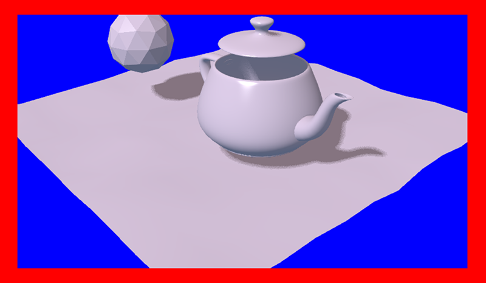

.. _developers:

**************************
For Application Developers
**************************

.. contents:: Table of Contents
    :depth: 3
    :backlinks: entry

.. _app_building:

Application Programming
=======================

"Hello World!" application
--------------------------

The simplest Blend4Web app may look like this:

.. code-block:: html

    <!DOCTYPE html>
    <html>
    <head>
    
    
    </head>

    <body onload="hello()"></body>

    </html>

This app prints a message and the engine's version in the browser window. Let's look at this example in detail. The engine library is embedded with the ``
    
    </head>

    <body onload="hello()"><canvas id="canvas_id"></canvas></body>

    </html>

.. note::

    Note that a real app should include error checking, setting up the engine before initializing and also a basic system for interacting with the user.

Module System
-------------

While the engine gives an app programmer an API in the scale of dozens of modules, it occupies a single ``b4w`` namespace. To call a module’s method import it first with the ``b4w.require()`` function.

It is possible to register external modules if their names do not collide with already existing modules. A module can be registered with a ``b4w.register()`` call. Check if a module with some name already exists with a ``b4w.module_check()`` call.

Example:

.. code-block:: javascript

    // check if module exists
    if (b4w.module_check("my_module"))
        throw "Failed to register module: my_module";

    // register my_module
    b4w.register("my_module", function(exports, require) {

        // import module "version"
        var m_version = require("version");

        // export print_build_date() from module "my_module"
        exports.print_build_date = function() {
            // exec function date() from module "version"
            console.log("Engine build date: " + m_version.date());
        }
    });

    // import module "my_module"
    var m_my_module = b4w.require("my_module");

    // exec function print_build_date() from module "my_module"
    m_my_module.print_build_date();

Creating Apps Quickly
---------------------

Creating an app from scratch can be a tedious task, especially for beginners. To address this there is a special add-on for the engine called ``app``:

.. code-block:: html

    <!DOCTYPE html>
    <html>
    <head>
    
    
    </head>

    <body>
        

    </body>

    </html>

In this case the ``app`` module will create a ``<canvas>`` element inside the container with the specified ``container_id`` id. Then it will initialize the engine after the page is loaded and will finally execute the ``load_cb()`` callback.

Then the some_scene.json scene is loaded similar to the previous example. The only difference is that after the scene is loaded, the control system is initialized and camera movement with keyboard and mouse (or sensor screen) becomes possible.

In case when the ``app`` module is used, it is necessary to explicitly specify dimensions of the container element. Otherwise, the created ``<canvas>`` element will have zero dimensions.

Background Transparency
=======================

The ``background_color`` and ``alpha`` parameters are passed to the :b4wref:`m_app.init` method placed in the load callback function (a function that is called right after the scene is loaded), like this:

.. code-block:: javascript

    m_app.init ({
        alpha: true,
        background_color: [0.7, 0.7, 0.7, 1]
       //this method sets the background to an opaque light grey color
    });

The combination of the parameters passed to the method defines how the backgrounds of the Blend4Web application and the HTML application blend together. Available options are:

1. ``alpha`` = false
	The color of the background is defined by the ``background_color`` of the Blend4Web application, the background of the HTML application is not taken into consideration.

2. ``alpha`` = true
	The background of the HTML application might influence the background of the Blend4Web application based on its transparency which is defined by the fourth component of the ``background_color`` parameter (``alpha`` = ``background_color[3]``, not to be confused with the ``alpha`` parameter mentioned above).

	background_color[3] = 1
		This produces the same result as if the alpha parameter has been turned off (``alpha`` = false)

	background_color[3] = 0
		Additive blending is used.

                .. image:: src_images/developers/developers_background_add.png
                   :align: center
                   :width: 100%

                Picture above shows an HTML page containing a Blend4Web application with a blue [0, 0, 1] background that blends with the page's red (``Red``) color producing a violet tone.

	background_color[3] > 0
		Additive blending is used with the ``background_color`` having a greater influence.

                .. image:: src_images/developers/developers_background_semiopaque.png
                   :align: center
                   :width: 100%

                This picture shows the same HTML page with the same Blend4Web app, however, the ``alpha`` value is set to 0.5, leading to a darker tone of the application background.

The mechanisms of alpha lending are described in greater detail in the :ref:`Color Management <alpha_compositing>` chapter.

By default, the ``alpha`` parameter is set to true and the ``background_color`` is set to transparent black [0, 0, 0, 0], which means that the application will have an HTML background with no influences from the background of the Blend4Web application.

Background transparency can also be utilized in :ref:`Web Player applications <web_player_app>` by using the ``alpha`` :ref:`URL attribute <webplayer_attributes>`. To use this feature, firstly you need to enable the ``Background transparency (alpha)`` parameter in the :ref:`Web Player Params <web_player_params>` group while creating the application.

If Blend4Web application uses sky rendering, the application canvas will be fully covered by objects (including sky), so the background will be fully opaque and not influenced by alpha settings.

.. note::
    Sky rendering is enabled by default in Blend4Web scenes created in :ref:`Project Manager <project_management>`. Don't forget, in order to use a transparent background you will need to manually disable sky rendering.

.. _converter:

Resource Conversion
===================

Currently, browsers do not fully support all possible media formats, so in order to create cross-browser applications (and also for optimization purposes) we recommend you to use the resource converter.

To support a wider range of platforms, a Python script (*scripts/converter.py*) for converting the source files into other formats is included into the distribution.

There are two ways to run this script.

Firstly, you can run it automatically using the project mangement system. The ``Convert Resources`` button can be found in the main page of the :ref:`Project Manager <project_management>`, in the ``Operations`` tab at the right side of the screen. 

.. image:: src_images/developers/developers_convert_resources.png
   :align: center
   :width: 100%

Secondly, you can run the script manually:

.. code-block:: bash

    > cd <path_to_sdk>/scripts
    > python3 converter.py [options] resize_textures | convert_dds | convert_media

For MS Windows users:

.. code-block:: console
    
    cd <path_to_sdk>\scripts
    python converter.py [options] resize_textures | convert_dds | convert_media

.. note::

    To run the scripts the Python 3.x needs to be installed in your system.

With the -d parameter you can specify the path to a directory in which converting will take place.

To exclude some directory from resource conversion, it is enough to put a file named ``.b4w_no_conv`` in it. This will not affect conversion in nested directories.

The **resize_textures** argument is used for decreasing texture resolution for the **LOW** mode.

.. _converter_deps:

Dependencies
------------

Please make sure that you have all converter dependencies installed. You can do it with the following command:

.. code-block:: bash

    > python3 <path_to_sdk>/scripts/converter.py check_dependencies

If some program is not installed, the following message will be displayed:

*Couldn't find PROGRAM_NAME.*

**Linux**

The list of dependencies is listed in the following table:

+-------------------------------+-------------------------------+
| Name                          | Ubuntu 16.04 package          |
|                               |                               |
+===============================+===============================+
| ImageMagick                   | imagemagick                   |
+-------------------------------+-------------------------------+
| NVIDIA Texture Tools          | libnvtt-bin                   |
+-------------------------------+-------------------------------+
| Libav                         | libav-tools                   |
+-------------------------------+-------------------------------+
| FFmpeg                        | ffmpeg                        |
+-------------------------------+-------------------------------+
| PVRTC                         | install manually              |
+-------------------------------+-------------------------------+

.. note::

    Linux users can additionally install the package qt-faststart which is used to optimize loading media files.

**Windows**

For MS Windows users it is not necessary to install these packages since they are already present in the SDK.

**macOS**

macOS users can install the `brew <http://www.brew.sh/>`_ package manager first and then install any missing packages.

Before installing packages, install the libpng and libjpeg libraries using these commands:

.. code-block:: bash

    > brew install libpng
    > brew install libjpeg

Now you can proceed with installing required dependencies:

.. code-block:: bash

    > brew install imagemagick
    > brew install --with-theora --with-libvpx --with-fdk-aac ffmpeg

In order to install NVIDIA Texture Tools, clone the repository with the following command:

.. code-block:: bash

    > git clone https://github.com/TriumphLLC/NvidiaTextureTools.git

Now you can build and install the package:

.. code-block:: bash

    > cd NvidiaTextureTools
    > ./configure
    > make
    > make install

.. _converter_data_format:

Data Formats
------------

The conversion is performed as follows:

for audio (convert_media):
    * ogg (ogv, oga) -> mp4
    * mp3 -> oga
    * mp4 (m4v, m4a) -> oga
    * webm -> m4a

We recommend to use ``ogg`` as a base format. In this case the only conversion required for cross-browser compatibility will be ``ogg`` to ``mp4``. Example of an input file: ``file_name.ogg``, example of an output file: ``file_name.altconv.mp4``.

for video (convert_media):
    * ogg (ogv, oga) -> m4v / seq
    * mp3 -> webm / seq
    * mp4 (m4v, m4a) -> webm / seq
    * webm -> m4v / seq

We recommend to use ``WebM`` as a base format. In this case the only conversion required for cross-browser compatibility will be ``webm`` to ``m4v`` (``webm`` to ``seq`` for iPhone). Example of an input file: ``file_name.webm``, example of an output file: ``file_name.altconv.m4v``.

for images (convert_dds):
    * png -> dds/pvr
    * jpg -> dds/pvr
    * bmp -> dds/pvr
    * gif -> dds

Example of an input file: ``file_name.jpg``, example of an output file: ``file_name.altconv.jpg.dds``.

For the purpose of optimizing application performance it's possible to use ``min50`` (halved) and ``DDS`` or ``PRVTC`` (compressed) textures. In order to do this, we need to pass the following parameters during initialization of the application:

.. code-block:: javascript

    exports.init = function() {
        m_app.init({
            // . . .
            assets_dds_available: true,
            assets_min50_available: true,
            // . . .
        });
        // . . .
    }

.. note::
    If you are planning to use textures compressed into :ref:`PVRTC <pvrtc>` format, then replace this line of code

     .. code-block:: javascript

         assets_dds_available: true,

    with the following:

     .. code-block:: javascript

         assets_pvr_available: true,

    This will tell the engine to load PVRTC textures, if such are present in the ``../assets/`` folder.

.. _dds:

DDS Texture Compression
.......................

``DDS`` textures require less memory (4 times less for ``RGBA`` data and 6 times for ``RGB`` data), but using them has following downsides:

    * ``DDS`` textures might not work on some devices, especially the mobile ones, as not all of them support the ``WEBGL_compressed_texture_s3tc`` extension;

    * as ``DDS`` is a lossy compression format, compression artifacts might be visible, especially on :ref:`normal <normal_map>` and :ref:`stencil <stencil_map>` maps; it is recommended to :ref:`disable compression <texture_disable_compression>` for such textures.

    .. image:: src_images/developers/compression_artifacts.png
        :align: center
        :width: 100%

    An example of the ``DDS`` compression artifacts, particularly visible on the edges of the shadow.

During exporting the scene from Blender to the ``JSON`` format (but not the ``HTML`` format), ``DDS`` textures will be plugged in automatically, if they are present.

Textures can be converted to the ``DDS`` format using the :ref:`project manger <project_management>` or the *scripts/converter.py* script described above.

.. _pvrtc:

PVRTC Texture Compression
.........................

``PVRTC`` is another texture compression format used primarily on iOS devices. In some cases it can produce texture files up to two times smaller than same texture images would take in ``DDS`` format.

The format has two compression settings that are supported by the engine: 2-bpp (two bits per pixel) and 4-bpp (four bits per pixel).

As with ``DDS`` format, textures compressed using the ``PVRTC`` algorithm may not work on some platforms, especially mobile, because using this compression format require support for the ``IMG_texture_compression_pvrtc`` WebGL extension.

The PVRTC library and SDK are available for Windows, Linux and macOS systems alike. Installation packages can be downloaded from the `Power VR Insider <https://community.imgtec.com/developers/powervr/>`_ web page.

The Blend4Web engine uses a console PVRTC tool. To use it, you need to add the path to it to the ``PATH`` environmental variable, like the following:

.. code-block:: bash

    export PATH = <InstallDir>\PVRTexTool\CLI\<PLATFORM>\

where <InstallDir> is the PVRTexTool installation directory and <PLATFORM> is a folder that contains the version of the tool that corresponds to your OS, for example, ``\Windows_x86_64\`` for 64-bit Windows OS.

.. note::
    In Windows systems, environment variables can be set in the ``System`` (in Windows 10 and 8) or ``Properties`` (in Windows 7 and Vista) dialogue window by choosing ``Advanced System Settings`` -> ``Environment Variables``, or by using console commands:

    .. code-block:: bash

        SET PATH = <InstallDir>\PVRTexTool\CLI\<PLATFORM>\

After this, you will be able to convert the textures to the PVR format by using converter.py script with the ``convert_dds`` command.

.. _seq:

SEQ Video Format
................

The ``.seq`` file format is used for sequential video. This is applied for IE 11 and iPhone because they are currently missing support for standard video formats for textures. Using dds format for images is more optimal compared to other formats.

The engine can use files which are manually created by a user if they have the following names: ``file_name.altconv.m4v``, ``file_name.altconv.mp3`` and so on. Such files should be placed in the same directory as the media files used in Blender.

You can also use the free and cross-platform application `Miro Video Converter <http://www.mirovideoconverter.com/>`_ to convert media files.

.. _code_snippets:

Code Examples
=============

The SDK includes the Code Snippets application which demonstrates how to use the engine's functionality.

Currently, this application contains the following examples:

    * Bone API - an example of individual bones position control
    * Camera Animation - procedural camera animation
    * Camera Move Styles - changing control modes for the camera
    * Canvas Texture - working with canvas textures
    * Change Image - changing texture images on-the-fly
    * Custom Anchors - creating custom annotations
    * Dynamic Geometry - procedural geometry modification
    * Gamepad - an example of controlling a character via gamepad
    * Gyro (Mobile Only) - working with mobile devices' gyroscopes
    * Instancing - copying scene objects in runtime
    * Lines - procedural lines rendering
    * Material API - tweaking material properties and replacing objects' materials
    * Morphing - using shape keys
    * Multitouch (Mobile Only) - using mobile devices multitouch sensor
    * Pathfinding - an example of calculating paths and using navigation meshes
    * Ray Test - the usage of raycasting for obstacles detection
    * Webcam - using media stream from a web camera

The Code Snippets application is available at ``./apps_dev/code_snippets/code_snippets_dev.html``. It can be also run by using a link in the ``index.html`` file located in the SDK root.

Loading Application Assets
==========================

To simplify project maintanance and server deployment always keep your application asset files (exported scenes, textures, sounds, etc) separate from other project files (JavaScript, CSS, HTML, etc). Inside your SDK this asset directory is located at ``deploy/assets/my_project``.

To load files (e.g by using :b4wref:`data.load()`) from this directory use the :b4wref:`config.get_std_assets_path()` method:

.. code-block:: javascript

    m_data.load(m_config.get_std_assets_path() + "my_project/my_project.json", load_cb);

This way you ensure that your applications will find assets independently of the current development stage (developed, built or deployed).

.. _event_model:

Event-Driven Model
==================

The event-driven model provides a universal interface for describing the 3D scene's change of state. It simplifies the processing of physics events and user actions.

.. index:: sensor

Sensors
-------

The basic unit of the event-driven model is a sensor. A sensor is a programming entity and can only be active (1, one) or inactive (0, zero). Some sensors may carry a payload which can be received in the manifold's callback function with corresponding API. For example, the ray-tracing sensor (Ray Sensor) provides the relative length of the intersection ray.

.. index:: sensor; manifold

Users cannot directly control sensors via the external API. Instead, all sensors must be present in one or multiple collections - so called sensor manifolds. A manifold is a logic container associated with a scene object. It generates a response to a defined set of sensor events by executing a callback function. To define the manifold it is required to have the following information (see also the API documentation for description of the ``controls.create_sensor_manifold`` function):

* An object to carry the manifold (e.g. a thrown object).
* A unique id of the manifold (e.g. "IMPACT").
* Callback execution mode (the options are: ``CT_POSITIVE`` - logic function positive result, ``CT_CONTINUOUS`` - every frame with a positive logic function result and once with a zero result, ``CT_LEVEL`` - any logic, function result change, ``CT_SHOT`` - one-stage logic function result change, ``CT_TRIGGER`` - logic function result switch, ``CT_CHANGE`` - any sensor value change).
* An array of sensors.
* A logic function to define the combination of the sensor states for which the callback function is executed.
* A callback function.
* An optional parameter to pass into the callback function.

You can read more about engine API in the :b4wmod:`controls` module documentation.

Example
-------

Let's consider the task to insonify the impact of a thrown stone. A distinctive sound should be produced for impacting different media (for example terrain and wall). There are collision meshes with physical materials in the Blender scene, material ids are "TERRAIN" and "WALL". There is also a physical object being thrown in the scene, the object is named "Stone".

Let's define a collision sensor for each medium, by the type of the sound produced.

.. code-block:: javascript

    // import the modules
    var m_scenes = b4w.require("scenes");
    var m_controls = b4w.require("controls");

    // get the object being thrown
    var stone = m_scenes.get_object_by_name("Stone");

    // create the sensors
    var sensor_impact_terrain = m_controls.create_collision_sensor(stone, "TERRAIN");
    var sensor_impact_wall    = m_controls.create_collision_sensor(stone, "WALL");

Add the sensors into an array. Use the ``OR`` logic in the logic function. Place the sound processing code in the callback function. Create the sensor manifold with the "IMPACT" id and the ``CT_SHOT`` type.

.. code-block:: javascript

    // array of the sensors
    var impact_sens_array = [sensor_impact_terrain, sensor_impact_wall];

    // manifold logic function
    var impact_sens_logic = function(s) {return (s[0] || s[1])};

    // callback
    var impact_cb = function(obj, manifold_id, pulse) {

        // NOTE: it's possible to play both sounds simultaneously 
        
        if (m_controls.get_sensor_value(obj, manifold_id, 0) == 1) {
            // ...
            console.log("play the terrain impact sound");
        }
                
        if (m_controls.get_sensor_value(obj, manifold_id, 1) == 1) {
            // ...
            console.log("play the wall impact sound");
        }
    }

    // create the manifold
    m_controls.create_sensor_manifold(stone, "IMPACT", m_ctl.CT_SHOT,
        impact_sens_array, impact_sens_logic, impact_cb);

When the "Stone" object collides with any physical material of "TERRAIN" or "WALL", the callback function is executed. Inside this function we get the values of both sensors by their indices in the sensor array (0 - "TERRAIN", 1 - "WALL"). The sensor value = 1 (active) means that the collision happened with the corresponding physical material. As a result the corresponding sound is produced (the code is not shown).

.. _repo_file_structure:

SDK File Structure
==================

**addons**
    **blend4web**
        Blender addon

**apps_dev**
    SDK apps source code

    **code_snippets**
        source files of the Code Snippets application

        **scripts**
            Blend4Web API usage examples' source files

    **dairy_plant**
        source files of the Dairy Plant demo (available only in SDK Pro)

    **demos_animation**
        project files of the basic animation demos

    **demos_environment**
        project files of the basic environment demos

    **demos_interactivity**
        project files of the basic interactivity demos

    **demos_materials**
        project files of the basic materials demos

    **demos_media**
        project files of the basic media demos

    **demos_particles**
        project files of the basic particles demos

    **demos_physics**
        project files of the basic physics demos

    **demos_postprocessing**
        project files of the basic postprocessing demos

    **farm**
        source files of the Farm demo (available only in SDK Pro)

    **fashion**
        source files of the Fashion Show demo (available only in SDK Pro)

    **flight**
        source files of the Island demo

    **new_year**
        source files of the New Year 2015 greeting card

    **project.py**
        script for application developers

    **space_disaster**
        source files of the Space Disaster app

    **tutorials**
        source files of the Blend4Web tutorials

    **victory_day_2015**
        source files of the V-Day 70 greeting card

    **viewer**
        the sources files of the Viewer application

    **webplayer**
        source files of the Web Player app

    **website**
        source files of applications from the Blend4Web official website

**blender**
    source files of the Blender scenes

**csrc**
    source code (in C) of the binary part of the engine exporter and of the other utilities

**deploy**
    the resource directory for deploying on the server (scene source files, compiled applications and documentation)

    **api_doc**
        API documentation for developers (built automatically, based on the engine's source code)

    **apps** 
        3D applications intended for deploying; the directory duplicates *apps_dev*

        **common**
            Compiled engine files. Shared by all applications from SDK (hence the name).

    **assets** 
        application assets: scenes, textures and sounds

    **doc**
        the current user manual in HTML format, built automatically from *doc_src*

    **webglreport**
        WebGL report application

**distfiles**
    distribution builder lists

**doc_src**
    source files of the current manual written in reST

**index.html** and **index_assets** 
    main SDK webpage files

**license**
    files with license texts

**Makefile**
    makefile for building the engine, the applications, and the documentation

**README.rst**
    README file

**scripts**
    scripts

    **check_resources.py**
        script for checking of and reporting about unused resources (images and sounds referenced by the exported files)

    **compile_b4w.py**
        script for building engine code and applications

    **converter.py**
        script which halves the texture dimensions, compresses the textures into the DDS format, converts sound files into mp4 and ogg formats

    **custom_json_encoder.py**
        fork of the json Python module, sorts the keys in reverse order

    **gen_glmatrix.sh**
        script for generating the math module based on the source code of glMatrix 2

    **graph.sh**
        SVG generator for the current scene graph, used for debugging rendering

    **make_dist.py**
        distributions builder script

    **memory.sh**
        script for checking memory (RAM) and video memory (VRAM)

    **mod_list.py**
        script for generating the list of modules to use in new applications

    **plot.sh**
        debugging information graph builder

    **process_blend.py**
        script for automatic reexport of all scenes from the SDK

    **remove_alpha_channel.sh**
        script for removing the images' alpha channel

    **screencast.sh**
        script for screen video recording

    **shader_analyzer.py**
        script starting the local web server which calculates complexity of the shaders

    **translator.py**
        script for building add-on translations

**shaders**
    GLSL shaders of the engine

**src**
    main source code of the engine's kernel

    **addons** 
        source code of engine add-ons

    **ext**
        source code of the external declarations that form the engine's API

    **libs**
        source code of the libraries

**tmp**
    directory for temporary files (e.g. Fast Preview)

**tools**
    various tools for building the engine, apps or convert resources

    **converter_utils**
        binary builds of the tools for resource conversion

    **closure-compiler**
        Google Closure compiler, its externs and their generators

    **glsl**
        **compiler**
            compiler for the engine's GLSL shaders

        **pegjs**
            grammars of the PEG.js parser generator for implementing the GLSL preprocessor, and also the script for generating the parser modules from these grammars

    **yuicompressor**
        utility for compressing CSS files

**uranium**
    source code and building scripts of the Uranium physics engine (the fork of Bullet)

**VERSION**
    contains the current version of the engine

.. _browser_for_local_loading:

Loading Local Resources
=======================

The engine's renderer is a web application and it works when you view an HTML file in a browser. After initialization the resources (scenes, textures) are loaded. This process is subject to the `same-origin policy <http://en.wikipedia.org/wiki/Same-origin_policy>`_ rule. In particular this rule forbids loading from a local directory.

Since version 15.02, the Blend4Web SDK includes the :ref:`development server <local_development_server>` to solve the problem of loading local resources.

.. _quality_settings:

Quality Profiles
================

Several quality profiles are implemented in order to support platforms with different functionality.

    * *low quality* (``P_LOW``) - a range of functions is turned off (such as shadows, dynamic reflection, postprocessing), the size of textures is halved when using a release version, anti-aliasing is disabled
    * *high quality* (``P_HIGH``) - all features requested by the scene are used, the anti-aliasing method is FXAA
    * *maximum quality* (``P_ULTRA``) - rendering resolution is doubled, resolution of shadow maps is increased, the anti-aliasing method is FXAA (uses higher quality settings and works slower).
    * *custom quality* (``P_CUSTOM``) - any quality parameter can be set to any possible value. This option is used when you need to set certain quality parameters manually. By default, it uses the same settings as ``High`` quality profile.

.. image:: src_images/developers/developers_quality.png
   :align: center
   :width: 100%

|

Switching the quality profiles can be performed in runtime before initialization of the WebGL context. The default profile is ``P_HIGH``.

.. code-block:: javascript

    var m_cfg = b4w.require("config");
    var m_main = b4w.require("main");

    m_cfg.set("quality", m_cfg.P_LOW);
    m_main.init(...);

Application developers can also set the **quality** parameter upon engine initialization using the ``app.js`` add-on:

.. code-block:: javascript

    var m_cfg = b4w.require("config");
    var m_app = b4w.require("app");

    m_app.init({
        canvas_container_id: "body_id",
        quality: m_cfg.P_HIGH
    });
    

.. _canvas_nonfullscreen_coords:

Non-FullScreen Web Apps
=======================

The Canvas element, to which the rendering is performed, can change its position relative to the browser window. This can occur due to some manipulations over the DOM tree, or as a result of page scrolling which is especially relevant for non-fullscreen web applications.

In most cases this will not affect the performance of the app by any means. However, some DOM events related to mouse cursor or touch position may carry incorrect information. This occurs because the coordinates obtained from the corresponding events are measured relative to the origin of the browser window, while the engine works with the coordinate space of the Canvas element itself (its origin is located in the top left corner).

1) If the top left corner of the Canvas element matches the top left corner of the browser window and is fixed in its position (non-movable) then it's sufficient to use event.clientX and event.clientY coordinates of the input events or :b4wref:`mouse.get_coords_x()`/:b4wref:`mouse.get_coords_y()` methods.

.. code-block:: javascript

    var m_mouse   = require("mouse");

    // . . .
    var x = event.clientX;
    var y = event.clientY;
    // . . .
    var x = m_mouse.get_coords_x(event);
    var y = m_mouse.get_coords_y(event);
    // . . .

2) In the case of the scrolled browser window, you have to use event.pageX and event.pageY coordinates.

.. code-block:: javascript

    // . . .
    var x = event.pageX;
    var y = event.pageY;
    // . . .

3) In the case of more sophisticated manipulations with the Canvas element (scrolling of the page elements, displacement from the top level corner of the browser window, changes in the DOM-tree) you need to perform correct coordinate conversions. In order to obtain coordinates suitable for use in the engine, you can covert them by using the ``client_to_canvas_coords()`` method of the ``container`` module:

.. code-block:: javascript

    var m_cont   = require("container");
    var _vec2_tmp = new Float32Array(2);
    // . . .
    var canvas_xy = m_cont.client_to_canvas_coords(event.clientX, event.clientY, _vec2_tmp);
    // . . .

|

    In order to obtain coordinates in the Canvas space, the engine should know its position relative to the browser window. However, if this position is subjected to changes during the work of the app (due to scrolling for example), the Canvas position should be recalculated. To do this automatically, you can set the ``track_container_position`` property upon app initialization:

.. code-block:: javascript

    exports.init = function() {
        m_app.init({
            // . . .
            track_container_position: true,
            // . . .
        });
        // . . .
    }

|

    Please note, that this setting can lead to performance degradation in some browsers (such as Firefox) due to frequent DOM tree accesses. If the performance is critical, you can update the Canvas position manually when it is really necessary. To do this, use the ``force_offsets_updating()`` and ``update_canvas_offsets()`` methods instead of the ``track_container_position`` setting, or even the lower-level ``set_canvas_offsets()`` method from the ``container`` module:

.. code-block:: javascript

    var m_cont = require("container");
    // . . .
    m_cont.force_offsets_updating();
    // . . .
    m_cont.update_canvas_offsets();
    // . . .
    m_cont.set_canvas_offsets(offset_left, offset_top);
    // . . .

|

4) The possibility to scale the whole webpage can lead to Canvas element displacement on mobile devices. The described decisions are suitable in this case. However, you can lock scaling at all and thus avoid such problems. It is enough to add the following meta-tag to the page's header:

.. code-block:: html

    <meta name="viewport" content="user-scalable=no">
