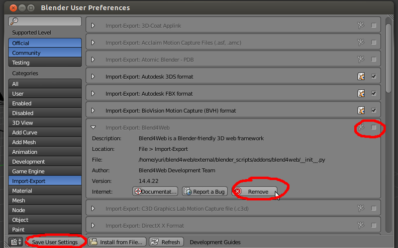

.. _quick_install:

******************
Экспресс-установка
******************

Экспресс-установка аддона Blend4Web подойдет обычным пользователям, которым не требуется разработка полноценных 3D приложений. 
Основной возможностью в этом случае является экспорт сцены в один HTML-файл с последующим просмотром в браузере, поддерживающем WebGL.

Для более серьезных задач необходима установка :ref:`комплекта средств разработки <setup>`.

.. _quick_install_blender:

.. index:: Blender; установка

Установка программы Blender
===========================

Создание 3D сцен осуществляется в графическом пакете `Blender <http://ru.wikipedia.org/wiki/Blender>`_, который является программным продуктом с открытым исходным кодом и распространяется бесплатно.

Должна использоваться текущая стабильная версия Blender. Загрузить Blender можно с `официального сайта <http://www.blender.org/download>`_.

.. image:: src_images/first_steps/blender_first_run.jpg
   :align: center
   :width: 100%

.. _quick_install_addon:

.. index:: аддон; установка

Установка аддона движка
=======================

Запустить Blender, загрузить сцену по умолчанию :file:`File > New`.
Вызвать окно пользовательских настроек :file:`File > User Preferences...`. Во вкладке :file:`Addons` нажать :file:`Install from File...` и затем выбрать zip-архив с файлами аддона. После этого необходимо отметить галочку напротив :file:`Import-Export: Blend4Web`.

.. image:: src_images/first_steps/user_preferences_install_b4w.jpg
   :align: center
   :width: 100%

|

Далее нажать :file:`Save User Settings` и закрыть окно пользовательских настроек.

.. index:: профиль Blend4Web

.. _quick_install_engine_select:

Профиль Blend4Web
=================

Выберите профиль настроек Blend4Web в выпадающем меню верхней панели:

.. index:: экспорт

.. _quick_install_export_viewer:

Экспорт и просмотр сцены
========================

Созданную сцену можно экспортировать в формате HTML. Для этого нужно выбрать опцию :file:`File > Export > Blend4Web (.html)` и указать путь экспорта. Полученный HTML файл можно открыть любым браузером, поддерживающим технологию WebGL.

.. seealso:: :ref:`browser_webgl_support`

.. index:: аддон; установка новой версии

.. _quick_install_addon_upgrade:

Установка новой версии аддона
=============================

Чтобы установить новую версию аддона, необходимо **сначала отключить, а затем удалить** старую версию. 

Для отключения аддона запустить Blender, загрузить сцену по умолчанию :file:`File > New`. Вызвать окно пользовательских настроек :file:`File > User Preferences...`. Перейти на вкладку :file:`Addons` и выбрать категорию :file:`Import-Export`. Снять галочку напротив :file:`Import-Export: Blend4Web`. Далее нажать :file:`Save User Settings` и **перезапустить Blender**. 

Затем для удаления аддона снова вызвать окно пользовательских настроек, раскрыть панель информации об аддоне Blend4Web и нажать кнопку :file:`Remove`.

|

