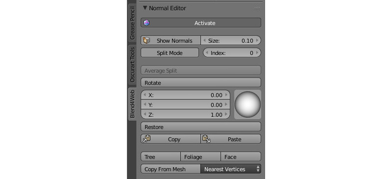
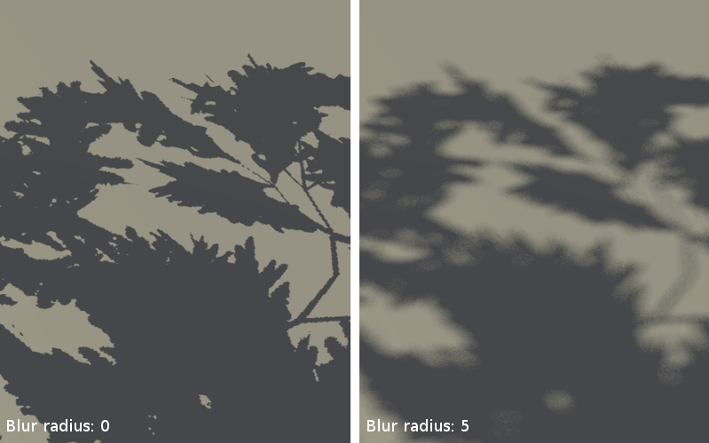

.. _lighting:

.. index:: lighting

********************************
Lighting, Shadows and Background
********************************

.. contents:: Table of Contents
    :depth: 3
    :backlinks: entry

.. index:: shading, shading; types

Shading Types
=============

Lighting (shading) depends on the direction of normal vectors. The standard Blender's shading types are supported: ``Shading: Flat`` (face normals are used), ``Shading: Smooth`` (interpolated vertex normals are used) and their combinations.

|

If the required effect is impossible to achieve with the standard tools, you can use the :ref:`normals editor <normals_editor>`.

The result of applying different shading types and using the normals editor:

.. image:: src_images/lighting/different_shadings_comparison.jpg
   :align: center
   :width: 100%

#. Flat Shading
#. Smooth Shading
#. Smooth Shading + bevel
#. Smooth Shading + bevel + editing normals

.. _normals_editor:

.. index:: normals, normals; editor

Normal Editor
=============

Editing the selected normals is a pretty easy and effective way to customize 3d model shading without complicating its geometry.

In some cases, using the normal editor you may achieve the effect which is similar to the result of using :ref:`normal maps <normal_map>`. At the same  time, editing normals is preferred because it is more computationally effective and consumes less video memory.

Normal editor workflow example:

    .. image:: src_images/lighting/vnt_img01.jpg
       :align: center
       :width: 100%

Simple geometry shading is to the left, a tree with edited normals is to the right.

    .. image:: src_images/lighting/vnt_img02.jpg
       :align: center
       :width: 100%

To the left - gates with common shading; at the center - gates with edited normals; to the right - gates geometry with a wireframe.

    .. image:: src_images/lighting/vnt_img03.jpg
       :align: center
       :width: 100%

To the left - common grass geometry shading; to the right - grass with edited normals.

    .. image:: src_images/lighting/vnt_img04.jpg
       :align: center
       :width: 100%

To the left - glasses with common shading; to the right - geometry with edited normals shading.

Main features of the normal editor:
-----------------------------------

#. native Blender storage is used as a container for edited vertices normals directions (it appeared in Blender 2.74);
#. normals editing and shading visualization are processed in ``Edit Mode`` now;
#. all changes are being saved automatically;
#. selected vertex normal rotation can be performed directly in the Viewport window with ``Shift+Ctrl+R`` hotkey, similary to other rotation operations in Blender;
#. edited normals are being exported automatically.

Interface of the Vertex Normal Editor
-------------------------------------

The interface of the normal editor is located on the tools panel ``Blend4Web > Normal Editor``. The ``Shading: Smooth`` mode should be enabled and ``Activate`` button should be pressed or ``Auto Smooth`` flag should be enabled in the mesh settings, before starting to work with the editor.

Activate
--------

*Description*

The new ``Activate`` button turns on vertex normal editing mode.

*Usage*

You can just press ``Activate`` button while in ``Edit Mode`` and start editing vertex normals. As it is active, object shading and its export would be processed taking edited vertex normals into account. In other words, after making some changes, this button should be left active if you want to see the changes in the Blender Viewport and in the Blend4Web engine.

Show Normals
------------

*Description*

This button actually duplicates the original Blender's button. It turns on displaying the normals in the viewport, while the Size field allows you to set their length.

*Usage*

You just need to push the Show Normals button either on the normal editor panel or on the Blender's right panel in the Mesh Display section. You can also set the convenient length of normals by tweaking the Size.

.. only:: latex

    .. image:: src_images/lighting/vnt_img07.jpg
       :align: center
       :width: 100%

.. only:: html

    .. image:: src_images/lighting/vnt_img07.gif
       :align: center
       :width: 100%

Rotation
--------

*Description*

Using these instruments you can change direction of the normals.

The Rotate function is also available through the Shift+Ctrl+R hotkeys, which allows rotation of vertex normals similarly to Blender.

*Usage*

Select one or more vertices that you want to edit and then rotate their normals using the visual sphere or specify the direction as numerical values.

The Rotate button provides a more convenient way to manipulate normals. The rotation is performed in the screen space. Nevertheless, as with any other rotations in Blender, you can isolate the desired axis during rotation (by typing X, Y or Z).

.. only:: latex

    .. image:: src_images/lighting/vnt_img08.jpg
       :align: center
       :width: 100%

.. only:: html

    .. image:: src_images/lighting/vnt_img08.gif
       :align: center
       :width: 100%

Split Normals
-------------

*Description*

The ``Split Normals`` mode allows to edit vertex normals separately for each ``face`` that form the ``vertex``. Index allows you to navigate between the split normals.

Usage

Turn on the ``Split Normals`` mode, select the vertex and change the direction of its normals. Firstly, the normal which has the zero index in the queue will be modified. Then, by switching between indexes you can go to the next normal of this vertex and edit it, then to the next and so on.

.. only:: latex

    .. image:: src_images/lighting/vnt_img09.jpg
       :align: center
       :width: 100%

.. only:: html

    .. image:: src_images/lighting/vnt_img09.gif
       :align: center
       :width: 100%

Average Split
-------------

*Description*

The ``Average Split`` button averages the direction of the vertex normals which was modified in the ``Split Normals`` mode.

*Usage*

To combine several split vertex normals into one, in order to obtain the average direction of these normals, you just need to select the desired vertex and press the ``Average Split`` button.

.. only:: latex

    .. image:: src_images/lighting/vnt_img10.jpg
       :align: center
       :width: 100%

.. only:: html

    .. image:: src_images/lighting/vnt_img10.gif
       :align: center
       :width: 100%

Restore
-------

*Description*

The ``Restore`` button restores the original direction of normals for the selected vertices.

*Usage*

In order to restore the normal's direction to its original (which is calculated on the basis of face normals), you need to select the desired vertices and click the Restore button.

.. only:: latex

    .. image:: src_images/lighting/vnt_img11.jpg
       :align: center
       :width: 100%

.. only:: html

    .. image:: src_images/lighting/vnt_img11.gif
       :align: center
       :width: 100%

Tree, Foliage and Face
----------------------

*Description*

The ``Tree`` button directs the normals of the selected vertices away from the 3D cursor. The ``Foliage`` button directs the normals of the vertices strictly up. The ``Face`` button directs the normals of the selected face parallel to the normal of this face.

Usage

In order to use the ``Tree`` function, select the desired vertices and place the 3D cursor in the desired position. Then click the ``Tree`` button so all the selected vertices will turn their direction away from the cursor, as if they were shot from one point.

The ``Foliage`` function is very easy to use: just select the vertices and press the button, so the function will direct their normals straight up.

In order to direct the normals parallel to the face normal, just select the desired face and click the ``Face`` button. The normals of the vertices which form the face will be directed parallel to the face normal. This function works only with one selected face at a time.

.. only:: latex

    .. image:: src_images/lighting/vnt_img12_01.jpg
       :align: center
       :width: 100%

    .. image:: src_images/lighting/vnt_img12_02.jpg
       :align: center
       :width: 100%

    .. image:: src_images/lighting/vnt_img12_03.jpg
       :align: center
       :width: 100%

.. only:: html

    .. image:: src_images/lighting/vnt_img12.gif
       :align: center
       :width: 100%

Copy/Paste
----------

*Description*

Copies the normal direction from one vertex to another.

*Usage*

Select the vertex you want to copy from and click the ``Copy`` button. Then, select the vertex you want to copy to and click the ``Paste`` button. You may copy information from one selected vertex to many different vertices. The buttons are not active in the ``Split Mode`` and do not copy data of split vertices.

.. only:: latex

    .. image:: src_images/lighting/vnt_img13.jpg
       :align: center
       :width: 100%

.. only:: html

    .. image:: src_images/lighting/vnt_img13.gif
       :align: center
       :width: 100%

Copy From Mesh
--------------

*Description*

This function allows you to copy the normals from one object to another. There are two modes: ``Matched Vertices`` and ``Nearest Vertices``.

The ``Matched Vertices`` mode copies the normals from the vertices of one object to another object's vertices only if they have the same coordinates; the other vertices are ignored. The ``Nearest Vertices`` mode copies the normals of the nearest vertices of the source object.

*Usage*

This function works in Blender's object mode. At first, you need to select the object you need to copy from, then the object you need to copy to. It is also necessary to select the target object's vertices to which normals are copied.

.. only:: latex

    .. image:: src_images/lighting/vnt_img14.jpg
       :align: center
       :width: 100%

.. only:: html

    .. image:: src_images/lighting/vnt_img14.gif
       :align: center
       :width: 100%

.. index:: light sources

Lighting with Light Sources
===========================

A scene can have multiple (but not less than one) light sources of different types.

Light source types
------------------

The following light source types are supported:

*Point*
    Light propagates from one point uniformly to all directions with gradual attenuation.

*Sun*
    Light propagates from an infinite plane in one direction without attenuation.

*Spot*
    Light propagates from one point within the angular limit, with gradual attenuation.

*Hemi*
    Hemispherical. Light propagates from an infinite hemisphere without attenuation.

Light source setup
------------------

Performed in the ``Object Data`` tab when a lamp object is selected.

.. image:: src_images/lighting/lighting_setup.jpg
   :align: center
   :width: 100%

|

*Color*
    Light color. The default value is (1.0, 1.0, 1.0) (i.e. white).

*Energy*
    Radiation intensity. The default value is 1.0.

*Falloff*
    Attenuation type. The value is exported but the engine always uses ``Inverse Square``. It is applicable to the ``Point`` and ``Spot`` light source types. The default value is ``Inverse Square``.

*Distance*
    Attenuation parameter. It is applicable to the ``Point`` and ``Spot`` light source types. The default value is 25.0.

*Specular*
    Create specular highlights. Enabled by default.

*Diffuse*
   Do diffuse shading. Enabled by default.

*Spot Shape > Size*
    Cone angle in degrees. It is applicable to the ``Spot`` light source type. The default value is 45º.

*Spot Shape > Blend*
    Parameter for blurring light spot edges. It is applicable to the ``Spot`` light source type. The default value is 0.15.

*Dynamic Intesity*
    Use this light source for calculating the time of day. Applicable only to the ``Sun`` light source type. Disabled by default.

*Shadow > Shadow*
    Use this light source for shadow calculation. Should be used when multiple light sources are present. Disabled by default.

.. _environment_lighting:

Environment Lighting (Ambient)
==============================

The engine supports 3 methods of the environment lighting simulation.

1. Flat white lighting.
2. Hemispherical lighting model in which horizon and zenith colors should be specified. As a result objects are filled with a gradient between these two colors depending on the direction of normals.
3. Lighting using an :ref:`environment map <environment_map>` - so called image-based lighting.

Activation
----------

Enable the ``Environment Lighting`` checkbox on the ``World`` tab.

.. image:: src_images/lighting/lighting_environment.jpg
   :align: center
   :width: 100%

Setup
-----

*World > Environment Lighting > Energy*
    Environment lighting intensity. The default value is 1.0.

*World > Environment Lighting > Environment Color*
    Selection of the environment lighting simulation method: ``White`` - flat white lighting, ``Sky Color`` - hemisperical model, ``Sky Texture`` - lighting using an :ref:`environment map <environment_map>`. The default value is ``White``.

*World > Horizon Color* and *World > Zenith Color*
    If the hemisperical model (``Sky Color``) is selected the horizon and zenith colors can be specified by means of the ``World > Horizon Color`` and ``World > Zenith Color`` color pickers. It is recommended to activate the ``World > Blend Sky`` option for better color selection.

Environment map method
----------------------

To use an environment map for environment lighting:

#. Enable the ``Environment Lighting`` checkbox on the ``World`` tab.
#. Select ``Environment Lighting > Sky Texture``.
#. Go from the ``World`` tab to the ``Texture`` tab.
#. Create an :ref:`environment map <environment_map>`, load the corresponding image to it.
#. For the environment map select ``ENVIRONMENT_LIGHTING`` or ``BOTH`` as the ``Sky Texture Usage`` value on the ``Export Options`` panel (the ``BOTH`` option also enables using this texture as a :ref:`skydome texture <skydome_texture>`).

.. image:: src_images/lighting/lighting_environment_texture.jpg
   :align: center
   :width: 100%

|

.. _shadows:

Shadows
=======

Shadows are exceptionally important for rendering the final picture. They provide the viewer not only with information about the objects' outline but also about their height and relative position, light source position and so on.

Blend4Web implements the following shadow rendering techniques: cascaded shadow maps (CSM) and softened shadows (PCF). 

Up to 4 (or 3 if SSAO is enabled) light sources can generate shadows simultaneously. If *Shadow* parameter is enabled for more than 4 light sources, shadows will still be generated only from 4 of them.

.. image:: src_images/lighting/lighting_multiple_shadows.png
    :align: center
    :width: 100%

Activation
----------

#. Enable the ``Shadows: Cast`` checkbox under the ``Object`` tab for the objects which **cast** shadows.
#. Enable the ``Shadows: Receive`` checkbox under the ``Object`` tab for the objects which **receive** shadows.
#. Make sure that the ``Shadows`` option in the ``Render`` tab has the value ``AUTO`` or ``ON``.

.. note::

    Objects, which have :ref:`transparent materials with a gradient <alpha_blend>`, do not cast shadows.

    .. image:: src_images/lighting/alpha_shadows.jpg
       :align: center
       :width: 100%

|

Setup
-----

*Direction*
    If there are multiple light sources, it is recommended to specify the exact light source which is used for shadow calculations, by enabling the ``Shadow > Shadow`` checkbox under the ``Object Data`` tab for the selected lamp object.

*Color*
    The shadow color is determined by the :ref:`environment lighting <environment_lighting>` settings.

The following additional settings are located on the ``Shadows`` panel of the ``Render`` tab:

*Resolution*
    Shadow map resolution. The default value is 2048x2048px.

*Self-Shadow Polygon Offset*
    Coefficient for shifting polygons relative to light source orientation. The default value is 1.

*Self-Shadow Normal Offset*
    Coefficient for shifting polygons along their normals. The default value is 0.010.

The last two parameters can be used to reduce self-shadowing artifacts. These artifacts appear for the objects that cast and receive shadows at the same time. The ``Self-Shadow Polygon Offset`` parameter is more effective for fighting against artifacts in inner areas of poligons while ``Self-Shadow Normal Offset`` is better for the boundary areas. Both these parameters lead to shadow distortions so we recommend to set them as low as possible.

.. image:: src_images/lighting/self_shadow_artifacts.png
   :align: center
   :width: 100%

.. note::
    Shadows from ``Point`` light sources are generated the same way as from ``Spot`` light sources and are projected only in one direction specified by the source's ``Rotation`` parameter.
    
|

*Enable CSM*
    Activates the using of cascaded shadows model; reveals additional options. Disabled by default. Won't work if the ``Shadow`` setting is enabled for more than one light source. ``Point`` and ``Spot`` type light sources support only one shadow cascade.

This option allows to choose between the following shadow generation models:

* Generic model which uses a single optimized shadow map for the whole scene (``Enable CSM`` is turned off).
* Shadow cascades (``Enable CSM`` is turned on).

*Blur Radius*
    Blur ratio for setting up softened shadows. The default value is 3. Zero value produces hard shadows.

|

Softened shadows can improve visual quality and realism. They hide the jugged edges inevitable when using image-based techniques, that is especially noticable for low-resolution shadow maps. The using of softened shadows often allows to decrease resolution without substantial quality loss.

Generic shadows
...............

This option suits well smaller scenes with a limited number of objects. Thanks to optimizations applied for such scenes, one can achieve better shadow quality as compared with cascaded shadows. Also this option is simpler and faster for setting up, while using a single shadow map greatly improves the performance.

Shadow cascades
...............

.. note::

    These settings are supported only for ``Sun`` light sources. Cascades are turned off for other types of light sources.

In order to provide acceptable shadow quality and to cover considerable space at the same time it is required to use multiple stages for shadow generation (cascades). Thus the best quality cascades are situated near the observer while the worst quality cascades are in the distance. This option suits well middle-to-large scenes, e.g. game levels.

When enabled the following extended settings are revealed:

.. image:: src_images/lighting/lighting_cascades.png
   :align: center

|

*CSM Number*
    Number of shadow cascades. From 1 to 4 cascades are supported. The default value is 1.

*CSM First Cascade Border*
    First cascade size. The default value is 10.0.

*CSM Last Cascade Border*
    Last cascade size. The default value is 100.0.

The sizes of the intermediate cascades are interpolated between the two above-mentioned parameters.

.. note::

    When setting up the shadows keep in mind that the bigger the cascade size is, the worse and less detailed are the shadows inside it. On the other hand, reducing the ``CSM First Cascade Border`` parameter makes the subsequent less detailed cascades closer to the camera and thus more noticeable. Reducing the ``CSM Last Cascade Border`` parameter forces shadows to disappear at more close distance from the camera. However when softened shadows are used the overall quality will improve thanks to blurring at the edges.

.. image:: src_images/lighting/csm_cascade_distance.png
   :align: center
   :width: 100%

|

*CSM First Cascade Blur Radius*
    Blur ratio for the first cascade. The default value is 3. Zero value produces hard shadows.

*CSM Last Cascade Blur Radius*
    Blur ratio for the last cascade. The default value is 1.5. Zero value produces hard shadows.

The blur radii of the intermediate cascades are interpolated between the two above-mentioned parameters.

.. note::

    We recommend to start setting up the softened shadows with the first cascade (using ``CSM First Cascade Blur Radius``) and then proceed to other cascades (using ``CSM Last Cascade Blur Radius``). Often the last cascade may need less blurring than the first one. This may be needed to prevent the shadows on the last cascade being too faded due to low resolution. This also reduces undesirable self-shadowing artifacts.

*Fade-out Last Cascade*
    Smooth dying-out of the last cascade. Enabled by default.

*Blend Between Cascades*
    Smoothing the boundaries between the cascades. Enabled by default.

.. image:: src_images/lighting/blend_between_cascades.png
   :align: center
   :width: 100%

|

.. index:: background

Background
==========

You can change the background in the following ways:

1. Enable ``World > Render Sky``, then set the ``Horizon Color`` and the ``Zenith Color`` under Blender's ``World`` tab.

2. Place the whole scene inside a model (e.g. a cube or a sphere) with its normals directed inside, with a material and an optional texture.

3. Place a surface with a material and an optional texture in front of the camera. Parent it to the camera. If required, tweak the distance to this surface, starting and ending clipping planes for the camera.

.. image:: src_images/lighting/parented_background.jpg
   :align: center
   :width: 100%

4. Use a :ref:`skydome <skydome_texture>`.

5. Set up the procedurally generated :ref:`atmosphere <atmosphere>`.

6. Set the engine's ``background_color`` parameter with the ``config.set()`` method. Please note, that ``World > Render Sky`` under Blender's ``World`` tab must be disabled. This value is used as argument for the WebGL ``clearColor()`` method. For correct results, it's recommended to turn the WebGL context transparency off (the ``alpha`` parameter). Such the configuration is used by default in the engine's standard web player.

    .. code-block:: javascript

        var m_cfg = b4w.require("config");
        var m_main = b4w.require("main");

        // gray
        m_cfg.set("background_color", new Float32Array([0.224, 0.224, 0.224, 1.0]));
        m_cfg.set("alpha", false);

        m_main.init(...);

7. You can use any HTML content behind the *canvas* element, to which the rendering is performed, as a background. To do this, activate the WebGL context transparency (the ``alpha`` parameter). Please note, that ``World  > Render Sky`` under Blender's ``World`` tab must be disabled. For correct results, it's recommended to set absolutely transparent black background color. Such the configuration is used by default in the :ref:`scene viewer <viewer>` of Blend4Web SDK.

    .. code-block:: javascript

        var m_cfg = b4w.require("config");
        var m_main = b4w.require("main");

        m_cfg.set("background_color", new Float32Array([0.0, 0.0, 0.0, 0.0]));
        m_cfg.set("alpha", true);

        m_main.init(...);

    .. seealso:: :ref:`alpha_compositing`
