.. _logic_editor:

************
Logic Editor
************

.. contents:: Table of Content
    :depth: 2
    :backlinks: entry

Basics
======

Visual programming is performed by creating logic node tree in the node editor area in Blender. These nodes can extend the scene functionality significantly without any coding.

.. image:: src_images/logic_editor/logic_editor_app_example.png
   :align: center
   :width: 100%

To activate logic on the given scene set the ``Logic Editor`` property in the ``Scene`` tab and append/select active node tree.

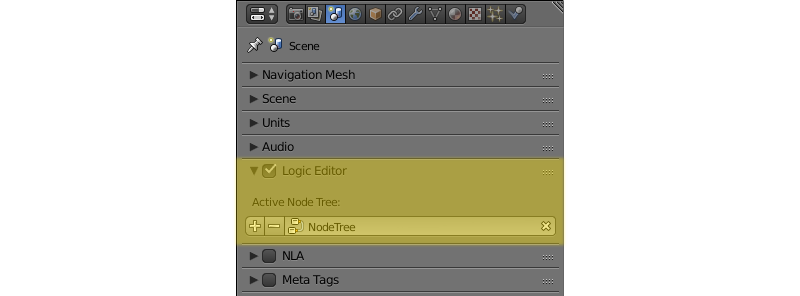

To edit logic tree go to the ``Node Editor`` area and select the ``Blend4Web Logic`` tree type:

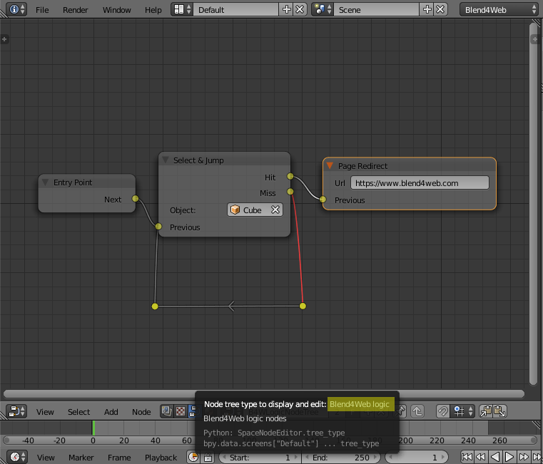

Then select the required node tree:

.. image:: src_images/logic_editor/logic_editor_select_tree.png
   :align: center
   :width: 100%

   
|

Nodes are created by using standard Blender keyboard shortcut ``Shift+A``.

The nodes themselves are logic blocks that are executed from the ``Entry Point`` node which has no inputs and only one output. All other nodes have both inputs and outputs, and can be inserted in any place of a logic tree. The exception is ``Page Redirect`` node, which can be inserted only to the end of the node tree. The nodes which have two outputs allow branching, thus the next leave is selected based on condition specified for such nodes.

For implementing complicated logic there are variables that can have either numeric or string values. The variables can be used for storing some scene state (e.g. this can be a counter of animation playbacks, character’s health points etc).

Logic Editor usage example:

.. image:: src_images/logic_editor/logic_editor_example.png
   :align: center
   :width: 100%

All available nodes are described below.

Control Flow
============

.. _logic_entry:

Entry Point
-----------

This is where the script starts. By using multiple entry points you can create multi-threaded applications.

.. image:: src_images/logic_editor/logic_editor_entry.png
    :align: center
    :width: 100%

Input Parameters
................

None.

Output Parameters
.................

*Next*
    Next node.

Internal Parameters
...................

*Run From Script*
    If this parameter is enabled, the entry point can be triggered via API by using the :b4wref:`logic_nodes.run_entrypoint` method.

.. _logic_switch_select:

Switch Select
-------------

Can be used to trace the selection of any object from the object list.

.. image:: src_images/logic_editor/logic_editor_switch_select.png
    :align: center
    :width: 100%

Input Parameters
................

*Previous*
    Previous node.

Output Parameters
.................

*<object name> Hit*
    This parameter will pass the control to the next node if the user selects (with a mouse or by touch) an object mentioned in the parameter’s name. The ``Switch Select`` node has one such parameter by default, but you can add new ones and remove existing ones (the node can even have no such parameters).

*Miss*
    This parameter will pass the control to the next node when the user selects any object with the ``Selectable`` property enabled (or used by another ``Switch Select`` node), but not specified in the ``Switch Select`` node.

Internal Parameters
...................

*Object*
    One of the objects that the user can select. These parameters are automatically created and deleted when you create or delete a ``Hit`` parameter. The number of such parameters is always equal to the number of the ``Hit`` parameters.

.. _logic_delay:

Delay
-----

Make a delay (measured in seconds) before going to the next node.

.. image:: src_images/logic_editor/logic_editor_delay.png
    :align: center
    :width: 100%

Input Parameters
................

*Previous*
    Previous node.

Output Parameters
.................

*Next*
    Next node.

Internal Parameters
...................

*Value*
    Time (in seconds) that will pass before the activation of the next node. Set to zero by default. Can be set manually or through a variable (if the ``Variable`` parameter is enabled).

.. _logic_jump:

Conditional Jump
----------------

Go to the specified node if the certain condition is met. The parameters (operands) can also be variables that are activated using the corresponding switches.

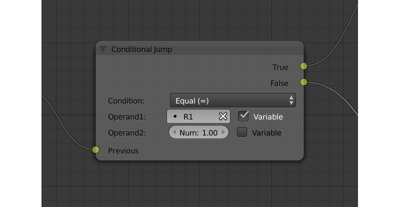

Input Parameters
................

*Previous*
    Previous node.

Output Parameters
.................

*True*
    Condition is true.

*False*
    Condition is false.

Internal Parameters
...................

*Condition*
    Logical condition. Can have one of the following types:

    * *Equal (=)* - first operand is equal to the second.
    * *Not Equal (!=)* - first operand is not equal to the second.
    * *Less Than (<)* - first operand is less than the second.
    * *Greater Than (>)* - first operand is greater than the second.
    * *Less Than Or Equal (<=)* - first operand is less than or equal to the second.
    * *Greater Than Or Equal (=>)* - first operand is greater than or equal to the second.

*Operand1*
    First operand of the logical condition. Contains a numeric value or a string (if the ``String Operators`` parameter is enabled). Can be specified in the node or can be a link to one of the variables (if the ``Variable`` parameter at the right of it is enabled).

*Operand2*
    Second operand of the logical condition. Works the same way as the first.

*String Operands*
    If this parameter is enabled, first and second operands can use strings (set manually or by a variable) as their values.

.. _logic_callback:

JS Callback
-----------

Can be used to call custom JavaScript callback defined in your Blend4Web application.

.. image:: src_images/logic_editor/logic_editor_js_callback.png
    :align: center
    :width: 100%

Input Parameters
................

*Previous*
    Previous node.

Output Parameters
.................

*Next*
    Next node.

Internal Parameters
...................

*Callback ID*
    The ID of a JavaScript function that will be called by the node.

*In Params*
    A list of the input parameters of the function. Each parameter can be either a variable or a link to a scene object. The number of the input parameters can be adjusted. By default, this list is empty.
    
    Input parameters are transferred to the callback function as an array that servers as the first argument of the function.

*Param <param_number>*
    Specifies an input parameter. This parameter can be a variable (``R1`` by default) or a link to a scene object, depending on the value of the ``Type`` parameter (each one of these parameters always has a corresponding ``Type`` parameter).

*Type*
    The type of the corresponding input parameter. It can have one of the two values: ``Variable`` (in this case, one of the variables will be used as the parameter) and ``Object`` (a link to a scene object).

*Out Params*
    A list of the output parameters. Empty by default. The number of the output parameters can be adjusted.

    An array that consists of the output parameters serves as the second argument of the callback function.

*Param <param_number>*
    Specifies one of the variables that will be used as an output parameter. By default, ``R1`` variable is used.

Animation
=========

.. _logic_play_timeline:

Play Timeline and Stop Timeline
-------------------------------

Can be used to control NLA animations. The ``Play Timeline`` node plays NLA fragment starting with a frame specified by the marker. Animation plays until next marker is encountered, or to the end of the scene’s timeline. After that, control passes on to the next node. The ``Stop Timeline`` node stops the playback.

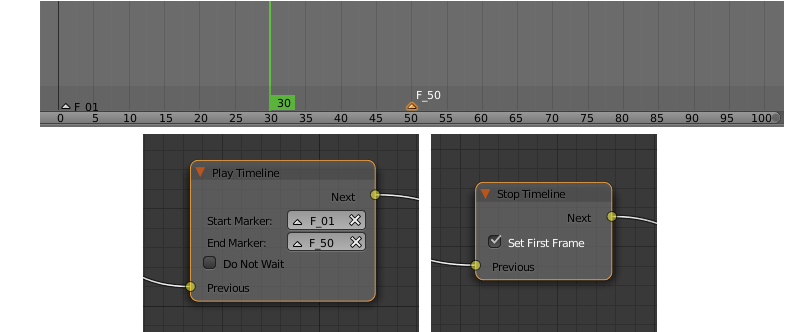

Input Parameters
................

*Previous*
    Previous node.

Output Parameters
.................

*Next*
    Next node.

Internal Parameters
...................

*Start Marker*
    First frame of the animation. If not specified, an animation plays from the start of the timeline and may not work correctly.

*End Marker*
    Last frame of the animation. If not specified, an animation plays to the end of the timeline and may not work correctly.

.. _logic_get_timeline:

Get Timeline
------------

This node can be used to get the current frame of an NLA animation or a timeline.

Input Parameters
................

*Previous*
    Previous node.

Output Parameters
.................

*Next*
    Next node.

Internal Parameters
...................

*NLA Timeline*
    If this parameter is enabled, the node will return the current frame of an NLA animation. If it is disabled, the node will return the current frame of the timeline. Enabled by default.

*Destination*
    Specifies a variable to store the number of the current frame. Set to ``R1`` by default.

.. _logic_select_play:

Play Animation
--------------
Can be used to play object’s animation. An animation can be one of the following types:

Regular Action:

.. image:: src_images/logic_editor/play_anim_action.png
   :align: center
   :width: 100%

Shader Action:

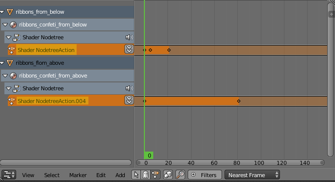

Particle system:

.. image:: src_images/logic_editor/play_anim_particle.png
   :align: center
   :width: 100%

Input Parameters
................

*Previous*
    Previous node.

Output Parameters
.................

*Next*
    Next node.

Internal Parameters
...................

*Object*
    Name of the object, animation of which will be played.

*Anim. Name*
    Name of an animation to play. If not specified, the entire timeline will be played.

*Behavior*
    Specifies animation behavior. Can have one of the following values:

    * *Finish Stop* - animation will be played once.
    * *Finish Reset* - animation will be played once, then the object will return to the starting point.
    * *Loop* - animation will be playing repeatedly until it is stopped by the ``Stop Animation`` node.

*Do Not Wait*
    If this parameter is enabled, the ``Play Animation`` node will pass the control to the next node on starting the animation playback. If it isn’t, the control will be passed to the next node only after playback is finished.

.. _logic_stop_anim:

Stop Animation
--------------
Can be used to stop an object’s animation.

Input Parameters
................

*Previous*
    Previous node.

Output Parameters
.................

*Next*
    Next node.

Internal Parameters
...................
*Set First Frame*
    Go back to the first frame after the animation has been stopped.

Camera
======

.. _logic_move_camera:

Move Camera
-----------

Can be used to move the camera, including smooth interpolation of its position.

.. image:: src_images/logic_editor/logic_editor_move_camera.png
    :align: center
    :width: 100%

Input Parameters
................

*Previous*
    Previous node.

Output Parameters
.................

*Next*
    Next node.

Internal Parameters
...................

*Camera*
    A camera that will be moved.

*Location*
    An object to which the camera will move. The camera’s coordinates will be the same as the object’s after the movement is finished.

*Target*
    The camera will point in the direction of this object after being moved.

*Duration*
    Time (in seconds) that the camera will spend being moved to a new location. Set to zero by default (and in this case the camera doesn’t actually move, it simply changes its position). It can be specified manually or as a link to a variable (if the ``Variable`` parameter is enabled).

.. _logic_set_camera_move_style:

Set Camera Move Style
---------------------

Can be used to change the move style of the selected camera.

.. image:: src_images/logic_editor/logic_editor_set_camera_move_style.png
    :align: center
    :width: 100%

Input Parameters
................

*Previous*
    Previous node.

Output Parameters
.................

*Next*
    Next node.

Internal Parameters
...................

*Camera*
    This parameter specifies a camera to which the changes will be applied.

*New Camera Move Style*
    This parameter specifies the new move style that the camera will use. Four options are available: ``Hover``, ``Eye``, ``Target`` and ``Static``.

The following options are only available if the ``New Camera Move Style`` parameter is not set to ``Static``:

*Translation*
    Sets the camera translation velocity. This parameter is set to 1.0 by default.

*Rotation*
    Sets the camera rotation velocity. This parameter is set to 1.0 by default.

*Zoom*
    Sets the zoom velocity of the camera. Default value is 0.10. Available only if the ``New Camera Move Style`` parameter is set to either ``Hover`` or ``Target``.

The following parameters are used to specify a target or a pivot point of the camera and are available only if the ``New Camera Move Style`` parameter is set to either ``Hover`` or ``Target``:

*Use Object*
    This parameter enables and disables using a scene object as camera's target or pivot point (depending on the camera type). If it is activated, a text field will appear to specify the object. This parameter is disabled by default.

If the ``Use Object`` parameter is disabled, the following three options become available:

*x*
    The ``X`` component of the camera's target/pivot pint.

*y*
    The ``Y`` component of the camera's target/pivot point.

*z*
    The ``Z`` component of the camera's target/pivot point.

.. _logic_set_camera_limits:

Set Camera Limits
-----------------

This node can be used to set limits of the selected camera. The node lists all available limits, but only ones that are compatible with the type of the camera are applied.

.. image:: src_images/logic_editor/logic_editor_set_camera_limits.png
    :align: center
    :width: 100%

Input Parameters
................

*Previous*
    Previous node.

Output Parameters
.................

*Next*
    Next node.

Internal Parameters
...................

*Camera*
    This parameter specifies a camera to which the limits will be applied.

*Distance Limits*
    Sets the ``Distance Limits`` parameter native to the :ref:`Target <camera_target_type>` and :ref:`Hover <camera_hover_type>` camera types.

*Hor. Rotation Limits*
    Sets ``Horizontal Rotation Limits`` parameter native to :ref:`Target <camera_target_type>` and :ref:`Eye <camera_eye_type>` camera types.

*Vert. Rotation Limits*
    Sets ``Vertical Rotation Limits`` parameter native to :ref:`Target <camera_target_type>`, :ref:`Hover <camera_hover_type>` and :ref:`Eye <camera_eye_type>` camera types.

*Pivot Translation Limits*
    Sets ``Pivot Translation Limits`` parameter native to :ref:`Target <camera_target_type>` camera type.

*Hor. Translation Limits*
    Sets ``Horizontal Translation Limits`` parameter native to :ref:`Hover <camera_hover_type>` camera type.

*Vert. Translation Limits*
    Sets ``Vertical Translation Limits`` parameter native to :ref:`Hover <camera_hover_type>` camera type.

Object
======

.. _logic_show_object:

Show Object
-----------

Can be used to show 3D objects.

.. image:: src_images/logic_editor/logic_editor_show_object.png
    :align: center
    :width: 100%

Input Parameters
................

*Previous*
    Previous node.

Output Parameters
.................

*Next*
    Next node.

Internal Parameters
...................

*Object*
    An object to show.

*Process child objects*
    If this parameter is enabled, child objects will be shown as well.

.. _logic_hide_object:

Hide Object
-----------

Can be used to hide 3D objects.

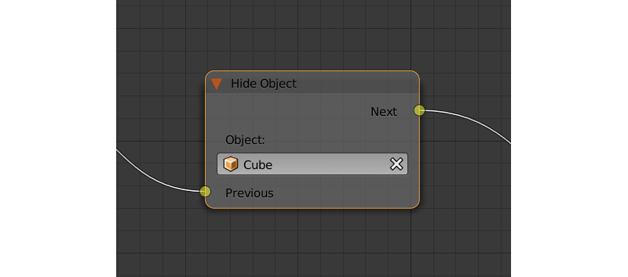

Input Parameters
................

*Previous*
    Previous node.

Output Parameters
.................

*Next*
    Next node.

Internal Parameters
...................

*Object*
    An object to hide.

*Process child objects*
    If this parameter is enabled, child objects will be hidden as well.

.. _logic_transform:

Transform Object
----------------

Can be used to transform object’s location, size and rotation angles.

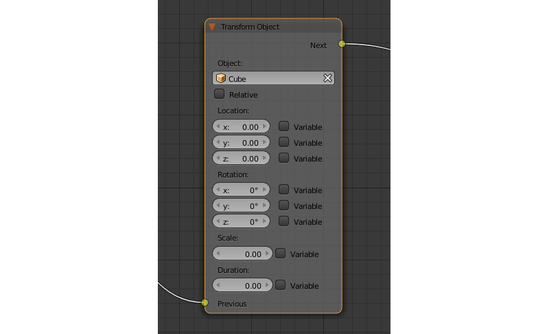

Input Parameters
................

*Previous*
    Previous node.

Output Parameters
.................

*Next*
    Next node.

Internal Parameters
...................

*Object*
    An object that needs to be translated.

*Space*
    This parameter defines the coordinate space that will be used to transform the object. It can have one of the following values:

    * ``World`` - global coordinate space.
    * ``Parent`` - local coordinate system of the parent of the object specified by the ``Object`` parameter. Parent object's origin point is used as the center of coordinates, while its angles of rotation define the directions of the coordinate axes. 
    * ``Local`` - local coordinate space of the selected object. Similar to the ``Parent`` coordinate space, but in this case, the origin point of the object itself is used as the origin of coordinates.

    Set to ``World`` by default.

*Location*
    How the object will move along the ``X``, ``Y`` and ``Z`` axes. By default, all three parameters are set to zero. Values can be specified in the node itself or through the variables (if the ``Variable`` option is enabled).

*Rotation*
    Object’s rotation around the ``X``, ``Y`` and ``Z`` axes. All three values are set to zero by default. Can be specified directly in the node or through the variables (if the ``Variable`` option is enabled).

*Scale*
    Object’s size. Can be specified directly or through a variable (if the ``Variable`` parameter is enabled). Set to 1 by default.

*Duration*
    Time (in seconds) that the transformation will take. It can be specified both directly or with a variable (to do this, the ``Variable`` parameter should be enabled). Set to zero by default.

.. _logic_move_to:

Move To
-------

Can be used to move objects.

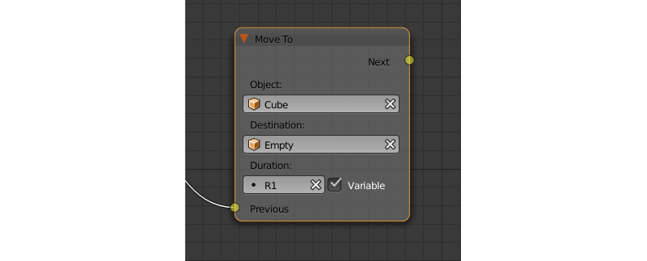

Input Parameters
................

*Previous*
    Previous node.

Output Parameters
.................

*Next*
    Next node.

Internal Parameters
...................

*Object*
    An object that you need to move.

*Destination*
    A target (another object or a light source, camera or anything else) to which the selected object will move. The object’s coordinated will be the same as the target’s after the movement is finished.

*Duration*
    Time (in seconds) that the object will spend moving to the new location. By default, this parameter is set to zero (and in this case, the object doesn’t actually move, it just changes its position in a moment). It can be set manually or with a variable (available only if the ``Variable`` parameter is enabled).

.. _logic_shape_key:

Apply Shape Key
---------------

Set the Shape Key factor.

.. image:: src_images/logic_editor/logic_editor_apply_shape_key.png
    :align: center
    :width: 100%

Input Parameters
................

*Previous*
    Previous node.

Output Parameters
.................

*Next*
    Next node.

Internal Parameters
...................

*Object*
    An object that needs to be transformed.

*Shape Key*
    Shape key that will be applied to the object.

*Value*
    How much the shape key will influence the object. This value can be set directly in the node or using a variable. The value should be between 0 and 1.

.. _logic_outline:

Outline
-------

Controls object outlining effect.

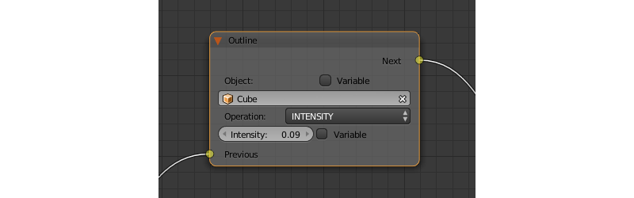

Input Parameters
................

*Previous*
    Previous node.

Output Parameters
.................

*Next*
    Next node.

Internal Parameters
...................

*Object*
    Any changes of the outline effect will be applied only to an object specified by this parameter.

*Operation*
    Specifies an operation that will be done to the object’s outline. This parameter can have one of the following values:

    * *PLAY* enables outline animation
    * *STOP* disables it
    * *INTENSITY* can be used to set intensity of the object’s outline

*Intensity*
    Outline intensity. This parameter is only available if the ``Operation`` parameter is set to ``INTENSITY``. The value can be set manually or via variable (if the ``Variable`` parameter is enabled).

.. _logic_shader_node:

Set Shader Node Param
---------------------

Can be used to set the value for the shader node. Currently, only ``Value`` and ``RGB`` nodes are supported.

.. image:: src_images/logic_editor/logic_editor_set_shader_node_param.png
    :align: center
    :width: 100%

Input Parameters
................

*Previous*
    Previous node.

Output Parameters
.................

*Next*
    Next node.

Internal Parameters
...................

*Object*
    An object that has material that needs to be edited.

*Material*
    Material that needs to be edited. It should use nodes.

*Node*
    A node that has parameters that can be changed. For now, only ``Value`` and ``RGB`` nodes are supported.

*Parameters*
    Editable parameters of the selected node. They can be set in the node itself or through the variables (if the ``Variable`` parameter is enabled).

.. _logic_inherit_material:

Inherit Material
----------------

Copy attributes from one material to another.

.. image:: src_images/logic_editor/logic_editor_inherit_material.png
    :align: center
    :width: 100%

Input Parameters
................

*Previous*
    Previous node.

Output Parameters
.................

*Next*
    Next node.

Internal Parameters
...................

*Source*
    An object that has a material that will be inherited.

*Material*
    The material to inherit.

*Destination*
    An object that will inherit selected material.

*Material*
    The material that will be replaced by the inherited one.

Operations
==========

.. _logic_var_store:

Variable Store
--------------

Saves numerical or string value to a variable.

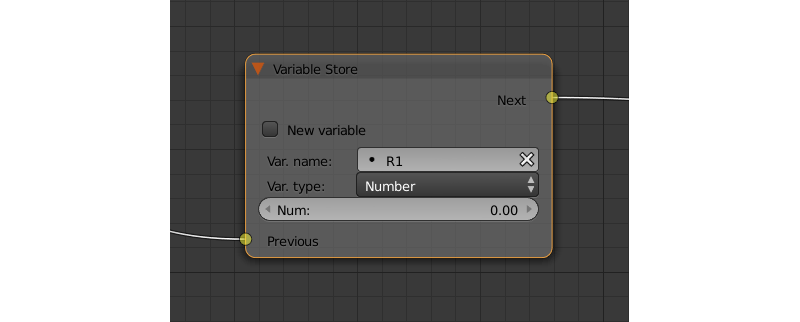

Input Parameters
................

*Previous*
    Previous node.

Output Parameters
.................

*Next*
    Next node.

Internal Parameters
...................

*Var. name.*
    Name of the variable. Can be selected from the list of variables or specified manually (if the ``New variable`` parameter is enabled).

*Var. type*
    Variable’s type. This parameter can have one of two values: ``Number`` (for numerical variables) and ``String`` (for string variables).

*New Variable*
    If this parameter is enabled, you can manually input a variable’s name and not just select one of the variables. This can be used to transfer the data between the application and the server.

*Global*
    Enabling this parameter makes the variable global. Available only if the ``New Variable`` parameter has been enabled.

    .. image:: src_images/logic_editor/logic_editor_variable_global.png
        :align: center
        :width: 100%

*Num./Str.*
    Numeric or string (depending on the ``Var. type`` parameter value) value of the variable.

.. _logic_math:

Math Operation
--------------

Perform a math operation and store the result in the variables. Any of parameters (operands) can be either a numeric value or a variables.

.. image:: src_images/logic_editor/logic_editor_math_operation.png
    :align: center
    :width: 100%

Input Parameters
................

*Previous*
    Previous node.

Output Parameters
.................

*Next*
    Next node.

Internal Parameters
...................

*Operation*
    Mathematical operation. Can have one of the following types:

    * *Random* generates random value greater than the first operand and less than the second,
    * *Add* sums the operands,
    * *Multiply* multiplies the operands,
    * *Subtract* subtracts the second operand from the first,
    * *Divide* divides first operand by the second,
    * *Sin* returns the sine of an angle (measured in radians) defined by the first operand,
    * *Cos* returns the cosine of an angle (measured in radians) defined by the first operand,
    * *Tan* returns the tangent of an angle (measured in radians) defined by the first operand,
    * *ArcSin* returns the arcsine value of the first operand,
    * *ArcCos* returns the arccosine value of the first operand,
    * *ArcTan* returns the arctangent value of the first operand,
    * *Log* returns the logarithmic value of the first operand with the second operand used as the base,
    * *Min* returns the lesser one of the two operands,
    * *Max* returns the greater one of the two operands,
    * *Round* rounds the first operator,
    * *Mod* returns the remainder after division of the first operand by the second,
    * *Abs* returns the absolute value of the first operand. 

*Operand1*
    First operand. It can be specified in the node or it can be a link to one of the variables (if the ``Variable`` parameter is enabled).

*Operand2*
    Second operand. Works the same way as the first.

*Destination*
    The result of the operation will be saved in the variable specified by this parameter.

.. _logic_string:

String Operation
----------------

Can be used to perform an operation with two strings and save the result to a variable.

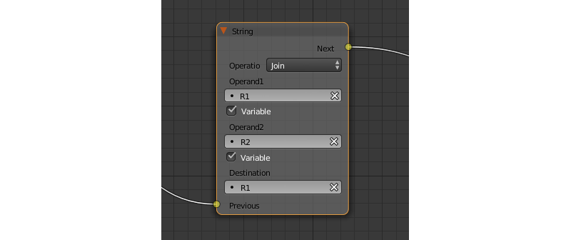

Input Parameters
................

*Previous*
    Previous node.

Output Parameters
.................

*Next*
    Next node.

Internal Parameters
...................

*Operation*
    An operation that you need to perform with two strings, which can have one of the following values:

    * *Join* - joins two strings into one.
    * *Find* - writes the index of the first occurrence of the second string in the first string to the variable. If there is no occurrences, the value of -1 will be written. It should be noted that the first symbol of a string has an index of 0, not 1.
    * *Replace* replaces first occurrence of the second string in the first string with the third one.
    * *Split* splits the first string in two using the first occurrence of the second string as a splitting mark.
    * *Compare* compares two strings. For this operation, you need to specify a logical condition. If this condition is met, a value of 1 will be outputted to the ``Destination`` variable, if it isn’t, zero will be outputted.

*Condition*
    A logical condition to compare two strings. This parameter is available only if the ``Operation`` parameter is set to ``Compare``. Works the same way as the ``Condition`` parameter of the ``Conditional Jump`` node.

*Operand1*
    The first string. Can be specified in the node itself or with a variable.

*Operand2*
    The second string. Works the same way as the first.

*Operand3*
    This parameter is available only if the ``Operation`` parameter is set to ``Replace``. Can be used to specify the third string, which will replace the first occurrence of the second one.

*Destination*
    A variable to save the operation’s result.

*Destination2*
    This parameter is available only if the ``Operation`` parameter is set to ``Split``. Specifies the variable to save the second half of the string that has been split (the first half will be saved to the variable specified by the ``Destination`` parameter).

Sound
=====

.. _logic_play_sound:

Play Sound
----------

Can be used to play speaker’s sound.

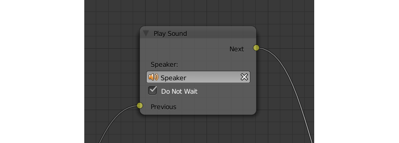

Input Parameters
................

*Previous*
    Previous node.

Output Parameters
.................

*Next*
    Next node.

Internal Parameters
...................

*Speaker*
    A speaker that will be enabled.

*Do Not Wait*
    If this parameter is enabled, the control will pass to the next node right after sound playback starts. If it isn’t enabled, the control will pass only when the playback is finished.

.. _logic_stop_sound:

Stop Sound
----------

Can be used to stop speaker’s sound.

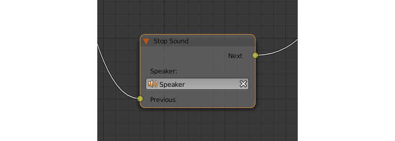

Input Parameters
................

*Previous*
    Previous node.

Output Parameters
.................

*Next*
    Next node.

Internal Parameters
...................

*Speaker*
    A speaker that will be turned off.

Network
=======

.. _logic_send_request:

Send Request
------------

Send an HTTP GET request to the specified URL and save the respond’s fields a variable.

.. image:: src_images/logic_editor/logic_editor_send_request.png
    :align: center
    :width: 100%

Input Parameters
................

*Previous*
    Previous node.

Output Parameters
.................

*Next*
    Next node.

Internal Parameters
...................

*Method*
    Method of the request. Can have one of two values:

    * *GET* is used to request data from the server.
    * *POST* is used to send data to the server.

    Set to ``GET`` by default.

*Url*
    A web address to send request to. Set to “https://www.blend4web.com” by default.

*Response Params*
    Specifies the variable to save the data received from the server.

.. note::
    The data received from the server should be in the JSON format:

    .. code-block:: json

        {
            "var0": 1,
            "var1": 10,
            "var2": 144
        }

*Content-Type*
    Indicates the media type of the message content. Consists of a type and a subtype, for example: ``text/plain``. Set to ``Auto`` by default. Can be used to reassign the title of the HTTP request.

*Request Params*
    Specifies the variable that contains a JSON object that will be sent to the server.  Available only if the ``Method`` parameter is set to ``POST``. Default value is ``R1``.

.. _logic_json:

JSON
----

This node can be used to encode and decode complex JSON objects.

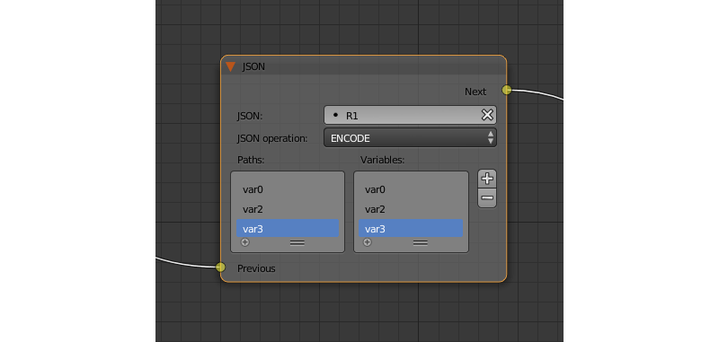

Input Parameters
................

*Previous*
    Previous node.

Output Parameters
.................

*Next*
    Next node.

Internal Parameters
...................

*JSON*
    A link to a JSON object that you need to decode or encode. Set to ``R1`` by default.

*JSON Operation*
    An operation you need to perform with the JSON object specified by the ``JSON`` parameter. Can have one of two values: ``ENCODE`` to encode the JSON object and ``PARSE`` to decode it. Set to ``ENCODE`` by default.

*Paths*
    A list of paths to the variables inside the JSON object. Paths are used to define the inner structure of a JSON object. A path should consist of several identifiers (separated by dots) that serve as a path to a JSON field. If a name of a fragment of the path consists solely of numbers, this name is interpreted as an array index. Paths are created and deleted in conjunction with variables (in the ``Variables`` list), and one path always corresponds to one variable. This list can be used both to encode and to decode JSON object. By default, the list is empty.

*Variables*
    A list of variables that will be used to either store the decoded data or to encode a JSON object (depending on the value of the ``JSON Operation`` parameter). The names and the quantity of the variables can be adjusted manually. This list is also empty by default.

Using JSON logic node to encode JSON object
...........................................

.. image:: src_images/logic_editor/logic_editor_json_encode_example.png
    :align: center
    :width: 100%

The logic node setup at the picture above encodes a JSON object and stores it in the ``R1`` variable. Such a JSON object looks like this:

.. code-block:: json
    
    {
        "main":{
            "part1":7,
            "part2":12,
            "part3":"abc"
        }
    }

Using JSON logic node to decode JSON object
...........................................

.. image:: src_images/logic_editor/logic_editor_json_decode_example.png
    :align: center
    :width: 100%

The picture above shows a logic node setup that receives a JSON object from the server, stores it in the ``R1`` variable and then decodes it. Such a JSON object looks like this:

.. code-block:: json

    {
        "a": {
	    "b": 17,
            "c": "abc" 
        } 
    }

Decoding this JSON object with the ``JSON`` logic node results in three variables named ``var0``, ``var1`` and ``var2`` (you don't have to create the variables beforehand) that will contain various parts of the JSON object. In this example, the ``var1`` variable has the value of 17, the ``var2`` variable has the value "abc", while the ``var0`` variable contains the following fragment of the JSON object:

.. code-block:: json

    {
        "b": 17,
        "c": "abc" 
    } 

.. _logic_page_param:

Page Param
----------

Allows to store any web page parameter in a given variable.

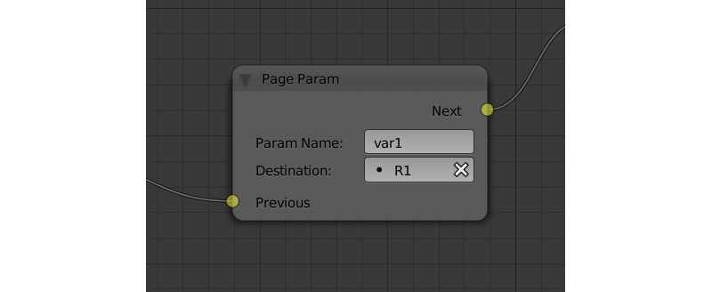

Input Parameters
................

*Previous*
    Previous node.

Output Parameters
.................

*Next*
    Next node.

Internal Parameters
...................

*Param Name*
    The name of the web page parameter.

    If the parameter specified in this field is presented in the URL, then its value will be saved to a variable specified by the ``Destination`` parameter.

*Destination*
    A variable that will be used to save the parameter.

.. _logic_page_redirect:

Page Redirect
-------------

Can be used to redirect the browser to another page. This node always marks the end of the node tree and doesn’t have any output parameters.

Input Parameters
................

*Previous*
    Previous node.

Output Parameters
.................

None.

Internal Parameters
...................

*Url*
    Web address of a page that will be opened. Set to “https://www.blend4web.com” by default.

Debug
=====

.. _logic_console_print:

Console Print
-------------

This node prints variables’s values and additional text to the web browser console. It can be used for debug purposes.

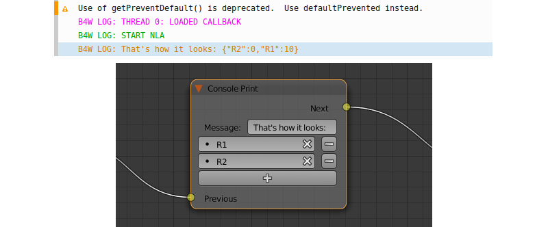

Input Parameters
................

*Previous*
    Previous node.

Output Parameters
.................

*Next*
    Next node.

Internal Parameters
...................

*Message*
    A message that will be printed to the console along with the values.

<variable name>
    A variable that will be printed to the console. By default, a ``Console Print`` node has one such parameter, but you can add new and delete existing ones (the node might not even have such parameters at all).

Deprecated
==========

Select (Deprecated)
-------------------
.. note::

    Deprecated! Isn’t recommended to use. Instead, using a ``Switch Select`` node is recommended.

It is similar to the ``Select & Play`` node, except the transition happens instead of animation. This function allows to implement a complicated logic because in this case there is a possibility to identify the user selection results.

Select & Play Timeline (Deprecated)
-----------------------------------
.. note::

    Deprecated! Isn’t recommended to use. Instead, using a combination of ``Switch Select`` and ``Play Timeline`` nodes is recommended.

Wait until the user selects an object (on desktops - with a mouse click, on mobile devices - with a touch). If the object, which is specified in this node, is selected - then start the animation similar to the ``Play Timeline`` node. If any other object is selected - then immediately transfer control to the next node.

Select & Play Animation (Deprecated)
------------------------------------
.. note::

    Deprecated! Isn’t recommended to use. Instead, using a combination of ``Switch Select`` and ``Play Timeline`` nodes is recommended.

Wait until the user selects an object (on desktops - with a mouse click, on mobile devices - with a touch). If the object, which is specified in this node, is selected - then start the animation similar to the ``Play Animation`` node. If any other object is selected - then immediately transfer control to the next node.

Layout
======

.. _logic_empty:

Empty
-----

This is a simple pass-through node that does not perform any operations on its own. It can be used to combine several logic threads into one or simply to make the logic node setup easier to read and understand.

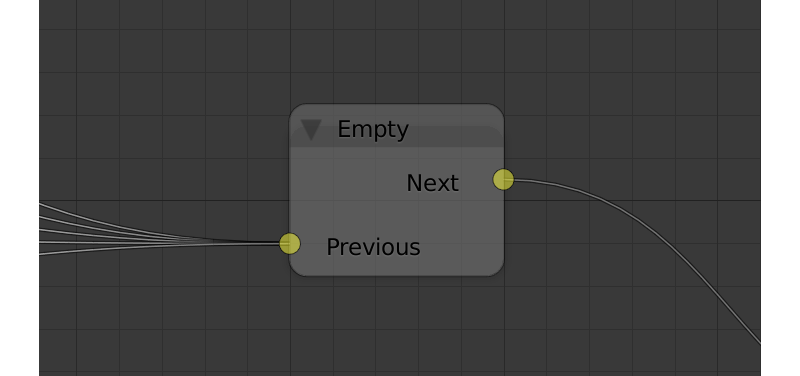

Input Parameters
................

*Previous*
    Previous node (or several nodes).

Output Parameters
.................

*Next*
    Next node.

Internal Parameters
...................

None.

.. _logic_reroute:

Reroute
-------

Logic Editor also has ``Reroute`` elements, the nodes that don’t do anything aside from passing the control to the next node or to the next ``Reroute`` element. Such elements can be used to create cyclic structures or to make the node tree easier to read and understand.

Unlike the ``Empty`` node, ``Reroute`` element can only handle a single logic thread.

.. image:: src_images/logic_editor/logic_editor_reroute.png
    :align: center
    :width: 100%

.. note::
    Output parameter can’t be connected to the same node’s input parameter. If you need to do this (to make a cycle, for example), you should use ``Reroute`` elements.

.. _logic_debug:

Debugging
=========

For debugging purposes some nodes inside logic tree can be muted. To do that select the required node and press the ``M`` key. Muted nodes are not evaluated and simply pass control to the next ones. If the muted node has two outputs the execution continues from the output with negative result (``Miss``, ``False``).
