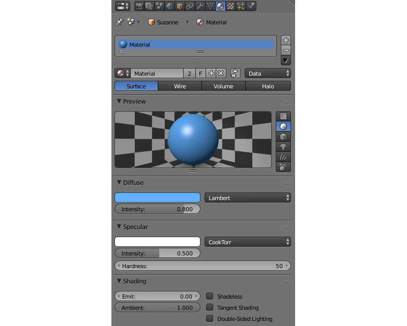
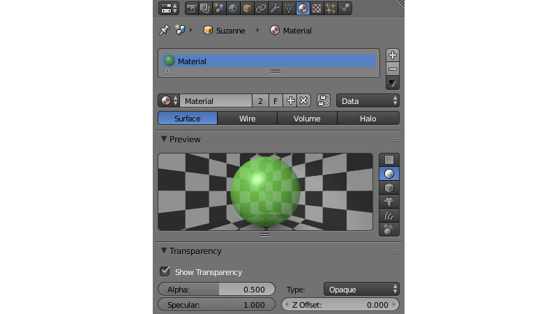
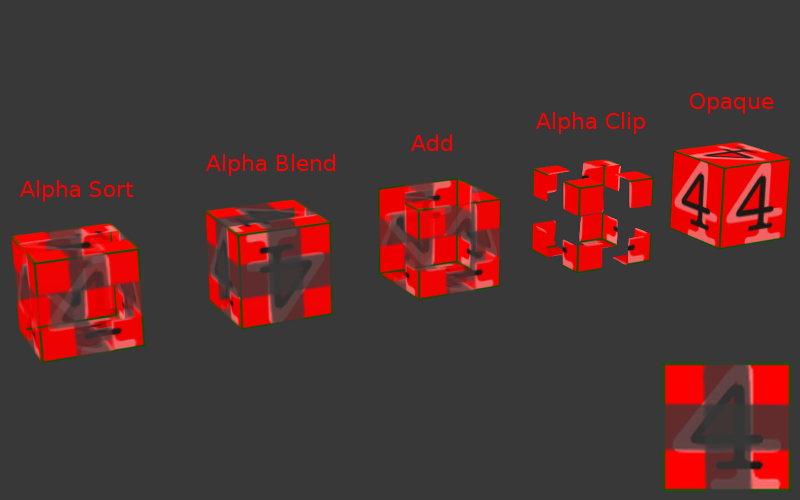
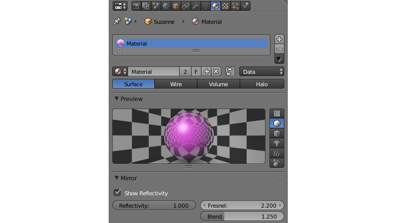
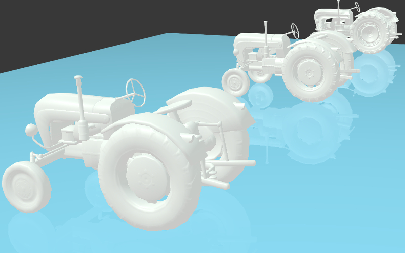
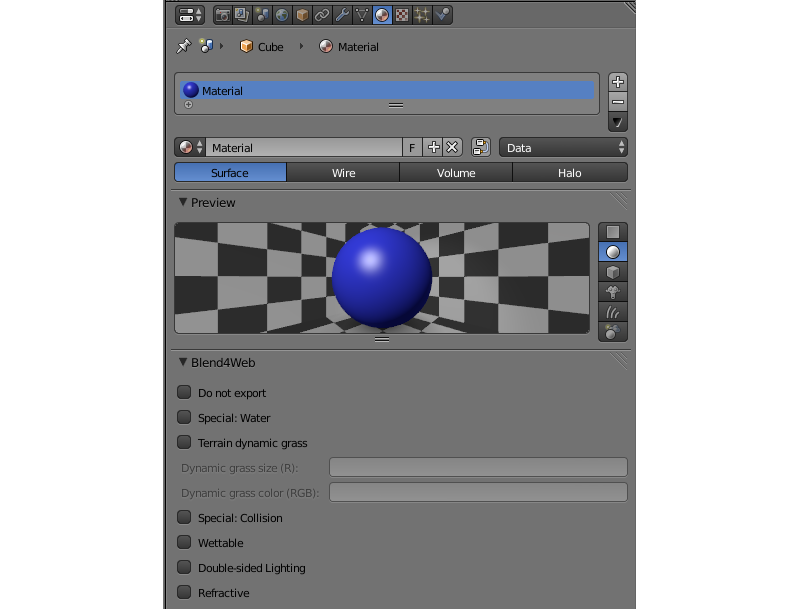
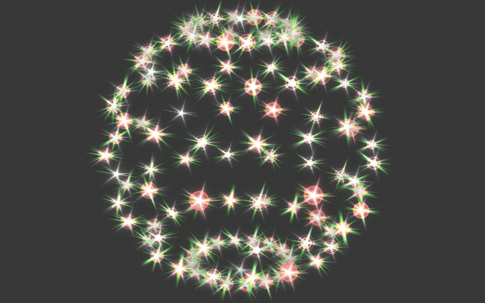

.. _materials:

.. index:: materials

*********
Materials
*********

.. contents:: Table of Content
    :depth: 3
    :backlinks: entry

Materials describe the object surface’s response to light and also contain information about its transparency, reflectivity, physical parameters and so on.

Meshes can have one or more materials. In case of multiple materials they can be assigned to different polygons in the ``Edit Mode``. To do this select the needed polygons, select the needed material from the list and click the ``Assign`` button.

The following material types are supported: ``Surface``, ``Halo``.

.. index:: materials; lighting parameters

.. _material_lighting_params:

Lighting Parameters
===================

*Diffuse > Color*
    Diffuse light color. The default value is (0.8, 0.8, 0.8). It may interact with the diffuse map color.

*Diffuse > Intensity*
    Diffuse light intensity. The default value is 0.8.

*Diffuse > Shader*
    Diffuse shading algorithm. The default value is ``Lambert``.

*Specular > Color*
    Specular light color. The default value is (1.0, 1.0, 1.0). It may interact with the specular map color.

*Specular > Intensity*
    Specular light intensity. The default value is 0.5.

*Specular > Hardness*
    Exponent in the specular shading calculation formula. The default value is 50. Note that the formula used in the engine differs slightly from the Blender’s one.

*Specular > Shader*
    Specular shading algorithm. The default value is ``CookTorr``.

*Shading > Emit*
    Emission intensity. The default value is 0.0.

*Shading > Ambient*
    Ambient influence factor on material. The default value is 1.0.

*Shading > Shadeless*
    When enabled, a material doesn’t react to light. Disabled by default.

.. _tangent_shading:

*Shading > Tangent Shading*
    When this parameter is enabled, the engine will use the material's tangent vector (instead of normal vector) for calculating the object's color. This can be used for creating anisotropic shading effects.

    .. figure:: src_images/materials/materials_tangent_shading_comparison.png
        :align: center
        :width: 100%
 
        **On the left:** standard shading model; **on the right:** tangent shading model.

*Shading > Double-Sided Lighting*
    Enables the double-sided lighting mode. This option is useful for non-transparent objects with a single-layered mesh.

.. index:: materials; transparency, transparency

.. _alpha_blend:

Transparency
============

.. index:: transparency; types

Types
-----

Transparency implementation type can be selected in the ``Transparency`` menu on the ``Properties > Material`` panel.

The engine supports all of the transparency types (sorted in the ascending order by performance):

*Alpha Sort*
    Transparent with a gradient. The engine sorts the triangles by camera distance in order to render overlapping transparent surfaces correctly. This operation is computationally expensive. It is recommended to use this feature for closed transparent geometry (bottle, car glass etc).

*Alpha Anti-Aliasing*
    Transparent with a gradient. This feature is implemented with the help of the Alpha to coverage technique. It's available only if MSAA is enabled (only on WebGL2-capable devices). The sorting of triangles is not performed. It is recommended to use this feature with a mask texture to visualize smaller details (tree leaves, grass).

*Alpha Blend*
    Transparent with a gradient. The sorting of triangles is not performed. It is recommended to use this feature for unclosed transparent geometry (water surface, decals).

*Add*
    Transparent with a gradient. The sorting of triangles is not performed. The engine disables writing to the depth buffer which causes transparent surfaces to be rendered in arbitrary order. It is recommended to use this feature for effects (particle systems, glowing beams).

*Alpha Clip*
    Transparent without a gradient. The engine discards pixels if their alpha is less than 0.5. The sorting of triangles is not performed. It is recommended to use this feature with a mask texture to visualize smaller details (tree leaves, grass).

*Opaque*
    Non-transparent. Alpha is ignored. This is the default value.

.. index:: transparency; settings

Additional Settings
-------------------

*Transparency > Show Transparency*
    Enabling the transparency checkbox is required for viewing transparent objects in Blender. The engine ignores this option - the ``Alpha Blend`` option is used instead.

*Transparency > Alpha*
    Material transparency level. The engine ignores this parameter (in contrast to Blender) if there is a diffuse texture - the alpha channel values of a texture are used instead.

*Transparency > Z Offset*
    This option explicitly specifies relative positioning order of objects with **different** materials with the purpose of depth sorting. The option can take both negative and positive values. The more distant the object is the lesser parameter value should be to provide correct rendering. The default value is 0.0.

.. index:: materials; reflection, reflection

.. _material_mirror:

Reflection
==========

.. index:: reflection; static

.. _reflection_static:

Static Reflection
-----------------

A surface reflects the same image no matter how the environment changes. For activation simply use the :ref:`mirror map <mirror_map>`.

.. seealso:: :ref:`fresnel`

.. index:: reflection; dynamic

Dynamic Reflection
------------------

A surface reflects the selected objects in their current position. The engine supports planar and spherical reflections.

.. note::
    If you are using :ref:`node materials <node_materials>`, dynamic reflection will only work if a ``Material`` or ``Extended Material`` node is present in the node tree.

Activation
..........

#. Check ``Reflections`` setting on the ``Render > Reflections`` and Refractions panel.
#. For *reflective* objects enable the ``Reflective`` option on the ``Object > Reflections`` panel.

   * For planar reflections, set the ``Object > Reflections > Type`` property to ``Plane``. After that, add an empty object to be used as a reflection plane by executing for example ``Add > Empty > Single Arrow``. Rename it for convenience and specify its name in the ``Reflection plane`` field of the reflective object.
   * For cube-mapped reflections, set the ``Object > Reflections > Type`` property to ``Cube``.

#. For the needed materials of the *reflective* objects, set the ``Material > Mirror > Reflectivity`` value.

   * ``Mirror > Reflectivity > Show Reflectivity`` is required for displaying reflections on objects in Blender. The engine ignores this option.

#. For the *reflexible* objects, enable the ``Reflexible`` checkbox on the ``Object > Reflections`` panel.

.. note::

    It is also recommended to enable the ``World > Environment Lighting`` checkbox.

Limitations
...........

Normal maps and shadows are ignored in the reflected image for optimization purposes.

.. seealso:: :ref:`fresnel`

.. index:: reflection; fresnel effect

.. _fresnel:

Fresnel effect for reflection
-----------------------------

The Fresnel effect manifests itself as the dependency of the intensity of passing and reflected light on the incidence angle. If the angle of incidence is close to zero (i.e. light falls almost at right angle to the surface) the passing light portion is large and the reflected light portion is small. On the contrary if the angle of incidence is close to 90 degrees (i.e. light falls almost parallel to the surface) almost all light is reflected.

The engine uses the approximate Schlick’s formula:

    R = R\ :sub:`0` + (1 − R\ :sub:`0`)(1 - cos θ)\ :sup:`N`, where

    R - reflection coefficient,

    R\ :sub:`0` - reflection coefficient in case of viewing at a right angle to the surface (i.e. when θ = 0),

    θ - angle of incidence (which is equal to the angle of reflection under which light enters the camera), it is calculated by the engine in real-time,

    N - exponent.

Settings
........

Fresnel effect can be set up both for static and dynamic reflection.

*Material > Mirror > Fresnel*
    Fresnel power for reflection. This is the N exponent in the Schlick’s formula. In Blender it is limited to values from 0 to 5. If this parameter is equal to zero the Fresnel effect is not observed and the *full* reflection at all angles occurs. If this parameter is greater than zero, the material is less reflective when viewing surfaces at angles which are close to the right angle. The bigger this parameter is the bigger is the angle deviation from the right angle for which the Fresnel effect is observed.

*Material > Mirror > Blend*
    Fresnel factor for reflection. It is reduced to R\ :sub:`0` in the Schlick’s formula by the following expression: R\ :sub:`0` = 1 - ``Blend`` / 5. In Blender it is limited to values from 0 to 5. This parameter defines the Fresnel effect intensity: the bigger the ``Blend`` factor is, the more is the Fresnel effect influence. If it is equal to zero the Fresnel effect is not observed.

|

.. index:: materials; rendering properties

.. _rendering_properties:

Rendering Properties
====================

*Material > Rendering Options > Do not Render*
    Disable rendering of this object.

*Material > Rendering Options > Backface Culling*
    When enabled, polygons’ back faces are not rendered by the engine. Enabled by default.

*Material > Rendering Options > Wettable*
    Water wetting effect is activated for the material.

    .. seealso:: :ref:`water`

*Material > Rendering Options > Lens Flare*
    Enabling this parameter activates Lens Flare effect for the material.

*Material > Rendering Options > Render Above All*
    Material is rendered on top of all scene objects. Transparency type with a gradient is required (``Add``, Alpha Blend`` or ``Alpha Sort``).

*Material > Rendering Options > Vertex Color Paint*
    Mesh vertex color is used instead of the material diffuse color when the checkbox is enabled.

*Material > Rendering Options > Refractive*
    Make object refractive. Perturbation factor can be set with the option ``Refraction Bump`` on the ``Refraction Settings`` panel. The default value is 0.001.

    .. note::

        In order to use this effect, select ``ON`` or ``AUTO`` on the ``Render > Reflections and Refractions > Refractions`` panel. The object must have ``Alpha Blend`` transparency type.

    .. seealso:: :ref:`alpha_blend`

|

.. index:: materials; viewport properties

Viewport Properties
====================

The ``Viewport`` section can be found on the ``Blend4Web`` panel.

.. image:: src_images/materials/update_material_anim.png
   :align: center
   :width: 100%

*Update Material Animation*

    Update animated shader in Blender Viewport.

|

.. index:: materials; specific parameters

Engine Specific Parameters
==========================

|

*Material > Water*
    Special material for :ref:`water rendering <water>`.

*Material > Terrain Dynamic Grass*
    Material is used for :ref:`grass rendering <particles_grass>`.

*Material > Collision*
    A special material for collision geometry.

    .. seealso:: :ref:`physics`

*Material > Export Options > Do Not Export*
    Material is not to be exported.

.. index:: materials; halo

.. _material_halo:

Halo Materials
==============

Halo materials are used in particle systems and in static meshes. Using the halo in static meshes is described below.

Activation
----------

Select the ``Halo`` type under the ``Materials`` tab. It’s also recommended to select the transparency type with a gradient (``Add``, ``Alpha Blend`` or ``Alpha Sort``).

Additional Settings
-------------------

*Halo > Alpha*
    Material transparency factor. The default value is 1.0 (non-transparent).

*Halo > Color*
    Material color. The default value is (0.8, 0.8, 0.8) (almost white).

*Halo > Size*
    Particle size. The default value is 0.5.

*Halo > Hardness*
    Exponent for computing the gradient. Affects visible dimensions of particles. The default value is 50.

*Halo > Rings*
    Use rings. Relative quantity and color can be set up.

*Halo > Lines*
    Use lines. Relative quantity and color can be set up.

*Halo > Star Tips*
    Use stars. The quantity of edges can be set up.

*Halo > Special: Stars*
    Enables the starry sky rendering mode. The mesh is fixed relative to the camera. For the ``Sun`` lamp it is also required to enable the ``Lamp > Dynamic Intensity`` checkbox. Applications should set up the hours of darkness via API.

*Halo > Blending Height*
    Height range for the fading of stars.

*Halo > Minimum Height*
    Minimum height in the object’s local space at which stars are visible.

.. _material_api:

Material API
============

All API methods used for setting and changing scene materials, both stack and node, are located in the Material API module. Every method that this module has to offer is thoroughly described in this :b4wmod:`page material` of the API reference.

.. note::

    API methods can only work with materials that are attached to dynamic objects.

Methods for Stack Materials
---------------------------

The :b4wmod:`material` API module includes methods to control virtually every aspect of a stack material.

Here are several examples of how the material API module can be used to perform various operations with the material of an object:

Getting object's diffuse color:

.. code-block:: javascript

    var m_scenes    = require("scenes");
    var m_material  = require("material");

    ...

    var cube = m_scenes.get_object_by_name("Cube");

    var diffuse_color = m_material.get_diffuse_color(cube, "MyMaterial");
    var diffuse_color_factor = m_material.get_diffuse_color_factor(cube, "MyMaterial");
    var diffuse_intensity = m_material.get_diffuse_intensity(cube, "MyMaterial");

Getting object's specular color:

.. code-block:: javascript

    var m_scenes    = require("scenes");
    var m_material  = require("material");

    ...

    var cube = m_scenes.get_object_by_name("Cube");

    var specular_color = m_material.get_specular_color(cube, "MyMaterial");
    var specular_color_factor = m_material.get_specular_color_factor(cube, "MyMaterial");
    var specular_hardness = m_material.get_specular_hardness(cube, "MyMaterial");
    var specular_intensity = m_material.get_specular_intensity(cube, "MyMaterial");

Getting other parameters:

.. code-block:: javascript

    var m_scenes    = require("scenes");
    var m_material  = require("material");

    ...

    var cube = m_scenes.get_object_by_name("Cube");

    var emit_factor = m_material.get_emit_factor(cube, "MyMaterial");
    var alpha_factor = m_material.get_alpha_factor(cube, "MyMaterial");
    var ambient_factor = m_material.get_ambient_factor(cube, "MyMaterial");

    var extended_parameters = m_material.get_material_extended_params(cube, "MyMaterial");

Setting stack material parameters:

.. code-block:: javascript

    var m_scenes    = require("scenes");
    var m_material  = require("material");
    var m_rgba      = require("rgba");

    ...

    var cube = m_scenes.get_object_by_name("Cube");

    m_material.set_diffuse_color(cube, "MyMaterial", m_rgba.from_values(1.0, 0.0, 0.0, 1.0));
    m_material.set_diffuse_color_factor(cube, "MyMaterial", 0.05);
    m_material.set_material_extended_params(cube, "MyMaterial", {fresnel: 0,
                                                                 fresnel_factor: 1.25,
                                                                 parallax_scale: 0,
                                                                 parallax_steps: "5.0",
                                                                 reflect_factor: 0});

Methods for Node Materials
--------------------------

At the moment, API methods can only affect RGB and Value nodes. Any other type is not supported.

To change the value of a particular material node, you need:

* to get the object that uses this particular material,
* the name of the material,
* the name of the node itself
* and the name of the node group that contains the node (if there is one).

The name of a node can be viewed and changed in the upper part of the side panel at the right of the Node Editor window.

.. note::

    Nodes in the main window of the Node Editor do not show the name of the node, only its type.

.. image:: src_images/materials/material_node_name.png
   :align: center
   :width: 100%

These two examples show how the parameters of a node material can be adjusted using API methods.

Getting node material parameters:

.. code-block:: javascript

    var m_scenes    = require("scenes");
    var m_material  = require("material");

    ...

    var cube = m_scene.get_object_by_name("Cube");

    var rgb_node_1 = m_material.get_nodemat_rgb(cube, ["MyMaterial", "MyRGB"]);
    var rgb_node_2 = m_material.get_nodemat_rgb(cube, ["MyMaterial", "MyRGB_2"]);
    var value_node = m_material.get_nodemat_value(cube, ["MyMaterial", "MyValue"]);

Setting node material parameters:

.. code-block:: javascript

    var m_scenes    = require("scenes");
    var m_material  = require("material");

    ...

    var cube = m_scene.get_object_by_name("Cube");

    m_material.set_nodemat_value(cube, ["MyMaterial", "MyValue"], 0.8);   
    m_material.set_nodemat_rgb(cube, ["MyMaterial", "MyRGB"], 0.7, 0.9, 0.3);

Same methods can also be used to adjust the scene environment, if the ``World`` object in the scene uses ``RGB`` or ``Value`` nodes. However, in this case you won't have to use the name of the material. The other difference is that a link to a scene object has to be replaced with a link to the ``World`` object that can be retrieved with the :b4wref:`scenes.get_world_by_name()` method:

.. code-block:: javascript

    var m_scenes    = require("scenes");
    var m_material  = require("material");

    ...

    var my_world = m_scene.get_world_by_name("World");
    
    var world_rgb = m_material.get_nodemat_rgb(my_world, ["My_RGB_3"]);

Replacing Textures
------------------

API methods also allow you to replace texture images. This can be done using the :b4wref:`textures.change_image()` method from the :b4wmod:`textures` module:

.. code-block:: javascript

    var m_scenes  = require("scenes");
    var m_tex = require("textures");

    ...

    var my_cube = m_scenes.get_object_by_name("Cube");

    m_tex.change_image(my_cube, "My_Texture", "./test.png");

This method can be applied to replace textures used by the ``World`` object as well. However, in this case the name of the ``Texture`` node should be used instead of the name of a texture.

.. _material_inherit:

Inherit Material
================

Blend4Web supports dynamic material switching. This feature is exceptionally useful for so-called configurator applications that give a user an opportunity to customize the appearance of a model such as an apparel, a piece of furniture, a car or something else. The Inherit Material feature should be used when API methods for adjusting stack and node materials as well as the :b4wref:`textures.change_texture` method do not suffice.

Inherit Material has the advantage of being flexible and easy to use, which makes it a better choice when you have to significantly alter the source material. It is available for both API scripts and logic nodes, and it can be used for stack and node materials alike. The downside of this feature is the fact that it might not work as fast as other methods described above, which can be critical in some cases.

Activation
----------

To use Inherit Material, you need two objects. First one of them is the source object that has a material that will be inherited assigned to it. The second one is the target object which has a material that you need to replace. Both object should have the ``Dynamic Geometry & Material`` option enabled (this option can be found under the ``Object`` tab, on the ``Rendering Properties`` panel).

.. note::

    After a material is inherited, it will look exactly the same as if it was simply assigned to the target object in Blender. This means that you might have to manually prepare all UV maps and vertex color layers for every material that will be inherited by the object beforehand. For the source object, this is not necessary.

If you are using Logic Nodes, Inherit Material can be performed with the ``Object->Inherit Material`` node. If you are using API, this can be done with the :b4wref:`materials.inherit_material` method.

.. image:: src_images/materials/material_container.png
   :align: center
   :width: 100%

If an application requires many different materials to be changed, it might be a good approach to create a dedicated container object. It can be a simple flat mesh, like a ``Plane`` object, that has every material you might need assigned to it. This object can be hidden from the scene itself by setting the ``Hidden`` or ``Do Not Render`` option on the ``Object->Rendering Properties`` panel.

