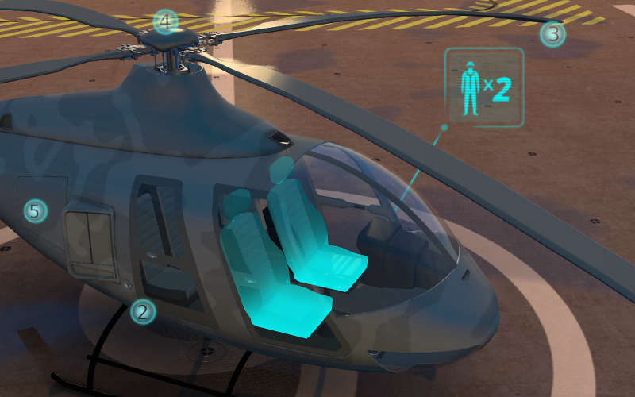

.. _nla:

*******************
Нелинейная анимация
*******************

.. _nla_editor:

Редактор NLA
============

Редактор нелинейной анимации, имеющийся в программе Blender, позволяет в удобной
форме задавать поведение сцены. С его помощью можно реализовать несложные
сценарии, не требующие вмешательства со стороны пользователя. Таким образом
исключается необходимость программирования простых сцен и демо-приложений.

.. image:: src_images/nla/simple_machinima.jpg
   :align: center
   :width: 100%

|

Движком поддерживается управление следующими сущностями:

* Любая анимация, параметры которой могут быть представлены с помощью `действий` (Action)

* Воспроизведение звуков

* Эмиссия частиц (в виде привязки к глобальной шкале времени)

.. image:: src_images/nla/nla_editor.jpg
   :align: center
   :width: 100%
   

Использование
-------------

#. Во вкладке ``Scene`` выбрать опцию ``Use NLA``.
#. В редакторе ``NLA Editor`` задать необходимую конфигурацию поведения сцены.
#. На панели ``Timeline`` выбрать интервал времени анимации.

Дополнительные настройки
------------------------

Настройка сцены *Blend4Web > Cyclic NLA* позволяет активировать режим
циклической NLA-анимации.

Ограничения
-----------

* Вертексная анимация не поддерживается.
* Масштабирование и зацикливание отдельных полос анимации (Strip) не поддерживается.
* Одновременное проигрывание различных видов анимации для одного объекта не поддерживается.

.. _nla_script:

Визуальное программирование (NLA Script)
========================================

Осуществляется с помощью добавления слотов логики (NLA Script Slot) на вкладке
настроек сцены Blender. С их помощью можно существенно расширить
функциональность сцены, не прибегая при этом к программированию.

   
|

Слоты являются логическими блоками, которые выполняются с первого по последний
последовательно, за исключением случаев, когда в слоте явно обозначен переход
(``Jump``). При достижении конца списка, выполнение логики останавливается, либо,
если на сцене активирована настройка *Blend4Web > Cyclic NLA*, начинается сначала.

.. image:: src_images/nla/interactive_nla_brick.png
   :align: center
   :width: 100%
   
.. note::
    Использование настройки *Blend4Web > Cyclic NLA* совместно с NLA Script не
    приводит к автоматическому зацикливанию анимации.

Ниже рассмотрены все возможные варианты слотов.

Play
----

Проигрывать участок NLA, начиная с кадра, на который указывает маркер.
Анимация воспроизводится до следующего маркера, либо до конца шкалы времени
сцены, после чего управление переходит к следующему слоту.

.. image:: src_images/nla/interactive_nla_anim.png
   :align: center
   :width: 100%
   

Select & Play
-------------

Ожидать, когда пользователь выберет объект (с помощью клика мышью в версии
движка для десктопа, либо нажатия на экране в мобильной версии). Если выбран
объект, указанный в параметрах слота, начать играть анимацию аналогично слоту
``Play``, если же был выбран любой другой объект - немедленно передать управление
следующему слоту.

Последняя функциональность используется для выбора одного из нескольких
объектов, причём ``Select & Play`` удобно размещать в стеке один за
другим. В данном случае результат выбора пользователя может быть подхвачен одним
из слотов из данной последовательности, поскольку переход без анимации
производится мгновенно.

.. note::
    Чтобы пользователь имел возможность выбрать объект, в его настройках необходимо активировать опцию ``Selectable``, как в случае реализации :ref:`эффекта свечения силуэта <glow>`.

Jump
----

Перейти к указанному слоту.

.. image:: src_images/nla/interactive_nla_jump.png
   :align: center
   :width: 100%

Select & Jump
-------------

Аналогично слоту ``Select & Play``, за исключением того, что вместо анимации
осуществляется переход. Указанная функция позволяет реализовать более сложную
логику, поскольку появляется возможность распознавания результата выбора
пользователя (выделение текущего объекта приводит к переходу по имени слота,
который не обязательно является следующим в списке).

Noop
----

Сокращение от "No Operation". Означает, что при обработке слота данного типа,
никаких действий произведено не будет. Слот удобно использовать совместно с
типом ``Jump``.

