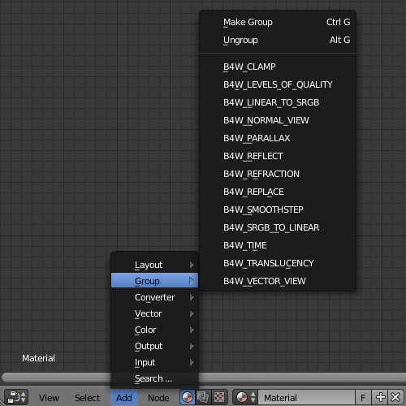
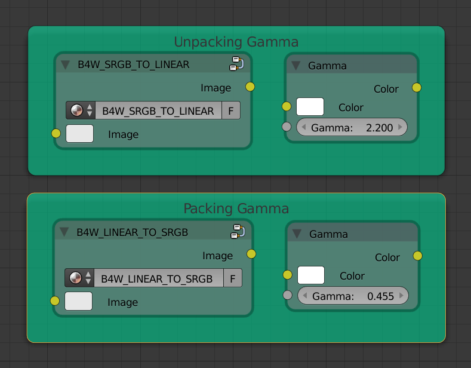
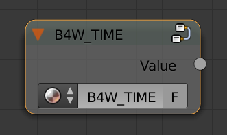
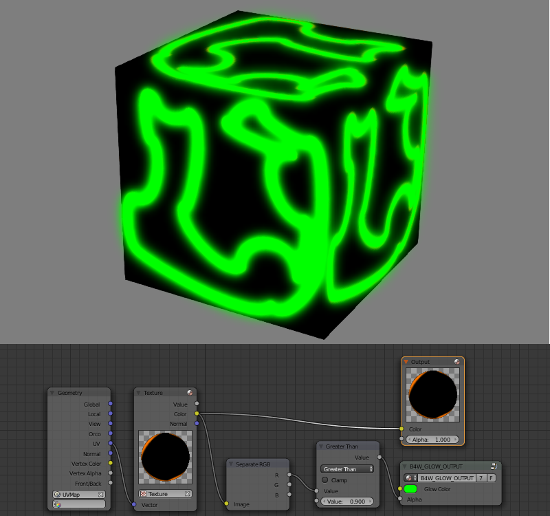

.. index:: материалы; ноды

.. _node_materials:

*****************
Нодовые материалы
*****************

Шейдерные ноды (Shader Nodes) существенно расширяют возможности стандартных материалов Blender, позволяя представить освещение как серию базовых преобразований.

.. image:: src_images/node_materials/node_example.jpg
   :align: center
   :width: 100%

.. _generic_node_materials:

Стандартные ноды
================

.. index:: материалы; ноды

Полностью поддерживаются все возможности Blender, за исключением следующих случаев:

* ``Geometry`` - не поддерживается выход ``Vertex Alpha``.
* ``Lamp data`` - не поддерживается выход ``Shadow``.
* ``Material``, ``Extended Material`` - допускается не больше одной ноды на материал,
  не поддерживаются входы ``Refl``, ``Ambient``, ``SpecTra`` и выход ``AO``.
* ``RGB Curves``, ``Vector Curves``, ``ColorRamp`` и Cycles-ноды поддерживаются ограниченно.

Кроме того, в контексте рендеринга в реальном времени, следует учитывать низкую производительность некоторых нод. Не рекомендуется к использованию:

* ``Hue/Saturation``
* ``MixRGB`` типы ``Burn``, ``Dodge``, ``Value``, ``Saturation``, ``Hue``, ``Color``

Не рекомендуется создавать сложные материалы, особенно использующие большое
количество нод ``Geometry`` и ``Texture``.

.. _custom_node_materials:

Дополнительные ноды
===================

.. index:: материалы; ноды

Дополнительные ноды расширяют функционал стандартных с учётом специфики работы движка. Ноды оформляются в виде нодовых групп (``Node groups`` или ``Node tree``) со специально выбранным именем и форматом входов. Для удобства, все дополнительные ноды добавляются в blend-файл при его открытии.

.. _node_gamma:

B4W_LINEAR_TO_SRGB и B4W_SRGB_TO_LINEAR
---------------------------------------

Преобразование цвета из линейного цветового пространства в пространство sRGB и наоборот. Функционал объявлен устаревшим с версии 15.04 - вместо этих нод должна использоваться нативная нода Gamma. 

.. seealso:: :ref:`gamma_node_materials`

B4W_REPLACE
-----------

Осуществляет замену входов в зависимости от того, в какой среде (viewport Blender'а или движок) в данный момент работает текущая сцена. При работе в Blender вход ``Color1`` подключается к выходу ``Color``, вход ``Color2`` игнорируется. При работе в движке входы меняются местами (``Color1`` игнорируется, ``Color2`` подключается к выходу). Нода предназначена для отображения во viewport'e одной конструкции нодов, а в движке - другой. 

.. image:: src_images/node_materials/replace.jpg
   :align: center
   :width: 100%

|

Используется, как правило, для подключения карт нормалей. Нодовые материалы Blender'а не поддерживают тангентное пространство координат, в связи с чем единственный способ корректного отображения карт нормалей во viewport'e - их подключение внутри нод Material. 

B4W_CLAMP
---------

Осуществить операцию ограничения над входом. В результате, все элементы вектора на выходе
получают значения от 0 до 1 включительно.

.. _node_time:

B4W_TIME
--------

Осуществляет отсчет времени с момента старта движка в секундах. Может использоваться для анимации любых параметров в нодовых материалах - UV координат, факторов смешивания, прозрачности и т.п.

|

.. seealso:: :ref:`node_anim`

B4W_VECTOR_VIEW
---------------

Осуществить преобразование вектора в пространство камеры. Преобразование необходимо, поскольку при работе в движке большинство векторов определены в мировой системе координат (например нормали, направления источников освещения и т.д). Преобразованный таким образом вектор нормали используется только для различных эффектов и не должен подключаться к входу ноды ``Material`` или ``Extended Material``.

B4W_PARALLAX
------------

Реализует смещение текстурных координат в соответствии с картой высот.

Входные параметры
.................

*UV*
   Исходные текстурные координаты.

*Height Map*
   RGBA текстура с картой высот в альфа канале.

*Scale*
   Коэффициент смещения текстурных координат.

*Steps*
   Количество шагов при генерации смещенных текстурных координат. Чем больше данное значение, тем выше качество получаемой текстуры.

*Lod Distance*
   Максимальное расстояние от камеры, на котором виден эффект.

Выходные параметры
..................

*UV*
   Измененные текстурные координаты, которые используются как вход для текстурных нод.

B4W_TRANSLUCENCY
----------------

Реализует эффект полупрозрачности (только по отношению к источникам света) для тонких объектов, таких как ткань, листва, бумага и др. Эффект состоит из двух частей: засвечивание обратной по отношению к источнику стороны объекта и появление светового пятна непосредственно в том месте, где должен был находится источник.

Входные параметры
.................

*Color*
    Одноканальная текстура, определяющая неоднородность материала, белый - максимальный эффект просвечивания, черный - его отсутствие. По умолчанию используется белый.
*Backside Factor*
    Коэффицент коррекции цвета материала на обратной от источника света стороне. Основан на визуальном эффекте большей насыщенности цвета при просвечивании.

    * *Backside Factor < 1* - коррекция в сторону осветления
    * *Backside Factor = 1* - без коррекции
    * *Backside Factor > 1* - коррекция в сторону затемнения

    Значение по умолчанию: 1.
*Spot Hardness*
    Коэффициент размытия светового пятна. При увеличении размеры пятна уменьшаются, края становятся более резкими.
    Значение по умолчанию: 1000.
*Spot Intensity*
    Интенсивность светового пятна. При увеличении становится более ярким.
    Значение по умолчанию: 1.
*Spot Diffuse Factor*
    Коэффициент влияния диффузного цвета материала на цвет светового пятна. 

    * *Spot Diffuse Factor = 0* - световое пятно имеет диффузный цвет
    * *Spot Diffuse Factor = 1* - световое пятно имеет белый цвет

    Значение по умолчанию: 1.

Выходные параметры
..................

*Translucency*
	Выход должен быть подключен ко входу ``Translucency`` ноды ``Extended Material``.

.. note::

  Возможно некорректное поведение ноды, если используются :ref:`отредактированные нормали <normals_editor>`.

B4W_REFRACTION
--------------

Реализует эффект преломления.

Входные параметры
.................

*Normal*
    Карта нормалей, по которой происходит возмущение (сдвиг).
*Refraction bump*
    Коэффицент возмущения (сдвига) текстуры сцены позади объекта.

    Значение по умолчанию: 0.001.

Выходные параметры
..................

*Color*
    Текстура сцены позади объекта с внесённым возмущением.

.. note::

    Для отображения эффекта необходимо включить опцию ``Render refraction`` на панели ``Scene > Blend4Web``. Объект должен быть с типом прозрачности Alpha Blend.
.. seealso:: :ref:`alpha_blend`

B4W_LEVELS_OF_QUALITY
---------------------

Устанавливает значение выходного цвета в зависимости от установленного профиля качества изображения.

.. seealso:: :ref:`quality_settings`

Входные параметры
.................

*HIGH*
    Значение, которое будет подано в выходной параметр ``Color`` при высоком и максимальном качестве изображения.
*LOW*
    Значение, которое будет подано в выходной параметр ``Color`` при низком качестве изображения.

Выходные параметры
..................

*Color*
    Значение выходного цвета.

.. note::

    Для отображения во вьюпорте Blender'а используется входной параметр ``HIGH``.

B4W_SMOOTHSTEP
--------------

Осуществить мягкую интерполяцию двух значений, исходя из первого значения.

Входные параметры
.................

*Value*
    Значение, на основе которого осуществляется интерполяция.
*Edge0*
    Первое значениe для интерполяции.
*Edge1*
    Второе значениe для интерполяции.

Выходные параметры
..................

*Value*
    Сглаженное значение.

.. note::
    Для корректной интерполяции входное значение ''Value'' должно лежать в диапазоне между ''Edge0'' и ''Edge1''.
    

.. _glow_output:

B4W_GLOW_OUTPUT
---------------

Применяет :ref:`эффект свечения (Glow) <glow>` к нодовому материалу. Помимо ноды *B4W_GLOW_OUTPUT* в нодовом материале должна присутствовать нода *Output*.

Входные параметры
.................

*Glow Color*
    Цвет свечения.
*Factor*
    Степень свечения. *Factor* :math:`\in [0, 1]`.

    * *Factor = 0* - свечение отсутствует. 
    * *Factor* :math:`\in (0, 1]` - свечение цветом *Glow Color*.

