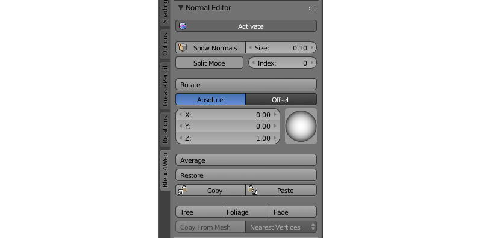

.. _normals_editor:

.. index:: normals, normals; editor

*************
Normal Editor
*************

.. contents:: Table of Contents
    :depth: 2
    :backlinks: entry

Editing the selected normals is a pretty easy and effective way to customize 3d model shading without complicating its geometry.

In some cases, using the normal editor you may achieve the effect which is similar to the result of using :ref:`normal maps <normal_map>`. At the same  time, editing normals is preferred because it is more computationally effective and consumes less video memory.

Normal editor workflow example:

    .. image:: src_images/normal_editor/normal_editor_example.png
       :align: center
       :width: 100%

Simple geometry shading is to the left, a tree with edited normals is to the right.

    .. image:: src_images/normal_editor/simple_geometry.png
       :align: center
       :width: 100%

To the left - gates with common shading; at the center - gates with edited normals; to the right - gates geometry with a wireframe.

    .. image:: src_images/normal_editor/grass.png
       :align: center
       :width: 100%

To the left - common grass geometry shading; to the right - grass with edited normals.

    .. image:: src_images/normal_editor/glasses.png
       :align: center
       :width: 100%

To the left - glasses with common shading; to the right - geometry with edited normals shading.

Main Features of the Normal Editor
==================================

#. native Blender storage is used as a container for edited vertices normals directions (it appeared in Blender 2.74);
#. normals editing and shading visualization are processed in ``Edit Mode`` now;
#. all changes are being saved automatically;
#. selected vertex normal rotation can be performed directly in the Viewport window with ``Shift+Ctrl+R`` hotkey, similarly to other rotation operations in Blender;
#. edited normals are being exported automatically.

Interface
=========

The interface of the normal editor is located on the tools panel ``Blend4Web > Normal Editor``. The ``Shading: Smooth`` mode should be enabled and ``Activate`` button should be pressed or ``Auto Smooth`` flag should be enabled in the mesh settings, before starting to work with the editor.

Activate
========

The ``Activate`` button turns on vertex normal editing mode.

You can just press ``Activate`` button while in ``Edit Mode`` and start editing vertex normals. As it is active, object shading and its export would be processed taking edited vertex normals into account. In other words, after making some changes, this button should be left active if you want to see the changes in the Blender Viewport and in the Blend4Web engine.

Show Normals
============

This button actually duplicates the original Blender's button. It turns on displaying the normals in the viewport, while the Size field allows you to set their length.

You just need to push the Show Normals button either on the normal editor panel or on the Blender's right panel in the Mesh Display section. You can also set the convenient length of normals by tweaking the Size.

.. only:: latex

    .. image:: src_images/normal_editor/show_normals.png
       :align: center
       :width: 100%

.. only:: html

    .. image:: src_images/normal_editor/show_normals.gif
       :align: center
       :width: 100%

Rotate
======

Using these instruments you can change direction of the normals. The ``Rotate`` function is also available through the ``Shift+Ctrl+R`` hotkeys, which allows rotation of vertex normals similarly to Blender.

.. only:: latex

    .. image:: src_images/normal_editor/rotation.png
       :align: center
       :width: 100%

.. only:: html

    .. image:: src_images/normal_editor/rotate.gif
       :align: center
       :width: 100%

Select one or more vertices that you want to edit and then rotate their normals using the visual sphere or specify the direction as numerical values.

The ``Rotate`` button provides a more convenient way to manipulate normals. The rotation is performed in the screen space. Nevertheless, as with any other rotations in Blender, you can isolate the desired axis during rotation (by typing ``X``, ``Y`` or ``Z``) and type the angle of rotation using numerical keys.

Scale
=====

This function can be used to change the scale of the normals and is available both from the Tool panel and by pressing the ``Shift + Ctrl + S`` hot keys. The length of a normal can be set with numeric keys, while ``X``, ``Y`` and ``Z`` keys are used to set the coordinate axis along which the normal is scaled.

.. note::

    Keep in mind that the visible length of any normal never changes and is always defined by the ``Size`` parameter.

Absolute and Offset Modes
=========================

Normal Editor can operate in two different modes: Absolute mode and Offset mode. The currently selected mode can be switched by pressing one of the two buttons placed under the ``Rotate`` button that has been described above. By default, ``Absolute`` mode is used.

Absolute Mode
-------------

.. image:: src_images/normal_editor/normal_editor_absolute.png
   :align: center
   :width: 100%

This is the default mode of the Normal Editor. In this mode, the coordinates of a normal vector are absolute and can be set using the ``X``, ``Y`` and ``Z`` fields or the visual sphere that is situated alongside of them.

Offset Mode
-----------

.. image:: src_images/normal_editor/normal_editor_offset.png
   :align: center
   :width: 100%

In this mode, a user-defined value is added to the normal vector.

The ``X``, ``Y`` and ``Z`` fields can be used for setting the corresponding components of the vector, while the ``Sub`` and ``Add`` buttons define whether the vector should be subtracted from the normal vector or added to it.

Split Normals
=============

The ``Split Normals`` mode allows to edit vertex normals separately for each ``face`` that form the ``vertex``. Index allows you to navigate between the split normals.

.. only:: latex

    .. image:: src_images/normal_editor/split_normals.png
       :align: center
       :width: 100%

.. only:: html

    .. image:: src_images/normal_editor/split_normals.gif
       :align: center
       :width: 100%

Turn on the ``Split Normals`` mode, select the vertex and change the direction of its normals. Firstly, the normal which has the zero index in the queue will be modified. Then, by switching between indexes you can go to the next normal of this vertex and edit it, then to the next and so on.

Average
=======

The ``Average`` button averages the direction of the vertex normals which was modified.

.. only:: latex

    .. image:: src_images/normal_editor/average_split.png
       :align: center
       :width: 100%

.. only:: html

    .. image:: src_images/normal_editor/average.gif
       :align: center
       :width: 100%

To combine several split vertex normals into one, in order to obtain the average direction of these normals, you just need to select the desired vertex and press the ``Average Split`` button.

Restore
=======

The ``Restore`` button restores the original direction of normals for the selected vertices.

.. only:: latex

    .. image:: src_images/normal_editor/restore.png
       :align: center
       :width: 100%

.. only:: html

    .. image:: src_images/normal_editor/restore.gif
       :align: center
       :width: 100%

In order to restore the normal's direction to its original (which is calculated on the basis of face normals), you need to select the desired vertices and click the Restore button.

3D Cursor, Axis and Face
========================

The ``3D Cursor`` button directs the normals of the selected vertices away from the 3D cursor or toward it (if the ``Towards`` parameter in the ``Vertex Normal Cursor`` panel is enabled). The ``Axis`` button directs the normals of the vertices along a coordinate axis (the axis can be selected in the same ``Vertex Normal Cursor`` panel). The ``Face`` button directs the normals of the selected face parallel to the normal of this face.

.. only:: latex

    .. image:: src_images/normal_editor/tree_foliage_face_01.png
       :align: center
       :width: 100%

    .. image:: src_images/normal_editor/tree_foliage_face_02.png
       :align: center
       :width: 100%

    .. image:: src_images/normal_editor/tree_foliage_face_03.png
       :align: center
       :width: 100%

.. only:: html

    .. image:: src_images/normal_editor/3dcursor.gif
       :align: center
       :width: 100%

In order to use the ``3D Cursor`` function, select the desired vertices and place the 3D cursor in the desired position. Then click the ``3D Cursor`` button so all the selected vertices will turn their direction away from the cursor, as if they were shot from one point. Then you may check the ``Towards`` option in the ``Vertex Normal Cursor`` panel, which will make the normals to turn in the direction of the cursor.

The ``Axis`` function is very easy to use: just select the vertices and press the button, so the function will direct their normals along the coordinate axis set in the ``Vertex Normal Cursor`` panel (Z axis is selected by default) or away from it, if you disable the ``Towards`` parameter on the same panel.

In order to direct the normals parallel to the face normal, just select the desired face (or several faces) and click the ``Face`` button. The normals of the vertices which form the face will be directed parallel to the face normal. This function works only with one selected face at a time.

The ``3D Cursor``, ``Axis`` and ``Face`` operators also possess the ``Factor`` parameter which is used to mix the initial position of the normals with the resulting position. The default value of this parameter is 1.0 (the resulting position is used).

Copy/Paste
==========

Copies the normal direction from one vertex to another.

.. only:: latex

    .. image:: src_images/normal_editor/copy_paste.png
       :align: center
       :width: 100%

.. only:: html

    .. image:: src_images/normal_editor/copypaste.gif
       :align: center
       :width: 100%

Select the vertex you want to copy from and click the ``Copy`` button. Then, select the vertex you want to copy to and click the ``Paste`` button. You may copy information from one selected vertex to many different vertices. The buttons are not active in the ``Split Mode`` and do not copy data of split vertices.

Copy From Mesh
==============

This function allows you to copy the normals from one object to another. There are two modes: ``Matched Vertices`` and ``Nearest Vertices``.

The ``Matched Vertices`` mode copies the normals from the vertices of one object to another object's vertices only if they have the same coordinates; the other vertices are ignored. The ``Nearest Vertices`` mode copies the normals of the nearest vertices of the source object.

.. only:: latex

    .. image:: src_images/normal_editor/copy_from_mesh.png
       :align: center
       :width: 100%

.. only:: html

    .. image:: src_images/normal_editor/copy_from_mesh.gif
       :align: center
       :width: 100%

This function works in Blender's object mode. At first, you need to select the object you need to copy from, then the object you need to copy to. It is also necessary to select the target object's vertices to which normals are copied.

