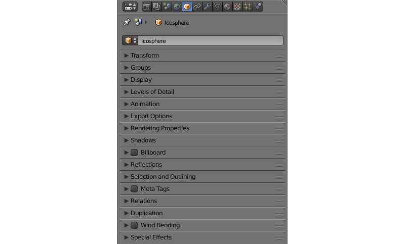
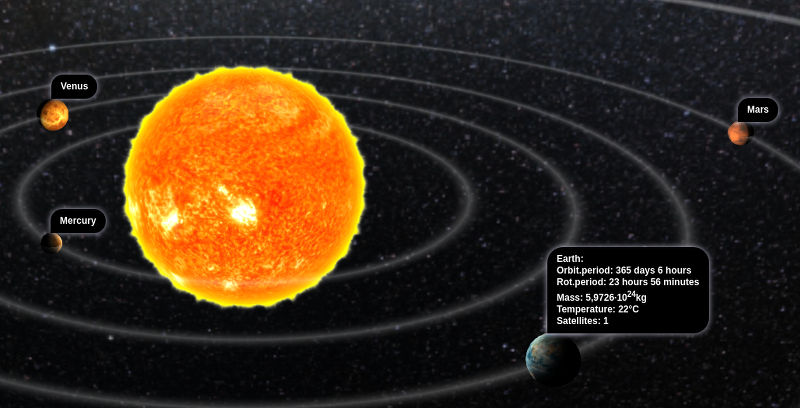

.. _objects:

*******
Objects
*******

.. contents:: Table of Contents
    :depth: 3
    :backlinks: entry

Objects are intended to position components of different types (meshes, cameras, lamps etc) in a 3D scene space.

Types
=====

The engine supports objects of the following types:

    - :ref:`meshes (mesh) <meshes>`
    - :ref:`camera <camera>`
    - :ref:`lamp <lighting>`
    - empty
    - :ref:`armature <skeletal_animation>`
    - :ref:`speaker <audio>`
    - curve
    - text
    - metaball
    - surface

During the scene export, ``CURVE``, ``TEXT``, ``METABALL`` and ``SURFACE`` type objects are converted into ``MESH`` type objects.

.. _static_dynamic_objects:

Static and Dynamic Objects
==========================

An object can be either static or dynamic.

**Static objects** are objects that cannot be moved, animated or changed in any other way while running the application. For performance purposes, such objects can be merged together if they have the same material.

**Dynamic objects** can be moved, animated or changed in other ways while running the application. They can also interact with other objects, including static ones. Dynamic objects are never combined with each other or with static objects.

Only ``MESH`` and ``EMPTY`` type objects can be either static or dynamic. All other object types, such as ``CAMERA`` and ``ARMATURE``, are always dynamic.

Static ``MESH`` objects are rendered much faster then the dynamic ones, so, for better performance, it is advised to keep the number of dynamic meshes to a minimum. Objects of any other type, both static and dynamic, do not significantly affect performance.

The objects which have animation, physics or a parent, which is a dynamic object, are considered dynamic, as well as the objects controlled by the following logic nodes:

    * ``Play Animation``
    * ``Transform Object``
    * ``Move To``
    * ``Inherit Material``

API methods that concern object movement, copying and animation (both object and node material) can only be applied to dynamic objects. In order to make the movement of the object without dynamic settings possible, it is necessary to activate ``Force Dynamic Object`` option in its settings.

.. _object_settings:

Settings
========

The following is supported for all types of objects: transform, data reference, parent object, group membership and a set of the Blend4Web’s special properties.

Object Tab
----------

|

.. _object_settings_transform:

Transform Panel
...............

.. image:: src_images/objects/object_settings_transform.png
   :align: center

*Transform > Location*
    Position coordinates.

*Transform > Rotation*
    Rotation angles. For the object rotation all available modes can be used (``Rotation Mode``). However only ``Quaternion (WXYZ)`` and ``XYZ Euler`` are supported for :ref:`object animation <whole_object_anim>`.

*Transform > Scale*
    Scaling. All 3 components (x, y, z) should be the same. Scaling for physics objects is not supported.

.. _object_settings_groups:

Groups Panel
............

*Groups*
    Objects’ groups to which this object belongs.

.. image:: src_images/objects/object_settings_groups.png
   :align: center

|

.. _object_settings_lod:

Levels of Detail Panel
......................

.. image:: src_images/objects/object_settings_lod.png
   :align: center

*Levels of Detail > Object*
    The object to use for this level of detail.

*Levels of Detail > Distance*
    The distance to begin using this level of detail.

Using levels of detail is described in the :ref:`dedicated section <lods>`.

.. _object_settings_animation:

Animation Panel
...............

*Animation > Apply Default Animation*
    Upon loading into the engine start playback of the animation assigned to the object.

*Animation > Animation Blending*
    Only for armature objects. Allows blending between skeletal animations.

*Animation > Behavior*
    Animation behavior when the last frame is reached: ``Finish Stop`` - stop, ``Finish Reset`` - stop and go to the zero frame, ``Loop`` - repeat forever.

.. _object_settings_export:

Export Options Panel
....................

.. image:: src_images/objects/object_settings_export.png
   :align: center

*Export Options > Do Not Export*
    Do not export this object.

.. _apply_modifiers:

*Export Options > Apply Modifiers*
    Apply the object’s modifiers upon export. If the ``SKIN`` modifier is used we recommend to apply it before the export because it resets vertex color and UV layers which may result in errors.

*Export Options > Apply Scale and Modifiers*
    Upon export, apply scale and modifiers for the object.

*Export Options > Export Vertex Animation*
    Export previously created and saved vertex animation. Applicable for ``MESH`` type objects only.

*Export Options > Export Shape Keys*
    Export shape keys. Applicable to ``MESH`` type objects only.

.. note::

    The following properties are mutually exclusive: *Apply Modifiers*, *Apply Scale and Modifiers*, *Export Vertex Animation* and *Export Shape Keys*.

.. _object_settings_render:

Rendering Properties Panel
..........................

*Rendering Properties > Hidden*
    An object with this property enabled will be hidden on load.

*Rendering Properties > Hidden Children*
    All of the object's children and children's children and so on will be hidden on load. Available only if the ``Rendering Properties > Hidden`` property is enabled and if the object has any children.

*Rendering Properties > Do Not Render*
    Disable object rendering (for example useful for a physics object).

    This parameter is not available for ``Empty`` type objects.

*Rendering Properties > Disable Frustum Culling*
    Disable frustum culling optimization.

    This parameter is not available for ``Empty`` type objects.

*Rendering Properties > Force Dynamic Object*
    Force the object to become a :ref:`dynamic object <static_dynamic_objects>`.

.. _dynamic_geom:

*Rendering Properties > Dynamic Geometry & Materials*
    Allows using geometry update API and inherit materials for the object.

*Rendering Properties > Line Rendering*
    Enables using the object for rendering :ref:`lines <line_rendering>`.

    This parameter is only available for ``Empty`` type objects.

.. _object_settings_shadows:

Shadows Panel
.............

.. image:: src_images/objects/object_settings_shadows.png
   :align: center

*Shadows > Cast*
    The object will cast shadows.

*Shadows> Cast Only*
    The object will cast shadows but will remain invisible itself. Becomes available after enabling ``Shadows > Cast``.

*Shadows > Receive*
    The object will receive shadows from other adjacent objects.

.. _objects_billboarding_properties:

Billboard Panel
...............

*Billboard*
    Use the object as a billboard (i.e. automatically orient relative to the camera).

.. _billboarding_preserve:

*Billboard > Preserve Global Orientation and Scale*
    Take into account rotation and scale of the billboard object (in the world space). The object will be directed toward the camera with its side which is visible when viewing along the Y axis in Blender. Becomes available after enabling the ``Billboard`` checkbox.

*Billboard > Billboard Type*
    Billboard orientation mode. ``Spherical`` (by default) - the object is always oriented with one side toward the camera, regardless of view angle, ``Cylindrical`` - similar to ``Spherical``, but rotation is limited to Blender’s world Z axis. Becomes available after enabling Billboard

.. _object_settings_reflections:

Reflections Panel
.................

.. image:: src_images/objects/object_settings_reflections.png
   :align: center

*Reflections > Reflexible*
    When enabled the object is reflected in the dynamic mirror surfaces.

*Reflections > Reflexible Only*
    The object will be reflected but will remain invisible itself. Becomes available after enabling ``Reflections > Reflexible``.

    .. note::
        If the ``Reflexible Only`` parameter is enabled simultaneously with the ``Shadows > Cast Only`` parameter, the engine will not render the object itself, but will render its shadow and reflection, like it is shown on the picture below.

        .. image:: src_images/objects/objects_cast_reflexible_only.png
           :align: center
           :width: 100%

*Reflections > Reflective*
    When enabled the object surface reflects other objects.

*Reflections > Reflection Plane*
    Text field for name of an empty object which defines the reflection plane. Becomes available after enabling ``Reflections > Reflective``.

.. _object_settings_selection:

Selection and Outlining Panel
.............................

.. image:: src_images/objects/object_settings_selection.png
   :align: center

*Selection and Outlining > Selectable*
    Enable :ref:`object selection <mesh_selection>` with the mouse or another input device.

*Selection and Outlining > Enable Outlining*
    Enable :ref:`outline glow <outline>` for the object.

.. _object_settings_anchors:

Anchors Panel
.............

*Anchors > Enable Anchor*
    This parameter enables interface for adding anchors (2D tags) to objects. Available for ``EMPTY`` objects only. Described in the :ref:`corresponding section <objects_anchors>`.

    .. image:: src_images/objects/objects_enable_anchors.png
        :align: center
        :width: 100%

.. _objects_meta_tags:

Meta Tags Panel
...............

.. image:: src_images/objects/object_settings_meta_tags.png
   :align: center

*Meta Tags*
    Interface for adding meta tags to the object:

    *Meta Tags > Title*
        Object's title.

    *Meta Tags > Category*
        Object's category.

    *Meta Tags > Description*
        Description for the object. Depending on ``Description Source``, this field accepts either description text itself, or the name of a file where this description is contained.

    *Meta Tags > Description Source*
        Source type for the description: text or text file.

.. _object_settings_relations:

Relations Panel
...............

*Relations > Parent*
    Reference to the parent object.

    If the parent object is a camera, ``Viewport Alignment`` settings are available.

    .. image:: src_images/objects/objects_viewport_alignment.png
       :align: center
       :width: 100%

    |

    These settings can be used to align the object to an active camera. They are described in the :ref:`Camera chapter <camera_viewport_alignment>`.

.. _object_settings_wind:

Wind Bending Panel
..................

.. image:: src_images/objects/object_settings_wind.png
   :align: center

*Wind Bending*
    Enables wind bending procedural animation. Thoroughly described at the :ref:`outdoor rendering <wind_bending>` page.

.. _object_settings_fx:

Special Effects Panel
.....................

.. image:: src_images/objects/object_settings_fx.png
   :align: center

*Special Effects > Disable Fogging*
    Disable fog for the object.

*Special Effects > Caustics*
    The object will render caustics effects from the adjacent water.

Physics Tab
-----------

.. image:: src_images/objects/object_setup_phys.png
   :align: center
   :width: 100%

|

*Detect Collisions*
    Activate the object’s physics.

*Floating*
    Make the object floating. The settings for floating objects are described in detail in the :ref:`physics <physics>` section.

*Vehicle*
    Use the object as part of a vehicle. The vehicle settings are described in detail in the :ref:`physics <physics>` section.

*Character*
    Use the object for character physics. The character settings are described in detail in the :ref:`physics <physics>` section.

.. _objects_constraints:

Object Constraints
==================

Blend4Web engine supports the following object constraints:

* ``Copy Location``,

* ``Copy Rotation``,

* ``Copy Transforms`` and

* ``Track To``.

.. note::

    When object constraints are used in Blend4Web, the ``Space`` parameter is not taken into account (it is always set to ``World Space``).

These constraints can be set up directly in Blender. Other types of constraints are not currently supported, but some API methods from the :b4wmod:`constraints` module act similarly. This include:

* the ``Copy Location`` constraint can be emulated with the :b4wref:`constraints.append_copy_loc()`

* the ``Copy Rotation`` constraint works similarly to the :b4wref:`constraints.append_copy_rot()` method.

* the ``Copy Transforms`` constraint works similarly to the :b4wref:`constraints.append_copy_trans()` method.

* The ``Limit Distance`` constraint can be emulated with the :b4wref:`constraints.append_follow()` method, though it should be noted that this method does not set a precise distance between objects (instead, it set a minimum and maximum possible distances).

* the ``Track To`` constraint can be replaced with the :b4wref:`constraints.append_track()` method.

Other constraints do not have distinctive counterparts in the API, although their behavior can be to certain extent imitated using API methods.

.. _objects_anchors:

Anchor Settings
===============

Anchors can be used to attach annotations to 3D objects. The annotation is displayed near the object regardless of the camera position and even follows it throughout the animation.

Annotations can be created entirely in Blender. All you need to do is to place an ``Empty`` object in the required position and enable the ``Anchor`` property. The text for the annotations can be assigned in the ``Title`` and ``Description`` fields on the ``Meta Tags`` panel.

*Enable Anchor*
    This parameter enables the interface for adding anchors (2D tags) to objects. This is available for ``EMPTY`` objects only.

*Type*
    Anchor type

    * ``Annotation`` - content is obtained from the :ref:`meta tags <objects_meta_tags>` assigned to the object and displayed in the standard section.

    * ``Custom Element`` - an arbitrary HTML element from the current web page is used as an anchor.

    * ``Generic`` - an anchor’s position can be detected using the ``anchors`` API module.

    Default value is ``Annotation``.

*HTML Element ID*
    This specifies the ID of the HTML element that will be used as the anchor. This is available only if the ``Type`` parameter is set to ``Custom Element``.

*Detect Visibility*
    Detect whether the anchor object is overlapped by other objects. This is disabled by default. Turning this option on decreases performance and should be used only when necessary.

*Max Width*
    This parameter limits the expanding info window by a predefined value (measured in CSS pixels). This is available only if the ``Type`` parameter is set to ``Annotation``, and it is set to 250 by default.

.. index:: Object Transform API

Object Transform API
====================

.. note::

    Make sure that the object you are trying to transform is a :ref:`dynamic object <static_dynamic_objects>`.

Use the following methods of the :b4wmod:`transform` module to move objects in the engine:

:b4wref:`transform.get_translation()`
    Get the coordinates of the object’s center in world space. The method with a single argument returns a new vector (i.e. this is a non-optimized option) while the method with two arguments requires an additional vector to write the result down.

:b4wref:`transform.get_translation_rel()`
    Similar to the ``get_translation()`` method, but if this object has a parent, the obtained coordinates are measured in the parent’s space.

:b4wref:`transform.set_translation()`, :b4wref:`transform.set_translation_v()`
    Move the object’s center into the specified location. The first method takes separate coordinates as arguments while the second one takes a three-component vector (``Array`` or ``Float32Array``).

:b4wref:`transform.set_translation_rel()`, :b4wref:`transform.set_translation_rel_v()`
    Similar to ``set_translation()`` and ``set_translation_v()``, but if this object has a parent, the set coordinates are measured in the parent’s space.

:b4wref:`transform.get_rotation()`
    Get the object’s rotation quaternion in world space. Similar to ``get_translation()``, there are two options for calling this function.

:b4wref:`transform.get_rotation_rel()`
    Get the object’s rotation quaternion measured in its parent’s space. Similar to ``get_translation_rel()``, there are two options for calling this function.

:b4wref:`transform.set_rotation()`, :b4wref:`transform.set_rotation_v()`
    Set the object’s rotation quaternion in world space. The first function takes separate coordinates as arguments while the second one takes a four-component vector (``Array`` or ``Float32Array``).

:b4wref:`transform.set_rotation_rel()`, :b4wref:`transform.set_rotation_rel_v()`
    Set the object’s rotation quaternion measured in its parent’s space. The first function takes separate coordinates as arguments while the second one takes a four-component vector (``Array`` or ``Float32Array``).

:b4wref:`transform.get_scale()`
    Get the object’s scale in world space.

:b4wref:`transform.get_scale_rel()`
    Get the object’s scale in its parent’s space.

:b4wref:`transform.set_scale()`
    Set the object’s scale in world space. Unity corresponds to the original scale of the object. Values less than unity mean scaling down, bigger than unity - scaling up. Note that not all objects can be scaled. Particularly, scaling is not allowed for physics objects.

:b4wref:`transform.set_scale_rel()`
    Set the object’s scale in its parent’s space.

:b4wref:`transform.set_rotation_euler()`, :b4wref:`transform.set_rotation_euler_v()`
    Set the object’s rotation using Euler angles. An **intrinsic** YZX rotation system is used (that means the angles follow in the YZX order and the origin of coordinates rotates and takes up a new position for every angle).

:b4wref:`transform.set_rotation_euler_rel()`, :b4wref:`transform.set_rotation_euler_rel_v()`
    Set the object’s rotation using Euler angles measured in its parent’s space.

:b4wref:`transform.move_local()`
    Move the object relative to its original position (in local space).

:b4wref:`transform.rotate_x_local()`, :b4wref:`transform.rotate_y_local()`, :b4wref:`transform.rotate_z_local()`
    Rotate the object relative to its original position (in local space).

.. index:: get object

.. _get_object_api:

Get Object API
==============

To perform any operation with an object, you first need to get it (i.e. receive the link to it). There are several API functions for doing this. A link to an object has ``Object3D`` type.

:b4wref:`scenes.get_object_by_name()`
    Get object by name.

    .. code-block:: javascript

        // ...
        var obj = m_scenes.get_object_by_name("Object");
        // ...

:b4wref:`scenes.get_object_by_dupli_name()`
    Get the duplicated object by empty name and dupli name.

    .. code-block:: javascript

        // ...
        var obj = m_scenes.get_object_by_dupli_name("Empty", "Object");
        // ...

:b4wref:`scenes.get_object_by_dupli_name_list()`
    Get the duplicated object by empty name and dupli name list (an array of ``String`` type elements).

    .. code-block:: javascript

        // ...
        var obj = m_scenes.get_object_by_dupli_name_list(["Empty1", "Empty2", "Object"]);
        // ...

:b4wref:`scenes.get_object_name_hierarchy()`
    Returns the object names hierarchy array (from the highest parent to the object itself) for a given object.

    .. code-block:: javascript

        // ...
        var names = m_scenes.get_object_name_hierarchy(obj);
        // ...

:b4wref:`scenes.check_object_by_name()`
    Check if object with given name is present on scene.

    .. code-block:: javascript

        // ...
        var object_exists = m_scenes.check_object_by_name("Cube");
        // ...

:b4wref:`scenes.check_object_by_dupli_name()`
    Check if duplicated object is present on scene by empty name and dupli name.

    .. code-block:: javascript

        // ...
        var object_exists = m_scenes.check_object_by_dupli_name("Empty", "Cube");
        // ...

:b4wref:`scenes.check_object_by_dupli_name_list()`
    Check if duplicated object is present on scene by empty name and dupli name list (an array of ``String`` type elements).

    .. code-block:: javascript

        // ...
        var object_exists = m_scenes.check_object_by_dupli_name_list(["Empty1", "Empty2", "Object"]);
        // ...

:b4wref:`scenes.get_object_name()`
    Get the object’s name.

    .. code-block:: javascript

        // ...        
        var object_name = m_scenes.get_object_name(obj);
        // ...

.. _mesh_selection:

Object Selection
================

In order to enable selection of a certain object, it is required to enable the ``Selectable`` checkbox on the ``Selection and Outlining`` panel.

.. note::
    Make sure that the status on the ``Scene > Object Outlining`` panel is set to ``ON`` or ``AUTO``.

Object selection is possible programmatically via API, for example, in the ``scenes.js`` module there is the ``pick_object`` function which selects an object based on canvas 2D coordinates,

.. code-block:: javascript

    // ...
    var x = event.clientX;
    var y = event.clientY;

    var obj = m_scenes.pick_object(x, y);
    // ...

or using the :ref:`Logic Editor <logic_switch_select>`.

If the selectable object has enabled ``Enable Outlining`` and ``Outline on Select`` checkboxes on the ``Object > Selection`` and Outlining panel, then the ``pick_object`` function call will activate :ref:`outline glow animation <outline>`.

.. note::
    If the selected object is transparent (``Blend``, ``Add`` and ``Sort`` transparency types), outline glow will only be visible on the parts that have ``Alpha`` value higher than 0.5.

.. _mesh_copy:

Copying Objects (Instancing)
============================

It is often required to copy (to make instances of) objects during application work.

Copying objects has its limitations:
    * only ``MESH`` objects can be copied
    * the object should be :ref:`dynamic <static_dynamic_objects>` (enable ``Rendering Properties > Force Dynamic Object``)
    * the source object should belong to the active scene

Making a Simple Copy
--------------------

In case of simple copying the new object will share the mesh with the original object. Thus, if the original object’s mesh is changed, the copied object’s mesh will be changed too. To make simple copying possible, it’s enough to turn on the ``Blend4Web > Force Dynamic Object`` setting in the source object’s properties.

Making a Deep Copy
------------------

In case of deep copying, the new object will have unique properties, namely it will have its own mesh. Thus, if the original object’s mesh is changed, the copied object’s mesh will not be changed. Also, the canvas textures on the copied objects are different textures and not one and the same like it is the case with the simple copying. To make deep copying possible, it is required to enable the :ref:`Rendering Properties > Dynamic Geometry <dynamic_geom>` checkbox for the source object.
|

Copying objects in runtime can be performed with the ``copy`` method of the ``objects.js`` module. This method requires three arguments: the id of the source object, a unique name for the new object and the boolean value to specify the copy mode (i.e. simple or deep). By default, simple copying will be performed.

The newly created object should be added to the scene. This can be performed with the ``append_object`` method of the ``scenes.js`` module. The new object should be passed to it as an argument.

.. code-block:: javascript

    // ...
    var new_obj = m_objects.copy(obj, "New_name", true);
    m_scenes.append_object(new_obj);
    m_transform.set_translation(new_obj, 2, 0, 2);
    // ...

Removing Objects
----------------
To remove objects, use the ``remove_object`` method of the ``scenes.js`` module. Pass the object to it as an argument. Dynamic mesh- and empty-type objects can be removed this way.

.. code-block:: javascript

    // ...
    m_objects.remove_object(new_obj);
    // ...

.. index:: quaternion

Quaternions
===========

Quaternion is a four-component vector used to perform rotating. Quaternions have a number of advantages over other rotation methods such as:

    - A quaternion has no ambiguity and doesn’t depend on the rotation order as the Euler angles.
    - Quaternion’s memory usage is more effective (2-4 times less depending on the matrix used).
    - Better computing efficiency than for matrices in case of a series of rotations.
    - Numeric stability - compensation for multiplication errors arising from float number inaccuracy.
    - Convenient interpolation method.

Quaternions have some drawbacks:
    - Rotating a vector with a quaternion is more computationally expensive than rotating with a matrix.
    - It is difficult to use quaternions for non-rotation transformations (such as perspective or orthogonal projection).

The engine has a number of functions to make it more convenient to work with quaternions:

*quat.multiply*
    Quaternion multiplication. Note that left-multiplying A quaternion by B quaternion A*B is a rotation by A. I.e. the object already has some rotation B which we supplement with a new rotation by A.

*quat.setAxisAngle*
    A quaternion is an alternative presentation of rotation by an arbitrary angle relative to the arbitrary axis (vector). Positive direction of rotation is defined as anticlockwise when viewing from the vector’s end. For example the :code`quat.setAxisAngle([1, 0, 0], Math.PI/2, quat)` call forms a quaternion which can be used for rotating the object by 90 degrees (anticlockwise if viewing from the X axis’ end) relative to the X axis.

*quat.slerp*
    Spherical interpolation of quaternions. Used for smoothing the object’s rotation and animation.

*util.euler_to_quat, util.quat_to_euler*.
    Conversion from Euler angles and back.

Quaternion Example
------------------

We need to rotate the object by 60 degrees in a horizontal plane to the right. We have a model named “Cessna” in Blender.

.. image:: src_images/objects/objects_aircraft.png
   :align: center
   :width: 100%

|

Let's save a reference to the object in the **aircraft** variable:

.. code-block:: javascript

    var aircraft = m_scenes.get_object_by_name("Cessna");

Let's rotate it:

    * A clockwise rotation corresponds to the rotation to the right (i.e. in the negative direction).
    * 60 degrees = :math:`\pi/3` radians.

As a result we get:

.. code-block:: javascript

    // compose quaternion
    var quat_60_Z_neg = m_quat.setAxisAngle([0, 0, 1], -Math.PI/3, m_quat.create());

    // get old rotation
    var quat_old = m_transform.get_rotation(aircraft);

    // left multiply: quat60_Z_neg * quat_old
    var quat_new = m_quat.multiply(quat_60_Z_neg, quat_old, m_quat.create());

    // set new rotation
    m_transform.set_rotation_v(aircraft, quat_new);

The optimized version which does not create new objects:

.. code-block:: javascript

    // cache arrays as global vars
    var AXIS_Z = new Float32Array([0, 0, 1])
    var quat_tmp = new Float32Array(4);
    var quat_tmp2 = new Float32Array(4);
    ...
    // rotate
    m_quat.setAxisAngle(AXIS_Z, -Math.PI/3, quat_tmp);
    m_transform.get_rotation(aircraft, quat_tmp2);
    m_quat.multiply(quat_tmp, quat_tmp2, quat_tmp);
    m_transform.set_rotation_v(aircraft, quat_tmp);

Moving via TSR Vectors
======================

It is sometimes convenient to move objects using vectors of the following format:

    :math:`[T_x, T_y, T_z, S, R_x, R_y, R_z, R_w]`

Here :math:`T_x, T_y, T_z` - the components of the translation vector, :math:`S` - scale factor, :math:`R_x, R_y, R_z, R_w` - the components of the quaternion vector. Hence the name of this vector: TSR or TSR-8.

This vector can be operated via `tsr` module, as well as via `set_tsr()`/`get_tsr()` methods of the `transform` module.

.. _line_rendering:

Line Rendering
==============

Blend4Web engine also features an option to render lines defined by sets of points.

.. image:: src_images/objects/objects_line_rendering.png
   :align: center
   :width: 100%

API methods used for line rendering itself are located in the :b4wmod:`geometry` module, while the style of a rendered line (i.e. its color and thickness) can be set with the :b4wref:`material.set_line_params()` method of the :b4wmod:`material` module.

To use line rendering, at least one ``Empty`` type object with enabled ``Line Rendering`` option needs to be present in the scene.

To render a line, you first have to :ref:`retrieve a link <get_object_api>` to an ``Empty`` object. The origin point of this object will then be used as a center of coordinates when rendering lines.

The line itself can be rendered by calling the :b4wref:`geometry.draw_line()` API method. Its first parameter is a link to an ``Empty`` object (see above), while the second one is an array of vertices that will be used for building a line. The method is also has a third, optional, parameter, that defines the rendering mode: whether the method will produce a single line or a set of lines defined by pairs of vertices (in the latter case, the total number of vertices should be even).

If an ``Empty`` object is used to render more than one line at a time, only the last one will be visible. To render multiple lines, you will need to use multiple ``Empty`` objects.

The following example shows a part of the coordinate axes object in the picture above rendered using lines:

.. code-block:: javascript

    var m_scenes    = require("scenes");
    var m_material  = require("material");
    var m_geometry  = require("geometry");
    var m_rgba      = require("rgba");
    ...

    //setting up Empty object for line rendering
    var line_1 = m_scenes.get_object_by_name("MyEmpty_1");
    
    //setting up style parameters for the lines
    m_material.set_line_params(line_1, { width: 3
                                         color: m_rgba.from_values(0, 0, 0, 1.0)
                                        });
    
    //coordinates for main axes
    var points_1 = new Float32Array([0, 0, 0, 5, 0, 0, 0, 0, 0, 0, 5, 0, 0, 0, 0, 0, 0, 5]);
    
    //drawing main axes
    m_geometry.draw_line(line_1, points_1, true);
    
This code listing produces only the main axes of the object, because listing all of its elements will make the code long and repetitive. The other elements of the object are drawn it the same way.

.. _lods:

Levels Of Detail
================

Overview
--------

LODs, or levels of detail, are versions of a single object with various amounts of detail. Levels of detail are used for the purpose of optimization, and the idea here is that if an object is far from the camera, you can render more simple version of it – for example, the one with less polygons and simpler material. This can reduce the burden on the GPU without decreasing the quality of the render, as most of the details of the original object won’t be visible from the distance.

LODs are often used in large-scale scenes with high object count. More compact scenes may not gain a major performance boost from using this feature. Video game locations such as islands, countrysides or town streets are most suitable for using LODs.

LODs can be set up directly in Blender at the ``Levels of Detail`` :ref:`panel <object_settings_lod>`.

.. image:: src_images/objects/objects_lod_list.png
    :align: center
    :width: 100%

There, you can set levels of detail and distances at which they will be used for an individual object. Each level of detail is a separate object. The main rule is obvious: the lower the level of detail is positioned in the list, the simpler the corresponding object should be.

You can make your objects simpler in different ways: by decreasing its polycount, by making the materials less complex (this is especially true for node materials) or by turning off various effect such as :ref:`shadows <shadows>`, :ref:`animations <animation>` or :ref:`Wind Bending <wind>`.

The number of levels can be set as you see fit, depending on the overall scale of the scene.

.. figure:: src_images/objects/objects_levels_compare.png
    :align: center
    :width: 100%

    *Levels of detail for trees: original object at the left, its LOD on the right*

Specifics and Differences From BGE
----------------------------------

Setting up LODs and using them in the engine has some specifics. Also, BGE mode in Blender has its own LOD system that is mostly identical to the one used in Blend4Web, but still has some differences that are mentioned below.

#. When you are applying a LOD object to some other object, the position of the LOD object will not change. So, if you want the objects to occupy the same place in the runtime, you should manually place them in the same location in Blender. This is different from BGE, where a selected LOD object is automatically moved to the center of the main object.

#. If you need to set the same LOD object for multiple different objects (for example, same-type trees, building, cars or shrubs), you should make a copy of it for every object (i.e., make as many copies as there are objects that will use this object as a LOD) and set these copies as LODs. Unlike BGE, copies are not generated automatically when you select the same LOD object for multiple base objects. To simplify creating same-type object, we recommend to put the base object and all its LODs to one group and then duplicate this group using Empty objects.

#. If the object is supposed to change its position in the runtime, you should attach its LODs to it in Blender using parent-child link so LOD object would copy its transformations.

Smooth LOD Switching
--------------------

One of the most notable shortcomings of the LOD system is the abrupt switching between levels of detail which is easy to notice and can be annoying.

The engine supports smooth transition between LODs based on alpha test.

.. figure:: src_images/objects/objects_lod_smoothing.png
    :align: center
    :width: 100%

    *Smooth transition between the original object and its LOD.*

The option used for this is called ``LOD Smooth Transitions`` and can be found on the ``Scene->Object Clustering & LOD`` :ref:`panel <scene_batching>`.

It is intended for enabling smooth LOD transition and setting object types that this transition will be applied to. It should be noted that enabling this option might significantly decrease performance (it depends on the number of LOD objects and their materials).

.. note::

    Smooth LOD transition is not always required. For example, if you instantly transport your camera to some distant object, you probably don’t want LOD switching to occur right in front of it. In cases like this, the ``lod_leap_smooth_threshold`` parameter should be used. It defines the threshold distance (in meters) that the camera can cover in one frame. If this value is exceeded, LODs are switched instantaneously. This can be used to disable smooth LOD transition when camera is teleported to a new location or simply moves very fast.

     .. code-block:: javascript

            var m_cfg = require("config");

            m_cfg.set("lod_leap_smooth_threshold", 5); // 5 meters

Hysteresis
----------

LODs are switched at certain distances from the object. These level borders are set up on the ``Levels of Detail`` panel. If the camera is moving near a border like this, it can cross it often, which results in frequent LOD switching. Under such circumstances, LOD switching becomes very apparent and thus undesirable.

This problem can be negated with the ``Max LOD Hysteresis Interval`` parameter located on the ``Scene->Object Clustering & LOD`` :ref:`panel <scene_batching>`. It sets an interval (in meters) that is used as a gap between two LOD levels.

For example, if ``Max LOD Hysteresis Interval`` is set to 4 meters while the distance between detail levels is equal to the 20 meters, one level will be turned on at the distance of 18 meters and the other, at the distance of 22 meters. Using this option eliminates frequent LOD switching, as levels of detail no longer have definite border between them. The setting is adaptive and can adjust to different LOD distances, reducing the set interval, if needed.
