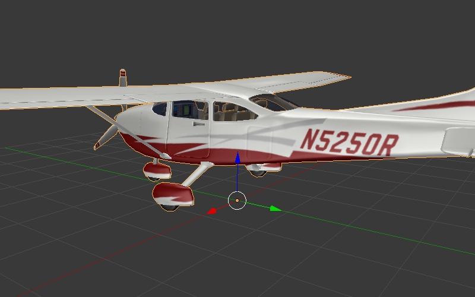
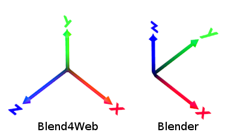

.. _objects:

*******
Объекты
*******

Объекты служат целям размещения компонентов различного типа (мешей, камер, ламп и т.д.) в пространстве 3D сцены.

Типы
====

Движком поддерживаются объекты следующих типов:

    - меш (mesh)
    - камера (camera)
    - лампа (lamp)
    - пустой (empty)
    - скелет (armature)
    - источник звука (speaker)
    - кривая (curve)
    - текст (text)
    - метасфера (metaball)
    - поверхность (surface)

.. _static_dynamic_objects:

Статические и динамические объекты
==================================

Все объекты типа ``MESH`` можно разделить на статические и динамические.

**Статические объекты** - объекты, меши которых могут быть объединены друг с другом, если они имеют одинаковый материал.

**Динамические объекты** - объекты, меши которых не могут быть скомбинированы друг с другом.

Объединение статических объектов - т.н. батчинг (batching) - осуществляется автоматически при загрузке сцены в целях оптимизации количества вызовов отрисовки. Конвертация происходит, даже если на сцене присутствует всего один объект. Центр получившегося в результате конвертации меша находится в начале координат.

Среди объектов другого типа динамическими являются ``CAMERA`` и ``ARMATURE``. Остальные - статические.

Объекты, имеющие анимацию, физику или родителя, являющегося динамическим объектом, рассматриваются как динамические.

Перемещение посредством API возможно только в случае динамических объектов. Чтобы обеспечить движение объекта, не имеющего настроек динамического объекта, в его настройках следует активировать опцию ``Force Dynamic Object``.

Настройка
=========

Для объектов всех типов поддерживаются расположение в пространстве, указатель на блок данных, родительский объект, принадлежность к группе и ряд свойств, специфичных для Blend4Web.

Вкладка Object
--------------

.. image:: src_images/objects/object_setup.png
   :align: center
   :width: 100%

|

*Transform > Location*
    Координаты местоположения.

*Transform > Rotation*
    Углы вращения. При повороте объекта доступны все режимы ``Rotation Mode``, но при создании :ref:`объектной анимации <whole_object_anim>` поддерживаются только ``Quaternion (WXYZ)`` и ``XYZ Euler``.

*Transform > Scale*
    Масштабирование. Все 3 компонента (x, y, z) должны быть одинаковы. Для физических объектов масштабирование не поддерживается.

*Relations > Parent*
    Указатель на родительский объект.

    Если в качестве родительского объекта выбрана камера, становятся доступными настройки ``Viewport Alignment``.

    .. image:: src_images/objects/objects_viewport_alignment.png
       :align: center
       :width: 100%

    Параметр ``Alignment`` определяет, с какой стороны от камеры будет находиться привязанный к ней объект (по умолчанию ``Center``). Параметр ``Distance`` задаёт расстояние объекта до камеры (по умолчанию 10). Чтобы привязанный объект отображался в Blender так же, как и в движке, нужно нажать кнопку ``Fit to Camera``.

*Groups*
    Группы объектов, которым принадлежит данный объект.

.. image:: src_images/objects/object_setup_end.png
   :align: center

|

*Levels of Detail > LOD Transition Ratio*
    Параметр для сглаживания переключения между LOD объектами. Определяет, на
    каком дополнительном расстоянии LOD объекты будут видны до замены
    последующими LOD объектами. Назначается для главного объекта. Измеряется в
    долях от радиуса охватывающей сферы объекта.

*Special Effects > Disable Fogging*
    Отключить туман для объекта.

*Special Effects > Caustics*
    На объекте будут видны эффекты от прилегающей к нему воды (каустика).

*Export Options > Do Not Export*
    Не экспортировать.

.. _apply_modifiers:

*Export Options > Apply Modifiers*
    Применить модификаторы объекта при экспорте. При наличии модификатора ``SKIN`` рекомендуется применить его перед экспортом, т.к. он сбрасывает слои вертексных цветов и UV-текстур, что может привести к ошибкам экспорта.

*Export Options > Apply Scale and Modifiers*
    Применить масштабирование и модификаторы объекта при экспорте.

*Export Options > Export Vertex Animation*
    Экспортировать предварительно созданную и сохраненную вертексную анимацию. Актуально только для объектов типа ``MESH``.

*Export Options > Export Shape Keys*
    Экспортировать ключи деформации. Актуально только для объектов типа ``MESH``.

.. note::

    Свойства *Apply Modifiers*, *Apply Scale And Modifiers*, *Export Vertex Animation*, и *Export Shape Keys* взаимоисключают друг друга.

*Animation > Apply Default Animation*
    Начать воспроизведение в движке связанной с объектом анимации.

*Animation > Animation Blending*
    Только для арматурных объектов. Разрешить плавный переход от одной скелетной
    анимации к другой.

*Animation > Behavior*
    Поведение анимации при достижении последнего кадра: ``Finish Stop`` -
    остановить, ``Finish Reset`` - остановить и сбросить в нулевой кадр,
    ``Loop`` - циклически повторять.

*Rendering Properties > Do Not Render*
    Отключить рендеринг объекта (например, вспомогательный объект физики).

*Rendering Properties > Disable Frustum Culling*
    Отключить оптимизацию отсечением по зоне видимости.

*Rendering Properties > Force Dynamic Object*
    Принудительно сделать объект :ref:`динамическим <static_dynamic_objects>`.

.. _dynamic_geom:

*Rendering Properties > Dynamic Geometry*
    Разрешить изменение геометрии объекта через API Blend4Web.

*Shadows > Cast*
    Объект будет отбрасывать тени.

*Shadows> Cast Only*
    Объект будет отбрасывать тени, при этом сам будет оставаться невидимым. Становится доступным после включения ``Shadows > Cast``.

*Shadows > Receive*
    Разрешить затенение от прилегающих объектов (получение теней) на объекте.

*Reflections > Reflexible*
    При включении объект будет отражаться от зеркальных поверхностей.

*Reflections > Reflexible Only*
    При включении объект будет отражаться, при этом сам будет оставаться невидимым. Становится доступным после включения ``Reflections > Reflexible``.

*Reflections > Reflective*
    При включении объект будет отражать своей поверхностью другие объекты.

*Reflections > Reflection Plane*
    Текстовое поле для названия пустого объекта, задающего плоскость отражения. Становится доступным после включения ``Reflections > Reflective``.

*Selection and Outlining > Selectable*
    Разрешить :ref:`выделение объекта <selection>` с помощью мыши или другого устройства ввода.

*Selection and Outlining > Enable Outlining*
    Разрешить подсвечивание объекта (:ref:`эффект Outline <outline>`).

*Meta Tags*
    Интерфейс добавления мета-тегов на объект:

    *Meta Tags > Title*
        Заголовок объекта.

    *Meta Tags > Category*
        Категория объекта.

    *Meta Tags > Description*
        Описание объекта. В зависимости от значения  опции ``Description Source`` в это поле заносится либо текст описания непосредственно, либо имя файла, в котором содержится описание.

    *Meta Tags > Description Source*
        Тип (источник) описания объекта: текст либо файл с текстом.

*Anchors > Enable Anchor*
    Опция доступна только для объектов типа ``EMPTY``. Интерфейс добавления графических меток (якорей) к объектам:

    *Anchors > Type*
        Тип якоря. Аннотация (``Annotation``) - информация из мета-тегов объектов отображается в раскрывающихся информационных окнах стандартного дизайна. Элемент (``Custom Element``) - в качестве якоря можно назначить произвольный HTML-элемент с текущей веб-страницы. Общий (``Generic``) - якорь, положение которого можно определить с помощью API модуля *anchors*.

    *Anchors > Detect Visibility*
        Определять видимость якоря, т.е. реагировать на перекрытие объекта-якоря другими объектами. Активация опции приводит к падению производельности рендеринга и должна рассматриваться только в случае реальной необходимости.

    *Anchors > Max Width*
        Используется для якорей-аннотаций. Ограничить всплывающее информационное окно аннотации выбранным значением (в CSS пикселях).

*Wind Bending*
    Включить процедурную анимацию под действием ветра. Подробно описана в разделе, посвященном :ref:`рендерингу наружных сцен <wind_bending>`.

.. _objects_billboarding_properties:

*Billboard*
    Использовать объект в качестве билборда (т.е. автоматически ориентировать его относительно камеры).

.. _billboarding_preserve:

*Billboard > Preserve Global Orientation and Scale*
    Билбординг объекта с учетом его ориентации и масштабирования в мировом пространстве. Объект всегда будет обращен к камере той стороной, которая видна при взгляде на него вдоль направления оси Y в системе координат Blender'а. Становится доступным после включения ``Billboard``.

*Billboard > Billboard Type*
    Способ ориентирования билборда. ``Spherical`` (по умолчанию) - объект всегда ориентирован к камере одной стороной независимо от угла обзора, ``Cylindrical`` - аналогично ``Spherical``, только вращение ограничено осью Z мирового пространства в Blender. Становится доступным после включения ``Billboard``.

Вкладка Physics
---------------

.. image:: src_images/objects/object_setup_phys.png
   :align: center
   :width: 100%

|

*Detect Collisions*
    Активировать связанную с объектом физику.

*Floating*
    Сделать объект плавучим. Подробное описание настроек плавучих объектов можно
    найти в разделе :ref:`физика <physics>`.

*Vehicle*
    Активировать использование объекта в качестве составной части транспортного
    средства. Подробное описание настроек транспортных средств можно найти в
    разделе :ref:`физика <physics>`.

*Character*
    Активировать использование объекта в качестве физического каркаса игрового
    персонажа. Подробное описание настроек персонажа можно найти в разделе
    :ref:`физика <physics>`.

.. index:: Управление перемещением объектов

Управление перемещением объектов
================================

.. note::

    Необходимо обеспечить, чтобы объект, над которым выполняется преобразование, был :ref:`динамическим <static_dynamic_objects>`.

Для управления перемещением объектов в движке предусмотрены следующие базовые функции модуля :b4wmod:`transform`:

:b4wref:`transform.get_translation()`
    Получить координаты центра объекта в мировой системе коориднат. Вариант с одним параметром возвращает новый вектор (неоптимизированный вариант), вариант с двумя требует отдельного вектора для записи результата.

:b4wref:`transform.get_translation_rel()`
    Аналогично методу ``get_translation()``, однако если у данного объекта имеется родительский объект, координаты берутся в относительной системе координат, связанной с этим родительским объектом.

:b4wref:`transform.set_translation()`, :b4wref:`transform.set_translation_v()`
    Переместить центр объекта в указанное место. Первая функция принимает в качестве параметров отдельные координаты, вторая - трёхмерный вектор (``Array`` или ``Float32Array``).

:b4wref:`transform.set_translation_rel()`, :b4wref:`transform.set_translation_rel_v()`
    Аналогично методам ``set_translation()`` и ``set_translation_v()``, однако если у данного объекта имеется родительский объект, координаты задаются в относительной системе координат, связанной с этим родительским объектом.

:b4wref:`transform.get_rotation()`
    Получить кватернион поворота объекта в мировой системе координат. По аналогии с ``get_translation()`` имеется два варианта вызова функции.

:b4wref:`transform.get_rotation_rel()`
    Получить кватернион поворота объекта в системе координат, связанной с родительским объектом. По аналогии с ``get_translation_rel()`` имеется два варианта вызова функции.

:b4wref:`transform.set_rotation()`, :b4wref:`transform.set_rotation_v()`
    Установить кватернион поворота объекта в мировой системе координат. Первая функция принимает в качестве параметров отдельные координаты, вторая - четырёхмерный вектор (``Array`` или ``Float32Array``).

:b4wref:`transform.set_rotation_rel()`, :b4wref:`transform.set_rotation_rel_v()`
    Установить кватернион поворота объекта в системе координат, связанной с родительским объектом. Первая функция принимает в качестве параметров отдельные координаты, вторая - четырёхмерный вектор (``Array`` или ``Float32Array``).

:b4wref:`transform.get_scale()`
    Получить значение коэффициента увеличения объекта в мировой системе координат.

:b4wref:`transform.get_scale_rel()`
    Получить значение коэффициента увеличения объекта в системе координат, связанной с родительским объектом.

:b4wref:`transform.set_scale()`
    Установить коэффициент увеличения объекта в мировой системе координат. Единица соответствует исходному состоянию. Значение меньше единицы - уменьшение. Значение больше единицы - увеличение. Не все объекты могут быть увеличены. В частности, увеличение невозможно для физических объектов.

:b4wref:`transform.set_scale_rel()`
    Установить коэффициент увеличения объекта в системе координат, связанной с родительским объектом.

:b4wref:`transform.set_rotation_euler()`, :b4wref:`transform.set_rotation_euler_v()`
    Установить поворот объекта с помощью углов Эйлера. Используется
    **внутренняя** (intrinsic) система поворота YZX (то есть углы следуют в
    последовательности YZX, сама система отсчёта при этом вращается и занимает
    каждый раз новое положение).

:b4wref:`transform.set_rotation_euler_rel()`, :b4wref:`transform.set_rotation_euler_rel_v()`
    Установить поворот объекта с помощью углов Эйлера в системе координат, связанной с родительским объектом.

:b4wref:`transform.move_local()`
    Переместить объект относительно своего первоначального положения (в локальной системе координат).

:b4wref:`transform.rotate_x_local()`, :b4wref:`transform.rotate_y_local()`, :b4wref:`transform.rotate_z_local()`
    Повернуть объект относительно своего первоначального положения (в локальной системе координат).

.. index:: кватернион

Кватернионы
===========

Кватернионы представляют собой четырёхмерные векторы, используемые для осуществления поворотов. Использование кватернионов обладает рядом преимуществ перед другими способами представления поворотов:

    - Не имеет неоднозначности и зависимости от порядка применения поворотов, которые имеют место в случае использования углов Эйлера.
    - Более эффективное использование памяти (от 2-х до 4-х раз меньше в зависимости от типа используемой матрицы).
    - Высокая эффективность вычисления серии поворотов, чем при использовании матриц.
    - Нейтрализация ошибок умножения, возникающих вследствие неточности чисел с плавающей запятой.
    - Удобный метод интерполяции.

Кватернионы имеют ряд недостатков:
    - Поворот вектора с помощью кватерниона более сложная в вычислительном плане операция чем поворот с использованием матрицы.
    - Использование кватернионов для представления отличных от поворота преобразований (перспективная или ортогональная проекция) затруднено.

Для удобства работы с кватернионами в движке имеется ряд функций:

*quat.multiply*
    Умножение кватернионов. Умножение кватерниона А на кватернион Б слева A*Б является поворотом на A. То есть у объекта уже имеется некий поворот Б, который мы дополняем новым поворотом на A.

*quat.setAxisAngle*
    Кватернион представляет собой иную форму записи поворота относительно произвольной оси (вектора) на произвольный угол. Положительное направление поворота отсчитывается против часовой стрелки, если смотреть с конца вектора. Например вызов :code:`quat.setAxisAngle([1,0,0], Math.PI/3, quat)` сформирует кватернион, который может быть использован для осуществления поворота относительно оси X на 60 градусов (против часовой стрелки, если смотреть с конца оси X).

*quat.slerp*
    Сферическая интерполяция кватернионов. Используется для осуществления плавного разворота объектов и анимации.

*util.euler_to_quat, util.quat_to_euler*.
    Преобразование из углов Эйлера и наоборот.

Пример работы с кватернионами
-----------------------------

Требуется повернуть объект на 60 градусов в горизонтальной плоскости вправо. В программе Blender имеется соответствующая модель с названием "Cessna".

|

Сохраним ссылку на объект в движке в переменной **aircraft**:

.. code-block:: javascript

    var aircraft = m_scenes.get_object_by_name("Cessna");

Осуществим поворот:

    * Расположение координатных осей в Blender'е и в движке различается, и при экспорте произойдет преобразование: [X Y Z] (Blender) -> [X -Z Y] (движок). Поэтому поворот нужно осуществлять относительно оси Y, а не Z.
    * Повороту вправо соответствует поворот по часовой стрелке, т.е. в отрицательном направлении.
    * 60 градусов = :math:`\pi/3` радиан.

В итоге получаем:

.. code-block:: javascript

    // compose quaternion
    var quat_60_Y_neg = m_quat.setAxisAngle([0, 1, 0], -Math.PI/3, m_quat.create());

    // get old rotation
    var quat_old = m_transform.get_rotation(aircraft);

    // left multiply: quat60_Y_neg * quat_old
    var quat_new = m_quat.multiply(quat_60_Y_neg, quat_old, m_quat.create());

    // set new rotation
    m_transform.set_rotation_v(aircraft, quat_new);

Оптимизированный вариант, не приводящий к созданию новых объектов:

.. code-block:: javascript

    // cache arrays as global vars
    var AXIS_Y = new Float32Array([0, 1, 0])
    var quat_tmp = new Float32Array(4);
    var quat_tmp2 = new Float32Array(4);
    ...
    // rotate
    m_quat.setAxisAngle(AXIS_Y, -Math.PI/3, quat_tmp);
    m_transform.get_rotation(aircraft, quat_tmp2);
    m_quat.multiply(quat_tmp, quat_tmp2, quat_tmp);
    m_transform.set_rotation_v(aircraft, quat_tmp);

.. _b4w_blender_coordinates:

Отличия систем координат Blender'а и Blend4Web
==============================================

В системе координат Blender'а вектор ``UP``, указывающий направление вверх, сонаправлен с осью Z. В движке Blend4Web, так же как и вообще в OpenGL, это направление совпадает с направлением оси Y. Таким образом система координат движка оказывается повернутой относительно системы координат Blender'а на 90 градусов вокруг оси X. 

|

Методы API используют именно систему координат движка, поэтому работа с API может отличаться от работы с настройками непосредственно в Blender'е. 

Перемещение с помощью векторов TSR
==================================

Удобным способом управления перемещением объектов является использование специальных векторов, имеющих следующий формат:

    :math:`[T_x, T_y, T_z, S, R_x, R_y, R_z, R_w]`

Здесь :math:`T_x, T_y, T_z` - компоненты вектора перемещения, :math:`S` - масштаб, :math:`R_x, R_y, R_z, R_w` - компоненты кватерниона поворота. Отсюда следует название вектора: TSR или TSR-8.

Для работы с данными векторами существует специальный модуль `tsr`, а также методы `set_tsr()`/`get_tsr()` модуля `transform`.

.. _copy_obj:

Копирование объектов (инстансинг)
=================================

Часто возникает необходимость копирования объектов (инстансинг) во время работы приложения.

Существует ряд ограничений на копируемые объекты:
    * тип объекта должен быть ``MESH``
    * объект должен быть :ref:`динамическим <static_dynamic_objects>` (включить настройку ``Rendering Properties > Force Dynamic Object``)
    * объект должен принадлежать активной сцене

Простое копирование
-------------------

В случае простого копирования для объекта-копии будет использоваться геометрия объекта, с которого осуществлялось копирование. При изменении геометрии на исходном объекте, геометрия изменится и на объекте-копии.

Глубокое копирование
--------------------

При глубоком копировании новый объект будет обладать уникальными для него свойствами, а именно, он будет иметь свою собственную геометрию. То есть при изменении геометрии на объекте-оригинале у объекта-копии геометрия изменяться не будет. Для такого типа копирования на исходном объекте нужно дополнительно выставить опцию :ref:`Rendering Properties > Force Dynamic Geometry <dynamic_geom>`.

|

Для копирования объектов в модуле ``objects.js`` предусмотрена функция ``copy``, в которую надо передать идентификатор копируемого объекта, уникальное имя нового объекта и булеву переменную, определяющую тип копирования: ``true``- глубокое, ``false`` - простое. По умолчанию будет осуществлено простое копирование.

Созданный при копировании объект необходимо добавить на сцену. Для этого в модуле ``scenes.js`` существует функция ``append_object``, куда нужно передать объект, полученный копированием.

.. code-block:: javascript

    // ...
    var new_obj = m_objects.copy(obj, "New_name", true);
    m_scenes.append_object(new_obj);
    m_transform.set_translation(new_obj, 2, 0, 2);
    // ...

Удаление объектов
-----------------
Для удаления объектов, созданных копированием, в модуле ``scenes.js`` предусмотрена функция ``remove_object``, куда надо передать объект. Возможно удаление только объектов-копий.

.. code-block:: javascript

    // ...
    m_objects.remove_object(new_obj);
    // ...

.. _selection:

Выделение объектов
==================

Чтобы разрешить выделение конкретного объекта, необходимо установить флаг ``Selectable`` в панели ``Selection and Outlining``.

.. note::
    Следует убедится в том, что в панели ``Scene > Object Outlining`` установлено состояние ``ON`` или ``AUTO``.

Выделение объекта возможно программно через API, например, в модуле ``scenes.js`` имеется функция ``pick_object``, которая по координатам в canvas'е выделяет объект,

.. code-block:: javascript

    // ...
    var x = event.clientX;
    var y = event.clientY;

    var obj = m_scenes.pick_object(x, y);
    // ...

или с использованием :ref:`NLA-скрипта <nla_select_play>`.

Если для выделяемого объекта в панели ``Object > Selection and Outlining`` установлены флаги ``Enable Outlining`` и ``Outline on Select``, то вызов функции ``pick_object`` приведет к активации :ref:`Outline-анимации <outline>`.

.. _morphing:

Морфинг
=======

Для создания ключей деформации (опорных фигур) перейдите во вкладку ``Mesh > Shape keys``.

.. image:: src_images/objects/morphing.png
   :align: center

|

Движком поддерживаются все опции типа "Relative" для ключей деформации.

Для изменения значения ключа деформации, существует функция ``apply_shape_key`` в модуле ``geometry.js``.

.. note::

    На объекте должно стоять свойство *Export Shape Keys*.

.. code-block:: javascript

    // ...
    var obj = m_scenes.get_object_by_name("Object");
    m_geometry.apply_shape_key(obj, "Key 1", 0.5);
    // ...
