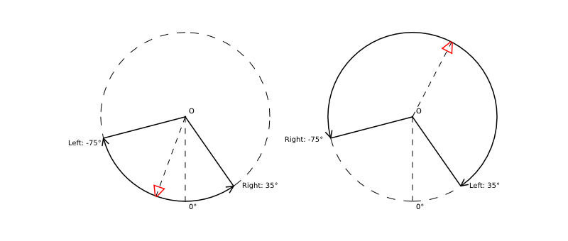
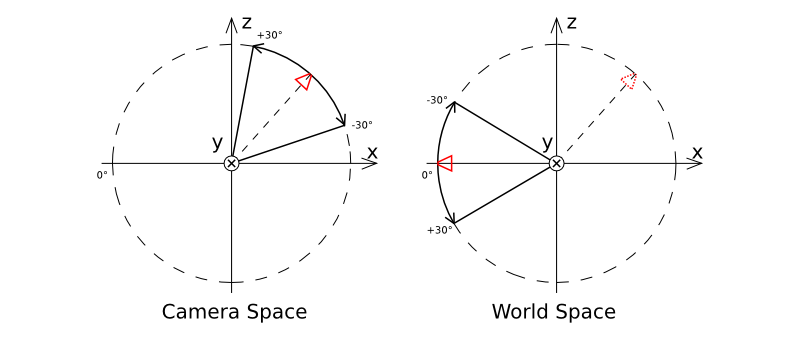

.. _objects:

*******
Объекты
*******

Объекты служат целям размещения компонентов различного типа (мешей, камер, ламп и т.д.) в пространстве 3D сцены.

Типы
====

Движком поддерживаются объекты следующих типов:

    - меш (mesh)
    - камера (camera)
    - лампа (lamp)
    - пустой (empty)
    - скелет (armature)
    - источник звука (speaker)
    - кривая (curve)

.. _static_dynamic_objects:

Статические и динамические объекты
==================================
Все объекты типа ``MESH`` можно разделить на статические и динамические.

**Статические объекты** - объекты, меши которых могут быть объединены друг с другом, если они имеют одинаковый материал.

**Динамические объекты** - объекты, меши которых не могут быть скомбинированы друг с другом.

Объединение статических объектов осуществляется в целях оптимизации количества вызовов отрисовки.
Динамические объекты нужны в том случае, когда необходимо обеспечить движение отдельного объекта.

Среди объектов другого типа динамическими являются ``CAMERA`` и ``ARMATURE``. Остальные - статические.

Объекты, имеющие анимацию, физику или родителя, являющегося динамическим объектом, уже рассматриваются как динамические. 
Если же необходимо обеспечить движение объекта, однако явным образом это не вытекает из имеющихся на нём опций, то следует включить настройку `Blend4Web > Do not batch`.

Настройка
=========

Для объектов всех типов поддерживаются расположение в пространстве, указатель на блок данных, родительский объект, принадлежность к группе и ряд специальных свойств движка.

Вкладка Object
--------------

.. image:: src_images/objects/object_setup.png
   :align: center
   :width: 100%
   
|

*Transform > Location*
    Координаты местоположения.

*Transform > Rotation*
    Углы вращения. Должен быть выставлен режим по умолчанию ``XYZ Euler``. При создании :ref:`объектной анимации <whole_object_anim>` необходимо перейти в режим ``Quaternion (WXYZ)``.

*Transform > Scale*
    Масштабирование. Все 3 компоненты (x, y, z) должны быть одинаковы. Для физических объектов масштабирование не поддерживается.

*Relations > Parent*
    Указатель на родительский объект.

*Groups*
    Группы объектов, которым принадлежит данный объект.

.. image:: src_images/objects/object_setup_b4w.png
   :align: center
   :width: 100%
   
|

*Blend4Web > Do not export*
    Не экспортировать.

*Blend4Web > Apply scale*
    Применить масштабирование объекта при экспорте. Также применяет модификаторы.

*Blend4Web > Apply modifiers*
    Применить модификаторы объекта при экспорте. 

*Blend4Web > Export vertex animation*
    Экспортировать предварительно созданную и сохраненную вертексную анимацию.

*Blend4Web > Export edited normals*
    Экспортировать предварительно отредактированные и сохраненные нормали.

*Blend4Web > Animation > Use default*
    Начать воспроизведение в движке связанной с объектом анимации.
    
*Blend4Web > Animation > Cyclic*
    Циклически повторять связанную с объектом анимацию.
    
*Blend4Web > Do not batch*
    Принудительно сделать объект :ref:`динамическим <static_dynamic_objects>`.

*Blend4Web > Dynamic Geometry*
    Разрешить изменение геометрии объекта через API Blend4Web.
    
*Blend4Web > Disable frustum culling*
    Отключить оптимизацию отсечением по зоне видимости.
    
*Blend4Web > Disable fogging*
    Отключить туман для объекта.

*Blend4Web > Do not render*
    Отключить рендеринг объекта (например, вспомогательный объект физики).

*Blend4Web > Shadows: Cast*
    Объект будет отбрасывать тени.

*Blend4Web > Shadows: Cast only*
    Объект будет отбрасывать тени, при этом сам будет оставаться невидимым.

*Blend4Web > Shadows: Receive*
    Разрешить затенение от прилегающих объектов (получение теней) на объекте.
    
*Blend4Web > Reflections: Reflexible*
    При включении объект будет отражаться от зеркальных поверхностей.

*Blend4Web > Reflections: Reflexible only*
    При включении объект будет отражаться, при этом сам будет оставаться невидимым.

*Blend4Web > Reflections: Reflective*
    При включении объект будет отражать своей поверхностью другие объекты.

*Blend4Web > Reflections: Reflection plane*
    Текстовое поле для названия пустого объекта, задающего плоскость отражения.

*Blend4Web > Caustics*
    На объекте будут видны эффекты от прилегающей к нему воды (каустика).
    
*Blend4Web > Wind bending*
    Включить процедурную анимацию под действием ветра.

*Blend4Web > Selectable*
    Разрешить выделение объекта с помощью мыши или другого устройства ввода, а
    также его подсвечивание (:ref:`эффект Glow <glow>`).

*Blend4Web > LOD transition ratio*
    Параметр для сглаживания переключения между LOD объектами. Определяет, на
    каком дополнительном расстоянии LOD объекты будут видны до замены
    последующими LOD объектами. Назначается для главного объекта. Измеряется в
    долях от радиуса охватывающей сферы объекта.

*Blend4Web > Self LOD > Distance*
    Расстояние от камеры, на котором объект перестает отображаться.

    .. deprecated:: 14.06
        реализовано в стандартном инструменте Blender ``Levels of Detail``.
    
*Blend4Web > Additional LOD objects*
    Интерфейс добавления низкополигональных объектов для реализации переключения уровня детализации.

    .. deprecated:: 14.06
        реализовано в стандартном инструменте Blender ``Levels of Detail``.
    

Вкладка Physics (в режиме Blender Game)
---------------------------------------

.. image:: src_images/objects/object_setup_phys.png
   :align: center
   :width: 100%

|

*Blend4Web > Detect collisions*
    Активировать связанную с объектом физику.

*Blend4Web > Floating*
    Сделать объект плавучим. Подробное описание настроек плавучих объектов можно
    найти в разделе :ref:`физика <physics>`.

*Blend4Web > Vehicle*
    Активировать использование объекта в качестве составной части транспортного
    средства. Подробное описание настроек транспортных средств можно найти в
    разделе :ref:`физика <physics>`.

*Blend4Web > Character*
    Активировать использование объекта в качестве физического каркаса игрового
    персонажа. Подробное описание настроек персонажа можно найти в разделе
    :ref:`физика <physics>`.

Камера
======
    
Настройки камеры выставляются в панели ``Properties`` на вкладке ``Object Data``.

.. image:: src_images/objects/camera_setup.png
   :align: center
   :width: 100%

|

*Blend4Web > Move style* -- режим управления камерой. По умолчанию камера
находится в статическом режиме (``Static``), допуская измененение своего
положения только через API. В режиме ``Target`` камера вращается вокруг
фиксированной точки. Режим ``Eye`` позволяет осуществлять вращение и перемещение от первого
лица.

*Blend4Web > Target location* -- доступно в режиме ``Target``. Позиция точки,
относительно которой будет вращаться камера. Кнопка ``Copy Cursor Location``
позволяет скопировать текущее положение курсора.

*Blend4Web > DOF front distance* -- описано в разделе :ref:`postprocessing_effects`

*Blend4Web > DOF rear distance* -- описано в разделе :ref:`postprocessing_effects`

*Blend4Web > DOF power* -- описано в разделе :ref:`postprocessing_effects`

Ограничения движения камеры
---------------------------
Для камеры доступно несколько настроек, ограничивающих её движение тем или иным образом. 
Они объединены в группу ``Camera limits``.

.. image:: src_images/objects/camera_limits.png
   :align: center
   :width: 100%

|

**Виды ограничений**

*Blend4Web > Use distance limits* -- доступно в режиме ``Target``. Задание минимального и максимального расстояния
от камеры до точки вращения.

Варианты интервалов:

* *Max > Min* - расстояние от камеры до объекта ограничено интервалом *[Min, Max]*

* *Max = Min* - фиксирование камеры на определенной высоте над объектом

* *Max < Min* - ограничение движения отсутствует

|

Значения по умолчанию: *Min = 1, Max = 100*.

|

*Blend4Web > Use horizontal rotation clamping* -- доступно в режимах ``Target`` и ``Eye``. Ограничение горизонтального вращения камеры относительно точки вращения (в режиме ``Target``) или относительно своего местоположения (в режиме ``Eye``).

Направление от ``Left`` к ``Right`` считается положительным и для режима ``Target`` совпадает с направлением против часовой стрелки, а для режима ``Eye`` - по часовой стрелке:

.. image:: src_images/objects/horizontal_limits.png
   :align: center
   :width: 100%

Значения по умолчанию: *Left = -180, Right = 180*.

|

*Blend4Web > Use vertical rotation clamping* -- доступно в режимах ``Target`` и ``Eye``. Ограничение вертикального вращения камеры относительно фиксированной точки (в режиме ``Target``) или относительно своего местоположения (в режиме ``Eye``).

Направление от ``Down`` к ``Up`` считается положительным:

.. image:: src_images/objects/vertical_limits.png
   :align: center
   :width: 100%

Если включена опция *Use horizontal rotation clamping*, то вертикальное вращение будет ограничено, по крайней мере, интервалом *[-90, 90]*.

Значения по умолчанию: *Down = -90, Up = 90*.

|

**Особенности значений, ограничивающих поворот**

* Перемена мест значений *Left/Right* или *Down/Up* приводит к движению по противоположной дуге окружности вращения.

* *Left = Right, Up = Down* - фиксирование камеры соответственно по горизонтали или вертикали.

|

**Отсчет углов поворота**

При ограничении горизонтального и вертикального вращения можно выбрать пространство координат:

* ``Camera space`` - все углы отсчитываются относительно начального положения и ориентации камеры. 

* ``World space`` - горизонтальные углы отсчитываются относительно направления оси Y в пространстве мировых координат, вертикальные - относительно горизонтальной плоскости XOY в мировом пространстве.

Для ограничения по горизонтали:

Для ограничения по вертикали:

Оси координат, отмеченные на рисунках, совпадают с осями мировых координат в Blender'е.

По умолчанию назначается вариант ``Camera space``.
