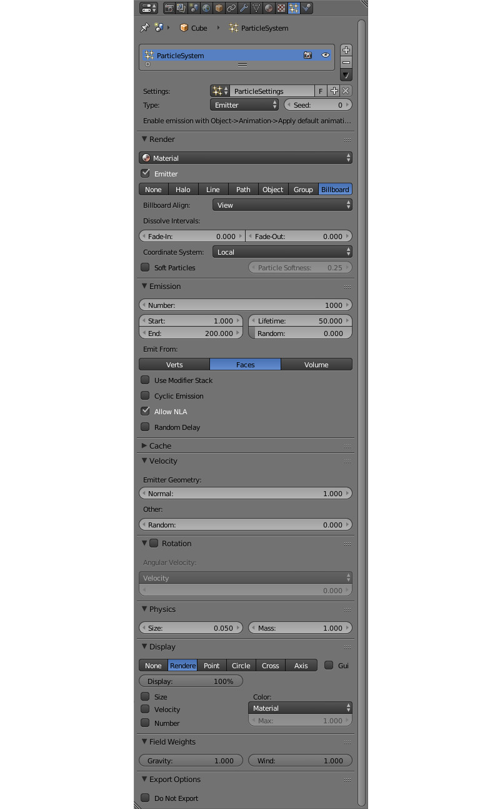

.. _particles:

.. index:: система частиц; флюиды

**********************
Система частиц. Флюиды
**********************

Система частиц предназначена для визуализации явлений, обусловленных движением множественных малых объектов, таких как дым, огонь, брызги воды и др.

.. image:: src_images/particles/particles_smoke.jpg
   :align: center
   :width: 100%

|

Необходимым элементом системы частиц является эмиттер - объект, определяющий местоположение и направление исходящего потока частиц.

Использование
=============

Необходимые этапы
-----------------

#. Добавить на сцену меш - эмиттер.
#. Создать на эмиттере материал для частиц, например типа ``Halo``. Поддерживается также материал типа ``Surface`` с обязательной диффузной текстурой.
#. Добавить на эмиттере систему частиц.
#. Инициализировать воспроизведение в движке. Возможны два варианта:

    - "циклическое испускание" - для системы частиц выставить опцию ``Emission > Cyclic emission``.
    - "нециклическая анимация" - для эмиттера выставить опцию ``Animation > Apply Default Animation``.

Рекомендуемые дополнительные настройки
--------------------------------------

#. Для материала частиц выставить тип прозрачности ``Add``.
#. Если отображение эмиттера на сцене не требуется, отключить опцию ``Particles > Render > Emitter``.
#. Если отображение эмиттера на сцене необходимо, для него можно использовать дополнительные материалы. В этом случае в настройках системы частиц нужно выбрать  материал частиц ``Particles > Render > Material``.
#. В случае использования для частиц материала типа ``Surface``, к материалу необходимо подключить диффузную текстуру (обычно с альфа-каналом). В меню ``Mapping > Coordinates`` выбрать ``UV``.  Убедиться, что меш эмиттера имеет развертку.

.. image:: src_images/particles/particles_first_steps.jpg
   :align: center
   :width: 100%

Настройка
=========

Параметры системы частиц настраиваются во вкладке ``Particles``. Поддерживается несколько систем частиц на одном эмиттере.

Общие настройки
---------------

*Name*
    Название системы частиц. Значение по умолчанию "ParticleSystem".

*Settings*
    Ссылка на блок данных с настройками системы частиц. Блоки данных с настройками могут быть общими для разных систем частиц.

*Type*
    Тип системы частиц: ``Emitter`` или ``Hair``. Системы частиц типа ``Hair`` используются для создания множественных копий (инстансинга) объектов. Значение по умолчанию ``Emitter``.

*Seed*
     Индекс в таблице случайных чисел, используемых для генерации системы частиц. Значение по умолчанию 0.

Настройки испускания
--------------------

*Emission > Number*
     Количество частиц. Значение по умолчанию 1000.

*Emission > Start*
    Первый кадр, после которого начинается испускание частиц. Значение по умолчанию 1.0.

*Emission > End*
    Последний кадр, после которого прекращается испускание частиц. Значение по умолчанию 200.0.

*Emission > Lifetime*
    Время жизни частиц в кадрах. Значение по умолчанию 50.0.

*Emission > Lifetime > Random*
    Фактор случайности для времени жизни. Значение по умолчанию 0.0.

*Emission > Emit From*
    Источник испускания. Поддерживаются вершины ``Verts``, грани ``Faces``. Значение по умолчанию ``Faces``.

*Emission > Cyclic emission*
    Опция включает циклический режим испускания. Применяется для постоянных эффектов (дым, горение, брызги). Рекомендуется выставить нулевое значение ``Emission > Start``. По умолчанию выключено.

*Emission > Random Delay*
    Опция устанавливает случайный характер времени испускания частиц. По умолчанию выключено.

*Emission > Emit From > Distribution*
    Настройки распределения испускания: ``Jittered``, ``Random``, ``Grid``. Игнорируются движком. Всегда используется случайное распределение (``Random``). Значение по умолчанию ``Jittered``.

.. image:: src_images/particles/particles_settings.jpg
   :align: center
   :width: 100%

Настройки направления
---------------------

*Velocity > Emitter Geometry > Normal*
    Фактор влияния на испускание вдоль нормалей меша эмиттера. Значение по умолчанию 1.0.

*Velocity > Other > Random*
    Фактор случайности для направления испускания. Значение по умолчанию 0.0.

Настройки вращения
------------------

*Rotation > Angular Velocity > Mode*
    Режим собственного вращения биллбордов частиц. Система частиц типа ``Hair`` поддерживает все типы вращения, а система частиц типа ``Emitter`` только ``Velocity``

*Rotation > Angular Velocity > Factor*
    Фактор скорости собственного вращения биллбордов частиц. Значение по умолчанию 0.0.

Настройки физики
----------------

*Physics > Type*
    Тип расчетов физики: ``No``, ``Newtonian``, ``Keyed``, ``Boids``, ``Fluid``. Игнорируется движком. Всегда используется физика Ньютона (``Newtonian``). Значение по умолчанию ``Newtonian``.

*Physics > Size*
    Размер частиц. Значение по умолчанию 0.05.

*Physics > Mass*
    Масса частиц. Влияет на взаимодействие с силовыми полями (в частности, с ветром). Значение по умолчанию 1.0.

*Physics > Forces > Brownian*
    Экспортируется, но не используется движком.

.. image:: src_images/particles/particles_settings2.jpg
   :align: center
   :width: 100%

Настройки отображения
---------------------

*Render > Material*
    Меню выбора материала частиц. Используется в случае использования эмиттером нескольких материалов. Значение по умолчанию ``Default Material``.

*Render > Emitter*
    Опция включения отображения эмиттера на сцене. По умолчанию включено.

*Render > Type*
    Режим отображения частиц: ``None``, ``Halo``, ``Line``, ``Path``, ``Object``, ``Group``, ``Billboard``. Движком различаются режимы ``Object`` и ``Group``, использующиеся для инстансинга объектов и групп объектов, соответственно. Другие режимы игнорируются. Для удобства отображения биллбордов рекомендуется включать режим ``Billboard``. Значение по умолчанию ``Halo``.

*Render > Billboard align*
    Способ ориентирования биллбордов: ``View`` - поворачивать к камере, ``XY plane``, ``YZ plane``, ``ZX plane`` - ориентировать в соответствующей плоскости (в мировой системе координат Blender'a). Значение по умолчанию ``View``.

*Render > Dissolve intervals > Fade-in* и *Fade-out*
    Начальный и конечный интервалы (в кадрах) для постепенного увеличения и уменьшения прозрачности частиц.

*Render > Coordinate system*
    Система координат испускаемых частиц: ``Local`` - использовать локальную систему координат эмиттера, ``World`` - использовать мировую систему координат.

*Render > Soft Particles*
    Включает так называемые "Мягкие частицы" билборды которых плавно растворяются при соприкосновении с поверхностями. С помощью слайдера Particle Softness настраивается степень проявленности этого эффекта.

.. _particles_force_fields:

Настройки влияния силовых полей
-------------------------------

*Field Weights > Gravity*
    Фактор влияния гравитационного поля (земное притяжение). Значение по умолчанию 1.0.

*Field Weights > Wind*
    Фактор влияния ветра. Необходимо присутствие объекта силового поля (добавляется ``Add > Force Field``) типа ``Wind`` (ветер). На систему частиц оказывают также настройки направления и силы ветра. Значение по умолчанию 1.0.

Специальные настройки движка
----------------------------

*Export Options > Do not export*
    Не экспортировать.

.. _particles_textures:

Текстуры в системах частиц
==========================

Текстуры материала частиц
-------------------------

В материалах частиц типа ``Surface`` **необходимо** наличие диффузной текстуры (обычно с альфа-каналом). В меню ``Mapping > Coordinates`` выбрать ``UV``.  Убедиться, что меш эмиттера имеет развертку.

В материалах частиц типа ``Halo`` **возможно** использование текстуры типа ``Blend`` с линейным (``Linear``) градиентом. В меню ``Mapping > Coordinates`` выбрать ``Strand / Particle``. На текстуре необходимо включить использование рампы (``Ramp``). Допускается использование до 4 контрольных точек градиента.

.. image:: src_images/particles/particles_settings_ramp_color.jpg
   :align: center
   :width: 100%

Текстуры системы частиц
-----------------------

Для настройки поведения системы частиц могут быть использованы текстуры. В отличие от текстур, используемых материалами частиц, такие текстуры относятся к блоку данных (datablock) системы частиц, а не к блоку данных материала. Чтобы создать текстуру системы частиц, необходимо **из вкладки** ``Particles`` перейти во вкладку ``Textures``, после чего нажать ``New``.

Поддерживаются только текстуры типа ``Blend`` с линейным (``Linear``) градиентом. На текстуре необходимо включить использование рампы (``Ramp``). Допускается использование до 4 контрольных точек градиента.

На панели ``Influence`` необходимо выбрать параметр, на который воздействует текстура. В настоящий момент поддерживается только ``Size`` (размер).

.. image:: src_images/particles/particles_settings_ramp_size.jpg
   :align: center
   :width: 100%

|

Результат применения текстур градиента для материала частиц и для системы частиц:

.. image:: src_images/particles/particles_gun.jpg
   :align: center
   :width: 100%

`Ссылка на модель <http://www.blendswap.com/blends/view/13977>`_
