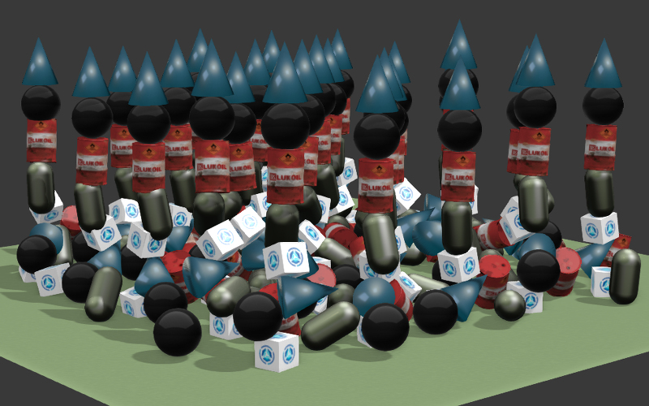
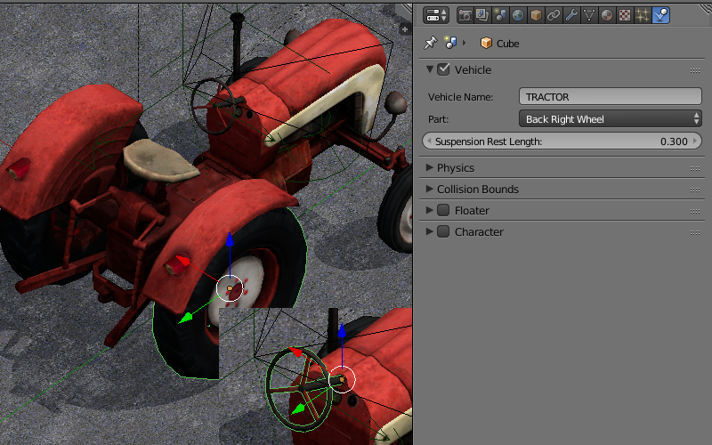

.. _physics:

*******
Physics
*******

.. contents:: Table of Contents
    :depth: 3
    :backlinks: entry

Preparing for Use
=================

In order to enable physics on the scene, please use the ``Enable Physics`` checkbox in the ``Physics`` panel under the scene tab in Blender.

.. image:: src_images/physics/scene_interface_phys_enable.png
   :align: center
   :width: 100%

|

.. _static_physics:

Static Physics Type
===================

Can be used to limit the movement of other objects, for example to detect collisions with a landscape, walls and so on. In the physics settings of such an object the ``Static`` value (set by default) should be selected for the ``Physics Type`` option.

.. image:: src_images/physics/physics_panel_static.png
   :align: center
   :width: 100%

|

One or multiple physics materials can be assigned to a mesh. Under the ``Material`` tab the ``Special: Collision`` panel must be activated.

.. image:: src_images/physics/material_panel_physics.png
   :align: center
   :width: 100%
   
|

The ``Ghost`` option excludes the material from physical interactions but still notifies the application about the contact with it. An example - detecting that the character is located on a vertical ladder.

.. image:: src_images/physics/water_tower.png
   :align: center
   :width: 100%

|

The ``Collision ID`` field is intended for detecting collisions with specific materials and can be left empty. An example of ``Collision ID`` usage is detecting the landscape surface a character is located on - grass, sand, wooden coating and so on.

The ``Margin`` field allows to customize the width of the zone where mesh reacts on collisions. This option improves physical collisions simulation stability.

Also, there are material physics settings in this panel. The following settings are supported: ``Friction``, ``Elasticity``.

The ``Collision Group`` field corresponds to the physics group which the material belongs to. The ``Collision Mask`` field defines all physics groups with which this material will interact.

.. _dynamic_physics:

Dynamic Physics Type
====================

Intended for rigid body movement simulation.

|

The ``Object Physics`` checkbox must be enabled under the object's ``Physics`` panel. The ``Collision ID`` field is intended for detecting collisions with a specific object (for example, for detecting proximity of a FPS character to different items) and can be left empty.

In the physics settings of such an object the ``Rigid Body`` (with rotations) or ``Dynamic`` (without rotations) values can be selected for the ``Physics Type`` option. In the ``Collision Bounds`` settings the collider type can be selected - the supported types are: ``Box``, ``Capsule``, ``Sphere``, ``Cylinder``, ``Cone``. Also, the following physics parameters can be set: ``Mass``, ``Damping`` - for ``Translation`` and ``Rotation``.

The ``Collision Group`` field corresponds to the physics group which the object belongs to.

The ``Collision Mask`` field defines all physics groups with which this object will interact.

.. image:: src_images/physics/physics_panel_dynamic.png
   :align: center
   :width: 100%
   
|

``Friction`` and ``Elasticity`` are supported for the material of such an object. When multiple materials are used on a single mesh, the physics parameters are taken from the first of them.

For the camera object the ``Physics Type`` = ``Dynamic`` parameter must be used, and the ``Object Physics`` checkbox must be enabled.

.. _physics_constraints:

Constraints
===========

Physical constraints are used for limiting the objects' degrees of freedom.

.. image:: src_images/physics/physics_constraints.png
   :align: center
   :width: 100%
   
|

Adding a physical constraint (``Rigid Body Joint``) to the object can be performed on the ``Object Constraints`` panel. The supported types (``Pivot Type``) are: ``Ball``, ``Hinge``, ``Cone Twist``, ``Generic 6 DoF``. A physical constraint can be added to one of the two interacting objects, while the other object acts as a ``Target``. Both objects can have a static and/or dynamic physics type. In constraints (except ``Ball``) the translation and rotation limits can be set up.

.. image:: src_images/physics/physics_constraints_panel.png
   :align: center
   :width: 100%
   
|

.. _wheeled_vehicles:

Wheeled Vehicles
================

The model of a vehicle must consist of 6 separate objects - a chassis, 4 wheels and a steering wheel. The chassis' mesh center should correspond to the mass center. The centers of the wheels' and the steering wheel's meshes should be located on the rotation axes. The steering wheel should be oriented in the local space of coordinates - X - the rotation axis, Y - to the right and Z - upwards. The object can have any names.

|

For all 6 objects: select the ``Part``, specify the same id in the ``Vehicle Name`` field, select the right object type - ``Chassis``, ``Steering Wheel``, ``Back Right Wheel`` and so on. The ``Suspension Rest Length`` setting is also available for the wheels.

It is necessary to specify a realistic mass for the chassis (because the default value is only 1 kg). To do this go to the physics settings, choose the ``Rigid Body`` value for the ``Physics Type`` option and specify the required value (for example, 1000 kg) in the ``Mass`` field.

Chassis Settings
----------------

*Force Max*
    Maximum driving force of the vehicle.

*Brake Max*
    Maximum braking coefficient.

*Suspension Compression*
    Damping coefficient for suspension stretching.

*Suspension Stiffness*
    Suspension stiffness coefficient.

*Suspension Damping*
    Suspension damping coefficient.

*Wheel Friction*
    Friction constant between the wheels and the surface. It should be around 0.8 for realistic vehicles. But it can be increased significantly to achieve a better control (1000 and more).

*Roll Influence*
    Decreases the wheels' torque decreasing the probability of the vehicle overturning (0 - no torque, 1 - real physics behavior).

*Max Suspension Travel Cm*
    Maximum suspension travel in centimeters.

For the ``Steering Wheel`` it is necessary to specify the maximum steering angle (``Steering Max``) and the ratio between the turn of the steering wheel and the turn of the wheels  (``Steering Ratio``). The maximum steering angle value is specified in revolutions. A single revolution equals to 360 degrees. Therefore, if ``Steering Max`` is equal to one and ``Steering Ratio`` is equal to 10, the maximum turn of the steering wheel will be 360 degrees and the maximum turn of the front wheels will be 36 degrees.

On this stage you can export and load the scene into the engine. We recommend to create a road surface with a physics material. To choose the controlled object press the ``Q`` key in the Viewer and select the chassis. Use the ``W``, ``A``, ``S``, ``D`` keys as controls.

We can additionally tweak the ``Damping`` of ``Translation`` and ``Rotation``. This will influence the speed and inertia of the vehicle.

The friction and elasticity of the road surface material do not influence the vehicle's behavior.

.. _floating_objects:

Floating Objects
================

.. image:: src_images/physics/physics_floater.png
   :align: center
   :width: 100%

|

In order for the object to float on the water surface (an object with the ``Water`` material), it is necessary to enable the ``Floater`` panel. There are two types of floating objects: ``Main Body`` - the floating object itself and ``Bob`` - an auxiliary bob-object onto which the buoyancy will be acting. A floating object can have an unlimited number of ``Bob`` objects. This can be both meshes or ``Empty`` objects.

All objects that are part of the same floating object must have the same name in the ``Floater Name`` field.

Floating Object Settings
------------------------

*Floating Factor*
    Buoyancy coefficient.

*Water Linear Damping*
    Linear velocity damping when the object is on the water surface (or under water). When the object is not in water, the physics settings are used.

*Water Rotation Damping*
    Rotation damping when the object is on the water surface (or under water). When the object is not in water, the physics settings are used.

.. _watercrafts:

Floating Vehicles aka Watercrafts
=================================

.. image:: src_images/physics/physics_boat.png
   :align: center
   :width: 100%

|

Watercrafts use some parameters from the ``Vehicle`` settings and all the settings which are similar to ``Floater`` setting. It is necessary to set the ``Part`` type ``Hull`` on the main object. Similar to a floating object a watercraft requires auxiliary ``Bob`` objects.

Watercraft Settings
-------------------

*Force Max*
    Maximum driving force of the vehicle.

*Brake Max*
    Maximum braking coefficient.

*Floating Factor*
    Buoyancy coefficient.

*Water Linear Damping*
    Linear velocity damping when the object is on the water surface (or under water). When the object is not in water, the physics settings are used.

*Water Rotation Damping*
    Rotation damping when the object is on the water surface (or under water). When the object is not in water, the physics settings are used.

.. _characters:

Characters
==========

.. image:: src_images/physics/physics_character_object_example.png
   :align: center
   :width: 100%

This feature can be activated by clicking the ``Character`` check-box in the title of the eponymous tab on the ``Physics`` panel.

From the engine standpoint, the character itself is a proper physical object that can collide with other physical objects or be influenced by physical forces such as gravity and buoyant force.

Character object can be easily controlled using several API methods with a `character` keyword in their names. All such methods reside in the :b4wmod:`physics` API module.

Character Settings
------------------

.. image:: src_images/physics/physics_character_settings.png
   :align: center
   :width: 100%

All the settings listed here become available after activating the ``Character`` tab.

*Walk Speed*
    This parameter sets the speed of a character walking (measured in meters per second). The lowest possible value of this parameter is zero, while the highest is 10.

    Its default value is 4.

*Run Speed*
    This is the speed of the character running (measured in meters per second). Its value can vary from zero to 20.

    This parameter is set to 8 by default.

*Step Height*
    This is the maximum height of an obstacle that character can overstep (in meters). The value of this parameter can vary from zero to 1.

    Default value of this parameter is 0.250.

*Jump Strength*
    This parameter sets the strength of the character jumping. Its minimum value is zero, while its maximum value is 50.

    Set to 5 by default.

*Waterline*
    This parameter sets up the waterline for the character object. The waterline is measured from the center of the physical shape of the object (not the object's mesh). If an object is submerged into the water below this line, it will float. Its value can vary from -2 to 2.

    It is set to zero by default.

Basic Character
---------------

Blend4Web engine has an option to quickly set up a user-controlled first-person character. Such character will only have very basic functionality, but can be set up without any programming.

To set up a basic character, follow these steps:

#. Select an object you intend to use as a character.
#. Enable physics for the selected object and set physics type to ``Dynamic`` or ``Rigid Body``.
#. Enable Character option for the object.
#. Create a new Camera or select an existing one and set its type to ``Eye``.

Now a basic character with an attached camera will be present in your scene.

The character can be controlled in mostly the same way as a regular ``Eye`` type camera:

* WASD keys move the character.
* Camera angles are controlled by arrow keys or moving the mouse while holding its left button.
* Pressing the C key toggles fly mode (enabled by default).

.. note::
    Only one basic character can be present in the scene. If a scene has multiple characters, the engine will use the first of them as the basic character and ignore the others.

Controlling Characters with API
-------------------------------

Basic character described above can only provide generic functionality. If you need more control over character behavior, you should use methods from the :b4wmod:`fps` module.

The most important of them is the :b4wref:`fps.enable_fps_controls()` method which, as its name suggests, is used to initialize characters in the scene. It can be used as follows:

.. code-block:: javascript

    var m_fps = require("fps");

    m_fps.enable_fps_controls();

This method should be used at the start of the application (in the **load_cb** function) to enable character controls.

.. note::

    This method may conflict with the :b4wref:`app.enable_camera_controls()` method which is used to enable basic character described in the previous section. These two methods should not be used simultaneously.

The method also has the following optional parameters:

    ``character`` sets the character object. The link to the character can be retrieved by calling the :b4wref:`scenes.get_first_character()` method. Should be used if more then one character is present in the scene.

    ``element`` specifies the HTML element to which the method adds listeners.

    ``motion_cb`` specifies the callback function that is called when character changes its direction.

    ``gamepad_id`` specifies the ID of the gamepad plugged to the system.

    ``forward_sens``, ``backward_sens``, ``right_sens``, ``left_sens``, ``jump_sens``, ``fly_sens`` - these parameters are used to set arrays of sensor types for specific character action like walking in different directions, jumping and so on.

    ``rotation_cb`` specifies the callback function that is called when a character or camera rotates.

    ``lock_camera`` - setting this parameter to ``true`` will parent the scene camera to the character.

Other important methods are :b4wref:`fps.set_cam_sensitivity()` and :b4wref:`fps.set_cam_smooth_factor()`. The first one of them sets the sensitivity of the camera (defined by a numeric value in the range from zero to 100). The second method defines how smooth the camera moves (defined by a value in the range from 0 to 1.0).

Character States
................

Character states are constant values that represent current behavior of the character (does it currently walk or fly or do anything else). Every character present in a scene always have one and only one state.

Available character states:

    :b4wref:`fps.CS_CLIMB` - a character is climbing.

    :b4wref:`fps.CS_FLY` - a character is flying.

    :b4wref:`fps.CS_RUN` - a character is running.

    :b4wref:`fps.CS_STAY` - a character does not move.

    :b4wref:`fps.CS_WALK` - a character is walking.

Current state of a specific character can be retrieved using the :b4wref:`fps.get_character_state()` method, while a specific state can be assigned to a character with the :b4wref:`fps.switch_state()` method. The following example shows how these two methods can be used:

.. code-block:: javascript

    var m_fps = require("fps");

    var current_state = m_fps.get_character_state();
    
    if (current_state == m_fps.CS_FLY)
        m_fps.switch_state(m_fps.CS_WALK);

Action Binding
..............

The :b4wmod:`fps` module also provides means for binding various actions to character events. The :b4wref:`fps.bind_action()` method is used for this:

.. code-block:: javascript

    var m_fps = require("fps");
    var m_ctl = require("controls");

    var action_cb = function(value) {
        console.log("Q key pressed.");
    }

    m_fps.bind_action(m_fps.AT_PRESSED, [m_ctl.KEY_Q], action_cb);

This method features the following parameters:

    * the first parameter is the type of action:

      :b4wref:`fps.AT_CONTINUOUS` - an input type that detects a continuous user action such as mouse movement, keyboard key held down, gamepad stick tilt etc.

      :b4wref:`fps.AT_PRESSED` - this input type detects a discrete user action, e.g. pressing a button.

      :b4wref:`fps.AT_RELEASED` - an input type that detects button (mouse, gamepad or keyboard) being released.

    * the second parameter defines an array of sensor types (such as keyboard keys, gamepad buttons or mouse actions).
    * **action_cb** is a callback function that will be called each time user performs action defined by the first parameter.

Navigation Meshes
=================

Navigation meshes (commonly abbreviated *navmeshes*) are mesh objects that are used to make pathfinding simpler by eliminating the need for additional calculations such as collisions.

.. image:: src_images/physics/physics_pathfinding_example.png
   :align: center
   :width: 100%

In this example (taken from Code Snippets), navigation mesh is used to build a path through the labyrinth.

Creating Navigation Meshes
--------------------------

To make a navmesh out of an object, turn on the ``Object Physics`` parameter on the ``Physics`` panel and select ``Navigation Mesh`` from the ``Physics Type`` list.

.. image:: src_images/physics/physics_navmesh.png
   :align: center
   :width: 100%

Navigation meshes can either be created manually or generated automatically using a specific tool.

.. image:: src_images/physics/physics_navmesh_generator.png
   :align: center
   :width: 100%

.. note::
    This tool is native to Blender and not a part of the Blend4Web engine.

This Navigation Mesh generation interface can be found on a dedicated panel under the ``Scene`` tab, but, as this feature is intended for real-time applications, it only appears if the Engine type is set to ``Blend4Web`` or ``Blender Game`` (Blender Internal, Cycles or any other rendering engine won’t do).

The main tool on this panel is the ``Build Navigation Mesh`` button. As the title suggests, it is used for building navigation meshes based on the currently selected object. The navmesh is created as a separate object placed above the selected object, thus leaving that object intact.

Aside from this button, the ``Navigation Mesh`` panel offers users several groups of parameters to fine-tune the navmesh that will be generated.

``Rasterization`` group of parameters:

*Cell Size*
    Rasterized cell size. Greater values lead to bigger navmesh polygons. The highest possible value is 1.0. Default value is 0.3.

*Cell Height*
    Rasterized cell height (the distance between the navmesh and the object from which it was generated). Default value is 0.2.

``Agent`` group of parameters:

*Height*
    Minimum height where the agent can still walk. Default value is 2.0.

*Radius*
    The radius of the agent. Default value is 0.6.

*Max Slope*
    Maximum angle of a slope agent can walk on. Measured in degrees. Default value is 45.

*Max Climb*
    The maximum height between grid cells the agent can climb. Default value is 0.9.

``Region`` group of parameters:

*Min Region Size*
    The minimum size of a region (smaller regions will be deleted). Default value is 8.0.

*Merged Region Size*
    The minimum size of a region (smaller regions will be merged). Default value is 20.0.

*Partitioning*
    The method used to partition the navigation mesh. Supported methods are:

    ``Monotone`` is the fastest method. Using it may generate long thin polygons.

    ``Layers`` — a slower, but still reasonably fast method that produces better triangulations than Monotone partitioning.

    ``Watershed`` — classic Recast partitioning method that generates the nicest tessellation. This option is selected by default.

``Polygonization`` group of parameters:

*Max Edge Length*
    The maximum length of a contour edge. Default value is 12.0.

*Max Edge Error*
    The maximum error of the distance from the contour to the cells. Default value is 1.3.

*Verts Per Poly*
    The maximum number of vertices per polygon. Default value is 6.

``Detail Mesh`` group of parameters:

*Sample Distance*
    Detail mesh sample spacing. Default value is 6.0.

*Max Sample Error*
    Maximum error of the mesh simplification. Default value is 1.00.

Using Navigation Meshes
-----------------------

After a navmesh is created, it then can be used in the application for calculating trajectories between two points. This can be done using two methods from the :b4wmod:`physics` module, :b4wref:`physics.navmesh_get_island()` and :b4wref:`physics.navmesh_find_path()`. The former is used to retrieve a link to the current island (closest independent segment of the navmesh), while the latter returns the actual path in the form of an array of coordinates.

An example of using navigation meshes for pathfinding can be viewed in the :ref:`Code Snippets <code_snippets>` (the corresponding snippet is named ``Pathfinding``).

.. _using_physics:

Use in Applications
===================

The physics system is implemented in the **uranium.js** module and loaded separately from the engine's main code. The **uranium.js** module itself is a modification of the `Bullet <http://bulletphysics.org/>`_ physics engine, which is ported to work in browsers. In order to activate the physics system, it is enough to put the **uranium.js** and **uranium.js.mem** files in the same directory as the source code of the application.

Another way is to explicitly specify the loading path of the **uranium.js** module by using the following API method:

.. code-block:: javascript

    m_config.set("physics_uranium_path", ".../uranium.js");

.. note::

    When applications are developed :ref:`within the SDK <project_management>`, the path to the physics engine is detected automatically.

If your application does not use physics, we recommend you to turn off the ``Enable Physics`` flag in the ``Physics`` panel under the scene tab in Blender. It is also possible to forcibly disable loading of the **uranium.js** module by calling the following method before initialization of the engine:

.. code-block:: javascript

    m_config.set("physics_enabled", false);
