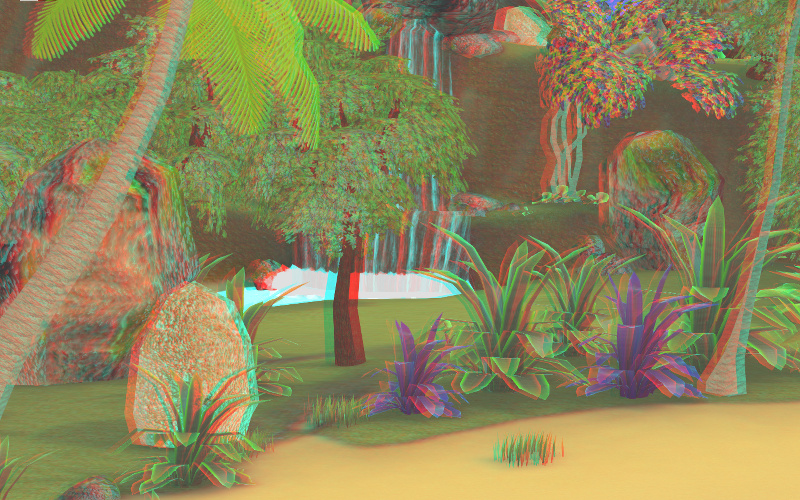

.. _postprocessing_effects:

**************************
Постпроцессинговые эффекты
**************************

.. index:: размытие при движении (motion blur)

.. _motion_blur:

Размытие при движении
=====================

Эффект размытия при движении (motion blur) служит целям увеличения реализма интерактивной сцены. Он проявляется при движении камеры или объектов в виде "смазывания" изображения.

Активация
---------

Выставить опцию ``Enable Motion Blur`` на панели ``Scene > Blend4Web``.

Дополнительные настройки
------------------------

На панели ``World > Blend4Web > Motion blur settings``:

*Motion blur factor*
    Степень проявления эффекта. Чем выше значение, тем сильнее эффект размытия. Значение по умолчанию 0.01.

*Motion blur decay threshold*
    Степень плавности размытия. Чем выше значение, тем более резким будет эффект. Значение по умолчанию 0.01.

.. image:: src_images/postprocessing_effects/motion_blur.jpg
   :align: center
   :width: 100%

|

.. index:: глубина резкости камеры (depth of field), DOF

.. _dof:

Глубина резкости камеры
=======================

Эффект глубины резкости камеры (depth of field, DOF) акцентирует внимание зрителя на части сцены. Проявляется в размытии изображения ближе и дальше от фокуса камеры.

Активация
---------

1. Выбрать активную камеру, перейти на панель ее настроек (``Object Data``).
2. Далее возможны два варианта:

    - На панели ``Depth of Field`` в меню ``Focus`` выбрать объект, на котором будет сфокусирована камера. В этом случае при удалении или приближении к этому объекту будет происходит соответствующая коррекция фокуса камеры.
    
    - На панели ``Depth of Field`` установить ненулевое значение ``Distance`` (в метрах). В этом случае фокус камеры будет располагаться на заданном расстоянии от камеры и перемещаться вместе с ней. 

Дополнительные настройки
------------------------

На панели настроек активной камеры ``Object Data > Blend4Web``:

*DOF front distance*
    Расстояние от фокуса до ближней к камере плоскости, за которой происходит полное размытие (в метрах). Значение по умолчанию 1.0.

*DOF rear distance*
    Расстояние от фокуса до дальней от камеры плоскости, за которой происходит полное размытие (в метрах). Значение по умолчанию 1.0.

*DOF power*
    Степень размытия. Значение по умолчанию 3.0.

.. image:: src_images/postprocessing_effects/dof.jpg
   :align: center
   :width: 100%

|

.. index:: взаимное затенение (screen-space ambient occlusion), SSAO

.. _ssao:

Взаимное затенение
==================

Эффект взаимного затенения (screen-space ambient occlusion, SSAO) применяется с целью воспроизведения сложного переотражения света от объектов. Пространство между близкими объектами менее доступно для рассеянного света и поэтому затеняется сильнее.

Активация
---------

Выставить опцию ``Enable SSAO`` на панели ``Scene > Blend4Web``.

Дополнительные настройки
------------------------

На панели "мира" ``World > Blend4Web > SSAO Settings``:

*Radius Increase*
    Фактор умножения радиуса сферического сэмплинга при переходе от внутреннего кольца к внешнему. Значение по умолчанию 1.7.

*Dithering Amount*
    Степень подмешивания случайного шума для уменьшения проявления полос (дитеринг). Значение по умолчанию 0.1.

*Gauss Center*
    Математическое ожидание - параметр распределения Гаусса для разницы глубин пиксела и соседнего сэмпла. Значение по умолчанию 0.2.

*Gauss Width*
    Стандартное отклонение - параметр распределения Гаусса для разницы глубин пиксела и соседнего сэмпла. Значение по умолчанию 2.0.

*Gauss Width Left*
    Стандартное отклонение в случае, когда разница глубин меньше математического ожидания. Значение по умолчанию 0.1.

*Influence*
    Степень проявленности эффекта взаимного затенения. Значение по умолчанию 0.7.

*Distance Factor*
    Фактор уменьшения проявленности эффекта взаимного затенения с расстоянием. Значение по умолчанию 0.0 (т.е. уменьшения нет).

*Samples*
    Количество сэмплов (чем больше, тем лучше качество, но меньше производительность). Значение по умолчанию 16.

.. image:: src_images/postprocessing_effects/ssao.jpg
   :align: center
   :width: 100%

|

.. index:: сумеречные лучи (crepuscular rays), god rays

.. _god_rays:

Сумеречные лучи
===============

Эффект сумеречных лучей (crepuscular rays, "god rays") симулирует известное природное явление - свечение освещенных областей воздуха.  

Активация
---------

Выставить опцию ``Enable God Rays`` на панели ``Scene > Blend4Web``.

Дополнительные настройки
------------------------

На панели "мира" ``World > Blend4Web > God Rays Settings``:

*God Rays Intensity*
    Степень проявленности эффекта. Значение по умолчанию 0.7.

*Maximum Ray Length*
    Фактор длины лучей. Определяет шаг сэмплов радиального размытия. Значение по умолчанию 1.0.

*Steps Per Pass*
    Количество шагов на один сэмпл. Значение по умолчанию 10.0.

.. image:: src_images/postprocessing_effects/god_rays.jpg
   :align: center
   :width: 100%

|

Эффект засветки ярких деталей
=============================

Эффект засветки (Bloom) проявляется при наличии на экране элементов с большой разницей в яркости. Вокруг ярких деталей создается светящийся ореол.

Активация
---------

Выставить опцию ``Enable Bloom`` на панели ``Scene > Blend4Web``.

Дополнительные настройки
------------------------

На панели "мира" ``World > Blend4Web > Bloom Settings``:

*Key*
    Интенсивность эффекта свечения.

*Blur*
    Степень размытия засветки.

*Edge Luminance*
    Граничное значение относительной яркости элемента, выше которого начинает проявляться эффект засветки.

.. image:: src_images/postprocessing_effects/bloom.jpg
   :align: center
   :width: 100%

|

.. index:: свечение (glow)

.. _glow:

Свечение вокруг объекта (Glow)
==============================

Эффект Glow заключается в подсвечивании конкретного объекта по контуру некоторым цветом. В результате вокруг объекта будет создан светящийся ореол. 

Активация
---------

Эффект Glow активируется программно через API. Может быть реализован как эффект постоянного свечения, так и затухающего, пульсирующего и любой другой модели. Чтобы разрешить его использование на конкретном объекте, необходимо выставить опцию ``Selectable`` на панели ``Object > Blend4Web``.

Дополнительные настройки
------------------------

На панели ``Object > Blend4Web``:

*Glow duration*
    Длительность Glow-анимации, сек. Значение по умолчанию 1.

*Glow period*
    Период повторения Glow-анимации, сек. Значение по умолчанию 1.

*Glow relapses*
    Количество итераций Glow-анимации. В случае 0 анимация будет повторяться бесконечно. Значение по умолчанию 0.

На панели ``World > Blend4Web``:

*Objects glow color*
    Общий цвет эффекта для всех объектов. Значение по умолчанию (1,1,1).

*Glow factor*
    Толщина и яркость ореола, окружающего объект. Падает с уменьшением параметра. Значение по умолчанию 1.

При управлении через API данные настройки воспринимаются как настройки по умолчанию.

.. image:: src_images/postprocessing_effects/glow.jpg
   :align: center
   :width: 100%
   
.. index:: анаглиф, стереоизображение

.. _anaglyph:

Анаглиф стереоизображение
=========================

Активация
---------

Режим стереоизображения предназначен для просмотра контента в специальных очках и активируется приложением.

Дополнительные настройки
------------------------

Нет.

|

.. index:: коррекция цвета

.. _color_correction:

Коррекция цвета
===============

Активация
---------

Выставить опцию ``Enable Color Correction`` на панели ``Scene > Blend4Web``.

Дополнительные настройки
------------------------

На панели "мира" ``World > Blend4Web > Color Correction Settings``:

*Brightness*
    Яркость. Значение по умолчанию 0.0.

*Contrast*
    Контрастность. Значение по умолчанию 0.0.

*Exposure*
    Экспозиция. Значение по умолчанию 1.0.

*Saturation*
    Насыщенность. Значение по умолчанию 1.0.

.. image:: src_images/postprocessing_effects/color_correction.jpg
   :align: center
   :width: 100%

|

.. index:: сглаживание

.. _antialiasing:

Сглаживание
===========

Сглаживание (anti-aliasing) необходимо для уменьшения влияния нежелательных артефактов рендеринга ("зубчатости"). 

Активация
---------

Выставить опцию ``Enable Antialiasing`` на панели ``Scene > Blend4Web``.

Дополнительные настройки
------------------------

Метод сглаживания назначается одновременно с выбором профиля работы движка. 

    * *низкое качество* - антиалиасинг отключен
    * *высокое качество* - метод антиалиасинга FXAA (Fast Approximate Anti-Aliasing), предложенный Nvidia
    * *максимальное качество* - метод антиалиасинга SMAA (Enhanced Subpixel Morphological Anti-Aliasing), предложенный Crytek

.. image:: src_images/postprocessing_effects/antialiasing.jpg
   :align: center
   :width: 100%

|
