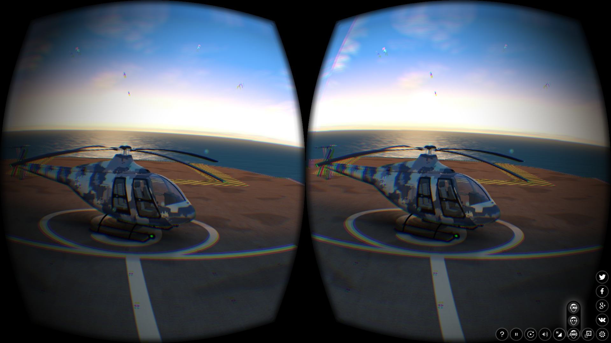

.. _postprocessing_effects:

**************************
Постпроцессинговые эффекты
**************************

.. index:: размытие при движении (motion blur)

.. _motion_blur:

Размытие при движении
=====================

Эффект размытия при движении (motion blur) служит целям увеличения реализма интерактивной сцены. Он проявляется при движении камеры или объектов в виде "смазывания" изображения.

.. image:: src_images/postprocessing_effects/motion_blur.jpg
   :align: center
   :width: 100%

Активация
---------

Активировать панель ``Motion Blur`` во вклдадке ``Render``.

Дополнительные настройки
------------------------

*Factor*
    Степень проявления эффекта. Чем выше значение, тем сильнее эффект размытия. Значение по умолчанию 0.01.

*Decay threshold*
    Степень плавности размытия. Чем выше значение, тем более резким будет эффект. Значение по умолчанию 0.01.

.. index:: глубина резкости камеры (depth of field), DOF

.. _dof:

Глубина резкости камеры
=======================

Эффект глубины резкости камеры (depth of field, DOF) акцентирует внимание зрителя на части сцены. Проявляется в размытии изображения ближе и дальше от фокуса камеры.

.. image:: src_images/postprocessing_effects/dof.jpg
   :align: center
   :width: 100%

Активация
---------

1. Выбрать активную камеру, перейти на панель ее настроек во вкладке ``Camera`` (``Object Data``).
2. Далее возможны два варианта:

    - На панели ``Depth of Field`` в опции ``Focus`` выбрать объект, на котором будет сфокусирована камера. В этом случае при удалении или приближении к этому объекту будет происходит соответствующая коррекция фокуса камеры.
    
    - На той же панели установить ненулевое значение ``Distance`` (в метрах). В этом случае фокус камеры будет располагаться на заданном расстоянии от камеры и перемещаться вместе с ней. 

Дополнительные настройки
------------------------

*Front*
    Расстояние от фокуса до ближней к камере плоскости, за которой происходит полное размытие (в метрах). Значение по умолчанию 1.0.

*Rear*
    Расстояние от фокуса до дальней от камеры плоскости, за которой происходит полное размытие (в метрах). Значение по умолчанию 1.0.

*Power*
    Степень размытия. Значение по умолчанию 3.0.

.. index:: взаимное затенение (screen-space ambient occlusion), SSAO

.. _ssao:

Взаимное затенение
==================

Эффект взаимного затенения (screen-space ambient occlusion, SSAO) применяется с целью воспроизведения сложного переотражения света от объектов. Пространство между близкими объектами менее доступно для рассеянного света и поэтому затеняется сильнее.

.. image:: src_images/postprocessing_effects/ssao.jpg
   :align: center
   :width: 50%

Активация
---------

Активировать панель ``Ambient Occlusion (SSAO)`` во вкладке ``Render`` и выставить параметр опции ``Render Shadows`` в положение ``AUTO`` или ``ON``  на панели ``Render > Shadows``.

Дополнительные настройки
------------------------

*Radius Increase*
    Фактор умножения радиуса сферического сэмплинга при переходе от внутреннего кольца к внешнему. Значение по умолчанию 3.0.

*Use Hemisphere*
    Использовать для расчёта затенения полусферический сэмплинг вместо сферического. Помимо этого используется другой закон затенения.

*Use Blur Depth Test*
    Если активировано - используется размытие SSAO на основе буфера глубины. Иначе - размытие по квадарту 4х4 по соседним пикселям.

*Blur Depth Test Discard Value*
    Влияние разницы глубины сэмлов на их вес в размытии. Используется при активированном параметре ``Use Blur Depth Test``. Значение по умолчанию 1.0.

*Influence*
    Степень проявленности эффекта взаимного затенения. Значение по умолчанию 0.7.

*Distance Factor*
    Фактор уменьшения проявленности эффекта взаимного затенения с расстоянием. Значение по умолчанию 0.0 (т.е. уменьшения нет).

*Samples*
    Количество сэмплов (чем больше, тем лучше качество, но меньше производительность). Значение по умолчанию 16.

.. index:: сумеречные лучи (crepuscular rays), god rays

.. _god_rays:

Сумеречные лучи
===============

Эффект сумеречных лучей (crepuscular rays, "god rays") симулирует известное природное явление - свечение освещенных областей воздуха.  

.. image:: src_images/postprocessing_effects/god_rays.jpg
   :align: center
   :width: 100%

Активация
---------

Активировать панель ``God Rays`` во вкладке ``Render``.

Дополнительные настройки
------------------------

*Intensity*
    Степень проявленности эффекта. Значение по умолчанию 0.7.

*Maximum Ray Length*
    Фактор длины лучей. Определяет шаг сэмплов радиального размытия. Значение по умолчанию 1.0.

*Steps Per Pass*
    Количество шагов на один сэмпл. Значение по умолчанию 10.0.

Эффект засветки ярких деталей
=============================

Эффект засветки (Bloom) проявляется при наличии на экране элементов с большой разницей в яркости. Вокруг ярких деталей создается светящийся ореол.

.. image:: src_images/postprocessing_effects/bloom.jpg
   :align: center
   :width: 100%

Активация
---------

Активировать панель ``Bloom`` во вкладке ``Render``.

Дополнительные настройки
------------------------

*Key*
    Интенсивность эффекта свечения.

*Blur*
    Степень размытия засветки.

*Edge Luminance*
    Граничное значение относительной яркости элемента, выше которого начинает проявляться эффект засветки.

.. index:: подсветка контура (outline glow)

.. _outline:

Подсветка контура (outlining)
============================= 

В результате применения эффекта подсветки контура вокруг объекта появляется светящийся ореол произвольного цвета.

.. image:: src_images/postprocessing_effects/outline.jpg
   :align: center
   :width: 100%

Активация
---------

Эффект подсветки контура активируется программно через API. Может быть реализован как эффект постоянного свечения, так и затухающего, пульсирующего и любой другой модели. Для включения возможности подсветки объектов необходимо убедиться, что в панели ``Render > Object Outlining`` поле ``Enable`` установлено в состояние ``ON`` или ``AUTO``.

Дополнительные настройки
------------------------

На панели ``Object > Selection and Outlining``:

*Enable Outlining*
    Разрешить использование эффекта подсветки контура на конкретном объекте.

*Duration*
    Длительность анимации подсветки, сек. Значение по умолчанию 1.

*Period*
    Период повторения анимации подсветки, сек. Значение по умолчанию 1.

*Relapses*
    Количество итераций анимации подсветки. В случае 0 анимация будет повторяться бесконечно. Значение по умолчанию 0.

*Outline on Select*
    Активация анимации подсветки при выделении объекта. Для данного случая необходимо включить опцию ``Selectable``. При необходимости реализации собственной модели подсветки объекта следует отключить эту опцию во избежание конфликта.

На панели ``Render > Object Outlining``:

*Factor*
    Толщина и яркость ореола, окружающего объект. Падает с уменьшением параметра. Значение по умолчанию 1.

При управлении через API настройки на панели ``Render > Object Outlining`` воспринимаются как настройки по умолчанию.

   
.. index:: анаглиф, стереоизображение

.. _stereo:

Стереоизображение
=================

Режим стереоизображения предназначен для просмотра контента в специальных очках и активируется приложением.

Blend4Web поддерживает два стереорежима - анаглифное изображение и HMD (Head-mounted display, шлем виртуальной реальности).

Анаглиф:

.. image:: src_images/postprocessing_effects/postprocessing_effects_anaglyph.png
   :align: center
   :width: 100%

HMD:

HMD - экспериментальная возможность, она работает только с камерами типа ``Eye``.

Активация
---------

Для работы стереорежима HMD нужно установить `runtime-утилиту <https://developer.oculus.com/downloads/>`_ от Oculus. Версии для Windows и MacOS присутствуют на сайте Oculus в бинарном формате, версию утилиты для Linux пользователю понадобится собирать из исходников самостоятельно.

На сегодняшний день HMD поддерживается в экспериментальных сборках `Chromium <http://blog.tojicode.com/2014/07/bringing-vr-to-chrome.html>`_ и в nightly build `Firefox <https://nightly.mozilla.org/>`_.

`Настройки Chromium. <https://docs.google.com/document/d/1g02qHfX85vSRSOkWm9k33I0b7VuyN79md9U9t6MIa4E/edit>`_

`Настройки Firefox. <https://developer.mozilla.org/en-US/docs/Web/API/WebVR_API>`_

Чтобы включить стереорежим, нужно выбрать соответствующий пункт в настройках приложения, в третьем столбце справа, как показано на иллюстрации.

.. image:: src_images/postprocessing_effects/postprocessing_effects_hmd.png
   :align: center
   :width: 100%

Для корректной работы рекомендуется включить полноэкранный режим.

Дополнительные настройки
------------------------

Отсутствуют.

.. index:: коррекция цвета

.. _color_correction:

Коррекция цвета
===============

.. image:: src_images/postprocessing_effects/color_correction.jpg
   :align: center
   :width: 100%

Активация
---------

Активировать панель ``Color Correction`` во вкладке ``Render``.

Дополнительные настройки
------------------------

*Brightness*
    Яркость. Значение по умолчанию 0.0.

*Contrast*
    Контрастность. Значение по умолчанию 0.0.

*Exposure*
    Экспозиция. Значение по умолчанию 1.0.

*Saturation*
    Насыщенность. Значение по умолчанию 1.0.

.. _glow:

Свечение (glow)
===============

Эффект возникновения ореола вокруг светящихся объектов, возникающий вследствие рассеивания света в атмосфере и внутри человеческого глаза.

.. image:: src_images/postprocessing_effects/glow.jpg
   :align: center
   :width: 100%

Активация
---------

Добавить в нодовый материал ноду :ref:`B4W_GLOW_OUTPUT <glow_output>`. Для включения возможности свечения в панели ``Render > Glow Materials`` опция ``Enable`` должна быть установлена в состояние ``ON`` или ``AUTO``.

Дополнительные настройки
------------------------

*Small Mask: Intensity*
    Интенсивность свечения по малой маске. Значение по умолчанию 2.0.

*Small Mask: Width*
    Ширина свечения по малой маске. Значение по умолчанию 2.0.

*Large Mask: Intensity*
    Интенсивность свечения по большой маске. Значение по умолчанию 2.0.

*Large Mask: Width*
    Ширина свечения по большой маске. Значение по умолчанию 6.0.

*Render Glow Over Transparent Objects*
    Отрисовывание эффекта свечения поверх прозрачных объектов. По умолчанию выключено.

.. index:: сглаживание

.. _antialiasing:

Сглаживание
===========

Сглаживание (anti-aliasing) необходимо для уменьшения влияния нежелательных артефактов рендеринга ("зубчатости"). 

.. image:: src_images/postprocessing_effects/antialiasing.jpg
   :align: center
   :width: 100%

Активация
---------

Выбрать один из профилей качества в поле ``AA Quality`` на панели ``Render > Anti-Aliasing``:

    * *None* - антиалиасинг отключен,
    * *Low*, *Medium*, *High* - применяется антиалиасинг с низкими, средними и высокими параметрами качества соответственно.

Значение по умолчанию: *Medium*.

Дополнительные настройки
------------------------

Итоговые настройки сглаживания назначаются копмозицией выбора профиля качества антиалиасинга и выбора профиля работы движка. При выборе профиля работы движка действуют следующие настройки:

    * *низкое качество* - антиалиасинг отключен,
    * *высокое качество* и *максимальное качество* - использовать алгоритм FXAA 3.11 (Fast Approximate Anti-Aliasing, Nvidia).

