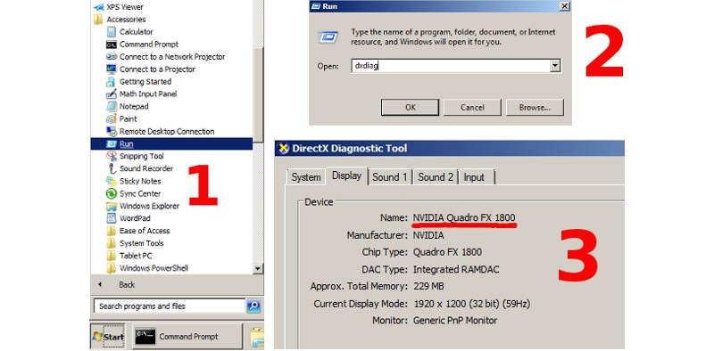

.. _problems_and_solutions:

******************
Проблемы и решения
******************

.. contents:: Содержание
    :depth: 3
    :backlinks: entry

.. _renderer_not_working:

Проблемы при запуске движка
===========================

*1. Появляется сообщение "Browser could not initialize WebGL."*

.. image:: src_images/problems_and_solutions/no_webgl.png
   :align: center
   :width: 100%

Следует выполнить действия, описанные в разделе :ref:`webgl_not_working`. 

*2. Видны элементы интерфейса или пустой экран, но сцена не отображается. При этом тестовый сайт* http://get.webgl.org/ *и другие WebGL приложения работают корректно.*

    Вероятные причины:

    * Не используется локальный веб-сервер или браузер не настроен для работы с локальными ресурсами. См. раздел :ref:`browser_for_local_loading`.

    * Файлы ресурсов, которые пытается загрузить движок, были перемещены или удалены.

    * Используются старые версии драйверов.

    * Используются открытые драйвера, не обеспечивающие поддержку WebGL.

        Для пользователей Linux - ввиду неполной реализации OpenGL стека в драйверах
        с открытым кодом в настоящий момент рекомендуется
        использовать проприетарные драйверы текущей версии для графических процессоров Nvidia и AMD.

    * Используется устаревшая операционная система, такая как Windows XP.

.. _webgl_not_working:

Ошибка инициализации WebGL
==========================

Сайт http://get.webgl.org/ при просмотре в браузерах Chrome или Firefox последней версии сообщает о проблемах. Что делать? 

1. Установить доступные обновления для системы (для Windows см. `инструкцию <http://support.microsoft.com/kb/311047/ru>`_). В случае Windows установить последнюю версию `DirectX <http://www.microsoft.com/ru-ru/download/details.aspx?id=35>`_. Перезагрузить систему.

2. Рекомендуется проводить своевременное обновление драйверов для графических карт. Чтобы определить тип и производителя карты, можно ввести **about:gpu** (или **chrome://gpu**) в адресную строку браузера Chrome...

.. image:: src_images/problems_and_solutions/chrome_gpu.png
   :align: center
   :width: 100%

|

или Firefox...

.. image:: src_images/problems_and_solutions/firefox_gpu.png
   :align: center
   :width: 100%

|

Для операционных систем семейства Windows можно воспользоваться средством диагностики DirectX **dxdiag**.

|

Необходимо загрузить драйверы с соответствующего центра поддержки (например, `Intel <http://downloadcenter.intel.com/Default.aspx?lang=rus>`_, `Nvidia <http://www.nvidia.com/Download/index.aspx?lang=ru>`_, `AMD/ATI <http://support.amd.com/ru-ru/download>`_). После установки драйверов перезагрузить систему.

3. Если в результате вышеперечисленных действий инициализировать рендеринг не удается (или нет возможности обновить систему), можно попробовать изменить настройки браузера. 

*В Chrome*:

Ввести **about:flags** (или **chrome://flags**) в адресную строку браузера, нажать :file:`Включить` (:file:`Enable`) под опцией :file:`Переопределение списка программного рендеринга` (:file:`Override software rendering list`) и перезапустить браузер.

|

.. image:: src_images/problems_and_solutions/about_flags_force_webgl.png
   :align: center
   :width: 100%

|

*В Firefox*: 

Ввести **about:config** в адресную строку браузера, найти параметр ``webgl.force-enabled`` и переключить его двойным щелчком мыши из ``false`` в ``true``. 

.. image:: src_images/problems_and_solutions/about_config_force_webgl.png
   :align: center
   :width: 100%

.. _known_problems:

Известные проблемы
==================

* Проблемы с обновлением старых версий аддона.

    Рекомендуется перезагрузка Blender после обновления аддона.

* Драйверы NVIDIA версии 331 в Linux могут приводить к программным ошибкам WebGL.

* Изменение фильтрации текстур на некоторых устройствах.

    При использовании *iPad* или браузера *Internet Explorer* отключена некорректная фильтрация текстур, которые используются материалами с типом прозрачности *Alpha Clip*.

* Некоторые устройства, использующие GPU Mali, требуют принудительного включения WebGL в настройках браузера.

* На системах Apple OS X и Blender 2.76 для работы локального сервера разработки может потребоваться установка `Python 3.4 <https://www.python.org/downloads/release/python-343/>`_. Это связано с ошибкой Blender https://developer.blender.org/T46623. В Blender 2.76b эта проблема устранена, поэтому рекомендуем обновиться.

* При использовании драйверов Nouveau скелетная анимация может работать некорректно.

* В браузерах IE11 и Microsoft Edge, а также на iPad могут некорректно рендериться текстуры с прозрачностью. 

    Проблема актуальна для :ref:`прозрачных материалов <alpha_blend>`. Артефакты заметны на тех участках, где значение альфа-канала равно нулю или отличается от него незначительно. Для исправления рекомендуется поднимать значение альфа-канала пока артефакты не исчезнут (как правило, бывает достаточно величин в диапазоне от 0.01 до 0.05). 