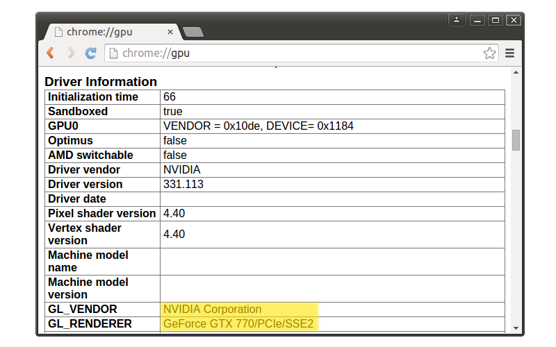
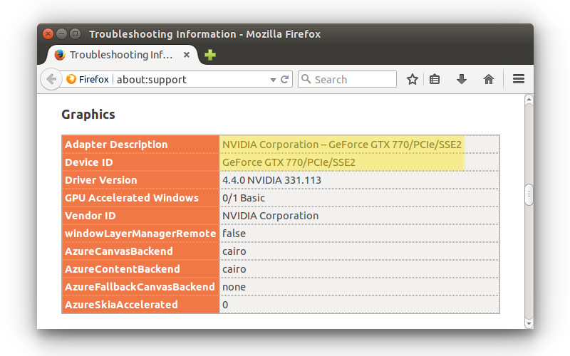
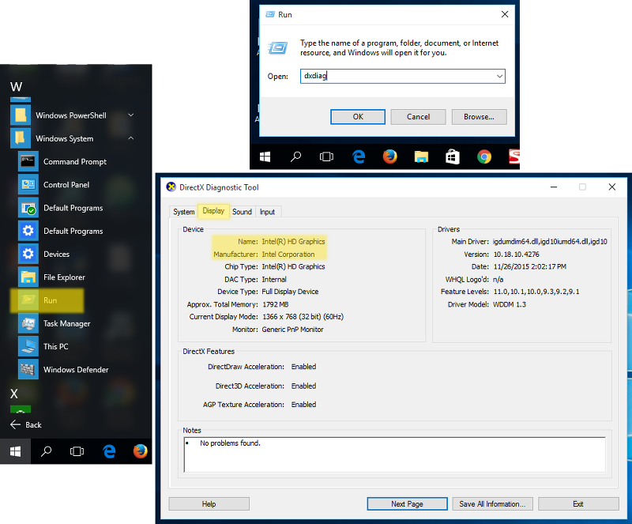
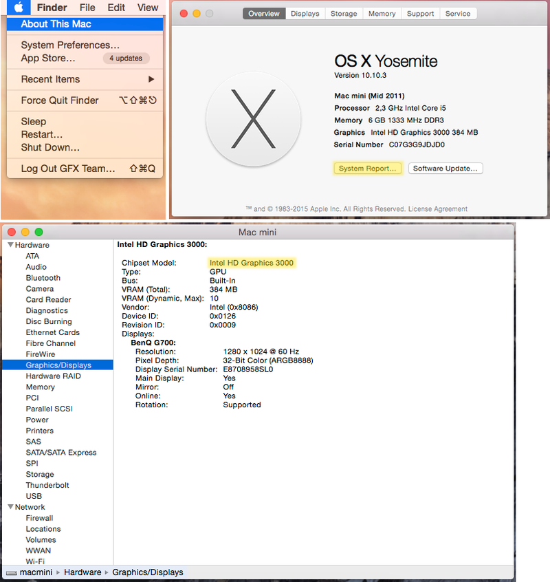
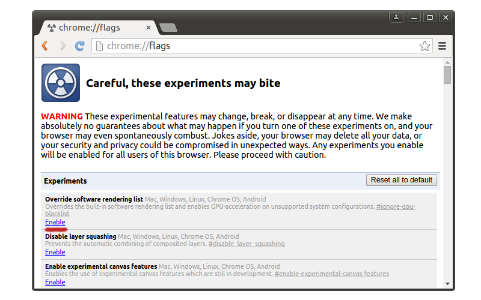
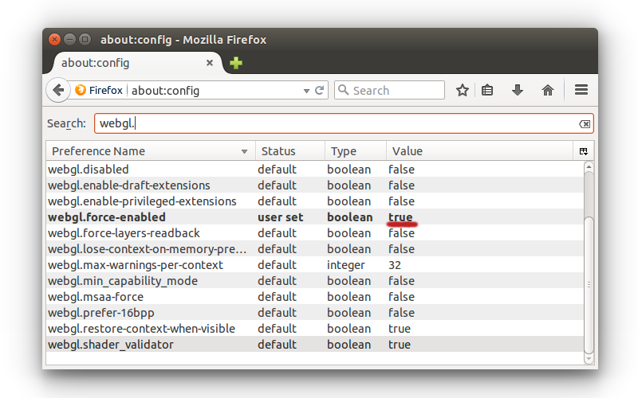

.. _problems_and_solutions:

**********************
Problems and Solutions
**********************

.. contents:: Table of Contents
    :depth: 3
    :backlinks: entry

As `WebGL <https://www.blend4web.com/en/technologies/webgl/>`_ is still a relatively new technology, it may not work perfectly with every combination of software and hardware. This chapter covers common problems that users of the Blend4Web engine may encounter and provides solutions for these problems.

.. _webgl_support:

WebGL Support
=============

If you are using a desktop or laptop computer, your system must have a GPU that supports DirectX 9.0c and OpenGL 2.1, such as:

    * Nvidia GeForce 6xxx series or higher.

    * AMD/ATi Radeon R500 (X1xxx) series or higher.

    * Intel GMA 950 or higher.

If you are using WebGL on a mobile device, please check whether your device is on the `compatibility list <http://mobilehtml5.org/>`_.

You also need to have a web browser that supports WebGL technology.

The following web browsers support WebGL:

    * Google Chrome (v. 9 or higher)
    * Mozilla Firefox (v 4.0 or higher)
    * Safari (v. 8.0 or higher)
    * Chrome for Android (v. 25 or higher)
    * Internet Explorer (v. 11 or higher)
    * Microsoft Edge
    * Opera (v. 12 or higher)
    * UC Browser (experimental)
    * Yandex Browser

We also recommend to use the most recent version of the web browser to avoid compatibility problems.

.. _renderer_not_working:

Problems Upon Startup
=====================

*1. The "Browser could not initialize WebGL" message is shown*.

.. image:: src_images/problems_and_solutions/no_webgl.png
   :align: center
   :width: 100%

Follow the instructions listed in the :ref:`webgl_not_working` section.

*2. The user interface or background is shown but the default scene is not rendered. At the same time the* http://get.webgl.org/ *site and other WebGL applications are working correctly.*

    Possible causes:

    * The engine tries to load resource files which were moved or deleted.

    * You are using the old versions of video drivers.

    * You are using open source drivers which do not fully support WebGL.

        For Linux users - due to incomplete OpenGL implementation in open source drivers at the moment it is recommended to use current versions of proprietary drivers for Nvidia and AMD video cards.

    * You are using an outdated operating system, such as Windows XP.

    * Browser is not set up for loading local resources. In this case, the problem can be fixed by using local web server. See the :ref:`browser_for_local_loading` section.

.. _webgl_not_working:

WebGL Failed to Initialize
==========================

The http://get.webgl.org/ page tells about problems when viewing it in recent Chrome or Firefox. What can I do?

1. Install the latest updates for your system (for MS Windows see `the guide <http://support.microsoft.com/kb/311047>`_). In case of MS Windows install the latest `DirectX runtime <https://www.microsoft.com/en-us/Download/confirmation.aspx?id=35>`_. Reboot.

2. It is recommended to timely update video card drivers. To detect your video card and its vendor please type **about:gpu** (or **chrome://gpu**) to the address bar of Chrome browser...

|

or Firefox...

|

For Windows, you can run the DirectX Diagnostic Tool called **dxdiag**.

To do it, please follow these steps:

    #. Select the ``Run`` command from the Start menu

    #. Type *dxdiag* to the ``Open`` field and press ``Enter`` to open DirectX Diagnostic Tool

    #. Open the ``Display`` panel. There you can find manufacturer, model and other information regarding your video card.

|

For macOS, you can check System Report.

To do it, please follow these steps:

    #. Select ``About This Mac`` from the ``Apple`` menu.

    #. Click ``System Report`` button.

    #. Select ``Graphics/Displays`` in the ``Hardware`` section.

|

Download the drivers from the corresponding support center (for example `Intel <http://downloadcenter.intel.com/Default.aspx>`_, `Nvidia <http://www.nvidia.com/Download/index.aspx>`_, `AMD/ATI <http://support.amd.com/en-us/download>`_). Reboot the system after the drivers are installed.

3. If the measures described above did not help to initialize rendering (or there is no possibility to update the system) try to change the browser settings.

*For Chrome*:

Enter **about:flags** (or **chrome://flags**) into the browser's address bar, click :file:`Enable` under the :file:`Override software rendering list` option and restart the browser.

|

|

*For Firefox*:

Enter **about:config** into the browser's address bar, search for the ``webgl.force-enabled`` parameter and double-click on it to switch from ``false`` to ``true``.

*For Safari*

Select ``Preferences`` from Safari menu, select the ``Security`` tab and make sure that ``Allow WebGL`` checkbox is enabled.

.. image:: src_images/problems_and_solutions/safari_force_webgl.png
   :align: center
   :width: 100%

More In-Depth Troubleshooting
=============================

If nothing mentioned above helped you solve the issues you are experiencing, please visit the Blend4Web `community forum <https://www.blend4web.com/en/forums/>`_ and leave a message in the `Bug Report <https://www.blend4web.com/en/forums/forum/17/>`_ thread. Our team will be sure to help you. 

.. _known_problems:

Known Issues
============

* Problems with updating of the add-on.

    It’s strongly advised to restart Blender after installing a newer version of Add-on/SDK.

* NVIDIA 331 driver in Linux can cause WebGL errors.

* Changed texture filtering on some platforms.

    An incorrect texture filtering was disabled on iPad and Internet Explorer for materials with Alpha Clip type of transparency.

* Some devices with Mail GPU require manual WebGL activation in browser settings.

* For the local development server to work on Apple macOS and Blender 2.76, you may need to install `Python 3.4 <https://www.python.org/downloads/release/python-343/>`_. This is due to a bug in Blender https://developer.blender.org/T46623. This bug has been fixed in Blender 2.76b, so updating it is advised.

* Skeletal animation may work incorrectly while using Nouveau drivers.

* Transparent textures may not render correctly in the IE11 and Microsoft Edge web browsers and on iPad.

    The problem is relevant for the :ref:`transparent materials <alpha_blend>`. Image artifacts are visible in the areas where alpha channel value is close or equal to zero. To fix this issue, it is recommended to increase the value of the alpha channel until artifact are no longer visible (increasing it by value from 0.01 to 0.05 should be enough in the most cases).

* WebGL crashes on Linux Chromium with Nvidia GeForce 400/500 series GPUs with drivers later than 355.
    
    This issue is caused by incompatibility of Chromium sandbox and NVIDIA's latest drivers. The solution is to downgrade drivers to the 340xx version.

* Audio issues.

    Audio doesn't work in some versions of Google Chrome for the "Background Music" speakers in case of HTML export. Currently, speaker type is automatically changed to "Background Sound" as a workaround.

    There is an audio context error when running too many instances (>6) of b4w engine (for example, many browser tabs or many iframes on one page) in Google Chrome. The error is prevented by disabling the audio for an application if the audio context cannot be created for it.

    Pausing the audio may not work on such mobile devices as Nexus 6 and Nexus 9 in Google Chrome 50-52 versions. It should work again in Chrome 53. More info here: `https://bugs.chromium.org/p/chromium/issues/detail?id=616772 <https://bugs.chromium.org/p/chromium/issues/detail?id=616772>`_.

* QQ Browser doesn't support WebGL at the moment.

* WebGL is unstable and sometimes crashes on Mesa 11.x drivers in Linux/Chrome with Intel GPUs. Downgrading to Mesa 10.x drivers can help.

* Information about moving fingers on GearVR touch sensor in VR-mode is not available.

    Samsung Internet browser doesn't fire any events about moving fingers on touch sensor in VR-mode.

* Particles emitted by particle systems placed on inactive (hidden) layers can have their positions set to zero as inactive layers are not updated by Blender.

    This problem can be solved by activating layers before exporting a scene or by simply clicking the layers to make Blender update them.

* Alpha blending objects are rendered incorrect on the Mali 400 series GPU by Google Chrome browser.

* Using several application instances in a single page can lead to excessive memory usage or even a tab crash in Chrome 59. However, this is fixed in Chrome 60.
