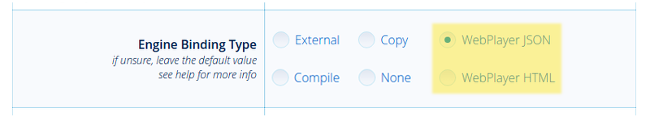

.. _project_management:

******************
Project Management
******************

.. contents:: Table of Contents
    :depth: 3
    :backlinks: entry

Since version 15.09, the SDK includes a project management feature, which makes it possible to:

    * browse the full list and file structure of the projects;

    * launch apps, run exported scenes in the Viewer, open source blend files in Blender;

    * create and configure new apps, including those based on ready-made templates;

    * build apps and pack them to be conveniently deployed on a remote server;

    * convert app resources (textures, audio and video files) into alternative formats to ensure cross-browser and cross-platform performance;

    * automatically re-export all scenes of an app, including export to JSON and HTML formats;

    * remove projects.

.. _project_manager:

Project Manager
===============

The *Project Manager* app can be run from the *Tools* section of the SDK’s index page. Upon launching, the app outputs a list of all current projects in the SDK.

.. image:: src_images/project_manager/project_manager_overview.png
   :align: center

The commands for project management are located at the top of the page.

    .. image:: src_images/project_manager/project_manager_actions.png
       :align: center
       :width: 100%

*Back to Index*
    Returns to the Blend4Web SDK index page.

*Create New Project*
    Opens the :ref:`project creation <create_new_project>` wizard.

*Import Project(s)*
    Opens the :ref:`project import <import_projects>` dialogue.

*Export Project(s)*
    Opens the :ref:`project export <export_projects>` page.

*Hide Stock Projects*
   Can be used to hide stock projects. If such projects are already hidden, this command is replaced with the ``Show Stock Projects`` command.

*Help*
    Opens the :ref:`Help file <project_manager>`.

Commands for managing a specific project is located at its right.

.. note::
    Some commands may not be available depending on the type of the project.

.. image:: src_images/project_manager/project_manager_commands.png
   :align: center

#. Build project (not available for Web Player JSON and Web Player HTML projects).
#. Check for missing or unnecessary API modules (not available for Web Player JSON and Web Player HTML projects).

    Activating this option will make the Project Manager check the modules used by the application and output the results of the check to the console. Possible warning messages are listed below:

    1. If one or more API modules are missing from the project's folder, the following message will be displayed:

     `Module \`module_name\` is missing in the \`project_name.html\` project, please include it or run \`Update Modules\`.`

    .. image:: src_images/project_manager/project_manager_check_modules_missing.png
       :align: center

    These missing modules can be appended to the project with the ``Update Modules`` button.

    2. If the project has one or more API modules that are not used anywhere in the program code, the following message will be displayed:

     `Incorrect module \`module_name\` in the \`project_name.html\`, please remove it or run \`Update Modules\`.`

    .. image:: src_images/project_manager/project_manager_check_modules_required.png
       :align: center

    These incorrect modules can be removed from the project with the ``Update Modules`` button.

    3. In case no problems with missing/unnecessary modules have been detected, the following message will be displayed:

    `Module check complete. No problems detected in the \`module_name.html\`.`

    .. image:: src_images/project_manager/project_manager_check_modules_complete.png
       :align: center

#. Re-export blend files from the project.
#. :ref:`Convert media resources. <converter>`
#. :ref:`Export and download a project archive <project_deploy>`.
#. Remove the project.
#. :ref:`Update file structure <updating_project_structure>`. Available only for the project created with versions of Blend4Web older than 16.12.

.. note::

    All project paths are retrieved from its :ref:`.b4w_project config file <b4w_config>`.

Beside the project's name are located the links to the 

#. :ref:`project information page  <project_info>`,
#. :ref:`project file editor <project_edit>` and
#. :ref:`project configurator <project_config>`. 

The application type is also specified there. An application can have one of the following types:

*Player*
    The application can be played using the Web Player.

*Dev*
    Application for development.

*Build*
    Compiled application.

.. _create_new_project:

Project Creation Wizard
-----------------------

The tool for creating new projects is included in the Project Management app and executed by the ``[Create New Project]`` button on the main page of this app.

    .. image:: src_images/project_manager/project_manager_create_project.png
       :align: center
       :width: 100%

The ``[Back to Projects]`` button can be used to return to the Project Manager's main page, while the ``[Help]`` button can be used to access the :ref:`Help file <create_new_project>`.

1) Project name is used to name project directories such as "projects/project_name", "projects/project_name/assets", "projects/project_name/blender" and "projects/project_name/build".
2) Project title as shown in the browser.
3) Project author’s name.
4) Add application templates. Standard application templates: html file, css file, js file will be added to the project directory "projects/project_name".
5) Add scene templates. Standard json file will be added to the "projects/project_name/assets" directory; blend file will be added to the "projects/project_name/blender" directory.
6) Use Material Library. Blend files of the material library will be copied to the project directory "projects/project_name/blender", while the asset files will be copied to "projects/project_name/assets" folder.
7) Copy project manager script. The project.py script will be copied to the project directory.
8) Project’s type. Several options are available:

    * ``Copy`` - engine files will be directly copied from the ``deploy/apps/common/`` to the application folder.

        When the project is deployed, only application files are compiled, while engine files are left intact (so you cannot modify the engine itself);
    * ``Compile`` - engine sources are compiled with application scripts.

        This option can be used to modify the code of the engine itself;
    * ``None`` - Project Manager will not copy the engine files to the application folder, nor will it perform any operations upon building the application. Application developers will have to manually perform everything they need;
    * ``Web Player JSON`` - json-file placed inside the project is run with the help of web-player inside SDK;
    * ``Web Player HTML`` - project is packed into single html-file, containing all required resources.

9) Javascript optimization level.

    * "Simple" - variable names are replaced in the code;
    * "Advanced" - code optimization is performed;
    * "Whitespace Only" - only whitespaces are removed from the code.

.. _web_player_params:

10) Web Player URL attributes. This tab is available only if ``Engine Binding Type`` parameter is set to ``Web Player JSON`` or ``Web Player HTML``.

    * "Show FPS" is used to display the FPS counter in the player’s top right corner.
    * "Auto-rotate camera" enables automatic camera rotation just after the scene loads.
    * "Disable social network buttons" disables social networks buttons on the control panel.
    * "Background transparency" enables transparency for the rendering area.
    * "Use compressed textures" enables loading of minified and compressed textures (in DDS format).

.. _web_player_app:

Creating a Web Player Application
---------------------------------

The main advantage of Web Player applications is the ease of deploying such applications on a website.

Creating a Web Player application is simple. All you have to do when creating a new project is select the ``Web Player JSON`` or ``Web Player HTML`` option under the Application Type tab.

The parameters that are available for a Web Player project are mostly the same as for any other type of project. The only exception is the group of parameter known as the Web Player Params.

Project Settings
................

.. image:: src_images/project_manager/project_manager_web_player_parameters.png
       :align: center
       :width: 100%

This panel is only available if the ``Web Player JSON`` or ``Web Player HTML`` option has been enabled. The parameters listed here are in essence URL attributes that the Web Player application will use while running the project.

Project Building and Deploy
...........................

After the work on a project is completed, it can be built and deployed to a web server. All of this is described in a :ref:`dedicated section <project_deploy>`.

.. _project_info:

Project Information
-------------------

This page contains information regarding the selected project and can be viewed by the ``[info]`` link beside the project's title.

    .. image:: src_images/project_manager/project_manager_info.png
       :align: center
       :width: 100%

Commands
........

*Back to Projects*
    Returns to the Project Manager's main page.

*Help*
    Opens the :ref:`Help file <project_info>`.

Project Parameters
..................

*Project Name*
    The name of the project.

*Project Title*
    Project title as shown in the browser.

*Project Author / Company*
    The name of the project's author or the title of the developer company.

*Project Icon*
    The icon of the project.

*Applications*
    Project applications.

*Engine Binding Type*
    The type of the project.

*Project Path (Development Directory)*
    Project's directory.

*Project Config*
    Project's config file.

*Build Directory*
    Project build directory.

*Blend Directory(s)*
    Directories where project's blend files are located.

*Assets Directory(s)*
    Directories where project's media assets are located.

*URL Params*
    The list of :ref:`URL parameters <webplayer_attributes>` used to start the application.

*JavaScript Obfuscation Level*
    JavaScript optimization level.

*JS Compilation Pass-Through List*
    The list of pass-through exceptions for the project's JavaScript files compilation.

*CSS Compilation Pass-Through List*
    The list of pass-through exceptions for the project's style sheets compilation.

*Build Ignore List*
    The list of exceptions for project's builds.
     
*Deployment Assets Directory*
    Directory where assets will be placed for deployed project.

*Deployment Assets URL Prefix*
    URL path prefix to assets directory inside deployed project as reported by :b4wref:`config.get_assets_path()`.

*Deployment Ignore List*
    The list of exceptions for project's deploy.

.. _project_edit:

Project Editing
---------------

A simple web-based interface for editing project files is available by the ``[edit]`` link beside the project's title.

.. image:: src_images/project_manager/project_manager_edit_project.png
   :align: center
   :width: 100%

The left part of the editor window contains a list of all ``.html``, ``.css`` and ``.js`` files from the project directory (``projects/my_project``). The right part contains the content of a currently selected project file (no file is selected by default) with highlighted syntax.

.. note::
    This interface can only be used to edit files from developer version of a project, but not from the built version.

New ``.html``, ``.js`` and ``.css`` files can be added to the project directory by clicking the ``[New File]`` button.

The ``[Save]`` and ``[Save As...]`` buttons that can be found at the bottom of the page are used for saving currently selected project file.

.. _project_config:

Project Config
--------------

This is a web interface that allows the developer to view and change project settings after the project is created.

.. image:: src_images/project_manager/project_manager_config.png
   :align: center
   :width: 100%

This page include all settings available during project creation along with some additional parameters. Some of the parameters are read-only (and thus cannot be changed after the project is created).

``Info`` Settings Group
.......................

*Name*
    The name of the project.

    This is a read-only parameter.

*Title*
    Project title as shown in the browser.

*Author*
    The name of the project's author or the title of the developer company.

*Icon*
    The icon of the project in the Project Manager.

    The icon can be replaced with the ``Choose File`` button. If an icon is not specified (as it is by default), Blend4Web logo is used.

``Build`` Setting Group
.......................

*Apps*
    The list of the project's ``.HTML`` files that are used for compiling applications. Each ``.HTML`` file is considered a separate application.

*Use Physics*
    Enables and disables adding physics engine files to the project. Can be turned off if the project does not use physics.

    This parameter is always disabled for a WebPlayer HTML type project and always enabled for a WebPlayer JSON type. For other types of projects, it can be set manually.

*Application Type*
    The type of the project.

    This is a read-only parameter, as projects with different types have different inner structure.

*JavaScript Obfuscation Level*
    JavaScript optimization level for compiling application.

    This parameter is read-only for the None, WebPlayer HTML and WebPlayer JSON type projects.

*JS Compilation Pass-Through List*
    The list of pass-through exceptions for the project's JavaScript files compilation.

*CSS Compilation Pass-Through List*
    The list of pass-through exceptions for the project's CSS files.

*Build Ignore List*
    The list of exceptions for project's builds.

``Paths`` Setting Group
.......................

*Developer Project Path*
    The path to the application for development.

    This is a read-only parameter.

*Build Project Path*
    The path to the compiled application.

*Blend Directory(s)*
    Path(s) to the blend file directory(ies).

*Assets Directory(s)*
    Path(s) to the assets directory(ies).

*Blender Exec*
    The path to the Blender executable file.

*Deployment Path*
    The path to the folder for project final deployment.

``Deploy`` Setting Group
........................

*Deployment Assets Directory*
    Directory where assets will be placed for deployed project.

*Deployment Assets URL Prefix*
    URL path prefix to assets directory inside deployed project as reported by :b4wref:`config.get_assets_path()`.

*Deployment Ignore List*
    The list of exceptions for project's deploy.

*Override Deployment Path*
    Deletes deployment directory, if it already exists.

URL GET Params
..............

The additional GET parameters for the URL link to the application in the Project Manager interface are specified in this field.

Project setting can be saved by pressing the ``[Save Config]`` button at the bottom of the screen.

.. _import_projects:

Project Import
--------------

Tools for importing projects are available by the ``[Import Project(s)]`` link.

Clicking this link opens standard Open File dialog where you can select the project you need to import.

.. _export_projects:

Project Export
--------------

Project exporting window can be accessed by the ``[Export Project(s)]`` link.

    .. image:: src_images/project_manager/project_manager_export.png
       :align: center
       :width: 100%

Commands
........

*Back to Projects*
    Returns to the Project Manager’s main page.

*Hide Stock Projects*
    Hides stock projects. If such projects are already hidden, this command is replaced with the ``[Show Stock Projects]`` command.

*Help*
    Shows the Help page.

*Export Project(s)*
    Can be used to export selected projects.

Project Parameters
..................

*Select*
    Shows if the project is selected for export.

*Name*
    The name of the project's directory.

*Title*
    Project's title.

*Author*
   Project author’s name.

*Archive Name*
    The name of an archive to which exported projects are packed.

.. _project_deploy:

Deploying the Project
---------------------

After you have completed your project, select the ``deploy project`` option from the ``Operations`` panel on the Project Manager main page. The project will be exported and packed into a single archive.

.. image:: src_images/project_manager/project_manager_deploying.png
       :align: center
       :width: 100%

After that, this archive can then be downloaded by to the folder where your web browser stores all downloaded files by pressing the ``Download`` button. It should be noted that the process of downloading can take a significant amount of time depending on the size of the archive.

To place the project on a webpage, you have to extract this archive and upload its files to a web server using FTP, SSH or any other protocols supported by the server.

.. note::
    The internal structure of the archive and relative paths to its files should be retained after uploading the project files to a web server.

A Web Player HTML application can then be placed on any webpage by using an ``iframe`` container.
Here is an example of HTML code that can be used for this:

.. code-block:: html

    <!DOCTYPE html>
    <html>
    <head>
        <title>An Example Application</title>
    </head>
    <body>
        <iframe width="800" height="500" allowfullscreen src="/projects/myproject/myproject.html"></iframe>
    </body>
    </html>

Deploying a JSON project is performed similarly, but instead of a single HTML file it uses a combination of the Web Player app and a JSON file that contains the actual scene.

.. code-block:: html

    <!DOCTYPE html>
    <html>
    <head>
        <title>Another Example Application</title>
    </head>
    <body>
        <iframe width="800" height="500" allowfullscreen src="/myproject/webplayer.html?load=/projects/myproject/myproject.json&show_fps"></iframe>
    </body>
    </html>

.. _advanced_project_management:

Advanced Project Management
===========================

Advanced project management is used by experienced developers which require more flexibility and need to automate process of project development.

For advanced project management use the *project.py* script and manually edit *.b4w_project* configuration files.

The *project.py* script can be found in the ``./apps_dev/`` folder of the Blend4Web SDK directory. If the ``Copy Project Management Script`` option has been set while creating the project, the script can also be found in the root folder of the project.

.. _project_deps:

Dependencies
------------

The project management system works in all operating systems. However, some operations can require installing additional dependencies. In order to check whether all dependencies are met, use the following command:

.. code-block:: bash

    ./project.py check_deps

For MS Windows users:

.. code-block:: console

    python project.py check_deps

For script operation it's required to install java and  `set the PATH system variable <https://www.java.com/en/download/help/path.xml>`_.

.. note::
    Java is included by default in the Windows version of the SDK. In Linux and macOS it should be installed manually.

:ref:`Resource Converter <converter>` also uses its own set of external tools that are described in :ref:`another section <converter_deps>`.

.. _project_list:

Projects List
-------------

The list of all projects in the SDK can be viewed with the following command:

.. code-block:: bash

    python3 project.py -p myproject list

.. _project_structure:

Project Structure
-----------------

This is how the structure of a project titled my_project and placed in the ``./projects`` directory in the root of the SDK folder should look:

::

    blend4web/
        projects/
            my_project/
                assets/
                    my_project.json
                    my_project.bin
                blender/
                    my_project.blend
                build/
                    my_project.html
                    my_project.min.css
                    my_project.min.js
                .b4w_project
                my_project.js
                my_project.css
                my_project.html

This app consists of 3 different directories.

#. my_project/assets. Contains media files (textures and sounds, as well as the ``.bin`` and ``.json`` files) of project's scenes.
#. my_project/blender. Contains ``.blend`` files of project's scenes.
#. my_project/build. Contains files of the built application.

Project's main file ``.b4w_project``, as well as the ``.js``, ``.html`` and ``.css`` files, is placed in the root of the ``my_project/`` folder.

Additionally, the deploy command can create yet another directory, but it's usually placed outside of the SDK and its name and path depend on directory structure on the target server.

.. _updating_project_structure:

.. note::

    Starting from the version 16.12, project structure has been changed. Projects that use old structure still do work, but should be considered obsolete. We recommend to use the ``update file structure`` button to upgrade the structure of such projects to a new one.

    This button can be found in the ``Operations`` panel at the right side of the project's entry in the Project Manager list. It is only available for user projects (not for stock ones) that use the obsolete project structure.

.. _b4w_config:

Project Configuration File (.b4w_project)
-----------------------------------------

Project configuration file includes all necessary information of your project, including name, metadata, directories, info for application building and deployment.

Project configuration file can be edited manually, but a more convenient way is to use :ref:`Project Editing <project_edit>` interface.

::

 [info]
 author = Blend4Web
 name = my_project
 title = MyProject
 icon = 
 
 [paths]
 assets_dirs = projects/my_project/assets;
 blend_dirs = projects/my_project/blender;
 blender_exec = blender
 build_dir = projects/my_project/build
 deploy_dir = 
 
 [compile]
 apps = 
 css_ignore = 
 engine_type = external
 ignore = 
 js_ignore = 
 optimization = simple
 use_physics = 
 
 [deploy]
 assets_path_dest = assets
 assets_path_prefix = assets
 ignore = 
 override = 

This is a standard INI configuration file, which includes sections, properties and values.

Section ``[info]``
..................

Contains project metadata:

*author*
    The name of the project's author or the title of the developer company.

*name*
    The name of the project.

*title*
    Project title as shown in the browser.

*icon*
    The icon of the project.

Section ``[paths]``
...................

Contains project paths:

*assets_dirs*
    Directories where project's media assets are located.

*blend_dirs*
    Directories where project's blend files are located.

*blender_exec*
    Path to Blender executable.

*build_dir*
    Project build directory.

*deploy_dir*
    Project deployment directory.

Section ``[compile]``
.....................

*apps*
    Project applications.

*css_ignore*
    The list of pass-through exceptions for the project's style sheets compilation.

*engine_type*
    The type of the project.

*ignore*
    The list of exceptions for project's builds.

*js_ignore*
    The list of pass-through exceptions for the project's JavaScript files compilation.

*optimization*
    JavaScript optimization level.

*use_physics*
    Indicates whether your project will use physics or not. Default - use physics.

*use_smaa_textures*
    Indicates whether your project will use SMAA textures or not. Currently unused.

*version*
    Project version.

Section ``[deploy]``
....................

*assets_path_dest*
    Directory where assets will be placed for deployed project.

*assets_path_prefix*
    URL path prefix to assets directory inside deployed project as reported by :b4wref:`config.get_assets_path()`.

*ignore*
    The list of exceptions for project's deploy.

*override*
    Replace existing output directory during deployment phase. Use with caution.

Section ``[url_params]``
........................

Optional section for Web Player projects. Contains :ref:`URL params <webplayer_attributes>` used to start project applications.

.. _creating_a_project:

Creating a Project
------------------

.. code-block:: bash

    ./project.py init my_project

This command will create a project with the specified name in the current directory. By default the project directory will only contain a config file.

Available parameters:

* ``-A | --copy-app-templates`` (optional) create standard app templates in the project directory  (*my_project_dev.html*, *my_project.js*, *my_project.css*).
* ``-C | --author`` (optional) write an author's or a company's name in the config file.
* ``-o | --optimization`` (optional) write the script optimization level in the config file.
* ``-P | --copy-project-script`` (optional) create a copy of the *project.py* script in the project directory.
* ``-S | --copy-scene-templates`` (optional) create standard scene templates in the directories ``projects/my_project/assets`` and ``projects/my_project/blender`` (*my_project.json/.bin* and *my_project.blend* correspondingly).
* ``-T | --title`` (optional) write a title in the config file. Upon building, it will be used inside the ``<title>`` HTML element.
* ``-t | --engine-type`` (optional) write an engine type in the config file.

Example:

.. code-block:: bash

    ./project.py init -AS -C Blend4Web -o simple -T MyProject -t external my_project

This command will create a directory named *my_project*, inside which the following files will be placed: *my_project.js*, *my_project.css*, *my_project_dev.html* and *.b4w_project*.

The .b4w_project file will look like::

 [info]
 author = Blend4Web
 name = my_project
 title = MyProject
 icon = 
 
 [paths]
 assets_dirs = projects/my_project/assets;
 blend_dirs = projects/my_project/blender;
 blender_exec = blender
 build_dir = projects/my_project/build
 deploy_dir = 
 
 [compile]
 apps = 
 css_ignore = 
 engine_type = external
 ignore = 
 js_ignore = 
 optimization = simple
 use_physics = 
 use_smaa_textures = 
 version = 
 
 [deploy]
 assets_path_dest = assets
 assets_path_prefix = assets
 ignore = 
 override = 

Developing multiple apps inside a project
-----------------------------------------

A project can contain multiple apps. This can be provided by listing the corresponding HTML files in the config file separated with semicolon::

 ...
 [compile]
 apps = myapp1;myapp2;
 ...

If the ``apps`` field is empty, every ``html`` file in the project directory will be considered an application.

.. _project_build:

Building Projects
-----------------

.. code-block:: bash

    python3 project.py -p my_project compile

Builds a project in the ``projects/my_project/build`` directory.

Available parameters:

* ``"-a | --app"`` (optional) specify an HTML file, relative to which the project app will be built.
* ``"-c | --css-ignore"`` (optional) add CSS styles to exceptions in order to not compile them.
* ``"-j | --js-ignore"`` (optional) add scripts to exceptions in order to not compile them.
* ``"-o | --optimization"`` (optional) specify the optimization level for JavaScript files: ``whitespace``, ``simple`` (by default) or ``advanced``.
* ``"-v | --version"`` add version to paths of scripts and styles.

Compiler Requirements

* In the root of the directory the single html file must be stored if ``-a`` option is disabled
* Scripts and styles can be stored in the app's root and in the subfolders

Automatic Blend File Export
---------------------------

.. code-block:: bash

    python3 project.py -p my_project reexport

This command will re-export blend files in JSON and HTML formats.

Available parameters:

* ``"-b | --blender-exec"`` path to the blender executable.
* ``"-s | --assets"`` specify directory with scene assets.

.. _project_resource_conv:

Resource Conversion
-------------------

.. code-block:: bash

    python3 project.py -p my_project convert_resources

Converts external resources (textures, audio and video files) into alternative formats to ensure cross-browser and cross-platform performance.

Available parameters:

* ``"-s | --assets"`` specify directory with scene assets.

Converting of resources is described in detail in the :ref:`corresponding section <converter>`.

.. _project_deploy_cli:

Deploying Projects
------------------

.. code-block:: bash

    python3 project.py -p my_project deploy DIRECTORY

Save a project to an external directory together with all dependencies.

Available parameters:

* ``"-e | --assets-dest"`` destination assets directory ("assets" by default).
* ``"-E | --assets-prefix"`` assets URL prefix ("assets" by default).
* ``"-o | --override"`` remove directory if it exists.
* ``"-s | --assets"`` override project's assets directory(s).
* ``"-t | --engine-type"`` override project's engine type config.

.. _project_remove:

Remove Project
--------------

.. code-block:: bash

    python3 project.py -p my_project remove

Removes a project. Removed directories are retrieved from project configuration file.

.. _project_sdk_update:

Upgrading Apps for New SDK Versions
-----------------------------------

While upgrading for new SDK versions often two problems arise:

#. Modules of the new and old versions of the engine do not match.
#. Old and new engine API do not match.

In order to update the list of modules imported in developer version of application go to project source directory ``apps_dev/my_project`` and execute module list generator script:

.. code-block:: bash

    python3 ../../scripts/mod_list.py

For MS Windows users:

.. code-block:: console

    python ..\..\scripts\mod_list.py

.. note::

    To run the scripts the Python 3.x needs to be installed in your system.

The console will print the list of modules - copy them and paste into the main HTML file:

.. code-block:: html

    <head>
        <meta charset="UTF-8">
        <meta name="viewport" content="width=device-width, initial-scale=1, maximum-scale=1">
        
        
        
        
        
        
        
        . . .
    </head>

To eliminate API incompatibilities you may require refactoring of your app. All changes are described in :ref:`release notes <release_notes>`.

