.. index:: сцена

.. _scene_settings:

***************
Параметры сцены
***************

.. contents:: Содержание
    :depth: 3
    :backlinks: entry

Все параметры, определяющие вид и поведение сцены (а не отдельных объектов), находятся на трёх вкладках: ``Render``, ``Scene`` и ``World``.

.. _render_settings:

Вкладка Render
==============

.. image:: src_images/scene_settings/render.png
   :align: center
   :width: 100%

На этой вкладке находятся параметры сцены, связанные с рендерингом изображения.

.. _render_reflections:

Reflections and Refractions
---------------------------

Настройка эффектов отражения и преломления.

.. image:: src_images/scene_settings/render_reflections_and_refractions.png
   :align: center
   :width: 100%

*Reflection*
    Настройки эффекта отражения. Может иметь значения ``ON`` и ``OFF``. Значение по умолчанию - ``ON``.

*Refraction*
    Настройки эффекта преломления. Может иметь значения ``ON``, ``OFF`` и ``AUTO``. Значение по умолчанию - ``AUTO``.

*Quality*
    Настройки качества эффекта отражения (и преломления?). Может иметь значения ``HIGH`` (высокое качество), ``MEDIUM`` (среднее) и ``LOW`` (низкое). Значение по умолчанию - ``MEDIUM``.

.. _render_motion_blur:

Motion Blur
-----------

Настройки эффекта размытия изображения при быстром движении. Подробно описаны в :ref:`соответствующем разделе <motion_blur>`.

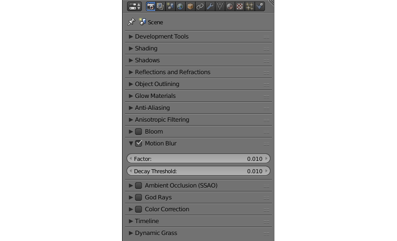

.. _render_bloom:

Bloom
-----

Настройки эффекта засветки. Подробно описаны в :ref:`соответствующем разделе <bloom>`.

.. image:: src_images/scene_settings/render_bloom.png
   :align: center
   :width: 100%

.. _render_color_correction:

Color Correction
----------------

Настройки цветокоррекции. Подробно описаны в :ref:`соответствующем разделе <color_correction>`.

.. image:: src_images/scene_settings/render_color_correction.png
   :align: center
   :width: 100%

.. _render_glow_materials:

Glow Materials
--------------

Настройки эффекта свечения материалов. Подробно описаны в :ref:`соответствующем разделе <glow>`.

.. image:: src_images/scene_settings/render_glow_materials.png
   :align: center
   :width: 100%

.. _render_object_outlining:

Object Outlining
----------------

Настройки эффекта обводки. Подробно описаны в :ref:`соответствующем разделе <outline>`.

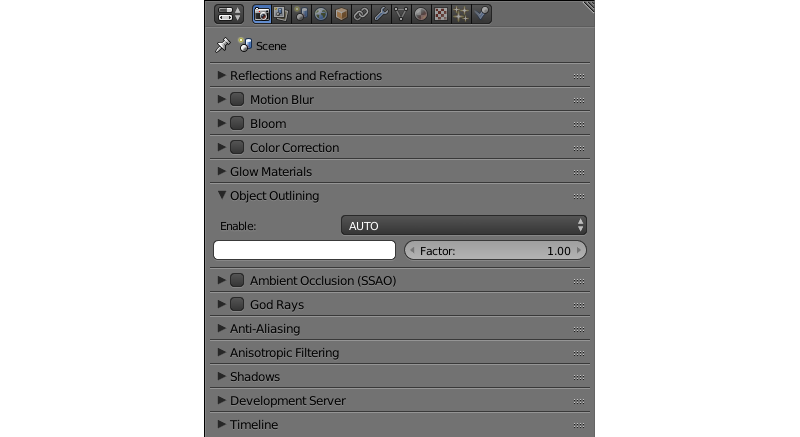

.. _render_ssao:

Ambient Occlusion (SSAO)
------------------------

Настройки эффекта взаимного затенения (SSAO). Подробно описаны в :ref:`соответствующем разделе <ssao>`.

.. image:: src_images/scene_settings/render_ambient_occlusion.png
   :align: center
   :width: 100%

.. _render_god_rays:

God Rays
--------

Настройки эффекта "сумеречных лучей". Подробно описаны в :ref:`соответствующем разделе <god_rays>`.

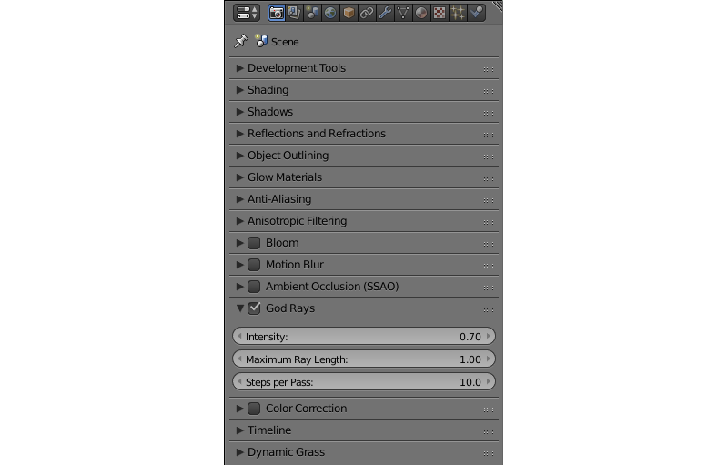

.. _render_anti_aliasing:

Anti-Aliasing
-------------

Настройки сглаживания изображения (anti-aliasing). Подробно описаны в :ref:`соответствующем разделе <antialiasing>`.

.. image:: src_images/scene_settings/render_anti_aliasing.png
   :align: center
   :width: 100%

.. _render_shadows:

Shadows
-------

Настройки теней. Подробно описаны в :ref:`соответствующем разделе <shadows>`.

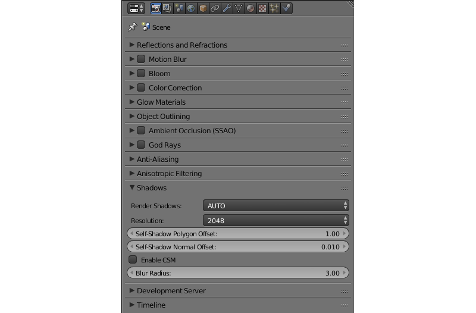

.. _render_development_server:

Development Server
------------------

Настройки сервера разработки. Подробно описаны в :ref:`соответствующем разделе <local_development_server>`.

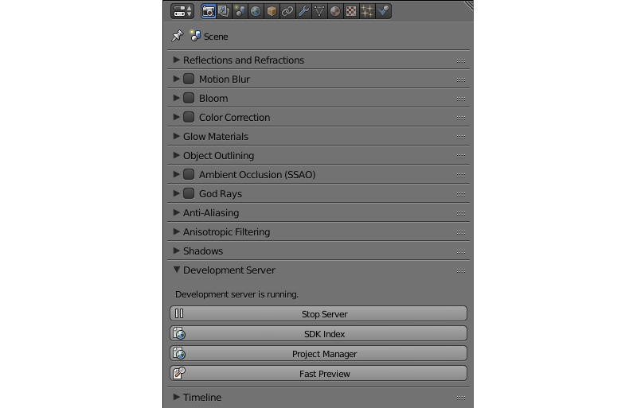

.. _render_timeline:

Timeline
--------

Настройки таймлайна.

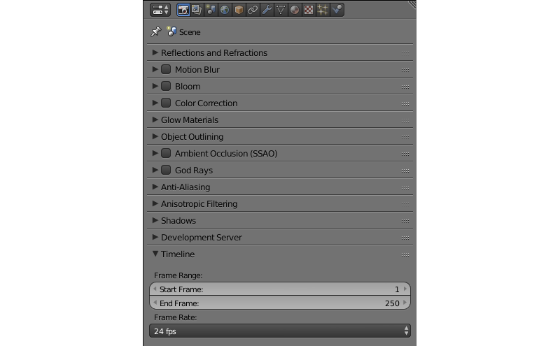

*Start Frame*
    Первый кадр таймлайна. По умолчанию 1.

*End Frame*
    Последний кадр таймлайна. По умолчанию 250.

*Frame Rate*
    Количество кадров в секунду. По умолчанию 24. Этот параметр определяет скорость воспроизведения анимации (но не скорость работы самой сцены).

.. _scene:

Вкладка Scene
=============

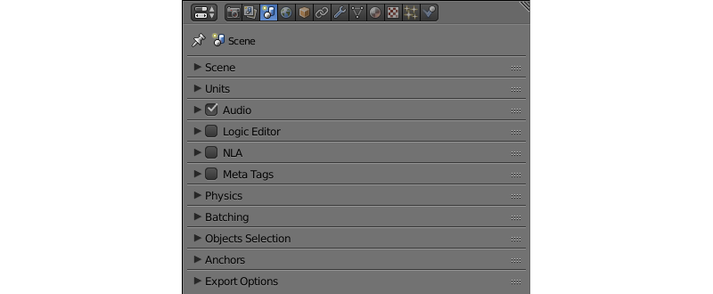

На этой вкладке находятся настройки, связанные с поведением сцены, в том числе настройки звука, физики, анимации и пр.

.. _scene_scene:

Scene
-----

Настройки сцены.

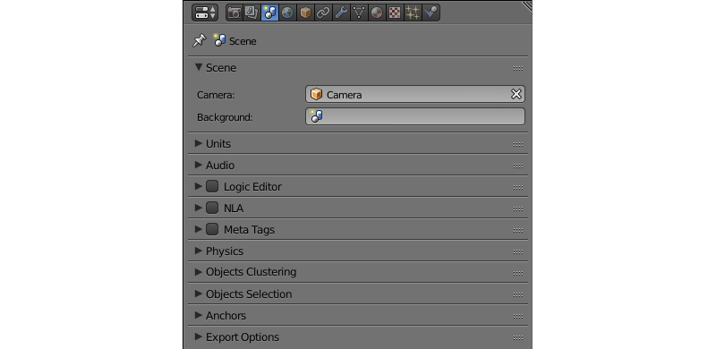

*Camera*
    Камера, используемая для воспроизведения сцены.

.. _scene_units:

Units
-----

Настройки единиц измерения, используемых в сцене.

.. image:: src_images/scene_settings/scene_units.png
   :align: center
   :width: 100%

.. _scene_audio:

Audio
-----

Настройки звука. Включены по умолчанию.

.. image:: src_images/scene_settings/scene_audio.png
   :align: center
   :width: 100%

*Dynamic Compressor*
    Сжатие динамического диапазона звукового сигнала. Применяется для того, чтобы сделать звучание более насыщенным и более равномерым по громкости. По умолчанию отключено.

*Treshold*
    Значение входного сигнала, при превышении которого включается компрессор. По умолчанию равно -24.

*Knee*
    Интервал над порогом (``Treshold``), где кривая громкости переходит в режим затухания. По умолчанию равен 30.

*Ratio*
    Фактор затухания компрессора. Значение по умолчанию равно 12.

*Attack*
    Время (в секундах) для затухания громкости на 10 дБ. По умолчанию равно 0.003.

*Release*
    Время (в секундах) для повышения громкости на 10 дБ. По умолчанию равно 0.25.

.. _scene_logic_editor:

Logic Editor
------------

Настройки использования логических деревьев (создаваемых в :ref:`редакторе логики <logic_editor>`) при воспроизведении сцены. По умолчанию отключено.

.. image:: src_images/scene_settings/scene_logic_editor.png
   :align: center
   :width: 100%

*Active Node Tree*
    Дерево логики, используемое при воспроизведении сцены.

.. _scene_nla:

NLA
---

Настройки использования нелинейной анимации при воспроизведении сцены. По умолчанию отключено.

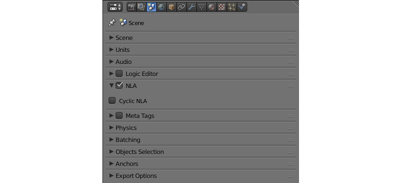

*Cyclic NLA*
    При активации этого параметра нелинейная анимацие будет зациклена.

.. _scene_meta_tags:

Meta Tags
---------

Мета-теги приложения.

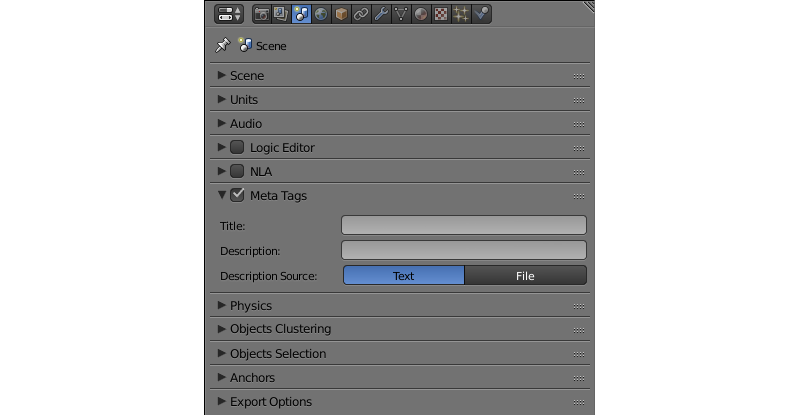

*Title*
    Заголовок приложения.

*Description*
    Описание приложения. Может быть текстовым или представлять собой ссылку на файл (если параметр ``Description Source`` имеет значение ``File``).

*Description Source*
    Источник описания приложения. Описание может быть взято из файла или задано непосредственно в поле ``Description``. Доступные значения - ``Text`` и ``File``. Значение по умолчанию - ``Text``.

.. _scene_physics:

Physics
-------

Настройки использования физики.

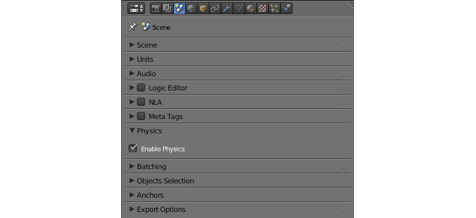

*Enable Physics*
    Использовать физику в приложении. Включено по умолчанию.

.. _scene_batching:

Batching
--------

Здесь задаётся размер сетки, используемой для объединения объектов с одинаковыми материалами. Этот параметр применяется для оптимизации.

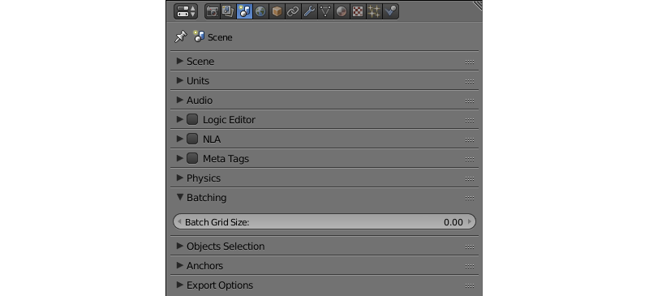

*Batch Grid Size*
    Размер сетки (в метрах). По умолчанию это значение равно 0 (в таком случае сетка не используется).

.. _scene_objects_selection:

Objects Selection
-----------------

Настройки параметров выбора объектов с помощью функции API :b4wref:`scenes.pick_object()` и :ref:`нодовой логики <logic_editor>`.

.. note::
    В :ref:`просмотрщике сцен <viewer>` выделение включено по умолчанию. Отключить его можно в разделе ``Tools & Debug``.

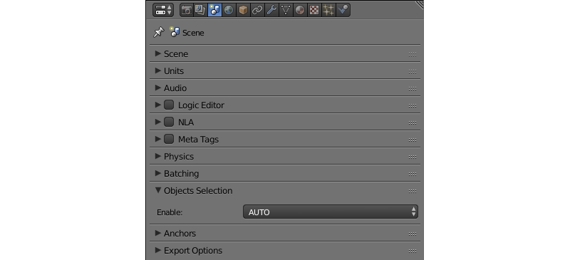

*Enable*
    Параметр, который определяет, могут ли объекты быть выбраны. Может иметь значения ``ON``, ``OFF`` и ``AUTO``. По умолчанию имеет значение ``AUTO``.

.. _scene_anchors:

Anchors
-------

Настройки определения видимости :ref:`якорей <objects_anchors>`.

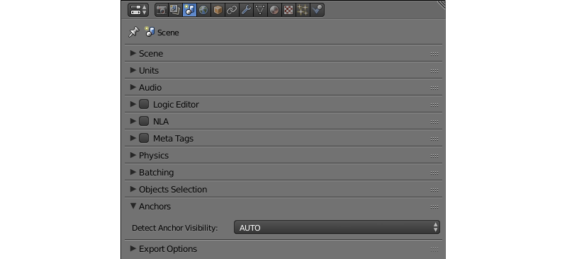

*Detect Anchors Visibility*
    Параметр определения видимости якорей. Возможные значения: ``ON``, ``OFF`` и ``AUTO``. Значение по умолчанию - ``AUTO``.

.. _scene_export_options:

Export Options
--------------

Параметры экспорта настроек сцены.

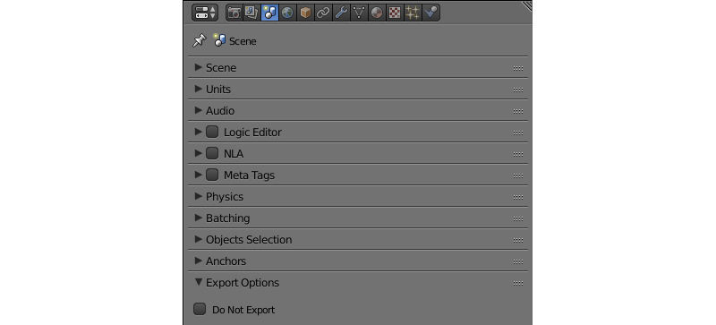

*Do Not Export*
    Игнорировать настройки сцены при экспорте приложения.

.. _world_settings:

Вкладка World
=============

.. image:: src_images/scene_settings/world.png
   :align: center
   :width: 100%

На этой вкладке находятся параметры окружающей среды, такие, как настройки неба, тумана и т.п.

.. _world_preview:

Preview
-------

Предварительный просмотр окружения.

.. image:: src_images/scene_settings/world_preview.png
   :align: center
   :width: 100%

.. _world_world:

World
-----

Настройки параметров неба.

.. image:: src_images/scene_settings/world_world.png
   :align: center
   :width: 100%

*Render Sky*
    Отображение неба.

*Paper Sky*
    Если эта опция включена, градиент неба всегда будет отрисовываться сверху вниз относительно кадра независимо от угла наклона камеры.

*Blend Sky*
    Плавный переход от цвета горизонта к цвету неба в зените.

*Real Sky*
    Визуализация неба с горизонтом, зависящим от угла наклона камеры.

*Horizon Color*
    Цвет неба у горизонта.

*Zenith Color*
    Цвет неба в зените.

*Ambient Color*
    Цвет окружающего освещения.

*Reflect World*
    Отображать небо при рассчёте отражений.

*Render Only Reflection*
    Отображать небо *только* при рассчёте отражений.

.. _world_environment_lighting:

Environment Lighting
--------------------

Настройки параметров освещения от окружающей среды. Подробно описаны в :ref:`соответствующем разделе <environment_lighting>`.

.. image:: src_images/scene_settings/world_environment_lighting.png
   :align: center
   :width: 100%

.. _world_mist:

Mist
----

Настройки параметров тумана.

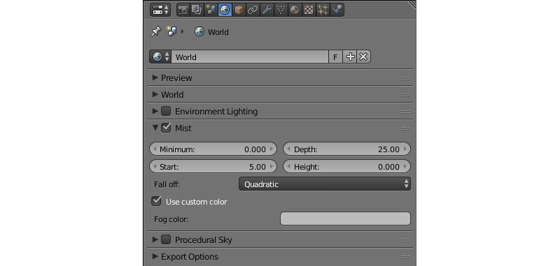

*Minimum*
    Минимальная интенсивность тумана. По умолчанию равна 0.

*Depth*
    Расстояние от камеры, на котором эффект тумана достигает наибольшей интенсивности. По умолчанию равно 25.

*Start*
    Расстояние от камеры, на котором начинает проявляться эффект тумана. По умолчанию равно 5.

*Height*
    Определяет, насколько быстро плотность тумана падает с ростом высоты. По умолчанию равно 0.

*Fall out*
    Правило, по которому возрастает интенсивность тумана между его границами (определяются параметрами ``Start`` и ``Depth``). Доступные значения: ``Quadratic``, ``Linear``, ``Inverse Quadratic``. Значение по умолчанию - ``Quadratic``.

*Use custom colors*
    Позволяет задать цвет тумана. По умолчанию включено. Если отключено, будет использоваться стандартный цвет 0.5, 0.5, 0.5.

*Fog color*
    Цвет тумана. Может быть настроен, если активирована опция ``Use custom colors``. По умолчанию установлен светло-серый цвет (0.5, 0.5, 0.5).

.. _world_procedural_sky:

Procedural Sky
--------------

    Настройки процедурного неба. Подробно описаны в :ref:`соответствующем разделе <atmosphere>`.

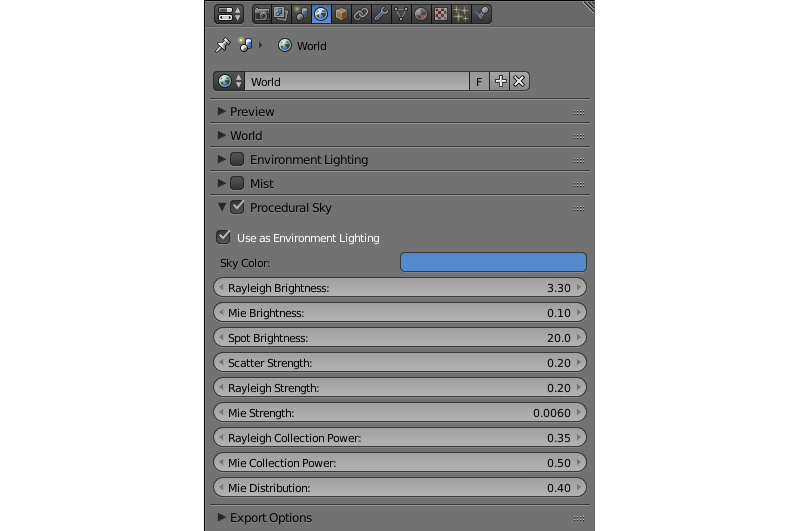

.. _world_export_options:

Export Options
--------------

Настройки экспорта параметров окружения.

.. image:: src_images/scene_settings/world_export_options.png
   :align: center
   :width: 100%

*Do Not Export*
    Игнорировать настройки окружения при экспорте приложения.

