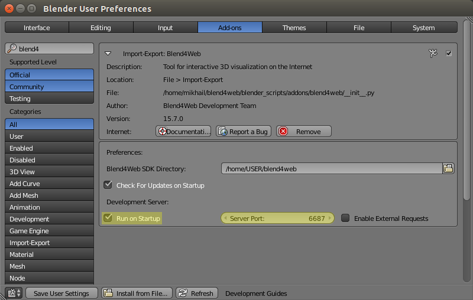
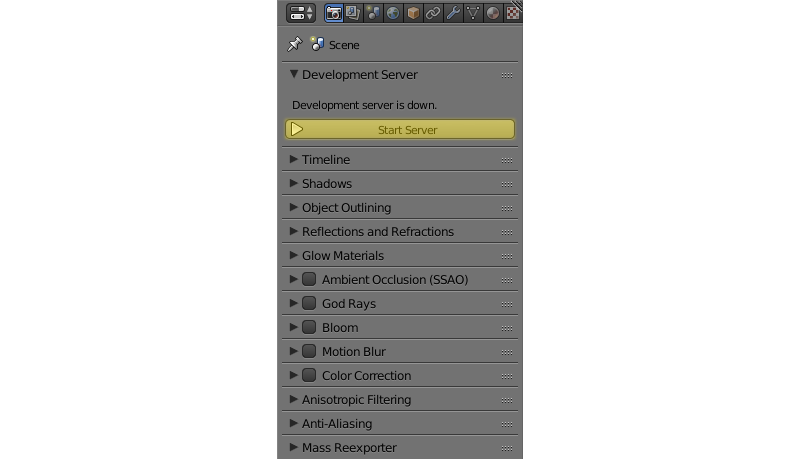
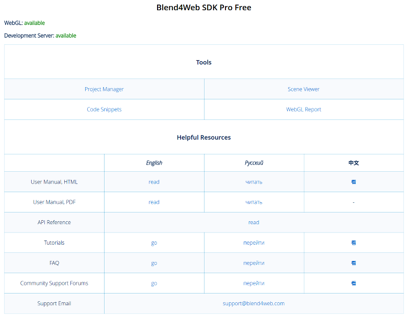

.. _setup:

***********************
Installing and Updating
***********************

.. contents:: Table of Contents
    :depth: 3
    :backlinks: entry

Before installation, please download and install the compatible Blender version, according to this `table <https://www.blend4web.com/downloads/>`_.

Installation Order
==================

.. _getting_started_install_blender:

Installing Blender
------------------

Authoring 3D scenes is carried out directly in `Blender <http://en.wikipedia.org/wiki/Blender_(software)>`_ which is open source software and is distributed free of charge.

A current stable version of Blender should be used. It can be downloaded from the `official site <http://www.blender.org/download>`_.

.. image:: src_images/first_steps/blender_first_run.png
   :align: center
   :width: 100%

Unpacking the Archive
---------------------

Stable versions of the distribution are available as an archive (``blend4web_sdk_free_YY_MM.zip`` -- free SDK, ``blend4web_sdk_pro_YY_MM.zip`` -- commercial SDK). Simply unpack this archive somewhere.

SDK Installation Order
----------------------

#. Open Blender.

#. Open the User Preferences panel :file:`File > User Preferences...`.

#. Open the :file:`File` tab.

#. Set the path to the SDK directory in the :file:`Scripts` field.

#. Click the :file:`Save User Settings` button.

#. Restart Blender.

.. image:: src_images/setup/user_preferences_sdk_path.png
   :align: center
   :width: 100%

*To verify it worked:*

In the :file:`File > Export` menu, the :file:`Blend4Web (.json)` and :file:`Blend4Web (.html)` options should appear.

.. note::

    If you are planning to use only the normal editor, you might consider installing the :ref:`Blend4Web addon <addon>` instead of the SDK.

    The addon can only export scenes to :ref:`HTML format <export_scene>` and has limited functionality (for example, it doesn't have the :ref:`project manger <project_management>`, example scenes, user manual and so on), but still it has everything you might need to create a simple application.

    It can be installed the same way as any other `Blender addon <https://www.blender.org/manual/advanced/scripting/python/add_ons.html?highlight=addon#installation-of-a-3rd-party-add-on>`_.

|

Blend4Web Mode
--------------

To reveal the engine settings, select Blend4Web from the upper panel menu:

.. image:: src_images/first_steps/first_steps_selecting_engine.png
   :align: center
   :width: 100%

.. _local_development_server:

Local Development Server
------------------------

Settings for the local development server can be found in :file:`File > User Preferences...` (hot keys :file:`Ctrl-Alt-U`). Here you can change the port number to be used to run the development server (6687 by default), and also enable its launching upon Blender startup. To do this, enable ``Run on Startup`` option in the add-on settings.

|

After changing local development server settings in it required to restart Blender.

It is possible for the local server to process external requests. To do that enable the option ``Enable External Requests``.

If you chose not to start the server automatically, you can always do it manually: go to the ``Render`` tab and press the ``Start Server`` button on the ``Development Server`` panel:

|

.. note::

    If the path to the Blend4Web SDK is not specified, the local development server cannot be launched. In this case the corresponding message will be displayed instead of the ``Start Server`` button.

    If the server is failed to run, an error message will be shown describing the reason:

    .. image:: src_images/setup/error.png
       :align: center

    This error can arise if the server port is already used by some other application.

Press the ``SDK Index`` button to open the index web page of the Blend4Web SDK in the browser. This page is available at http://localhost:6687.

.. image:: src_images/setup/server_open.png
   :align: center
   :width: 100%

|

As a result, the default browser for your operating system will be launched.

The ``Project Manager`` button can be used to open :ref:`project manager <project_management>`.

The ``Fast Preview`` button loads the scene that is currently open in Blender, into the :ref:`viewer <viewer>`.

The server can be stopped by pressing the ``Stop Server`` button. It also stops when Blender is closed.

.. index:: viewer; launch

.. _getting_started_launching_viewer:

Running Viewer and Demos
------------------------

The index page contains links for launching the scene viewer and the demo applications. A :ref:`WebGL-capable browser <browser_webgl_support>` is required to run these apps.

|

.. note::

   If the SDK apps are not displayed correctly, or error messages are shown, follow the instructions in the :ref:`renderer_not_working` section.

Updating
========

Updating the SDK
----------------

Before updating, we recommend to backup all projects in development using the :ref:`project export <export_projects>` tools.

There are two methods to update the SDK.

Firstly, you can completely delete the SDK folder and, after that, extract the new version folder and set the path to it in the Blender settings, as if you were installing the SDK for the first time.

Secondly, you can simply overwrite the outdated SDK files with the new ones. This method is considered less "pure", but in most cases it should not cause any problems.

After updating is complete, you can import all saved projects using the :ref:`project import <import_projects>` tools.

.. index:: export

.. _getting_started_export_viewer:

Exporting and Viewing Scenes
----------------------------

The created scenes can be exported in HTML format. To do this use the :file:`File > Export > Blend4Web (.html)` or :file:`File > Export > Blend4Web (.json)` menu option and choose the export filepath. Scene export is described thoroughly in :ref:`its own chapter <addon>`. The resulting HTML file can be opened with any browser with WebGL support.

.. seealso:: :ref:`browser_webgl_support`

|

