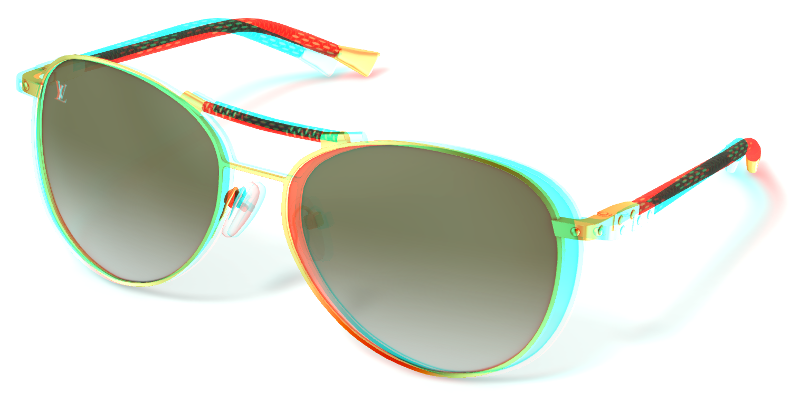
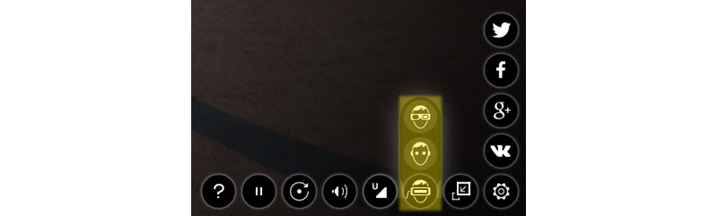
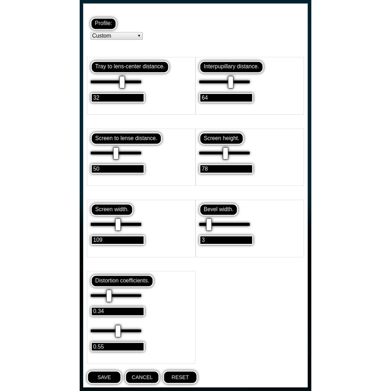

 
.. index:: anaglyph

.. _stereo:

****************
Stereo Rendering
****************

.. contents:: Table of Contents
    :depth: 3
    :backlinks: entry

The stereoscopic rendering mode is intended for viewing the content using special glasses. It is activated by an application via API.

Blend4Web supports two techniques of the stereo image rendering - anaglyph image and the HMD (head-mounted display).

.. _anaglyph:

Anaglyph:

|

.. _hmd:

HMD:

.. image:: src_images/stereo_rendering/postprocessing_effects_stereo.png
   :align: center
   :width: 100%

HMD is an experimental feature, for now it works only with the ``Eye`` type cameras.

Activation
----------

To use HMD stereo rendering, you need to install Oculus' `runtime utility <https://developer.oculus.com/downloads/>`_ (two versions are supported: the `chromium_webvr_v1_win64.7z` in the root directory and the one in the `Deprecated API` folder). Windows and macOS versions can be found on the Oculus website in binary format, while Linux version should be compiled from the source code.

For now, the HMD is supported by the `Chromium experimental builds <https://webvr.info/get-chrome/>`_ and in the `Firefox nightly builds <https://nightly.mozilla.org/>`_.

`Chromium settings. <https://docs.google.com/document/d/1g02qHfX85vSRSOkWm9k33I0b7VuyN79md9U9t6MIa4E/edit>`_

`Firefox settings. <https://developer.mozilla.org/en-US/docs/Web/API/WebVR_API>`_

To turn the stereo rendering on, you need to choose certain option in the settings, in the third column from the right, as shown on the picture.

For stereo rendering to work correctly, switching to the full screen mode is recommended.

Additional Settings
-------------------

None.

.. _hmd_settings:

HMD Settings
------------

This group of settings allows a user to change various parameters in order to adjust whatever VR device they have to better view a certain 3D application or scene. There are two ways these settings can be accessed:

Firstly, it can be found in the :ref:`Blend4Web Viewer <viewer>` application under the :ref:`Stereo View tab <stereo_view>`.

And secondly, it can also be shown in an application by using the :b4wref:`hmd_conf.show` method of the :b4wmod:`hmd_conf` module, but doing this requires some programming. Examples of this method can be found in the ``viewer.js`` and ``webplayer.js`` applications (in the ``m_hmd_conf`` object).

Profile
.......

This allows user to select a profile for a specific device.
Currently, the following profiles are available:

    * Custom
    * Cardboard (2014)
    * Cardboard (2015)

By default, `Custom` profile is selected.

Rendering Settings
..................

*Tray to lens-center distance*
    This parameter specifies the distance between the phone frame and the center of the camera lenses.

    This value can vary from 0 to 50. Default value is 32.

*Interpupillary distance*
    This parameter specifies the distance between the pupils of the user's eyes. Measured in millimeters.

    This value can vary from 0 to 100. Default value is 64.

*Screen to lens distance*
    This specifies the distance between the screen of the phone and the camera lenses.

    This value can vary from 0 to 100. Default value is 50.

*Screen height*
    The height of the screen.

    This value can vary from 0 to 150. Default value is 63.

*Screen width*
    The width of the screen.

    This value can vary from 0 to 200. Default value is 107.

*Bevel width*
    The thickness of the border around the image.

    This value can vary from 0 to 20. Default value is 3.

*Distortion coefficients*
    This is used in order to compensate image distortion produced by the VR device lenses.

    Both values can vary from 0 to 1. Default values are 0.34 for the first parameter and 0.55 for the second one.

Other control tools
...................

*Save*
    Saves the settings.

*Cancel*
    Closes the setting interface without saving the settings.

*Reset*
    Restores default settings.

