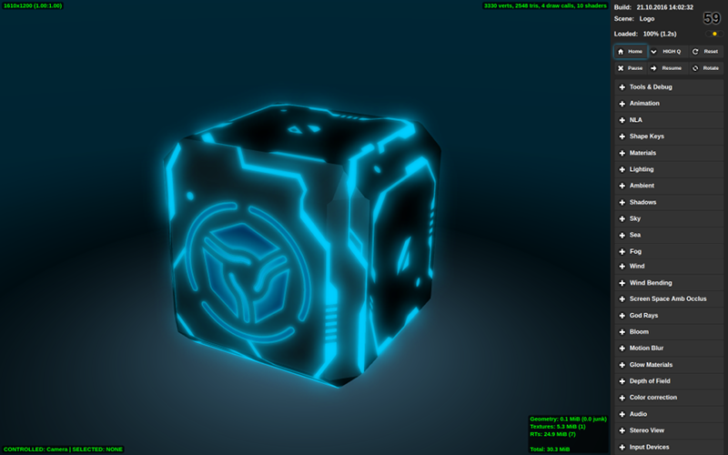

.. index:: viewer

.. _viewer:

************
Scene Viewer
************

.. contents:: Table of Contents
    :depth: 3
    :backlinks: entry

:ref:`Running The Scenes Viewer <getting_started_launching_viewer>`.

Navigation
----------

To control the camera hold down a mouse button and move the mouse. Control can also be performed using the ``W``, ``A``, ``S``, ``D``, ``R``, ``F`` keys: forward, left, back, right, up, down. Arrows and ``numpad`` keys can be used as well. In the ``Target`` camera mode it's possible to focus on the selected object using the ``Z`` or ``.(dot)`` keys.

The Side Panel
--------------

The side panel consists of three areas: the information board, basic control buttons and the list of drop-down panels with additional control elements differentiated by functionality.

|

Control elements list in top-to-bottom order
............................................

**Build**
    The engine build date and time. In the developer version this shows the page load time.

**Scene**
    Loaded scene name from the ``assets.json`` file. Path to the file pops-up on mouse hover.

**Loaded**
    Loading progress and time.

**Reset**
    This button deletes the saved name of the last viewed scene and reloads the page back to display the default scene.

**LOW Q - HIGH Q - ULTRA Q**
    Drop-down menu for choosing the performance profile of the engine.

    .. seealso:: :ref:`quality_settings`

**Pause**
    Pause rendering.

**Resume**
    Resume rendering.

**Auto View**
    Activate the automatic scene switching mode; the delay between views is 1 second.

**Scenes**
    A double-level list of the categories and scenes from the ``assets.json`` file.

**Animation**
    Animation controls. When viewing animated models, you can select an object and switch its animation with a drop-down menu, switch cyclic animation mode, stop and resume animation, set the required frame (the animation should be stopped to do this).

**NLA**
    A tool to control Non-Linear Animation (if it is present in the scene). For this panel to work, NLA option should be enabled in the scene's settings.

**Shape Keys**
    Shape Keys control. When viewing models that has shape keys, you can select an object, one of its shape keys and the influence that the key has on the object.

**Materials**
    Material properties setup. A material can be selected using the drop-down menu. For now, only a limited number of properties is supported.

**Lighting**
    Direct lighting parameters setup. A light source can be selected using the drop-down menu. Changing color and intensity is supported. Daytime and sun lighting parameters can also be tweaked on this panel.

**Ambient**
    Ambient lighting parameters setup. Changing the colors and intensity of a hemispheric ambient model is supported.

**Shadows**
    Shadow parameters setup, including shadow cascades and shadow edges softening parameters.

**Sky**
    Dynamic sky parameters setup such as color, sun light scattering parameters etc.

**Sea**
    Water rendering parameters setup, including color transitions by depth and by shore distance, foam and subsurface scattering parameters, waves dynamics etc.

**Wind**
    Wind parameters setup, including direction and strength.

**Screen Space Amb Occlus**
    Ambient occlusion parameters setup.

**God Rays**
    Crepuscular rays effect parameters setup.

**Bloom**
    Bright light effect parameters setup.

**Motion Blur**
    Motion blur effect settings.

**Glow Materials**
    Glow Materials effect settings.

**Depth of Field**
    Depth of field effect parameters setup.

**Color correction**
    Color correction parameters setup, including brightness, contrast, exposure and saturation.

**Audio** 
    There is a mixing mode switch on the panel. After it is enabled the mixer interface becomes visible (only for scenes with sound sources).

**Stereo View**
    There is a stereoscopic mode switch on the panel.

**Gyroscope**
    Gyroscope settings for mobile devices can be controlled from this panel.

**Tools & Debug**
    This panel contains a range of debugging tools, including the wireframe mode and the postprocessing stages viewer switches.

Indicators
----------

**Frames per second counter**
    This is located in the top right corner. It displays the averaged and rounded value for the last 1.5 seconds.

**Viewport dimensions**
    This is located in the top left corner. It displays the viewport dimensions in pixels.

**Selected object and controlled object**
    This is located in the left bottom corner. It displays the names of selected and controlled objects. Object selection can be performed with the mouse. To control the object directly (normally for physics debugging) press the ``Q`` key and click on the object. The object movement is performed with the ``W``, ``A``, ``S``, ``D`` keys. To exit the control mode press the ``Q`` key and click on an empty space. The indicator also displays the distance to the selected object in Blender units (meters equivalent).

**Scene complexity indicator**
    Is located in the top right corner of the rendering area. It displays the number of vertices, triangles and WebGL calls on the main rendering scene (i.e. shadow rendering calls are not included, for example).

**Video memory indicator**
    Is located in the bottom right corner of the rendering area. It displays the amount of video memory used by geometry, textures, render targets, and also the total memory usage.

**Scene load errors indicator**
    Is located under the FPS counter. Shows errors and warnings which occurred during scene load. Red light means errors, yellow - warnings and green means that the scene was loaded successfully.

.. image:: src_images/viewer/viewer_indicators.png
   :align: center
   :width: 100%

