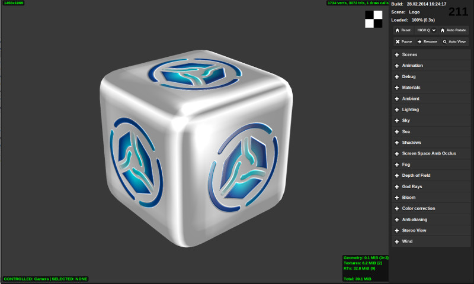
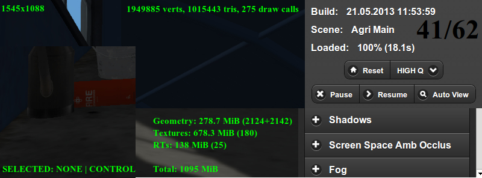

.. index:: просмотрщик

.. _viewer:

****************
Просмотрщик сцен
****************

:ref:`Запуск просмотрщика сцен <getting_started_launching_viewer>`.

Навигация
---------

Вращение камеры осуществляется клавишами ``W``, ``A``, ``S``, ``D``, ``R``, ``F``: вперед, влево, назад, вправо, вверх, вниз. Также поддерживаются стрелки и клавиши ``numpad``. В зависимости от настроек камеры (режим движения Target) возможно целеуказание на выделенный объект, для чего используется клавиша ``Z`` или ``.(точка)``.

Боковая панель
--------------

Боковая панель содержит в себе три области: информационное табло, базовые кнопки
управления и список выпадающих панелей, содержащий дополнительные элементы управления, разделённые по функциональному признаку.

|

Список элементов управления сверху вниз:

**Build**
    Дата и время сборки движка.

**Scene**
    Название загруженной сцены, взятое из файла ``assets.js``. При наведении курсора мыши всплывает путь к файлу.

**Loaded**
    Процент и время загрузки.

**Reset**
    Кнопка сброса настроек и возврата к базовой сцене.

**HIGH Q - LOW Q - COMPAT**
    Выпадающее меню выбора профиля работы движка: высокое качество (максимальный набор функций), среднее качество (отключен ряд функций, размер текстур уменьшен вдвое), режим совместимости (минимум функций).

**Pause**
    Приостановка рендеринга.

**Resume**
    Возобновление рендеринга.

**Auto View**
    Активация режима автоматического переключения сцен.

**Scenes**
    Список категорий и сцен из файла ``assets.js``.

**Animation**
    Управление анимацией. При просмотре анимированных моделей можно переключать анимацию с помощью выпадающего меню, останавливать и возобновлять анимацию, выставлять кадр, отключать циклическую анимацию.

**Sound** 
    Управление звуком. Содержит упрощённый микшер для управления всеми источниками звука.

**Materials**
    Настройка свойств материалов.

**Ambient**
    Управление освещением от окружающей среды.

**Lighting**
    Управление прямым освещением.

**Sky**
    Настройка параметров динамического неба.

**Shadows**
    Настройка теней.

**Screen Space Amb Occlus**
    Настройка параметров взаимного затенения.

**Fog**
    Настройка тумана.

**Depth of Field**
    Настройка глубины резкости.

**God Rays**
    Настройка сумеречных лучей.

**Color correction**
    Цветовая коррекция.

**Anti-aliasing**
    Настройка параметров сглаживания.

**Stereo View**
    Управление режимом стерео-изображения.

**Wind**
    Настройка ветра.

Индикаторы
----------

**Счетчик количества кадров в секунду**
    Находится в правом верхнем углу. Выводит усредненные и округленные значения для процесса рендеринга и симуляции физики соответственно.

**Размер области рендеринга**
    Находится в левом верхнем углу. Выводит размер области рендеринга в пикселах. 
    
**Выбранный объект и контролируемый объект**
    Находится в левом нижнем углу. Выводит название выбранного объекта и контролируемого объекта. Выбор объекта осуществляется мышью. Для получения прямого контроля над объектом (обычно в целях проверки физики) нужно нажать ``Q`` и выбрать объект. Движение объекта осуществляется клавишами ``W``, ``A``, ``S``, ``D``. Для выхода из режима контроля нужно нажать ``Q`` и "кликнуть" на пустом пространстве.

**Индикатор сложности сцены**
    Находится в правом верхнем углу области рендеринга. Выводит количество вертексов, треугольников и WebGL вызовов.
      
**Индикатор памяти**
    Находится в правом нижнем углу области рендеринга. Выводит количество памяти, занимаемой геометрией, текстурами, буферами с результатами рендеринга (render targets), а также суммарное количество занимаемой памяти.
      
      

