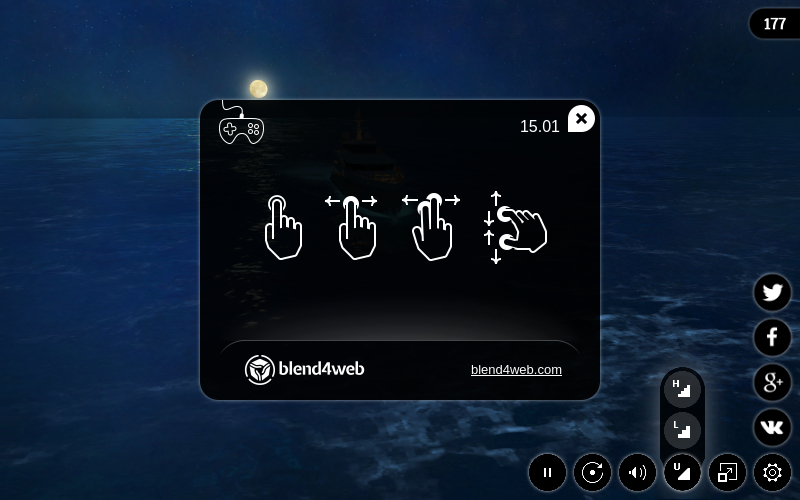
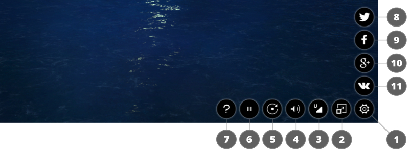
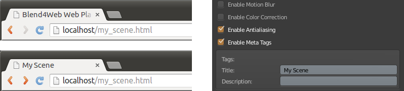
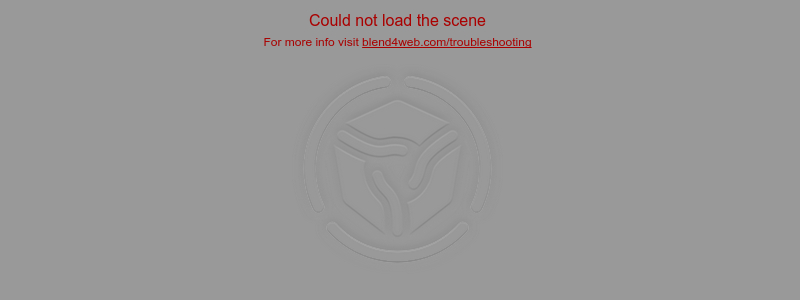

.. index:: веб-плеер

.. _web_player:

*********
Веб-плеер
*********

Веб-плеер представляет собой специализированное приложение для отображения моделей и сцен в режиме демонстрации.

Десктопная версия:

.. image:: src_images/web_player/web_player_example.jpg
   :align: center
   :width: 100%

|

Мобильная версия:

|

Использование
-------------

Директорию с файлами веб-плеера ``deploy/apps/webplayer`` можно скопировать из дистрибутива Blend4Web SDK и разместить на сайте. Полученные в результате экспорта файлы сцен можно разместить на сайте и указать путь к ним (абсолютный или относительный) с помощью параметра веб-плеера ``load``.

При экспорте в единый HTML файл интерфейс веб-плеера интегрируется автоматически.

Навигация
---------

Управление камерой (в режимах ``Target`` и ``Eye``) осуществляется мышью с нажатой кнопкой, а также клавишами ``W``, ``A``, ``S``, ``D``, ``R``, ``F``: вперед, влево, назад, вправо, вверх, вниз. Также поддерживаются стрелки и клавиши ``numpad``.

Панель управления
-----------------

Ниже показана панель управления веб-плеера.

1) показ / скрытие панели управления;
2) включение / выключение полноэкранного режима;
3) установка качества сцены;
4) включение / выключение звука;
5) включение / выключение автоматического поворота камеры вокруг сцены;
6) запуск / остановка движка;
7) открытие окно помощи;
8) кнопка Твиттер;
9) кнопка Facebook;
10) кнопка Google+;
11) кнопка ВКонтакте.

.. _webplayer_attributes:

Атрибуты
--------

Веб-плеер принимает атрибуты из адресной строки браузера:

.. image:: src_images/web_player/player_params.jpg
   :align: center
   :width: 100%

|

1) для загрузки сцены используется обязательный атрибут ``load``, в который помещается относительный путь к JSON файлу.
2) необязательный атрибут ``fallback_image`` используется для установки фона, заменяющего сцену при возникновении ошибки WebGL.
3) необязательный атрибут ``fallback_video`` используется для установки видео, заменяющего сцену при возникновении ошибки WebGL.
   Может использоваться неоднократно с целью добавления видео файлов различных форматов.
4) необязательный атрибут ``show_fps`` применяется для отображения счетчика кадров в секунду в правом верхнем углу плеера.
5) необязательный атрибут ``autorotate`` используется для включения автоматического вращения камеры сразу после загрузки сцены.
6) необязательный атрибут ``compressed_textures`` используется для включения загрузки уменьшенных текстур и текстур в формате с компрессией (DDS).
7) необязательный атрибут ``alpha`` используется для установки прозрачности области отрисовки.

.. note::

   Если указаны параметры ``fallback_image`` и ``fallback_video``, приоритет имеет ``fallback_image``.

.. _wp_title:

Название сцены в заголовке
--------------------------

По умолчанию веб-плеер устанавливает тег ``title`` равным ``Blend4Web Web Player``. С помощью мета-тега ``title``
в настройках сцены можно изменить значение по умолчанию.

Ошибки сцены
------------

В случае некорректного использования веб-плеера выводятся сообщения об ошибках.

1) атрибутом ``load`` указан неверный путь к JSON файлу или данный файл неисправен;

|

2) атрибут ``load`` не найден или его значение пустое;

.. image:: src_images/web_player/error_not_load_attr.jpg
   :align: center
   :width: 100%

|

3) ошибка инициализации WebGL.

.. image:: src_images/web_player/error_webgl.jpg
   :align: center
   :width: 100%

|

