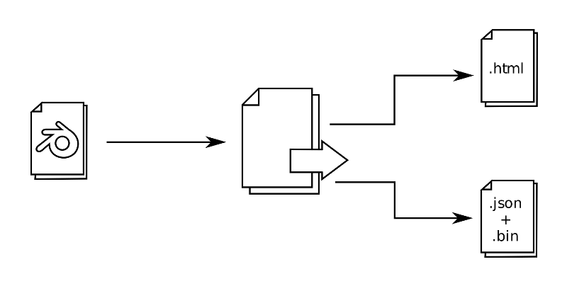
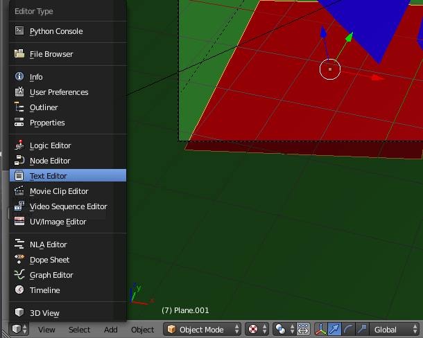
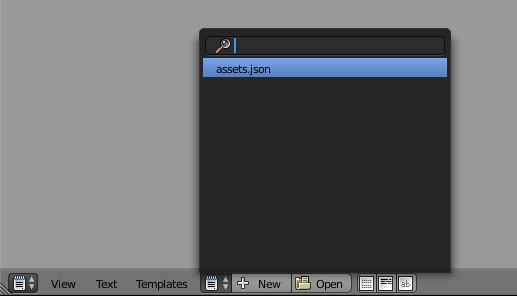
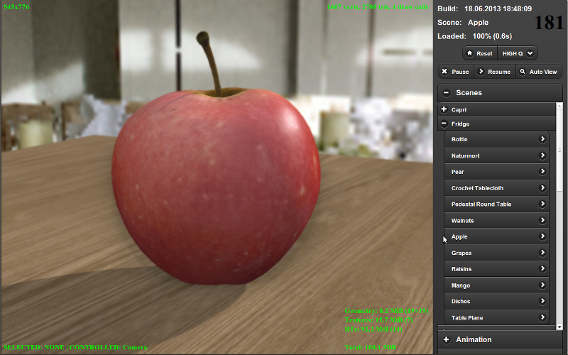

.. _working_process_stages:

********
Workflow
********

.. contents:: Table of Contents
    :depth: 3
    :backlinks: entry

Developing any product is a creative process with many participants who have
different skills and experience. However, no matter how complex it is and
what is the target it's always possible to separate the production stage in
which the bulk of assets and source code is authored.

When using Blend4Web the workflow is the following:

#. Authoring 3D scenes in Blender.
#. Exporting scenes.
#. Running, tweaking and debugging scenes in the Viewer.
#. Creating the target application.

.. _authoring_scenes:

Authoring Scenes
================

Besides the usual stages such as modeling, texturing, animation etc a scene
should be prepared for working in the engine.

General recommendations:

#. We strongly recommend to save your blend files in the ``blender/project_name`` directory. Auxiliary files which are not intended for loading in your app (for example, references), should be located there as well.

#. Images and media files should be external and located in the ``deploy/assets/project_name`` directory.

#. Files from which you export should contain resources which are actually required in your application (objects, materials, textures, animation etc).

#. Scene components should have distinct names. They should not be named \"Cube.001\", \"Material\" or \"Armature\".

#. We recommend you to practice linking components from other files (libraries).

.. index:: export

.. _export_scene:

Exporting Scenes
================

The export procedure converts the scene from the Blender format to one of
the formats used by Blend4Web.

There are two formats: JSON and HTML.

The HTML format is used for simple stand-alone applications, where all the resources are packed into one HTML file that can then be easily deployed to a web page.

The JSON format can be used for creating such projects as well, but it also offers numerous extra features making it possible to create complex projects that require programming. Format differences and export options are described in the :ref:`Export Formats <export_formats>` chapter.

To export the scene, select ``Blend4Web (.json)`` or ``Blend4Web (.html)``
option from the ``File > Export`` menu, or type ``b4w export`` in the
operator search menu (available by pressing ``Spacebar``).

.. note::
    If the scene uses Blender features not yet supported by the Blend4Web engine, errors may occur during export. Export errors are listed in :ref:`this table <export_errors>`.

Export options are described in detail in the :ref:`corresponding section <export_opts>`.

.. index:: viewer; adding scenes

.. _assets_json:

Displaying Scenes in the Viewer
===============================

When using the :ref:`local development server <local_development_server>`
it's possible to preview current scene using ``Fast Preview`` button,
located on the ``Scene->Development Server`` panel in Blender. In this case
the scene will be exported inside some temporary storage and loaded in the
Viewer app.

The other method is using :ref:`Run in Viewer <run_in_viewer>` export
option. In this case the scene will be displayed in the Viewer app
immediately after the export.

For the long-term storage of the scene in the scene list of the viewer, it's
required to manually add the entry to the ``apps_dev/viewer/assets.json``
text file. This file is opened automatically in Blender if you are using
Blend4Web SDK.

Use the \"Text Editor\" to modify it:

|

Then select the ``assets.json`` file in the window to edit it:

|

To add a new scene you need to know the category in which it should be
displayed. The category normally corresponds to the project name and to the
name of the directory where the corresponding files are stored.

Example
-------

For example below you can see a part of ``assets.json``. In this file there
are two projects - \"Capri\" and \"Fridge\" each with corresponding scenes::

    {
        name: "Capri",
        items: [
            {
                name: "Baken",
                load_file : "capri/props/baken/baken.json"
            },
            {
                name: "Terrain",
                load_file : "capri/landscape/terrain/terrain.json"
            }
        ]
    },
    {
        name: "Fridge",
        items: [
            {
                name: "Apple",
                load_file : "fridge/fruits/apple/apple.json"
            },
            {
                name: "Mango",
                load_file : "fridge/fruits/mango/mango.json"
            }
        ]
    }

To add a new scene you can copy and paste a similar scene's description to
the required category and then edit its name and path to the exported file.

A successfully added scene should appear in the scenes' list of the viewer
in the required category

Application Development
=======================

At this stage an application is created. Logic for scene loading and user
interaction is written using JavaScript. The application developer notes are
given in the :ref:`corresponding section <developers>`.
