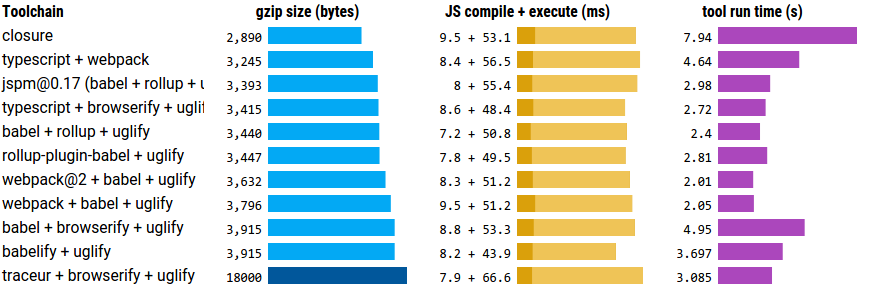

# webpack-closure-compiler
Google Closure Compiler plugin for Webpack


<a href="https://travis-ci.org/roman01la/webpack-closure-compiler">
  
</a>
<a href="https://www.npmjs.com/package/webpack-closure-compiler">
  
</a>

<p>
<a href="https://www.patreon.com/bePatron?c=1239559">
  
</a>
</p>

## Table of Contents
- [Why use Closure Compiler instead of UglifyJS?](#why-use-closure-compiler-instead-of-uglifyjs)
- [Installation](#installation)
- [Requirements](#requirements)
- [Usage](#usage)
- [Contributing](#contributing)

## Why use Closure Compiler instead of UglifyJS?
Closure Compiler is the most advanced JavaScript optimization tool. It generates smallest bundle and emits efficient JavaScript code by doing whole program analysis and optimization, removing closures and inlining function calls, as well as tree-shaking for AMD, CommonJS and ES2015 modules.

<a href="https://github.com/samccone/The-cost-of-transpiling-es2015-in-2016"></a>

## Installation

```bash
npm i -D webpack-closure-compiler
```

## Requirements
While there's JavaScript version of Closure Compiler, the original compiler is written in Java and thus Java version is more complete and performs better in terms of JavaScript code optimizations and compilation speed. If you want to use Java-based compiler, make sure you have intalled [Java SDK](http://www.oracle.com/technetwork/java/javase/downloads/index-jsp-138363.html).

## Usage

### Options

#### compiler: &lt;Object&gt;

A hash of options to pass to
[google-closure-compiler](https://github.com/google/closure-compiler-npm#specifying-options).

You can optionally specify a path to your own version of the compiler.jar if the version provided by the plugin isn't working for you. See example below for optional parameter.

#### jsCompiler: &lt;Boolean&gt;

Use pure JavaScript version of Closure Compiler (no Java dependency). Note that compilation time will be around 2x slower. Default is `false`. *`concurrency` and `jsCompiler` options are mutually exclusive.*

#### concurrency: &lt;Number&gt;

The maximum number of compiler instances to run in parallel, defaults to `1`.  *`concurrency` and `jsCompiler` options are mutually exclusive.*

#### test: &lt;RegExp&gt;

Process only files which filename satisfies specified RegExp, defaults to `/\.js($|\?)/i`.

### Example

```js
const path = require('path');
const ClosureCompilerPlugin = require('webpack-closure-compiler');

module.exports = {
    entry: [
        path.join(__dirname, 'app.js')
    ],
    output: {
        path: path.join(__dirname, '/'),
        filename: 'app.min.js'
    },
    plugins: [
        new ClosureCompilerPlugin({
          compiler: {
            jar: 'path/to/your/custom/compiler.jar', //optional
            language_in: 'ECMASCRIPT6',
            language_out: 'ECMASCRIPT5',
            compilation_level: 'ADVANCED'
          },
          concurrency: 3,
        })
    ]
};
```

## Contributing

If you've spotted a bug, please, open an issue, and after discussion submit a pull request with a bug fix. If you would like to add a feature or change existing behaviour, open an issue and tell about what exactly you want to change/add.

## License

MIT
